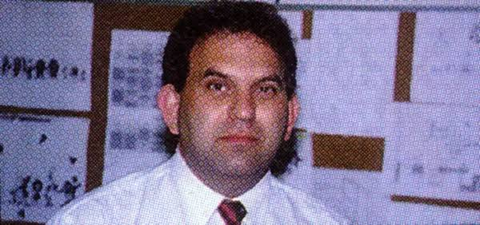

# Dave Siller

Widely recognized as a legendary figure in the video game industry, David Siller has left an indelible mark on gaming history as a key creator, designer, and producer. His illustrious career includes producing the iconic global phenomenon Crash Bandicoot (1996) at Universal Interactive, designing the memorable Disney's Beauty and the Beast: Roar of the Beast (1993) and Belle's Quest (1993) for the Sega Genesis, and spearheading cult classics like Aero the Acro-Bat and Capcom's Maximo: Ghosts to Glory. For decades, Dave has been celebrated for his ability to blend complex design structures with vibrant, imaginative worlds that capture the hearts of players worldwide. [1, 2, 3, 4, 5] 
Beyond the screen, however, Dave channels that same meticulous vision and creative drive into a lifelong passion for high-end automotive design and competitive slot car modeling. Approaching slot car building not merely as a hobby but as a high-fidelity craft, he acts as a full-cycle visionary—fusing striking artistic concepts with sophisticated mechanical execution. From drafting intricate engineering blueprints and custom-sculpting aerodynamic PETG bodies to hand-soldering robust brass frames and tuning innovative weight-shifting mechanisms, his custom racing models are true masterpieces of track dynamics. Whether coding legendary gaming worlds or fabricating precision scale racers, Dave continues to redefine the boundaries where interactive art meets technical engineering. [2] 

[1] [https://www.imdb.com](https://www.imdb.com/name/nm1469199/)
[2] [https://www.sega-16.com](https://www.sega-16.com/2007/07/interview-david-siller/)
[3] [https://www.imdb.com](https://www.imdb.com/title/tt6305904/)
[4] [https://www.imdb.com](https://www.imdb.com/title/tt6306090/)
[5] [https://www.mobygames.com](https://www.mobygames.com/game/6745/disneys-beauty-and-the-beast-belles-quest/)
[6] [https://www.thegeekgetaway.com](https://www.thegeekgetaway.com/2020/07/i-discuss-canceled-maximo-3-with-lead.html)

## Racing car design and modeling

Beyond his work in game development, Dave channels his creativity into the world of custom racing car design and modeling. As a full-cycle builder, he crafts unique slot cars from scratch—blending striking artistic concepts with advanced mechanical engineering.

**[Read the Full Construction Report (Jan/Feb 2015)](./TheGreyThingie.pdf)** — A step-by-step technical document showcasing Dave’s engineering precision through his "The Grey Thingie" project. This feature details his full-cycle modeling process, from vacuum-formed body alterations and alien-themed airbrushing to the advanced solder fabrication of a custom brass chassis featuring an adjustable ISO suspension and a 7/8” travel sliding-weight mechanism.

