# Создатель Aero the Acro-Bat: Нерассказанная история Дэвида Силлера

Перевод интервью с Дэвидом Силлером – геймдизайнером, художником и, без преувеличения, звездой Sunsoft 90-х. Он известен как создатель франшизы Aero the Acro-Bat, а также принимал участие в разработке таких хитов, как Crash Bandicoot (PlayStation) и Maximo: Ghosts to Glory (PlayStation 2). Это интервью было дано бразильскому журналу WarpZone в 2017 году.

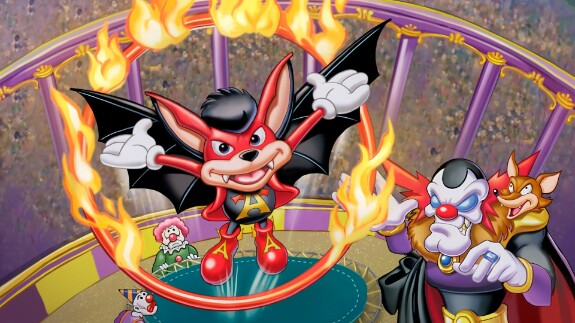

***Проработав в EGM, Sunsoft, Universal Interactive и Capcom (среди прочих), у вас сложилась карьера, которой может похвастаться лишь горстка людей в игровой индустрии. Расскажите немного о своем пути.***

`Дэвид Силлер:` Я был очень творческим молодым человеком, с воображением, которое всегда держало мой разум занятым. Я рисовал всё: лошадей, девушек, самолеты, танки, а позже — супергероев. Это продолжалось всю мою жизнь. Однажды я создал настольную игру, похожую и в то же время отличную от популярных игр этого жанра. Игра так и не была реализована, но подтолкнула мою креативность, позволив мне выражать свои идеи разными способами.

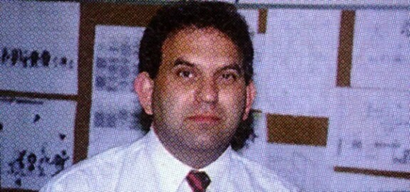

Через несколько лет, будучи уже юношей, я устал работать в розничной торговле. Тогда я, мой младший брат (Рон) и мой отец (Рейес) начали бизнес с аркадными автоматами, который постоянно расширялся. Мы приняли участие в торговой выставке в Чикаго, где познакомились с японской компанией «Nichibutsu», которая делала аркадные игры, такие как Crazy Climber и Moon Cresta. Они были впечатлены мной и предложили мне работу, даже оплатив переезд из Техаса в Калифорнию. 

Я занимался продажей игр Nichibutsu через дистрибьюторов, но в свободное время набрасывал идеи и отправлял их в Японию. Японцы начали воспринимать мои предложения всерьез, и я участвовал в разработке некоторых новых игр. Затем я перешел в другую японскую компанию, которая предложила мне лучшую должность. Она называлась Tehkan, и позже сменила название на Tecmo. Я продолжал делать всё, что они хотели, оценивал новые проекты и давал предложения. 

Со временем я поднимался по карьерной лестнице и работал с Sunsoft и Capcom, а также с Universal Studios Interactive и позже Midway. Моя философия заключалась в том, что видеоигры были "визуальными", поэтому они должны быть спроектированы таким образом, чтобы легко и как можно лучше передавали концепцию или идею. Я также играл во все игры, до которых мог дотянуться, чтобы понять и оценить, как мыслили дизайнеры.

***Во время работы в EGM вы предложили создать рубрику «Review Crew». Как появилась идея вымышленного персонажа в журнале «Sushi-X»? Другие редакторы тоже писали под этим псевдонимом?***

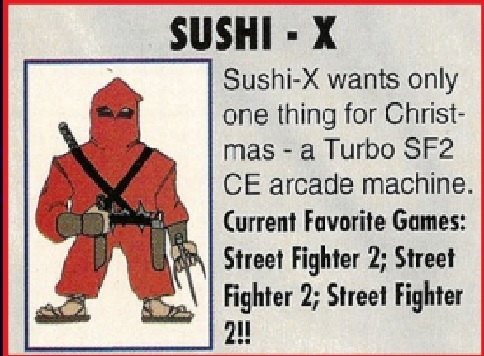

``Дэвид Силлер:`` Я хотел помочь EGM стать самым успешным журналом о видеоиграх в США. Я знал, что игроки очень проницательны, и им нужен какой-то четкий ориентир. Обзоры субъективны, но они предоставляют информацию, которая дает читателям возможность узнать больше об игре. Псевдоним «Sushi-X» был вдохновлён японским редактором «Tako-X» (что означало «осьминожье щупальце»).

Я также создал «Sam Moori», «Terri Akki» и другие псевдонимы. Только я писал как «Sushi-X» в Sendai Publications, но другие использовали этот псевдоним после моего ухода.

***В Sunsoft вы активно участвовали в разработке лицензионных игр Hanna-Barbera и Warner. «Scooby Doo Mystery» был вдохновлен жанром adventure; Looney Tunes B-Ball — это спортивная игра; Taz-Mania можно считать предшественником жанра runner. Как происходил творческий процесс создания проектов с таким разнообразием геймплея?***

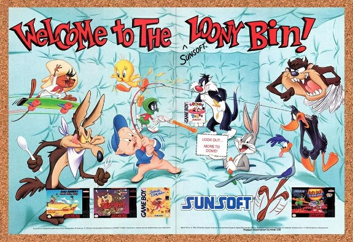

**Дэвид Силлер:** Создание такого количества по-настоящему разных игр было для меня необычным опытом и непростой задачей. Я не хотел просто повторять предыдущие игры. Если нет инноваций, то в чем смысл? Мы также работали со внешними студиями над разработкой игр, но у такого подхода – когда делаешь много проектов одновременно и при этом у тебя мало опытных помощников – есть и обратная сторона...

***Blaster Master был классикой своего времени на NES. Какова была ваша роль в сиквеле для Mega Drive? Вы считаете получилось достойное продолжение?***

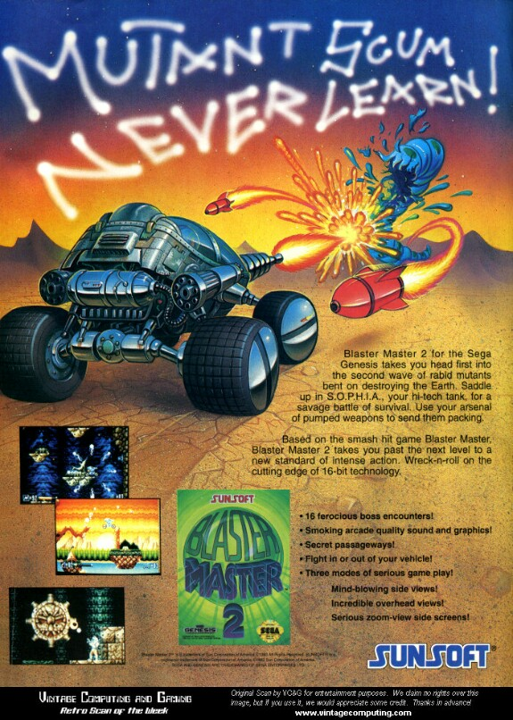

**Дэвид Силлер:** Проблема с разработкой игр заключается в том, что мы всегда опаздываем. Нам дали одобрение создать что-то, но издатель хочет, чтобы всё было готово уже завтра утром! Я считаю, что мы сделали отличное продолжение, но оригинал для Famicom делали более двух лет, тогда как работа над версией для Mega Drive заняла примерно восемь месяцев. Будь у нас больше времени у нас бы получилась более сбалансированная игра и, возможно, более интересные особенности.

***Каково было работать с Disney  когда одновременно разрабатывались две игры по «Красавице и Чудовищу» в Sunsoft?***

**Дэвид Силлер:** Вначале это было волнительно, но потом это стало большой проблемой. Это была моя идея создать две разные игры: «Roar of The Beast» предназначалась для мужской аудитории, а «Belle's Quest» была бы специально ориентирована на женскую, с головоломками и ездой на лошади. Игры немного пересекались, если играть в них одновременно.

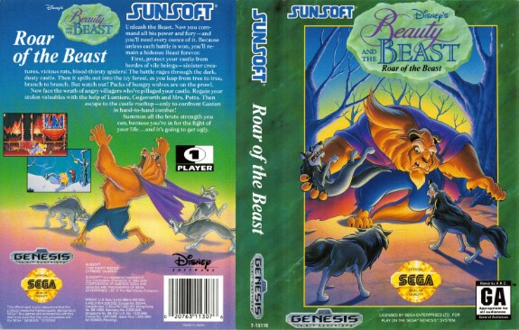

В то время Disney была влюблена в игру «Aladdin» от Virgin и чувствовала угрозу со стороны наших игр.  Это заставило их намеренно задерживать одобрение концепции наших двух проектов. Даже с задержкой мы всё равно должны были закончить обе игры за шесть месяцев. Я горжусь этими играми, но хотелось бы иметь больше времени, чтобы доработать их как следует. 

***Как создавался Aero The Acrobat? Sunsoft искала талисмана для компании?***

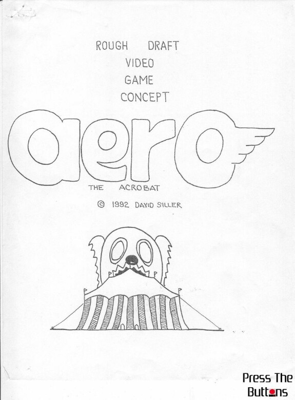

**Дэвид Силлер:** Aero уже был частью моего портфолио интеллектуальной собственности игр до моего прихода в Sunsoft. Они не стремились создать талисмана, но я представил концепцию президенту Sunsoft Джо Роббинсу, и он ею загорелся.

Однако сначала он предложил Aero президенту Sega, Хаяо Накаяме, как компаньона для Sonic. Но Накаяма предложил Роббинсу, чтобы сама Sunsoft разработала игру с этим персонажем и выпустила её для Mega Drive! После этого Sunsoft воодушевилась и начала кампанию по продвижению этого «талисмана».

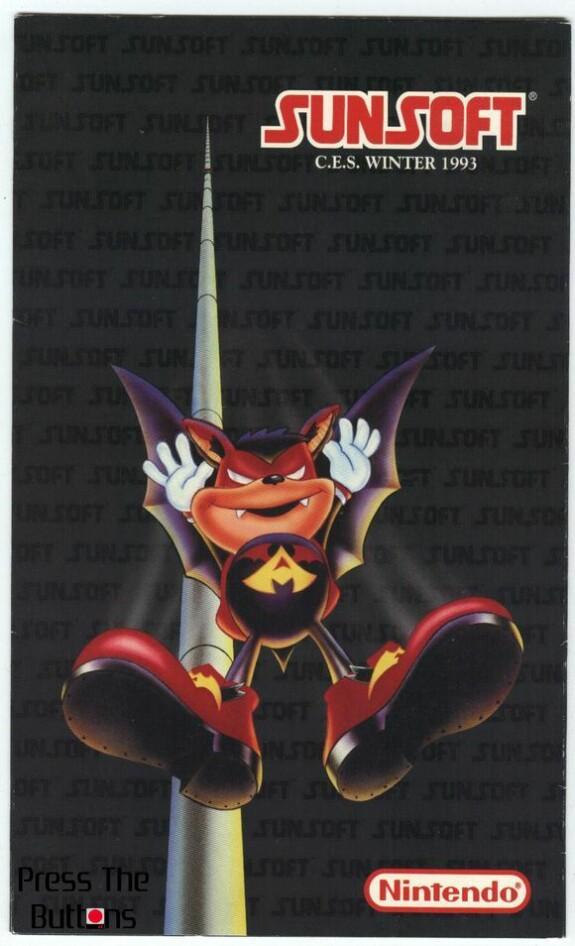

***Что легло в основу концепции персонажа? Чем вы вдохновлялись?***

**Дэвид Силлер:** Aero был вдохновлен тремя элементами. Во-первых, Микки Маусом от Walt Disney. Кто не любит этого мышонка? Во- вторых, героем мультфильмов Super Mouse от Terrytoon Studio (Fox). Это был один из моих любимых мультфильмов в детстве. Наконец, Mappy от Namco, который прыгал по батутам.

Я объединил некоторые из этих элементов и создал историю, в которой Aero, цирковой артист, становится героем, чтобы спасти цирковой мир. Концепция развилась, и он также стал защитником животных.

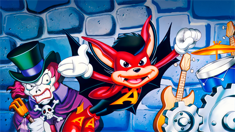

***Второй Aero отказался от структуры миссий, которая нарушала типичную линейность платформенных игр того времени. Это решение было принято, чтобы сиквел проще?***

**Дэвид Силлер:** К сожалению, да. Мы приняли более традиционную структуру, потому что некоторые игроки ожидали более знакомых механик и были разочарованы тем, что мы представили. Aero был одним из первых, возможно, первой игрой, которая представила «миссии» и «задачи» для выполнения, а также дала герою техники для атаки и защиты. Также, в отличие от многих платформенных игр, Aero использовал механики, требующие близкого контакта вместо простых выстрелов по врагу на экране. Было необходимо изучить новые приемы и ловкие манёвры, чтобы хорошо играть.

***Aero The Acrobat 2 содержит в титрах дань уважения бразильскому гонщику Айртону Сенне (умершему в 1994 году, в год выпуска игры). Кто-то из команды был поклонником Сенны?***

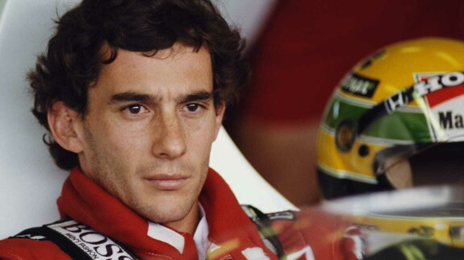

**Дэвид Силлер:** Айртон Сенна был героем для меня. У него был уникальный и вдохновляющий талант. Я был и остаюсь фанатом Формулы 1, но Сенна был больше, чем просто величайший гонщик всех времен. Он вдохновил меня достигнуть высот в моей карьере, которые я не мог себе представить. Его харизма была невероятной, и при всей своей гениальности, он оставался простым человеком.

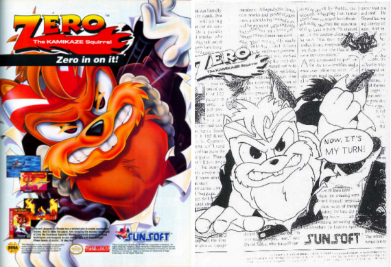

***Когда возникла идея создать спин-офф с персонажем Zero?***

**Дэвид Силлер:** Zero стал одним из первых антигероев в видеоиграх, получивших собственную игру. Он был создан в сотрудничестве с моим сыном Джастином (который работал со мной) и был противником Aero. А позднее Джастин создал отдельную историю, которая исследовала способности Zero и его трансформацию в героя.

***Каков был коммерческий результат франшизы? Были ли планы третьей игры, возможно, в 3D?***

**Дэвид Силлер:** Sunsoft проходила через множество изменений, и  после крупной реорганизации управления я решил перейти в одну из крупнейших голливудских студий. Warner Bros и Universal активно меня переманивали, и так как Sunsoft преобразовывала свой бизнес-проект во что-то другое, я покинул компанию. Именно поэтому не было третьей игры от Sunsoft, хотя я ее планировал.

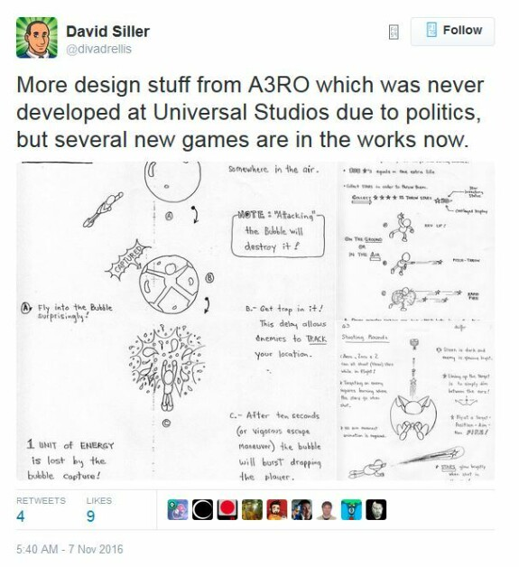

После моего ухода Sunsoft даже продала мне права на интеллектуальную собственность, и Universal была заинтересована ею, поскольку планировала создать набор персонажей мультфильмов, похожий на Warner Bros. В Universal Aero должен был стать талисманом подразделения по решению президента Роба Биназа.

Я полностью спроектировал 3D-игру и представил ее в офисах Universal Interactive Studio. Это вызвало недовольство ребят, работавших над  Crash Bandicoot ... В итоге некоторые элементы моего проекта были заимствованы двумя независимыми внутренними командами по приказу исполнительного продюсера.

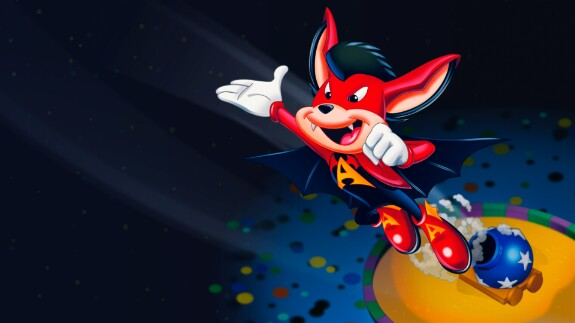

***В 2002 году Aero the Acro-Bat получила порт для Game Boy Advance с батарейкой для сохранения прогресса и в ней сложность была занижена. По-вашему, оригинал получился слишком сложным для новой аудитории?***

**Дэвид Силлер:** Я думал, что более простой геймплей лучше подходит для портативных консолей. К сожалению, издатель Metro 3D совсем не занимался маркетингом, что сделало невозможным финансирование выпуска других портов.

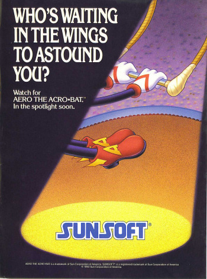

***Франшиза отметила свое 25-летие в 2018 году. Возможно ли увидеть что-то новое из серии в будущем? Может быть, в рамках краудфандинговой кампании?***

**Дэвид Силлер:** Да, безусловно. Я планировал что-то новое к 25-летию. Rocket Amusements, компания, которая производит игровые автоматы для развлекательных центров и торговых центров, заинтересована в моем проекте для своего рынка. Я назвал его «Aero the Acro-Bat 25th Anniversary Edition: Under the Big Top». Кампания на Kickstarter была бы более сложной, потребовался бы прототип, и я не знаю, нужно ли рынку еще одна игра с Aero... Если бы кампания провалилась, я бы был разочарован.

***Sunsoft имела очень сильную линейку игр в поколениях 8 и 16 бит, но позднее исчезла. Что послужило причиной упадка компании на ваш взгляд?***

**Дэвид Силлер:** Японская материнская компания, Sun Denshi, до сих пор работает с компьютерным железом. Она остается сильной и активной, но не в играх. Sunsoft погубил провальный проект гольф-курорта «Desert Wells» в Палм-Спрингсе (США).

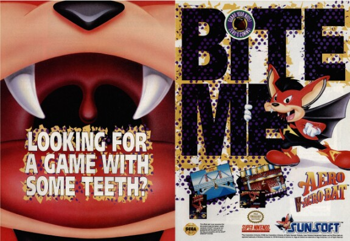

***Часть игр, над которыми вы работали в эпоху 16 бит выходила на разных платформах. Для какой системы было проще создавать игры – для Nintendo (SNES) или Sega (Genesis/Mega Drive)?***

**Дэвид Силлер:** Из этих двух вариантов консоль Sega имела более понятную архитектуру, и поэтому можно было делать то, что хочешь, с менее сложным кодом. У SNES были интересные возможности, такие как псевдо-3D в Mode 7, но это была более сложная в работе система и чтобы раскрыть ее потенциал требовались наилучшие технологии.

***Какова была ваша роль в создании первой части Crash Bandicoot (в Universal Interactive) и позже в Maximo: Ghosts to Glory (в Capcom)?***

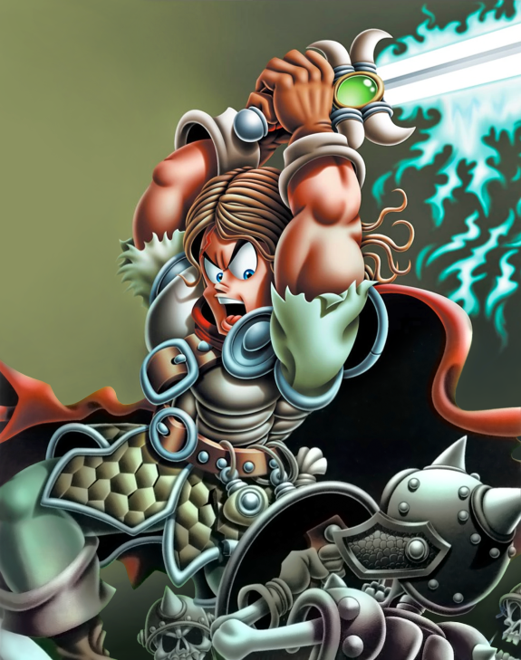

**Дэвид Силлер:** Я потихоньку пишу книгу об этих двух проектах.

***Из всех игр, которые вы разработали, какая ваша любимая?***

Дэвид Силлер: Спросите у отца, кто его любимый ребенок. Я по-особенному люблю все оригинальные проекты, в создание которых я был вовлечен, поэтому все они для меня как дети. Каждый из них особенный по-своему. Все они — фавориты!

***Как вы сейчас относитесь к миру видеоигр? Известно, что у вас большая коллекция.***

**Дэвид Силлер:** Я частично отошел от дел, так как не создаю новые игры уже много лет. Я все еще рисую, делаю наброски и создаю проекты игр, которые, скорее всего, никогда не будут реализованы. Конечно, у меня есть все программы для работы над ними, и у меня есть несколько потенциально интересных, но для этого нужны время и деньги. Будучи коллекционером, у меня есть все картриджи NES и SNES, которые я хотел иметь у себя.

Перевод: Dart
Источник: Журнал WarpZone, November 2017