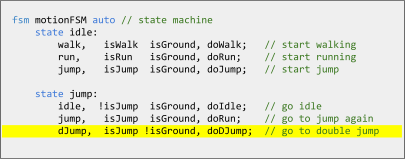
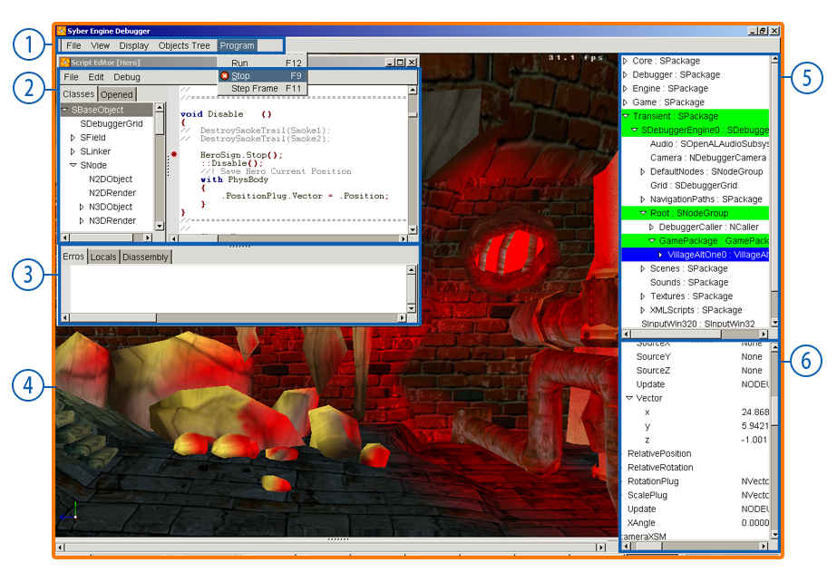
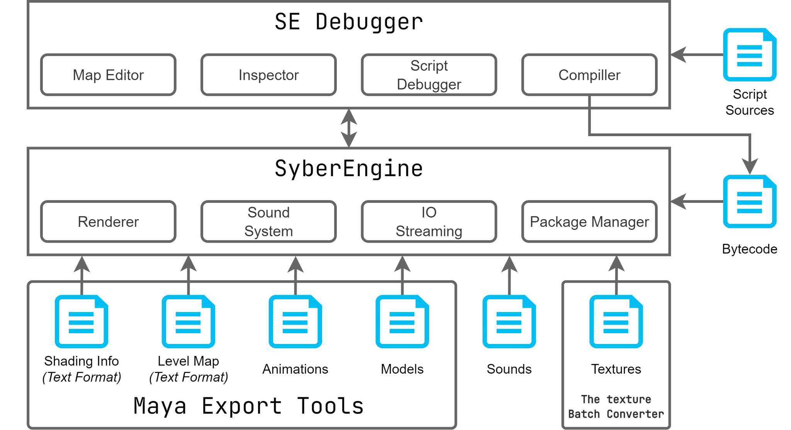

# SyberEngine: Rapid Game Development System Overview
> **Technical Specification & Architectural Overview**  
> *Author: Valeriya Pudova*  
> *Date: June 2003*  
> *Document Revision: G*  
> *© 2003 Sybersoft. All rights reserved.*

---

## Abstract / Введение

This document outlines the core architecture of **SyberEngine**, a high-performance system designed for rapid game development. It establishes the asset pipelines, data-driven execution paradigms, and tooling structures implemented to bridge the gap between engine code and content creation.

---

## Introduction: Architectural Goals & Philosophy

To achieve rapid iteration loops and true cross-platform capabilities, we engineered **SyberEngine**. At its inception, no commercial engine on the market provided the necessary combination of architectural flexibility and pipeline integration. 

The system was designed from the ground up to meet four non-negotiable engineering requirements:
* **True Portability:** Absolute decoupling from platform-specific APIs to ensure seamless ports to any target hardware.
* **Deep Digital Content Creation (DCC) Integration:** Native, deep-level synchronization with *Autodesk Maya*.
* **Data-Driven Gameplay Scripting:** A lightweight, high-performance scripting language for rapid feature implementation.
* **Extensible SDK & Plug-in Architecture:** A modular type system allowing engineers to build isolated, specialized modules.

### Component-Based Node Architecture

SyberEngine pioneered a highly efficient **Component-Based (Node) Architecture** to drive runtime behavior. By implementing a system of standalone nodes equipped with connection plugs, we achieved a strict *Separation of Concerns* between engine systems and creative design.

While visual programming tools were planned for the next lifecycle phase, our immediate focus was defining a robust text-based paradigm:
1. **Native Optimization:** Core systems engineers write highly optimized, deterministic Node collections in native C++.
2. **Safety and Stability:** Every C++ node undergoes strict testing to isolate memory management and performance bottlenecks before it is exposed to the scripting layer.
3. **High-Level Abstraction:** Content creators and gameplay scripters connect these stable blocks via our custom language (**SyberScript**).

Nodes abstract complex low-level operations (such as `3DRender`, `3DObject`, `Texture`) into clean, concise, and self-contained interfaces. This drastically reduces the cognitive load on artists and designers, enabling them to safely interact with engine internals through an intuitive and predictable API.

---

## The Scripting Layer: SyberScript & State Machine DSL

While the entire engine core is built in native C++, gameplay logic is intentionally offloaded to **SyberScript**. This architectural decision was driven by several critical production and technical metrics:

* **Memory Safety & Sandbox Execution:** Native C++ development is highly prone to memory leaks, pointer corruption, and hard crashes. SyberScript acts as a safe sandbox, isolating engine stability from gameplay-level bugs.
* **Hot-Reloading (Zero Compilation Overhead):** Modifying native C++ code requires a full compilation and linking cycle. SyberScript bypasses this bottleneck entirely, allowing instant runtime evaluation and fine-tuning without restarting the engine client.
* **Lowering the Barrier to Entry:** Offloading logic from systems programmers allows game designers and content creators to modify gameplay parameters and script behaviors independently, without deep knowledge of low-level C++ paradigms.
* **Asynchronous Multi-Tasking:** The scripting engine natively simplifies the creation and execution of parallel, multi-tasking gameplay routines without complex manual thread synchronization.
* **Native State Machine Integration:** Complex gameplay logic is inherently event-driven. SyberScript natively implements a dedicated Domain-Specific Language (DSL) to easily define and manage **Finite State Machines (FSM)**.

### Finite State Machine (FSM) Domain-Specific Language

Managing complex interactive logic manually becomes unmaintainable as a game grows. SyberScript solves this by introducing a clean, deterministic syntax explicitly designed for state handling:

*Figure 1: SyberEngine's native Finite State Machine (FSM) Domain-Specific Language (DSL).*

---

## Content Pipeline & Maya Toolchain Integration

Our fundamental pipeline philosophy was to **empower the creative team**. To eliminate the friction of moving assets between DCC software and the engine runtime, we developed a massive custom toolchain integrated directly into *Autodesk Maya*. 

Instead of forcing artists to adapt to a separate, clunky proprietary editor, we transformed Maya into the primary scene and world-building layout tool.

### Features of the Maya Asset Pipeline:
* **Direct World Editing:** Artists can instantiate actors, place 3D objects, configure lights, and assign textures directly inside the Maya viewport.
* **Data-Driven Property Injection:** Behavioral attributes, script links, and custom gameplay variables can be attached to 3D nodes and tweaked without leaving the DCC application.
* **Instant Export Pipeline:** With a single-button export tool, assets are serialized, processed, and pushed to SyberEngine immediately.
* **Unified Interface Design:** Once exported, any secondary adjustments or engine-side polish are performed via an editor UI designed to functionally replicate Maya’s layout, minimizing cognitive switching for the art team.

To support this seamless workflow, we engineered **over 40 custom plug-ins and tools for Maya**. This massive tooling ecosystem completely offloaded content-integration tasks from programmers, allowing them to focus entirely on core engine infrastructure.

*Figure 2: Custom-programmed integration tools and toolbars inside Autodesk Maya.*

---

## Rendering Capabilities & Shading Pipeline

SyberEngine delivers a production-ready feature set tailored for high-fidelity interactive graphics. The rendering pipeline is engineered to extract maximum performance from the hardware while maintaining visual flexibility for the art team:

* **Real-Time Dynamic Shadows:** Native support for real-time actor casting shadows to ground characters firmly within the environment.
* **Advanced Vertex Color Pipelines:** Exploiting hardware vertex baking for efficient ambient lighting, tinting, and optimization of static geometry.
* **Multilayered Material Texturing:** Support for multi-texture blending, enabling complex material definitions, detail maps, and surface variation.
* **Programmable Shading via NVIDIA CgFX:** Full integration with the **NVIDIA CgFX** shader framework. Artists and technical directors can leverage the CgFX shading language directly, bypassing fixed-function pipeline limitations to author custom surface effects, post-processing, and cutting-edge materials.

---

## Tooling Ecosystem: SEDebugger & Runtime Introspection

SyberEngine moves completely away from archaic, command-line-driven workflows. The toolchain is designed as a WYSIWYG ecosystem with focus on absolute ease of use. 

With a **single-click pipeline**, assets generated in *Autodesk Maya* are compiled, exported, and immediately loaded into the active engine instance. If necessary, SyberEngine performs **just-in-time compilation (JIT) of script sources on the fly**, eliminating asset-stale states during iteration.

To bridge the gap between asset inspection, script execution, and live debugging, we engineered **SEDebugger**—a unified graphic runtime tool designed for both programmers and technical artists.

*Figure 3: SyberEngine's native SEDebugger workspace layout.*

### Workspace Breakdown:
1. **Main Menu:** Global engine commands, state management, and pipeline configurations.
2. **Class/Files Browser & Script Editor:** Live access to the active SyberScript source files with on-the-fly editing capabilities.
3. **Error Log, Variable Inspector & Disassembly Preview:** Low-level runtime introspection, tracking compiler errors, memory state variables, and virtual machine bytecode disassembly.
4. **Active Game View:** Live, unthrottled real-time rendering window of the running game client.
5. **Scene Hierarchy Browser:** Complete outliner tree showing all active Nodes, GameObjects, and scene entities.
6. **Fields Inspector/Editor:** Data-driven property grids to tweak and hot-reload component values, attributes, and transform data in real time.

## Runtime Execution Architecture: Virtual Machine & Bytecode Pipeline

The internal execution pipeline of SyberEngine is structurally divided to maximize iteration speed and platform independence. The vast majority of gameplay logic is decoupled from native binaries and driven entirely by the scripting subsystem.

*Figure 4: SyberEngine's compiled asset serialization and VM execution pipeline.*

### The Compilation and Execution Loop:
1. **Source Compilation:** When a `SyberScript` file is modified, the compiler instantly tokenizes and translates the high-level human-readable code into a compact, serialized bytecode.
2. **Bytecode Virtual Machine (VM):** This bytecode is ingested by a highly optimized proprietary Virtual Machine running inside the engine core.
3. **On-the-Fly Runtime Updates:** The VM evaluates the instructions and mutates the active **Runtime Environment** state on the fly, eliminating the need for application restarts.

### VM Optimization & Resource Constraints

To minimize memory footprint and cache-miss overhead (critical metrics for the console hardware of the early 2000s), the Virtual Machine was designed around a **compact instruction set**:
* **Minimalist Opcode Footprint:** The VM utilizes a reduced command set with short-code operations, significantly lowering the memory overhead required to store active scripts.
* **Deterministic Execution:** The runtime and VM instruction pipeline are optimized specifically for low-latency gameplay loops, state transitions, and event processing.

### True Cross-Platform Portability

In traditional 2003-era game engines, platform porting was bottlenecked not just by rendering APIs, but by architecture-specific gameplay logic. SyberEngine solves this fundamentally:

* **Data and Logic Abstraction:** While geometry, textures, and keyframes are processed through hardware-agnostic serialization layers, **gameplay logic remains completely unified via the portable VM**.
* **Isolated Platform Layer:** Because SyberScript executes identically on any host machine, the platform-specific wrapper that requires manual rewriting and optimization during a hardware port is kept exceptionally small and self-contained. 

This architecture effectively shifts the cost of cross-platform development from aggressive codebase refactoring to simple low-level system mapping.

## SyberEngine Core Feature Sheet

### Core Architecture & Source Portability
* **Hardware-Agnostic Core:** 100% fully portable, modular source code engineered on top of native **OpenGL**.
* **Extensible Plug-in SDK:** Simplified extension API allowing systems programmers to easily compile new native C++ Nodes and expose them directly to the scripting layer and UI.

### Tooling Ecosystem & IDE (SEDebugger Workspace)
* **Scriptable GUI:** Fully customizable, Windows-native graphical user interface driven by layout scripts.
* **Integrated Script Editor:** Embedded IDE featuring real-time syntax highlighting, tokenization, and error tracking.
* **Live Runtime Introspection:** Dedicated Class Browser, Scene Hierarchy Object Tree, and live Object Fields Inspector.
* **State & Memory Diagnostics:** Real-time Local Variables viewer and memory state registers tracking.
* **Specialized Visual Editors:** Dedicated viewports for Navigation Path editing, Gameplay logic rules, World Reference object linking, and level staging.

### Execution Layer: Script Engine & VM
* **High-Performance Gameplay VM:** High-speed, lightweight Object-Oriented Programming (OOP) scripting language mapping to a highly optimized proprietary Virtual Machine.
* **Memory Constraints Optimization:** VM explicitly optimized for compact bytecode size and low cache overhead.
* **Native 3D Math Pipeline:** Built-in hardware-accelerated 3D vector, matrix, and quaternion math functions and primitives.
* **First-Class FSM Support:** Native, grammar-level implementation of Finite State Machines inside the scripting language syntax.
* **Just-In-Time (JIT) Debugging:** Full support for live execution breakpoints, step-by-step instruction stepping, and single-frame execution analysis.

### Component & Engine Systems
* **Pure Node-Based Architecture:** Fully componentized architecture where behaviors, renders, and rules are self-contained Nodes with data connection plugs.
* **Production-Ready Node Library:** **85+ fully verified C++ nodes** available out-of-the-box (covering rendering, systems, logic, and math).

### Rendering & Programmable Shading Pipeline
* **Spatial Optimization:** Hierarchical scene graph occlusion and frustum culling.
* **Level of Detail (LOD):** Automated runtime LOD switching for meshes and textures based on camera distance.
* **Advanced Material Pipeline:** Multi-layered and animated texture support with depth-sorting rendering queues.
* **Programmable Shading:** Seamless execution of **NVIDIA CgFX** shaders and custom OpenGL shading paths.
* **Dynamic Environmental FX:** Real-time hardware-calculated dynamic actor shadows, vertex color illumination baking, lens flares, and true cubic real-time environmental reflections.
* **Procedural Shading Systems:** Dedicated volumetric subsystems for rendering clouds, animated water surfaces, and atmosphere.

### Advanced Animation Graph
* **Skeletal Animation Engine:** Low-overhead skeletal deformation pipeline.
* **Multi-Source Blend Graph:** Real-time mathematical animation blending across multiple independent clips and pose tracks.

### Physics & Rigid-Body Dynamics
* **Multi-Domain Physics Simulation:** Support for running multiple independent physics systems concurrently within a single unified game world.
* **Rigid-Body Mechanics:** High-performance processing of both active (kinematic/dynamic) and passive rigid bodies.
* **Dynamic Mesh Fragmentation:** Real-time skeletal explosion algorithms allowing physical joint separation and limb-tearing effects on impact.

### Asset Pipeline, Serialization & DCC Compatibility
* **Unified Level Serialization:** Clean **XML-based format** for structured level data import, export, and cross-platform scene migration.
* **Deep Autodesk Maya Integration:** One-click automated export pipelines pipeline transferring geometry data, keyframe animations, shader bindings, and complex scene node references natively into the engine binary format.

---

### Roadmap / Upcoming Release Milestones (Archival 2003 Focus)
* **Mesh Blending:** Advanced vertex-blend shapes for organic deformations and facial expressions.
* **Specialized Vegetation Shading:** Custom shading models designed for sub-surface scattering on foliage, leaf glowing, and wind reflections.
* **Advanced Constraints:** Implementation of complex physics joints (hinges, ball-sockets, and springs) for articulated rigid-body assemblies.
* **Real-Time Structural FX:** Specialized procedurals for ropes, dynamic suspension rope-bridges, structural destructions, and explosion/implosion vector simulations.
* **Asynchronous Background Streaming:** IO background asset streaming to eliminate loading screens during world transitions.
* **Integrated Movie Player:** Native, real-time 3D textures video decoding for cinematic playback.
* **Dynamic Weather Simulation:** System-driven state changes for seasonal environments, rain, and particle precipitation loops.
