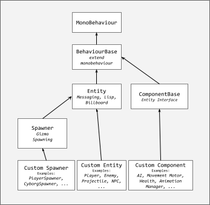
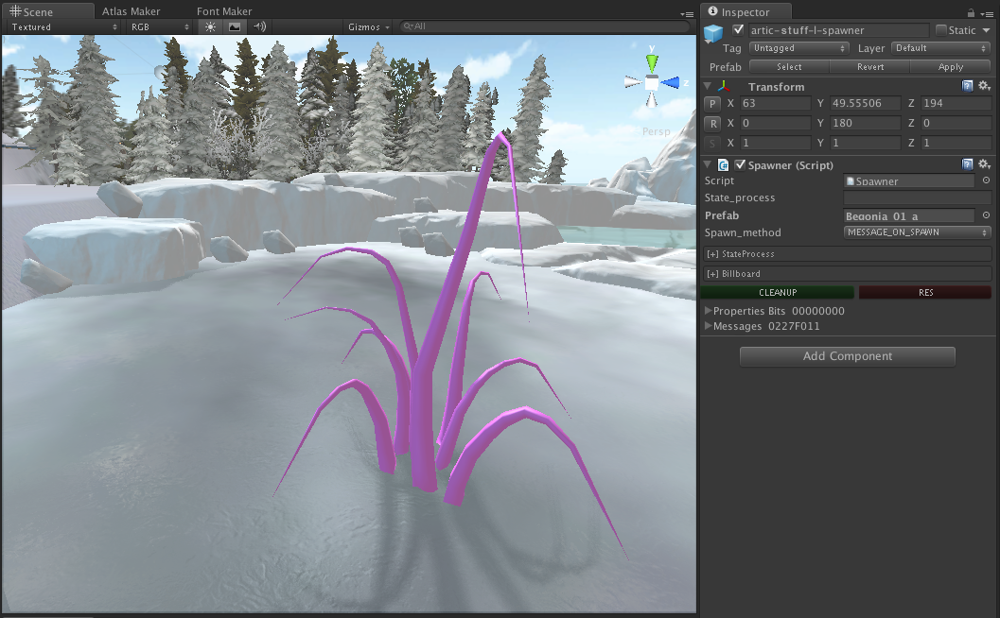
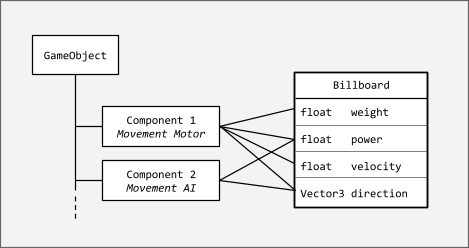
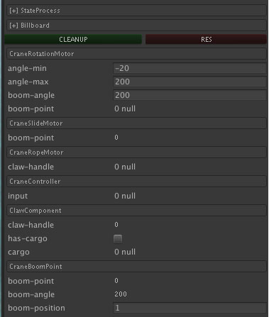
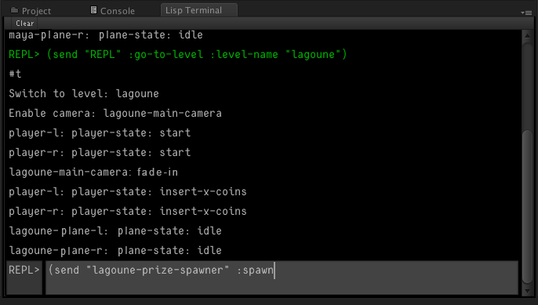
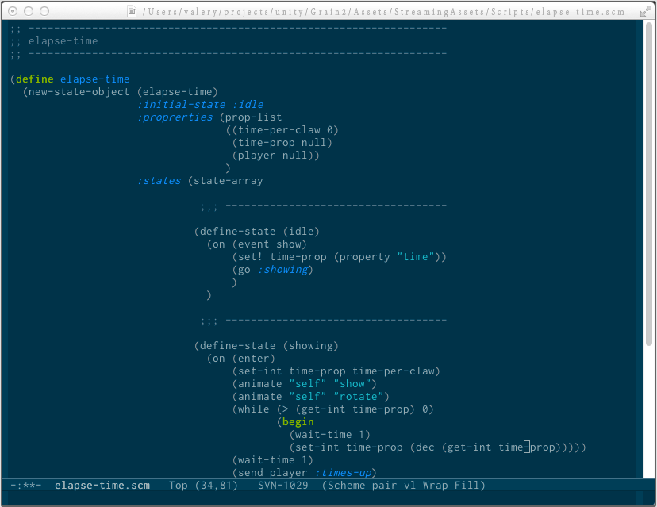

# Lisp-Based Scripting in Unity 3D: A Practical Case Study

> **Architectural Specification & Embedded Interpreter Integration**  
> *Author: Valeriya Pudova*  
> *Date: June 2013*  

---

## Abstract

This paper details the architectural integration of a **Scheme (Lisp dialect) interpreter** into the *Unity 3D* game engine. It demonstrates how leveraging a functional scripting layer yields faster iteration loops, increased behavioral flexibility, and higher runtime reliability compared to the standard, monolithic Unity C# / UnityScript environment.

For interactive software—which inherently demands thousands of concurrent runtime behaviors and complex, dynamic data structures—the high-level Scheme paradigm of **homoiconicity ("code-as-data")** and functional execution proves to be an exceptionally valuable asset.

---

## Introduction: The Scale Bottleneck & Data-Driven Alternatives

While Unity 3D’s GUI-centric scripting and inspector-driven configuration provide an intuitive onboarding experience for rapid scene layout and elementary character behaviors, the paradigm suffers from severe, asymmetric scaling issues in large-scale production environments.

As a project grows, managing thousands of interactive entities, cross-referenced mono-behaviors, and granular asset dependencies purely through a graphical user interface becomes unmaintainable. The cognitive load and error rates of tracking implicit links in a GUI layout present a major bottleneck to development velocity.

To alleviate this, experienced Unity practitioners advocate shifting toward text-based configuration architectures to streamline automation, data serialization, and asset tracking `[1]`. Textual representations are fundamentally superior for distributed, multi-developer workflows, enabling clean branch merging, code reviews, and deterministic state tracking via standard Source Code Management (SCM) systems.

## Bridging Data and Logic via Homoiconicity

The framework detailed in this paper expands upon traditional declarative text configurations (such as static JSON or XML) by embedding rich script and execution behaviors directly within the asset definition layer using a **Lisp/Scheme S-expression syntax**. By exploiting Lisp's inherent *homoiconicity*—the structural duality where code is represented as data—game objects can inject, mutate, and execute custom behaviors on the fly. This architecture eliminates the anti-pattern of constructing rigid, deep type hierarchies in more static, compiled languages just to handle contextual gameplay variations.

## Advantages over Compiled Runtimes

Integrating Scheme as a high-level scripting layer delivers several distinct advantages over Unity's native compiled C# or legacy UnityScript environments:

* **Decoupled Serialization:** Text files defining game object parameters can encapsulate localized event-handling routines, isolated finite state machines (FSMs), lightweight concurrent threads, and child entity instantiation sub-graphs.
* **Low Ceremony Lifecycle:** Game levels and runtime logic can be ingested, validated, and initialized with significantly less boilerplate and architectural ceremony than native C#-driven scene management.
* **REPL-Driven Introspection:** The embedded Lisp runtime exposes a live **REPL (Read-Eval-Print Loop)** console interface. Engineers and designers can inspect live memory states, reconfigure active scene topologies, and evaluate logic modifications instantly, completely bypassing the destructive edit-compile-rebuild loop during live parameter tuning.

This framework heavily embraces the industry-proven **Data-Driven Game Object Design** paradigm popularized by leading AAA studios `[2, 3, 4, 7]`. Historically, the practical deployment of Lisp-family dialects inside high-end game runtimes has demonstrated immense architectural advantages in terms of system isolation and iteration throughput `[4, 5, 6, 7]`. By unifying executable code and declarative data structures into unified S-expressions, SyberEngine's Scheme integration bridges the gap between fast logic modification and stable host execution.

## Embedding the Scheme Interpreter in Unity 3D

The architectural framework deployed in this implementation utilizes the **Scheme dialect** of Lisp. The embedded scripting environment is built on top of a modified version of the **TAME Scheme library (C#)** authored by *Andrew Hunter*.

The interpreter operates via a structured multi-stage pipeline:

1. **Bytecode Compilation:** Source code is parsed and compiled into an optimized instruction bytecode.
2. **Production Pre-cooking (AOT):** For release builds and production environments, the engine supports Ahead-of-Time (AOT) compilation. Instruction lists are serialized and saved directly to disk files to minimize runtime initialization overhead.
3. **CLR Integration:** While the underlying library supports dynamic translation of Scheme source code directly into the Common Language Runtime (CLR) Common Intermediate Language (CIL), this feature was intentionally bypassed to maintain absolute cross-platform predictability and security sandboxing.

### Zero-Overhead Data Types Integration

To meet strict gaming performance budgets and prevent memory fragmentation, the scripting layer eliminates runtime data serialization overhead:

* **Native C# Representations:** The vast majority of primitive data structures in the execution loop are represented using native, unmanaged C# types and structures.
* **Custom Lisp Primitives:** Instead of boxing application data into heavy, Lisp-specific data formats, the architecture maps core engine functionalities directly into lightweight Lisp primitives implemented natively in C#.
* **Direct Mapping:** This tight binding eliminates costly runtime data conversion loops between the host engine (C#) and the scripting layer (Scheme).
* **C#-Native Lisp Primitives:** Only essential Lisp-specific control primitives—such as `Symbol`, `Cons` (cells), `Function`, and `Continuation`—are defined, and they are fully implemented as native, high-performance C# classes.

### Garbage Collection & Memory Management

The embedded scripting framework does not deploy a separate, isolated memory management loop:

* **Unified Host GC:** The Scheme runtime completely offloads memory management to Unity's native Common Language Runtime (CLR) Garbage Collector.
* **Opaque Handle Referencing:** In most scenarios, the Scheme environment interacts with heavy Unity Engine resources via **unique object names** or **opaque handles**. This ensures that the host garbage collector can freely move and compact objects in memory without corrupting script-side references.
* **Transient Pointer Optimization:** Raw C# references and pointers are confined strictly to local, transient scopes where execution properties guarantee that a GC allocation/collection phase cannot be triggered.

### Cross-Runtime Naming Conventions

To maintain absolute clarity across the boundary of the script environment and the compiled host engine, a strict naming convention is enforced at the architecture level:

| Runtime Domain | Case Style | Syntax Example | Context / Usage |
| :--- | :--- | :--- | :--- |
| **Lisp / Scheme Scope** | Kebab-case (lowercase with dashes) | `elapsed-time` | Internal script variables, functions, and DSL syntax. |
| **Host C++ / C# Interop** | Snake_case (lowercase with underscores) | `elapsed_time` | Native C# bindings, raw API wrappers, and interop fields. |
| **Unity Typings & Reflection** | PascalCase (CamelCase) | `PlayerController` | Native Unity Components, Class Typings, and Reflection hooks. |

### Runtime Introspection & Reflection Pipeline

The embedded Scheme Virtual Machine leverages native CLR reflection to dynamically access and manipulate Unity Engine data structures. The syntax for evaluating fundamental operations, field mutations, and static method invocations is structured as follows:

```lisp
;;; Retrieve a field/property, or invoke a method without arguments
(-> object fieldname) ;; Object instance scope
(-> type fieldname)   ;; Static member scope

;;; Mutate a field/property, or invoke a method with specific arguments
(-> object (fieldname value)) ;; Object instance mutation
(-> type (fieldname value))   ;; Static member mutation
```

To resolve nested object graphs—equivalent to a standard C# dot-notation chain like `foo.bar(1).baz(2,3)`—the interop layer evaluates expressions sequentially:

```lisp
(-> object foo (bar 1) (baz 2 3))
```

### Object Instantiation

Instantiating a new engine entity with arguments passed to the constructor:

```lisp
(new vector3 1 2 3)
```

Instantiating an object via its default constructor, followed by selective field assignment using keyword/value pairs:

```lisp
(new* vector3 :x 1 :y 2)
```

The interop layer encapsulates a robust suite of reflection utilities, including namespace parsing, runtime type casting, enum evaluation, delegate bindings, generic class instantiation, and live object/metadata inspection.

### Mitigating Reflection Overhead: The Entity "Billboard" System

While native reflection provides absolute architectural flexibility, it introduces severe CPU overhead during runtime execution loops due to metadata lookup costs. To safeguard the engine's frame rate during high-performance gameplay scenarios, the architecture bypasses reflection via a proprietary pattern: **The Entity Billboard**.

* **Data Structure:** The Billboard is a dynamic, high-density list of strongly-typed attributes attached directly to each interactive GameObject, managed as a high-performance `<Key, Value>` slot table.
* **Performance Characteristics:** The computational cost of a Billboard attribute access scales similarly to a lightweight, flat hash table lookup, completely bypassing the heavy CLR reflection pipeline.
* **Pointer Caching Optimization:** To maximize throughput, the script runtime can permanently cache direct references to specific Billboard slots after the initial lookup phase. This optimization drops the subsequent read/write access overhead down to a level comparable to native **C++ smart pointers**.
  
## Game Object Architecture: The Hybrid Entity System

In native Unity 3D, the core `GameObject` class is sealed and cannot be extended with custom low-level memory fields or dynamic architectural methods. To bypass this limitation, the framework enforces a decoupled architecture by introducing a specialized **Entity Component Class**.

Every interactive or script-driven object in the runtime must encapsulate this component (or a component derived from it). The `Entity` instance acts as the primary host-side wrapper, containing the high-performance **Billboard slot table** and the execution bindings to the underlying Scheme runtime.


*Figure 1: Type hierarchy and structural separation between native Unity GameObjects and the Scheme-bound Entity component layer.*

### Extensibility without Inheritance

Due to this design, creating custom C# sub-classes for different game archetypes is rarely required:

* **Dynamic Mutation:** The base `Entity` class can be dynamically extended at runtime via Scheme scripts and on-the-fly Billboard attribute injections.
* **Composition over Inheritance:** Behavior can be heavily customized by composing multiple independent **Custom Components** onto the Entity, completely eliminating the anti-pattern of deep, rigid inheritance trees.

### Tooling Automation: The Dynamic Spawner Pipeline

The toolchain introduces a specialized **Spawner Component**, which acts as a lightweight, memory-efficient proxy for complex entities that will be instantiated at runtime.

The Spawner delivers high pipeline utility by solving a major designer bottleneck:

* **Inspector Virtualization:** It exposes the complete serialized Billboard of the target spawnable object directly to the Unity Editor Inspector, allowing parameter tuning before instantiation.
* **Editor Viewport Virtualization:** To prevent scene bloat, the Spawner does not contain its own native `MeshFilter` or `MeshRenderer` in the runtime. However, utilizing custom editor scripting hooks, **it dynamically visualizes the precise 3D bounds and mesh representation of the spawnable object directly within the Scene View**.
* **Live Selection:** These virtualized preview meshes remain fully interactive and selectable within the editor viewport, maximizing layout speed for level designers.


*Figure 2: The Spawner proxy renders the spawnable target's mesh data within the editor viewport without instantiating actual runtime graphics components.*

## Component Interoperability & Communication Architecture

### The Interface Synchronicity Problem

While Unity’s native component architecture scales predictably within a mono-runtime environment (C# to C# or JavaScript), it introduces severe architectural friction when bridged to an embedded Lisp scripting layer. The fundamental bottleneck lies in **Inter-Component Communication (ICC)** within a single unified Entity.

Traditional C# paradigms rely on two primary patterns, both of which break down when applied to a dynamic scripting bridge:

1. **Message-Passing (`SendMessage` / Event Hooks):** This requires maintaining strict, bidirectional type synchronicity between compiled C# messages and dynamic Scheme schemas. The runtime costs of serializing, dispatching, and interpreting string-based or boxed messages severely throttle CPU performance.
2. **Strict Interface Contracts (`IComponentInterface`):** This enforces static typing. For the dynamic Scheme layer to interact with these interfaces, the Virtual Machine would be forced to execute heavy **runtime reflection** loops, creating an unacceptable performance bottleneck in the gameplay execution path.

### The Solution: Shared Blackboard State via the Billboard

To completely eliminate the overhead of message parsing and dynamic reflection, the architecture routes all inter-component states through a unified blackboard pattern: **The Entity Billboard**.

Instead of components talking to each other directly or invoking foreign methods, they read and write to named, strongly-typed memory slots on the host Entity.


*Figure 3: Inter-component communication and state sharing managed via the centralized Entity Billboard allocation grid.*

#### Deterministic Slot Registration Pipeline

* **Unified Attribute Namespace:** Attribute keys are strictly unique within the scope of a single `GameObject` instance.
* **Declarative Manifests:** Every individual component (whether compiled C# or scripted Scheme) contains a declarative manifest of the memory attributes it requires for execution.
* **On-Demand Allocation & Initialization:** When a component initializes, its attribute declarations are evaluated against the parent Entity's Billboard:
  * **Slot Resolving (Late Binding):** If the requested attribute key already exists (allocated by a previously initialized component), the registration loop short-circuits and returns a direct memory reference to the **existing Billboard slot**.
  * **Slot Allocation:** If the key is absent, a new typed slot is dynamically carved out within the Billboard memory pool, and its reference is returned.

This late-binding allocation strategy turns the Billboard into a highly efficient, type-safe shared memory grid. Components achieve absolute decoupling: they do not need to know about each other's existence, types, or internal implementations. They simply read and write to the same pre-cached memory slots at speeds matching direct pointer operations.

---

### Reactive Data Bindings & Frame-Level Batching

To allow components to react dynamically to state mutations within the unified memory grid, the Billboard system implements an optimized **Reactive Event-Driven Pipeline**. Whenever a shared attribute value is mutated, a notification callback is automatically queued for any component bound to that data slot.

To prevent performance degradation under heavy execution loads, the dispatch system utilizes a high-efficiency **Frame-Level Coalescing Mechanism**:

* **Update Consolidation:** If an attribute is mutated multiple times within a single execution frame, or if multiple related attributes are modified simultaneously, the system batches the operations.
* **Single-Pass Execution:** Redundant callback triggers are completely stripped out, executing exactly one unified notification pass per frame for the affected components.

#### C# Host Binding Implementation Example

The following code illustrates how a compiled host-side component registers, caches, and evaluates a strongly-typed Billboard attribute within the Unity runtime loop:

```csharp
[BillboardFloat("angle-min", 0f)]
private PropFloat angle_min;

void Awake()
{
    // Resolve and cache the memory slot reference once during the initialization pass
    angle_min = FindProperty("angle-min") as PropFloat;
}

void Update()
{
    // Absolute low-overhead reading, scaling down to direct memory access speeds
    angle = Mathf.Max(angle + angle_velocity, angle_min.GetFloat());
}
```

The data pipeline supports a comprehensive suite of primitives beyond basic scalars (including vectors, matrices, string hashes, and object handles). Every property registered on the active Entity Billboard is automatically serialized and exposed natively to the editor workspace layout.


*Figure 4: The unified Billboard Editor inspector workspace. Attributes are automatically discovered and aggregated into contextual component groups.*

---

### Low-Overhead Script Binding & Prototype Overriding

By mapping script execution directly to pre-allocated Billboard data slots, the Scheme Virtual Machine achieves absolute performance parity with compiled local variables. The following snippet demonstrates how a high-level Scheme routing reads and mutates vector primitives without data boxing or reflection overhead:

```lisp
(define (change-direction new-direction)
  (set! old-direction (get-vector3 :direction))
  (set-vector3 :direction new-direction))
```

#### Composition via Prototype Inheritance

The Billboard architecture unlocks a powerful pattern for asset instantiation and level design workflows: **Prototype-Based Parameter Inheritance**.

Consider a standard automated `Spawner` entity tasked with instantiating a complex enemy character archetype upon receiving a gameplay event signal:

1. **Schema Injection:** The Spawner references a target character prefab asset. During its own initialization, it reads the prefab’s internal schema and merges all of the character's core Billboard attributes directly into its own editor-exposed property graph.
2. **Dynamic Overriding:** Level designers can tweak and override specific character values (e.g., boosting a specific spawn instance's health or modifying its navigation path) directly on the Spawner object itself.
3. **Flawless Instantiation:** When the spawn event is evaluated, the runtime instantiates the character entity, cloning the structural prefab data but seamlessly injecting the customized, overridden memory parameters from the host Spawner.

This completely eliminates the need to author hundreds of distinct, duplicated prefab variations for minor stat changes.

## The Interop Messaging System

### Overcoming Native SendMessage Bottlenecks

While Unity’s native `GameObject.SendMessage` pipeline serves as a convenient utility for pure, high-level C# inter-component routing, it presents severe architectural limitations when integrated with an embedded Lisp scripting runtime.

Because native `SendMessage` directly maps to compiled C# method signatures via string-based reflection, the host engine enforces a strict constraint: every dispatched signal must resolve to a concrete compiled C# function. This restriction breaks down when the intended recipient of a gameplay event or signal is a dynamic Lisp script execution block.

To bypass this bottleneck and achieve absolute interop fluidness, the architecture implements a custom, highly optimized **Polymorphic Event Bus**. This framework routes messages via pre-hashed atom references (**Symbols**), allowing unified, two-way communication between compiled native subsystems and dynamic runtime scripts.

#### Message Dispatch Examples (C# Host Scope)

Constructing and sending a zero-parameter signal:

```csharp
Message msg;
msg = new Message(sender_entity, Symbols.s_fire);
msg.Send(recipient_entity);
```

Constructing a data-dense payload using key-value dictionary bindings mapped via atomic Symbols:

```csharp
Message msg;
msg = new Message(sender_entity, Symbol.s_damage);

// Injecting strongly-typed payload variables without string parsing
msg[Symbol.s_force] = damageForce;
msg[Symbol.s_position] = hitPosition;

msg.Send(recipient_entity);
```

### Polymorphic Message Ingestion

Because messages are serialized into unified, decoupled payloads, they can be transparently intercepted and evaluated by either the compiled host engine or the dynamic Lisp virtual machine.

#### Unified Message Handler Implementation Example (C# Interop Layer)

```csharp
public override bool OnMessage(Message msg)
{
    // High-speed comparison using pre-hashed atomic symbols instead of raw strings
    if (msg.name == Symbol.s_animate) 
    {
        string animation = msg[Symbol.s_name] as string;
        Animate(animation);
        return true; // Event consumed successfully
    }
    
    return base.OnMessage(msg); // Forward to base fallback routing
}
```

This decoupled messaging bus provides seamless integration: a C# physical trigger can fire an event that a Lisp state machine absorbs instantly, or a Lisp combat script can broadcast a damage signal that native C# rendering and particle systems execute with zero data-marshaling overhead.

### Script-Side Message Ingestion

If the native C# `OnMessage()` pipeline returns `false` (indicating the event was not consumed by host-level components), the Polymorphic Event Bus invokes a **Fallback Routing Mechanism**. This automatically forwards the unhandled event payload directly into the active Scheme state machine execution loop.

#### Declarative Lisp Message Handler Example

```lisp
(on (event go-to-level)
    (destroy player)
    (set! level-name (msg-get :level-name))
    (spawn player)
    (go :start))
```

As demonstrated above, evaluating data properties inside a message utilizes the exact same syntax paradigm as reading from the Entity Billboard, reducing API friction for scripters.

---

### Fluent Message Dispatch in Scheme

Emitting gameplay messages directly from the script layer is designed to be concise and readable. Broadcasting a zero-parameter signal uses the following syntax:

```lisp
(send elapse-time-name :show)
```

To dispatch complex payloads, additional arguments are appended to the expression as a flat list of atomic key-value pairs—structurally mirroring the host-side C# pipeline:

```lisp
(send "player-l" :go-to-level :level-name "deadzone" :elapse-time 100)
```

#### Message Mutability and Context Forwarding

Because messages are managed as self-describing, high-density dictionary layers, they support dynamic mutation and lazy forwarding. This allows scripters to intercept an event, modify its fields on the fly, and forward it down the graph with minimal execution overhead:

```lisp
;; Forward the exact active message context to a new recipient
(msg-send "player-l")

;; Forward the current message context but mutate the event Identifier
(msg-send "player-l" :shoot)

;; Forward the current context while dynamically adding or overriding specific properties
(msg-send "player-l" null :speed 100 :direction (go-direction-to "exit-door"))
```

## Architectural Constraints & Execution Ordering

### Strict Actor Model Isolation

To maintain system stability and prevent fragile global state cross-dependencies, the framework enforces a design convention akin to the **Actor Model**:

* **Inter-Entity Isolation:** One independent `Entity` is strictly forbidden from directly accessing or mutating the internal memory fields or Billboard slots of another `Entity`. All cross-entity data transfers and state synchronization must be executed exclusively via the asynchronous **Interop Messaging System**.
* **Intra-Entity Composition:** Conversely, distinct components residing *within the exact same parent Entity scope* are encouraged to communicate and share states at high speeds through the centralized **Entity Billboard**.

### Message Processing Pipeline Matrix

Messages can be dispatched for **Immediate Execution** within the active frame or queued with a specific **Chronological Delay** (scheduled events). Once a message is delivered to a target Entity, it undergoes a rigid, three-stage evaluation hierarchy:

1. 🛡️ **Host-Level Triage (C# Entity Core):** The primary C# wrapper intercepts the message first, performing high-speed preliminary filtering to determine which native components (if any) should receive the payload.
2. 🤖 **Script-Driven Interception (Lisp Runtime):** If not hard-consumed by the host core, the dynamic Scheme layer evaluates the message. At this stage, scripters can execute **Behavioral Overriding**: the script can silently drop the message, mutate its inner payload fields, or replace it entirely with a new command, completely altering the entity's baseline response.
3. ⚙️ **Component-Level Execution (C# Components):** Finally, if the script passes the message through, individual native C# components ingest the payload and execute concrete performance-heavy logic (e.g., triggering physics or visual effects).

### Command Disambiguation Convention

To prevent structural race conditions within the decoupled component ecosystem, the architecture enforces a strict **Command Disambiguation Convention**: different components attached to a single Entity must never listen to identical message identifiers for different actions.

* **Anti-Pattern:** Broadcasting a generic `:move-to` signal when both an AI Pathfinding Component and a Direct Kinematic Transform Component are active on the same actor.
* **Production Standard:** Explicitly defining intent at the symbol level, e.g., partitioning the commands into `:move-to-with-ai` and `:move-to-straight`. This guarantees absolute determinism in how individual components consume event logic.

## State Process: Behavioral Extension Layer

Every baseline `Entity` instance can be dynamically subclassed and extended at runtime by binding it to a custom Scheme script known as the **Entity State Process**.

When bound, the State Process injects a reactive execution layer into the Entity, allowing it to transition between complex, event-driven gameplay loops.

### Declarative Finite State Machine (FSM) Blueprint

The structural blueprint of a Lisp-driven **State Process** leverages a clean, declarative DSL to encapsulate localized properties, share methods across states, and map event-driven state transition matrices:

```lisp
(define state-process-name
  (new-state-object (state-process-name)
       ;; 1. Initialization Vector
       :initial-state :idle
       
       ;; 2. Local Scope Context (Variables & Inter-State Methods)
       :properties (prop-list
                     ;; Shared process-local fields
                     (field-name field-initial-value)
                     
                     ;; Shared process-local routines
                     (define (method-name arguments)
                       ;; Method execution body
                       )
                     )
       
       ;; 3. State Transition Matrix Definitions
       :states (state-list
                ;; Node Definition: 'idle' state
                (define-state (idle)
                  ;; Delegate high-performance per-frame execution directly to C#
                  (on (proc) :c_function_name)
                  
                  ;; Core FSM Lifecycle Hooks
                  (on (enter)
                      ;; Executed exactly once upon state entry
                      )
                  (on (exit)
                      ;; Executed exactly once upon state exit
                      )
                  (on (update)
                      ;; Executed every frame within the script runtime loop
                      )
                  
                  ;; Reactive Inter-Interop Message Routing
                  (on (event event-name)
                      ;; Executed upon receiving the specific Symbol message
                      )
                  )
                ;; Additional states append here cleanly
                )))
```

---

#### FSM Lifecycle Hooks & Transition Matrix

Every independent State Process controls an isolated, uniquely named namespace containing its collection of active execution states, structural fields, and fallback parameters.

The state transition logic implements three critical **Lifecycle Hooks** to guarantee absolute predictability when navigating the state matrix:

* **`enter`:** Invoked instantly and exactly once when the entity initializes or transitions into the current state node.
* **`exit`:** Invoked instantly and exactly once right before the execution pointer breaks away from the active state node.
* **`update`:** Evaluated continuously on every frame loop as long as the parent node remains active.

When a state transition triggers from node `State-A` to `State-B`, the underlying execution loop safely serializes the stack sequence: `State-A.exit` is cleanly evaluated -> the active state pointer swaps -> `State-B.enter` is initialized. Custom reactive behavior mappings for incoming interop messages are declared inline via the `(on (event event-name) ...)` syntax.

#### Native Execution Offloading: The `proc` Paradigm

While the embedded Scheme interpreter is highly optimized, evaluating heavy per-frame loops (like distance checks or vector math transformations) directly inside a dynamic scripting runtime introduces unnecessary CPU overhead compared to native C# compilation.

To maintain rock-solid frame rates while retaining script-driven state control, the architecture introduces a critical optimization keyword: **`proc`**.

Instead of writing expensive, high-frequency logic inside the script-side `update` hook, developers can register a pre-compiled native host-side routine directly to the active state node using `(on (proc) :c_function_name)`.

* **How it Works:** The Virtual Machine caches a direct execution pointer to the C# method. As long as that state remains active, the engine completely offloads the per-frame tick to native code (e.g., executing high-speed, pre-compiled compiled functions like `move_forward` or `rotate_to_enemy` inside the C# component loop).
* **Architectural Payoff:** This achieves a hybrid execution model—the high-level, declarative **State Machine logic remains fully dynamic, hot-reloadable, and scripted**, while the **heavy math and performance-critical operations run at maximum hardware speeds** inside native compiled code.

##### Dynamic Process Pipeline Mutators: `proc+` and `proc-`

Beyond the static registration of native execution pointers inside a state block, the framework unlocks real-time runtime control over the active engine process loop. This is achieved via two dynamic primitive mutators: **`proc+`** (append native routine) and **`proc-`** (detach native routine).

These primitives can be invoked procedurally within any standard Scheme function or inline event response, completely rearranging the entity's high-frequency frame processing layout without necessitating a full state transition node swap:

```lisp
(define-state (idle)
 (on (proc) :move_forward)

 (on (event :reach_goal)    
    ;; Procedurally detach the heavy forward locomotion routine from the C# frame tick
    (proc- :move_forward)

    ;; Dynamically bind and inject the target rotation math routine instead
    (proc+ :rotate_to_enemy))
)
```

###### Global Hierarchical State Fallbacks

To minimize redundant code declarations across massive behavior graphs, the architecture introduces a fallback mechanism via the **`default` state container**:

* Any reactive message listeners and event evaluation semantics registered within the `default` node are treated as global fallbacks.
* If the entity receives an interop message while executing a specialized state (e.g., `combat-engaged`) and that specialized state does not explicitly intercept that specific symbol, the execution pointer automatically falls back to evaluate the global `default` handler.

This centralized fallback structure heavily compresses boilerplate code for cross-state global events (such as tracking system ticks, handling damage signals, or global UI events).

#### Composition-Based FSM Polymorphism & Inheritance

The DSL natively integrates structural object-oriented mechanics, allowing complete State Processes or individual state nodes to inherit from pre-existing behavioral templates. Once inherited, specific nodes and lifecycle hooks can be selectively overridden, enabling fast iteration over complex NPC variations:

```lisp
;; The 'monkey' execution graph inherits all foundational states from the 'npc' template
(new-state-object (monkey npc) 

   ;; Scenario A: Completely override the base 'idle' state node behavior
   (define-state (idle)
     ;; Custom monkey-specific idle code blocks execute here
     )

   ;; Scenario B: Remap a state node by directly injecting a specific sub-state from a foreign entity graph
   (define-state (walking (biped walking)))
)
```

#### Runtime Context Addressing

The runtime engine simplifies contextual entity addressing, exposing unified macro keywords to target actors, cameras, or world objects fluidly across the C#-to-Lisp boundary:

* **`self` Pointer Evaluation:** The `self` keyword resolves to a direct memory reference of the specific host `Entity` executing the active state script context:

```lisp
  (animate :self "die")
```

* **Explicit & Procedural Targeting:** Logic strings can target foreign components, active Unity GameObjects, or query spatial lookups via high-speed string hashing or active search queries:

```lisp
  ;; Address explicit runtime entities or globally tracked instances
  (animate current-camera "look-at" sun-position)

  ;; Address an entity explicitly by its string descriptor hash
  (animate "player" "die")

  ;; Evaluate a runtime scene query before resolving the command dispatch
  (animate (go-find "player") "die")
```

To trigger a deterministic leap along the FSM transition graph to a new target state node, the runtime evaluates the **`go` transition primitive**:

```lisp
(go :target-state-node)
```

## Thread Control & Continuation-Driven Coroutines

### Asynchronous Control Flow via First-Class Continuations

Interactive gameplay loops inherently demand complex, time-slice-distributed logic (such as waiting for animations to finish, staging cinematic sequences, or throttling AI perception ticks). In native Unity C#, handling these routines requires constructing heavy iterator blocks (`IEnumerator`) and invoking `StartCoroutine()`, which introduces significant syntactic ceremony and memory allocation overhead.

To completely eliminate this architectural boilerplate, the embedded Scheme Virtual Machine implements **First-Class Coroutines** backed by native **Continuations**. Within this runtime environment, *any* standard Lisp function can natively yield its execution state to the host engine scheduler and resume seamlessly at a later frame boundary:

```lisp
;; Halt execution and yield thread control to the scheduler for a specific duration (in seconds)
(wait-time 10)

;; Explicitly put the current execution continuation to sleep (suspension state)
(sleep)

;; Re-inject a suspended continuation back into the active scheduler queue
(resume continuation)
```

### Low-Overhead Continuation Capture

Capturing and manipulating execution stacks is handled natively at the grammar level using two foundational primitives:

* **The `cc` Primitive:** Dynamically captures the current execution context (structurally operating like the classic Lisp `call/cc` or *call-with-current-continuation* paradigm), enabling non-local jumps and complex asynchronous state recovery.
* **The `continuation-new` Primitive:** Instantiates a clean, isolated continuation stack context from a procedural function pointer.

#### Eliminating Native Boilerplate Overhead

While the architecture provides a robust suite of multi-threading and task-scheduling primitives, their primary production benefit is the complete **elimination of compilation ceremony**.

Instead of cluttering the native compiled codebase with nested callbacks, async-await tasks, or state-heavy C# coroutine handlers, gameplay programmers can author sequential, highly readable linear code that evaluates asynchronously under the hood. This shifts the engineering focus from debugging complex state-machine scaffolding back to implementing raw, high-velocity gameplay logic.

## Object Instantiation & Parameter Injection Pipeline

### Atomic Object Spawning via S-Expressions

A fundamental runtime task for the gameplay scripting layer is the dynamic instantiation of pre-compiled Unity assets (**Prefabs**) into the active scene graph. In native C#, this workflow is often fragmented, requiring multiple manual passes to instantiate an object, re-parent it, modify its transform data, and explicitly bind context parameters.

To streamline this pipeline, the Scheme runtime consolidates asset generation into an atomic, data-driven primitive expression:

```lisp
(spawn resource-name parameter-list)
```

The `parameter-list` payload evaluates as a flat sequence of atomic key-value pairs. The serialization layer automatically splits these arguments into two distinct categories:

1. ⚙️ **Core Engine Transform Properties:** Parameters mapped directly to the native Unity GameObject lifecycle topology:
   * `:name` — Registers the unique runtime instance identifier string.
   * `:position` — Vectors defining world-space or local spatial coordinates.
   * `:rotation` — Quaternions or Euler angles governing instance orientation.
   * `:parent` — Resolves a target node string to bind the new instance within the scene hierarchy.
2. 🎛️ **Data-Driven State Overrides:** Any foreign context parameters included in the list (e.g., `:health 100`) bypass the native engine transform matrix entirely. Instead, they are directly injected into the entity’s custom **Billboard memory grid** and active **State Process scope** variables.

#### Fluent Spawning & Configuration Example

The following script block illustrates how a high-level Scheme routing queries world space markers, instantiates an asset, structures the parent-child hierarchy, and overrides structural gameplay parameters in a single, atomic operation:

```lisp
(spawn "player"
   :name "player-left"
   :parent "player-left"
   :position (go-get-position "start-position")
   :rotation (go-get-rotation "start-position")
   :health 100)
```

##### Architectural Impact on Level Design

This design eliminates a massive bottleneck in level design workflows: **Prefab Bloat**.

Instead of requiring separate, duplicated prefab variants for minor balance adjustments (e.g., creating distinct assets for *Zombie-Normal*, *Zombie-Hard*, and *Zombie-Boss*), designers can deploy a single unified base asset. The specific structural differences—varying health pools, movement speeds, or script graphs—are dynamically injected on the fly during the spawning loop.

This guarantees absolute modularity, drastically compresses file sizes, and maximizes iteration velocity across complex game worlds.

## Architectural Evaluation: Behavior Trees vs. State Processes

### Pragmatic Paradigm Selection

During the initial design and research and development (R&D) phase of the framework, we conducted a rigorous cost-benefit analysis regarding the deployment of **Behavior Trees (BT)** for high-level agent decision-making, reactive planning, and sequence orchestration.

While Behavior Trees have become an industry-standard pattern for managing complex non-player character (NPC) AI, **the architecture team intentionally decided against integrating them into this project's production pipeline**. Instead, we offloaded character reasoning, contextual reactions, and execution sequencing entirely onto our custom **State Processes**.

#### Rationale and Team Composition Constraints

This architectural detour was driven by two key engineering realities:

1. **Notational Expressiveness of Scheme:** The inherent syntactic flexibility and macro system of Lisp provide exceptional *notational convenience* out-of-the-box. By leveraging high-level functional abstractions carefully, software engineers can author complex, deeply nested behavioral logic with a level of clarity that matches or exceeds the declarative readability of Behavior Trees, completely removing the need for a separate execution layer.
2. **Alignment with Team Composition:** The primary beneficiaries of a Behavior Tree's visual, declarative, and heavily sandboxed layout are non-programmer content authors (such as traditional level designers or junior scripters). Because this specific project was driven by a highly technical team with no non-programmer scripters, introducing a rigid, heavy Behavior Tree runtime engine would have added unnecessary layer abstraction and execution overhead without delivering any real pipeline utility.

By matching our engine architecture directly to the elite technical skills of the development team, we streamlined the execution loop, minimized cognitive switching, and kept the runtime code exceptionally light and high-performing.

## Live Introspection via the Runtime REPL

The **REPL (Read-Eval-Print Loop)** is not implemented as an external, detached tool; instead, it executes directly as a specialized foundational `Entity` within the active game level graph. The state script bound to the REPL entity serves as the orchestrator for the global level logic. To guarantee absolute stability, the REPL initialization phase triggers before any other interactive GameObject evaluates its startup cycle.

The architecture provides two distinct deployment variants of the graphical REPL console window:

1. 🛠️ **Unity Editor Extension Layout:** Deeply integrated into the host engine workflow for developers and technical artists.
2. 📱 **Standalone Application Overlay:** Compiled directly into the standalone game build, enabling live diagnostics, parameter injection, and memory monitoring on target hardware platforms.

Both versions incorporate an optimized internal command history ring-buffer equipped with fluent history navigation and token filtering.


*Figure 5: The native Unity Lisp REPL extension workspace showcasing a live level-load routing execution.*

### Editor-Workspace Context Virtualization

The Unity Editor version of the REPL implements a powerful pattern: **Dynamic Scope Virtualization**.

When an engineer or designer selects any interactive GameObject inside the Unity Hierarchy viewport, the REPL automatically intercepts the editor event and shifts its dynamic evaluation scope to map that specific object's local context.

* **Context Binding:** The console prompt dynamically mutates to display the active `StateProcess` identifier bound to the selection.
* **Live Injections:** Within this live session, evaluating the **`self`** keyword automatically resolves to the selected entity.

This enables developers to write hot-reloadable script patches, force state transitions, or query local Billboard values on a live, running actor directly from the command line.

All master script source files are stored cleanly within the native `StreamingAssets` directory matrix, preserving them as external plain-text files that can be updated externally—for instance, using a standard **GNU Emacs** environment setup—and re-read by the engine instantly without asset database re-import loops.


*Figure 6: A dual-window production workspace: orchestrating and polishing a live Scheme state process file within external Emacs layout buffers.*

## Performance Auditing & Runtime Budgeting

The internal execution velocity of the modified TAME Scheme interpreter proved to be highly decent and stable within production budgets. The engine achieves this through two internal design properties:

* **Pre-compiled Instruction Arrays:** Functions are evaluated via flat, linear instruction list arrays instead of costly dynamic tree-walking.
* **Minimalist Host Loop:** The core Virtual Machine execution loop is kept exceptionally small and register-friendly, minimizing cache misses.

While faster Lisp/Scheme runtimes exist in pure computer science environments, TAME was selected due to its exceptional embeddable architecture, clean extensibility, and low-friction interop boundary with the host CLR C# engine layer.

> 🧠 **Architectural Post-Mortem:**
> The R&D team heavily evaluated engineering a proprietary, custom Scheme-family compiler capable of direct Ahead-of-Time (AOT) machine-code compilation and zero-overhead native multi-language interfacing. This would have allowed offloading even deeper engine systems (such as physics or rendering structures) into Lisp. However, due to strict **Production Schedule Constraints**, the architecture team pragmatically locked the scope to the embedded interpreter model.

### Mitigating CPU Overhead via Event-Driven Throttling

In practice, the system encountered **zero performance bottlenecks or frame-rate degradation** throughout the production cycle. This absolute stability is a direct result of strict execution policing:

* **Event-Driven Execution:** The execution matrix enforces an anti-pattern ban on high-frequency script evaluation. Lisp code runs almost exclusively via **event-driven triggers** (e.g., absorbing a collision message, handling a combat signal, or evaluating a state transition) rather than ticking every frame.
* **Confined Per-Frame Ticks:** Any scenario demanding per-frame script-side evaluation is explicitly confined to short, mathematically lightweight conditional functions or temporary state queries, executing across only a few highly specialized active processes at any single point in time.

All heavy lifting, complex matrix mathematics, and high-frequency hardware loops remain strictly offloaded to compiled, native C# host components via the **`proc` pointer paradigm**.

## Conclusion & Post-Mortem Analysis

The integration of a Scheme-based component architecture has proven to be highly successful, substantially driving production throughput and enabling the orchestration of complex, emergent gameplay logic. By completely bypassing the high-ceremony setup loops of Unity's native C# APIs, the team unlocked immense expressive power. The computational overhead introduced by this dynamic abstraction layer remained entirely negligible and well within our frame-rate budgets.

### Technical Hurdles & Engine Limitations (Unity 4 Era)

During the engineering and deployment phase of this framework, several structural limitations within the native Unity 3D engine presented significant integration friction:

* **Rigid Editor Naming Enforcement:** Unity's editor environment failed to support customized metadata or naming conventions for fields, strictly parsing and rendering properties only if they adhered to standard CamelCase/PascalCase layouts.
* **Granular Inspector Limitations:** Custom editor extensions could only be declared at the holistic class level, rather than allowing granular, decoupled inspector overriding per-individual field type.
* **Fragile Serialization Layer:** Unity's native serialization pipeline was notoriously awkward, brittle, and difficult to extend with custom dynamic field types.
* **Inflexible Lifecycle Execution:** The native initialization lifecycle sequence—split across `Awake`, `Start`, and `OnEnable`—lacked the structural flexibility required to safely orchestrate complex, multi-stage interop binding routines.
* **Opaque Script Execution Ordering:** The engine provided no programmatic C# API to control or enforce script execution ordering at runtime, forcing developers to rely exclusively on a fragile, manual GUI manager window.
* **High-Cost Runtime Reflection:** Native CLR reflection utilities were severely unoptimized and mathematically awkward to parse within high-frequency loops.
* **Rigid Log Console Interface:** The native Unity console window was non-extensible and slow. It prevented custom error formatting from the embedded Lisp environment and lacked an API to bind double-click triggers to open specific Lisp script files inside an external editor (e.g., Emacs).
* **Scene Query Inconsistencies:** Monolithic spatial search tools like `GameObject.Find` silently ignored deactivated or sleeping objects, creating unpredictable edge cases in scene state tracking.

#### Overcoming Interpreter Deficiencies: Debugging & Macro Expansion

The baseline TAME Scheme library completely lacked built-in runtime debugging infrastructure. To resolve this bottleneck and provide production-grade diagnostics, the architecture team manually overhauled the byte-code compilation pipeline:

* **Source Mapping Injection:** In debug compilation mode, we successfully injected metadata arrays—capturing exact source file identifiers, line numbers, and character positions—directly into the serialized bytecode instructions.
* **Stack Trace Recovery:** This allowed the live REPL environment to map active Virtual Machine execution frames back to plain-text script sources, delivering clean, actionable stack traces upon error interception.
* **The Macro Disassembly Bottleneck:** This tracking mechanism functioned flawlessly across all standard routines, except for expressions generated via macro expansions. Because TAME's macro expander was compiled natively in C# and translated structures directly into raw bytecode primitives, it stripped away source-mapping tokens. Due to the lack of a native `macroexpand` equivalent, diagnosing structural compiler bugs within deeply nested macro structures remained a notable debugging challenge.

Nevertheless, matching this custom debugging layer with the live REPL drastically reduced iteration loops, solidifying the framework as a highly stable, production-ready scripting alternative.

## References

1. **Herman Tulleken (2012)** — *50 Tips for Working with Unity (Best Practices)*.
2. **Scott Bilas (Gas Powered Games, GDC 2002)** — *A Data-Driven Game Object System*.
3. **Naughty Dog (GDC 2008)** — *Adventures in Data Compilation*.
4. **Jason Gregory (Naughty Dog, GDC 2009)** — *State-Based Scripting in Uncharted 2: Among Thieves*.
5. **Andy Gavin** — *Making Crash Bandicoot (Development Blog Series)*.
6. **Stephen White (Naughty Dog, 2002)** — *Postmortem: Naughty Dog's Jak and Daxter: The Precursor Legacy*.
7. **Jason Gregory** — *Game Engine Architecture* (Textbook).
8. **Simon Colton & Alison Pease** — *Behaviour Trees: Evaluation and Development*.
9. **Peter Mawhorter (2010)** — *Behavior Trees and Reactive Planning*.
10. **Chong-U Lim, Robin Baumgarten, and Simon Colton** — *Evolving Behaviour Trees for the Commercial Game DEFCON*.
