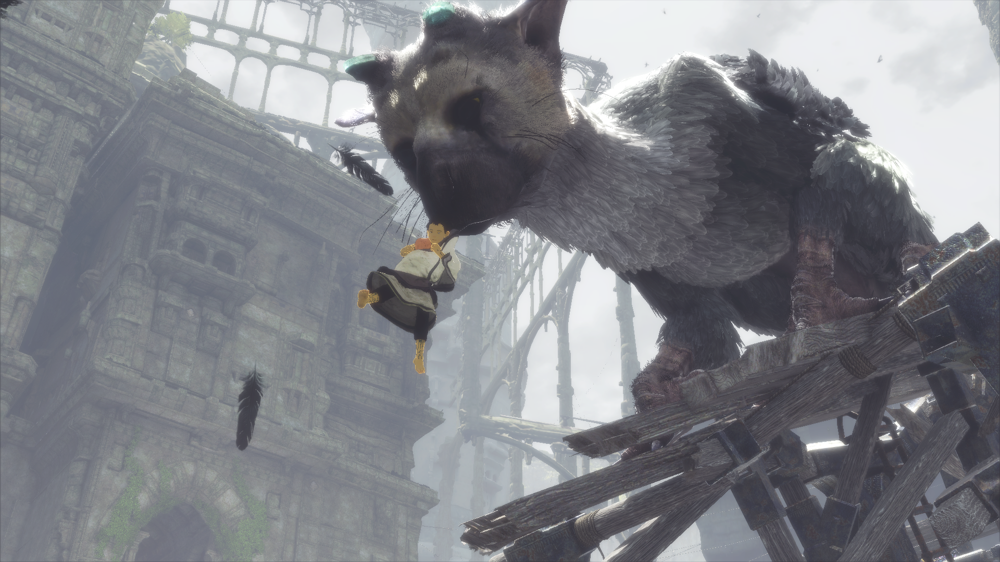
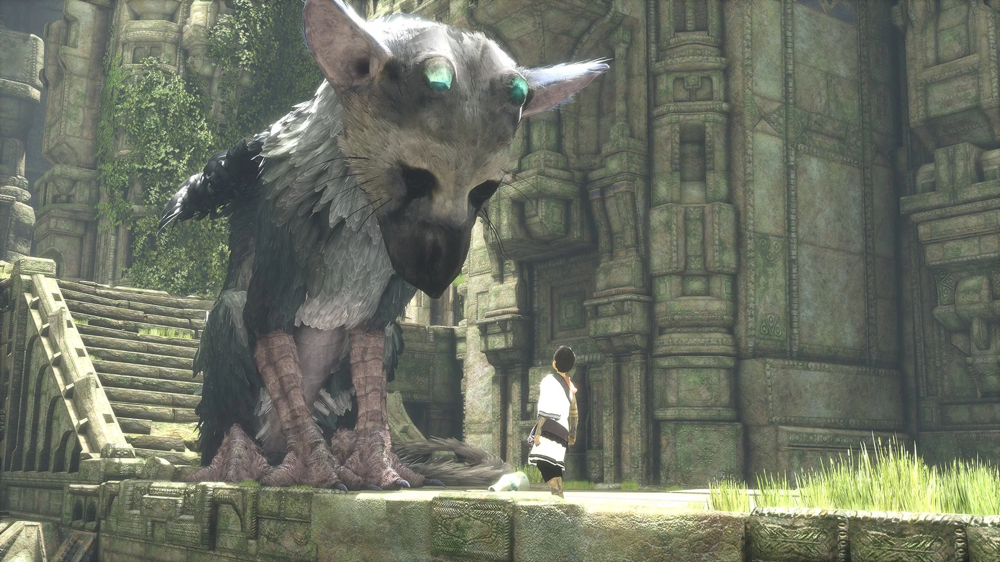
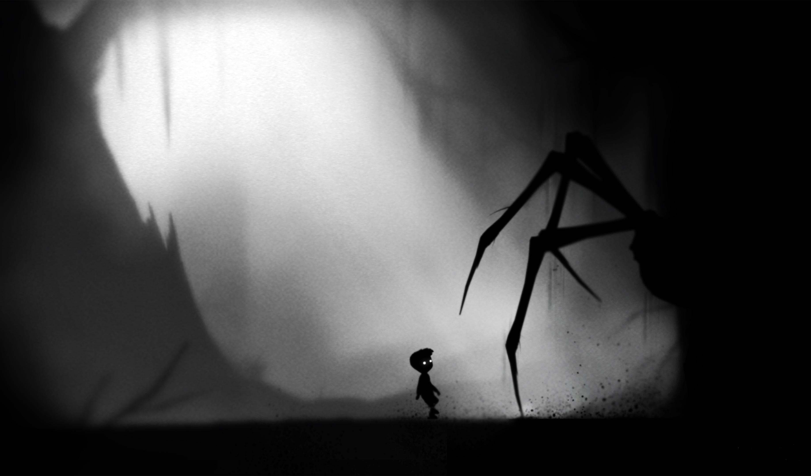
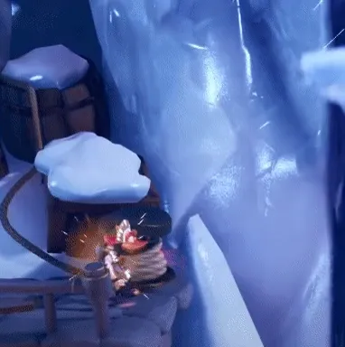

# Эстетика движения: почему геймдизайн рождается из анимации и как её полировать

**Валерия Пудова**
2020

---

### Аннотация

Статья посвящена итерационному процессу проектирования игры через призму её визуального и тактильного восприятия — через анимацию и «игровой сок» (Game Feel). Базовые механики, правила и этапы разработки рассматриваются не как абстрактные блок-схемы, а как живой процесс создания плавного, элегантного и отзывчивого взаимодействия между игроком и персонажем. Материал ориентирован на геймдизайнеров, аниматоров и разработчиков, стремящихся превратить сухую логику кода в живую эстетику экранного движения.

---

### Введение: От простого к сложному, от блокинга к живой эстетике

Всё, что человек способен сделать, изначально очень хрупкое и слабое. Чтобы дело стало жизнеспособным, не погибло в зачатке, оно должно следовать фундаментальному природному принципу: **от простого — к сложному, от общего — к частному**. Мощное, вековое дерево, накрывающее всё вокруг густой кроной, когда-то было лишь маленьким зернышком. Если бы оно не прошло этот трудный, последовательный путь развития, оно бы просто погибло.


_Движение Трико и мальчика — это диалог без слов. Геймдизайн рождается там, где механика становится неотделима от анимации._

Этот путь преодолевают идеи. Им следуют произведения искусства, творения науки и любые сложные цифровые продукты. Это единственный надежный способ спроектировать устройство, написать сценарий и создать работающую игру.

В геймдеве это природное зерно — первоначальный замысел. Но если архитектуру игры задает программный код, то её душу формирует движение. Игрок познает виртуальный мир не через чтение дизайн-документов, а через непрерывное наблюдение за персонажем на экране. То, как герой переносит вес тела при ходьбе, как его стопа взаимодействует с неровностями почвы, как он реагирует на опасность — именно эта эстетика движения заставляет игрока сопереживать пикселям и испытывать подлинное восхищение от игрового процесса. Геймдизайн рождается там, где механика становится неотделима от анимации.

---

### Concept Design: Анимация как первый язык игры

Прежде чем в игре появится первый работающий код, её главный герой уже должен совершить своё первое движение — пусть даже на бумаге. Именно здесь, на стадии концепта, анимация становится не декорацией, а **инструментом проектирования**.

Опытные геймдизайнеры и аниматоры на этом этапе работают не с цифрами и не с громоздкими таблицами характеристик. Их главный инструмент — **аниматик** (animatic): грубая раскадровка ключевых движений персонажа.

Этот простой, почти карандашный набросок выполняет три критически важные функции:

1. **Передаёт характер.** Как идёт персонаж? Гордо, с расправленными плечами? Или крадучись, прижимаясь к стенам? Это решение определит всё: от дизайна уровней до звукового сопровождения.
2. **Проверяет механику.** Если персонаж должен совершать "ускоренный рывок" (dash), аниматор сразу видит: для этого движения нужно 5 кадров подготовки, 3 кадра активной фазы и 8 кадров восстановления. Геймдизайнер получает не абстрактную цифру "длительность рывка = 0.3 сек", а **чувствуемый тайминг**.
3. **Экономит ресурсы.** Аниматик стоит 1–2 дня работы. Переделать полностью отриггованного и затекстурированного персонажа — 2–3 недели. Быстрый прототип движения выявляет проблемы до того, как они становятся дорогими.



_И концепт-арт, и финальная игра говорят на одном языке — 
языке движения и взгляда. Характер персонажа определяется ещё до того, 
как написана первая строка кода._

Параллельно с этим техническая команда фиксирует жёсткие рамки:

- Сколько костей может содержать скелет (риг) персонажа?
- Какой лимит оперативной памяти на анимационные ассеты?
- Поддерживает ли движок инверсную кинематику (IK) в реальном времени?

Эти ограничения не должны сковывать творчество. Они должны **направлять его**, как русло направляет реку. Гениальный аниматор способен влюбить игрока в персонажа даже с 20 костями в скелете — если движение продумано на стадии концепта.

Вся последующая документация (GDD, TDD, руководства по стилю) лишь детализирует то, что уже было решено на уровне аниматика. **Без живого движения на бумаге все остальные документы — лишь архитектура без души.**

---

### Pre-Production: От «грязного» геймплея к первому играбельному кадру

На этапе пре-продакшна магия движения начинает обретать осязаемую форму. Художники совместно с геймдизайнерами определяют список концептов, лучше всего передающих суть игры, и внедряют их во всю сопутствующую документацию для иллюстрации желаемого визуального стиля.

Учитывая принцип движения от общего к частному, на этом этапе создаются исходные низкополигональные модели. Эти первоначальные, грубые персонажи — часто без текстур, сглаживания и теней — используются для чернового прототипирования механик, описанных в GDD. Этот первый работающий прототип проходит две важнейшие стадии эволюции:

```
┌─────────────────────────────────────────────────────────────┐
│ Эволюция Прототипа                                          │
├──────────────────────────────┬──────────────────────────────┤
│ First Functional             │ First Playable               │
├──────────────────────────────┼──────────────────────────────┤
│ • Грубый блокинг (кубы)      │ • Первичный блендинг         │
│ • Проверка базовой физики    │ • Персонаж «чувствует» мир   │
│ • Тест коллизий и триггеров  │ • Появляется Game Feel       │
└──────────────────────────────┴──────────────────────────────┘
```

1. **First Functional (Первый функциональный прототип)**. На этой стадии проверяется исключительно техническая работоспособность базовых систем: рендеринга, физики, звука, триггеров и корректности воспроизведения анимационных файлов. Здесь геймплей выглядит «грязным» — персонаж может быть простым серым кубом или роботом, совершающим неестественные рывки без промежуточных кадров. Задача этапа — убедиться, что код математически правильно обрабатывает коллизии и команды ввода.
2. **First Playable (Первый играбельный прототип)**. После добавления скриптов, базовых поведений и механик игра обретает достаточный функционал, чтобы в неё можно было полноценно играть. Персонажу добавляется первичный анимационный блендинг (плавное смешивание движений при переходе из бега в шаг или прыжок). Игра начинает выглядеть завершенной, особенно после настройки базовых текстур и эффектов освещения.

Теперь игру можно увидеть, потрогать, почувствовать и сравнить с начальным замыслом. Именно на этой критической точке многие проекты, не имевшие четкого плана, перестают соответствовать изначальной идее и превращаются в бездушные демонстраторы технологий. Если же прототип успешно передает нужное ощущение от управления, он проверяется всеми отделами компании, инвесторами и издателями, после чего проект официально переходит на этап производства.

---

### Настройка и полировка: от цифр к ощущениям

Процесс доведения движений персонажа до идеала называют в индустрии полировкой. Но за этим красивым словом скрываются два принципиально разных этапа работы.

#### Tuning (Настройка) — это работа с Excel-таблицей

Геймдизайнер открывает конфигурационный файл и меняет цифры:

- Скорость бега: с `5.0` на `5.5` м/с
- Высота прыжка: с `2.0` на `2.3` м
- Радиус атаки: с `1.5` на `1.8` м

Это механическая работа. Она требует дисциплины, но не требует художественного вкуса. Идеальный Tuning делается **до** того, как в игру добавлены финальные анимации.

#### Polishing (Полировка) — это работа с движением

Аниматор открывает редактор и добавляет **3 кадра подготовительного приседания** перед прыжком. Без них прыжок ощущается "пластиковым", невесомым. С ними игрок *чувствует* тяжесть тела персонажа — даже если числовые параметры прыжка не изменились ни на миллиметр.

**Почему это принципиально важно для планирования?**

Любая полировка анимации неизбежно тянет за собой изменения в игровом мире:

- Если аниматор добавил **инерционное торможение** с проскальзыванием стопы, игровые платформы должны стать шире на 15–20%. Иначе персонаж будет срываться в пропасть при каждой остановке.
- Если аниматор увеличил **взмах рук** при беге, это может потребовать изменения высоты потолков в узких коридорах — иначе руки будут "протыкать" геометрию.
- Если аниматор добавил **предупреждающий жест** перед атакой босса (поднятие руки за 8 кадров до удара), уровень сложности резко снижается — и баланс придётся перенастраивать.


Именно поэтому **полировка должна происходить позже настройки**, когда геометрия уровней уже не меняется. Иначе вы рискуете отполировать анимацию до блеска, а затем сломать её радикальным изменением платформы — и полировать заново.

**Практическое правило:**  
*Тюнинг (цифры) — до финальной геометрии.*  
*Полировка (движение) — после.*

---

### Full Production: Анимация на каждой стадии зрелости

На этапе полномасштабного производства команда уже знает, как выглядит финальный персонаж. Теперь анимация проходит через жёсткую последовательную фильтрацию — от экспериментов к кристаллизации.

#### Pre-Alpha: Грязный блокинг, чистые тайминги

На этой стадии персонаж — это серая, лишённая текстур модель. Но её анимация уже **читается**. Аниматоры сознательно делают движения чуть быстрее, чем нужно, — это известная практика студии Naughty Dog. Быстрая, резкая анимация в Pre-Alpha оставляет пространство для замедления при финальной полировке. Если же сделать её медленной изначально, добавить "веса" и инерции будет невозможно без полной переработки.

На Pre-Alpha проверяется главное: **ощущается ли персонаж тяжёлым, лёгким, быстрым, неуклюжим?** Без текстур, без звука, без декораций — только ритм движений.

#### Alpha: Блендинг и заморозка

Когда все базовые механики собраны воедино, наступает момент **блендинга** (Blending) — плавных переходов между состояниями:

- Из бега в шаг
- Из прыжка в приземление
- Из атаки в блок

На Alpha аниматор уже не создаёт новых движений. Он настраивает **пороги переходов**: при какой скорости бега персонаж начинает "шагать", а при какой — "бежать"? Как быстро происходит смена позы при рывке в сторону?

**Золотое правило Alpha:** В этот период **запрещено обновлять игровой движок и любые инструменты** (Maya, Photoshop, MotionBuilder). Обновление движка — это всегда риск, что анимационное дерево (Blend Tree) будет интерпретироваться иначе. Один баг в новом билде может превратить грациозное движение в дергающуюся марионетку. И фиксить это придётся неделями, перестраивая уже согласованные переходы.

#### Beta: Только исправления, без творчества

**Beta** — это абсолютное табу на новые анимации. Здесь аниматор превращается в хирурга:

- Исправляет разрывы скелета (когда конечность "выворачивается" в нефизичную позицию)
- Устраняет микро-фризы на стыках циклов
- Проверяет коллизии — не проваливается ли оружие в геометрию?
- Синхронизирует звук шагов с касанием стопы (это делается вручную, кадр за кадром)

Последние 10% проекта — это 90% стресса. Именно здесь большинство багов проявляются из-за того, что различные системы (анимация, физика, звук) работают в разных тактовых частотах. Задача аниматора на Beta — сделать так, чтобы игрок **не замечал** анимации. Она должна стать естественной, как дыхание.

#### Release Candidate: Читаемость движений

Игра почти готова. Теперь её тестируют фокус-группы. Но аниматор не сидит сложа руки. Он смотрит на геймплейные видео и отвечает на один вопрос:


_Паучьи лапы в Limbo: игрок считывает опасность за 0.3 секунды. Если этого не происходит — это Brickwall._

**Видит ли игрок угрозу за 0.3 секунды до удара?**

Если босс поднимает руку, но из-за анимации это движение нечитаемо — игрок не успевает среагировать. Это не хардкор. Это **Brickwall** — терминальное препятствие, которое убивает желание играть.

На RC аниматор может добавить **один-единственный кадр-предупреждение**: яркую вспышку на лезвии меча, изменение цвета глаза врага, рывок мышц перед атакой. Это превращает "читерского" босса в честного противника. Игрок проигрывает не из-за бага, а из-за своей ошибки.

---

### Соблюдение правил игры: Контекстная гармония движений

Интуитивная понятность игры и эстетическое удовольствие пользователя строятся на жестком соблюдении внутренних правил виртуального мира. Чрезвычайно важно установить эти правила для всего проекта на самых ранних этапах и никогда их не нарушать: если игровой элемент функционирует определенным образом, он должен работать точно так же на протяжении всей игры.

Это правило напрямую управляет поведением контекстной анимации персонажа и объектов:

```
┌─────────────────────────────────────────────────────────────┐
│ Контекстная Система Анимаций                                │
├──────────────────────────────┬──────────────────────────────┤
│ Игрок у края обрыва          │ Игрок вдоль стены            │
├──────────────────────────────┼──────────────────────────────┤
│ • Смещение центра тяжести    │ • Касание стены рукой        │
│ • Балансирование руками      │ • Изменение наклона корпуса  │
│ • Паническая Idle-анимация   │ • Смена вектора взгляда      │
└──────────────────────────────┴──────────────────────────────┘
```

- **Контекстный Idle (Анимация покоя)**: Если герой стоит посреди безопасной комнаты, его анимация ожидания должна транслировать спокойствие. Но как только он оказывается у края бездонного обрыва, система обязана бесшовно переключить анимацию: персонаж начинает панически балансировать руками, смещать центр тяжести назад, заглядывать вниз. Это визуальное изменение передает опасность на подсознательном уровне, обходясь без текстовых предупреждений.
- **Взаимодействие с окружением**: При движении вплотную к стене персонаж должен естественным образом касаться её ладонью, подстраивая угол наклона плечевого пояса. При беге по колено в воде анимация ног обязана наглядно демонстрировать сопротивление плотной среды.

Важно обеспечивать единообразное соответствие поведения игрового арта. Если игрок прыгает на платформу, которая затем падает, текстура и микро-анимация (например, предупреждающее дрожание или осыпание крошки) должны присутствовать на каждой платформе, ведущей себя аналогичным образом. Такие визуальные подсказки критически важны: они позволяют игроку интуитивно понимать структуру уровней.

Само игровое поле не должно дезориентировать. Наличие очевидного прохода или визуального вектора движения — простой способ направить игрока, даже если на уровне спроектированы разветвленные всенаправленные схемы (*omni-directional*) для исследования. Планирование структуры уровней должно гармонично сочетать архитектуру, анимацию окружения, точки спавна врагов (NPC) и места расположения предметов для подбора — это фундаментальный аспект полировки, напрямую влияющий на геймплей.

---

### Release Candidate: Борьба с Roadblocks и Brickwalls через восприятие

Когда игра практически готова, финальный **Release Candidate** отправляется на тестирование фокус-группами. Особое внимание уделяется балансу: выявляются места, где игра из-за чрезмерной легкости заставляет скучать, и зоны повышенной сложности, способные вызвать критические проблемы восприятия — *roadblocks* и *brickwalls*. В геймдизайне анимация служит мощным инструментом регулирования этих состояний:


_Crash не допрыгивает. Игрок видит свою ошибку, а не баг игры. Честная анимация = честное поражение._

- **Roadblocks (Препятствия)** — участки, где сложность прохождения становится чрезмерно высокой. Часто это связано с неотполированными таймингами анимаций или скрытым пиксель-хантингом, когда из-за визуальной нечитаемости движений врага игрок совершает ошибки. Это вызывает сильное разочарование и может легко привести к отказу от дальнейшего прохождения.
- **Brickwalls (Каменные стены)** — более опасная, терминальная версия roadblocks. Это ситуация в игровом процессе, которая физически не может быть решена среднестатистическим игроком. Например, если анимация атаки босса не имеет фазы «предупреждения» (тайминга подготовки к удару), игрок физически не способен среагировать на неё вовремя. Наступает окончательное разочарование, безусловно приводящее к полному удалению игры.


После тщательного тестирования одной или нескольких версий *release candidate* к публикации допускается именно та сборка, в которой подобные анимационные и логические барьеры полностью устранены. Отполированное движение гарантирует игроку идеальный визуальный контроль: даже в хардкорных проектах каждое поражение воспринимается как личная честная ошибка игрока, а не как вина неотзывчивого управления.

---

### Заключение: Дерево, выращенное из зерна

Отполировать игру — все равно что огранить алмаз. Но в отличие от ювелира, гейм-команда начинает не с алмаза, а с **зерна**.

Зерно — это концепт-аниматик. Грубый, небрежный, некрасивый. Но именно в нём заложена ДНК будущего движения: характер персонажа, ритм боя, эстетика прыжка.

Это зерно прорастает в Pre-Alpha — быстрый прототип, где персонаж ещё серый и бесформенный, но уже живёт в правильном темпе. На Alpha он обрастает корой — блендингом переходов, плавностью шагов. Beta обрезает сухие ветки — фризы, баги, разрывы. RC проверяет, выдержит ли дерево бурю — то есть судит его игрок.

Но дерево не становится кроной за один день. Оно требует полировки каждого листа. Так и анимация: быстрый прототип даёт форму, но только долгая, ювелирная полировка превращает техническую механику в искусство, вызывающее восхищение.

И помните: игрок прощает пиксельную графику. Он прощает простые модели и повторяющиеся текстуры. Но он **никогда не прощает** плохого движения. Потому что движение — это жизнь.

---

### Литература

1. *Schell J.* The Art of Game Design: A book of lenses. – CRC press, 2008.
2. *Schell J.* The Art of Game Design: A deck of lenses. – Pittsburgh : Schell Games, 2008.
3. Wikipedia - Software release life cycle.
