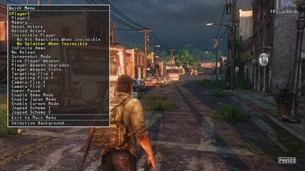

# Создание тестируемого кода: Интерактивная разработка как философия

**Валерия Пудова**  
ARCADIA  
6.02.2022  
*Версия 2.0 (переработанная)*

---

## Аннотация


Каждый день программист тратит часы на ожидание: скомпилировать, загрузить сцену, воспроизвести баг, остановить, исправить, повторить. Этот цикл **Edit → Compile → Run** — главный враг продуктивности. Статья предлагает философию разработки, где код пишется так, чтобы модификации вносились прямо в рантайме, а результат оценивался мгновенно. Рассматриваются практические инструменты: Debug Menu, REPL, удалённый терминал, валидация, логирование и профайлинг — всё, что превращает тестирование из рутины в непрерывный процесс.

*Ключевые слова: Testing, Collaboration, Process Automation, Debugging, Scripting, REPL, Runtime Editing, Live Reload*

---

## Содержание

- [Создание тестируемого кода: Интерактивная разработка как философия](#создание-тестируемого-кода-интерактивная-разработка-как-философия)
  - [Аннотация](#аннотация)
  - [Содержание](#содержание)
  - [Введение: Главный враг продуктивности](#введение-главный-враг-продуктивности)
  - [Терминология](#терминология)
  - [Единицы измерения](#единицы-измерения)
  - [Выбор сторонних решений](#выбор-сторонних-решений)
  - [Автоматическое тестирование кода](#автоматическое-тестирование-кода)
  - [Оптимизация](#оптимизация)
  - [Целевая платформа](#целевая-платформа)
  - [Shortcuts \& Debug Menu](#shortcuts--debug-menu)
    - [Функции](#функции)
  - [Debug Draw](#debug-draw)
  - [Лог файл](#лог-файл)
  - [Встроенный профайлер](#встроенный-профайлер)
  - [Crash Report](#crash-report)
  - [Интерактивная разработка](#интерактивная-разработка)
  - [REPL](#repl)
  - [Удалённый терминал](#удалённый-терминал)
  - [Unity 3D Runtime Environment](#unity-3d-runtime-environment)
  - [Unity 3D Static Validation](#unity-3d-static-validation)
  - [Human-readable format](#human-readable-format)
    - [GUI vs Text](#gui-vs-text)
    - [Локализация](#локализация)
  - [Валидация](#валидация)
    - [Статическая валидация](#статическая-валидация)
    - [Динамическая валидация Validate or Require](#динамическая-валидация-validate-or-require)
  - [Пример из практики: как мы сократили цикл разработки на 80%](#пример-из-практики-как-мы-сократили-цикл-разработки-на-80)
  - [Заключение: Программист как скульптор](#заключение-программист-как-скульптор)
  - [Литература](#литература)

---

## Введение: Главный враг продуктивности

Перед тем как читать эту статью, остановитесь на секунду.

Сколько раз за сегодня вы перезапускали игру? Десять? Двадцать? Каждый раз вы ждали, пока она загрузится, пока вы дойдёте до нужного места, пока повторится баг.

Это не кажется большой проблемой. 30 секунд — ерунда. Но 30 секунд × 50 раз в день × 5 дней в неделю × 50 недель = 104 часа в год. На одного человека. Умножьте на размер вашей команды.

Вот о чём эта статья. Не о коде. О времени. О внимании. О том, что каждый раз, когда вы ждёте компиляцию, вы теряете не секунды, а контекст. И вернуть его сложнее, чем вы думаете.

Мы будем говорить об инструментах. Но на самом деле мы будем говорить о том, как не тратить свою жизнь на ожидание.

Разработка игры — это не написание кода. Это **тысячи итераций**: проверка механик, настройка баланса, поиск багов, полировка анимаций, тестирование на целевой платформе. Каждая итерация требует, чтобы код работал — и работал правильно.

Но есть проблема. Стандартный цикл разработки выглядит так:

```
Edit → Compile → Run → Test → Fail → Edit → Compile → Run → Test → Pass
```

Это называется **Edit → Compile → Run**. И это главный враг продуктивности.

Почему? Потому что между "Edit" и "Test" лежит **зона ожидания**:

- Компиляция: 30 секунд — 2 минуты
- Загрузка сцены: 10–30 секунд
- Повтор игровой ситуации: ещё 10–30 секунд
- Итого: **1–3 минуты на одну итерацию**

Умножьте это на 50 итераций в день — получите **2–3 часа чистого времени**, потраченного на ожидание. А если вы работаете с консолью или VR-платформой, время деплоя может достигать 10–15 минут.

**Но самое страшное — не время.** Самое страшное — **потеря контекста**. Каждый раз, когда вы ждёте 30 секунд загрузки, вы выходите из состояния потока. Вернуться в него сложно. А выходить и входить 50 раз в день — невозможно.

**Философия этой статьи проста:**

> Программист должен писать код так, чтобы модификации вносились в рантайме, а результат оценивался мгновенно. Без реббилда. Без перезапуска. Без повторного прохождения уровня. Каждый инструмент, описанный ниже, служит одной цели: **минимизировать цикл Edit → Compile → Run** и вернуть разработчику его внимание.

---

## Терминология

**Tuning, Настройка** — это изменение параметров: *скорость*, *высота прыжка* и т.д. Добавление призов, NPCs и т.д. На конечных этапах разработки называется ***fine tuning*.**

**Tweaking, Polishing, Полировка** — небольшие изменения, устранение всех видимых дефектов и недостатков.

---

## Единицы измерения

Для параметров использовать стандартные единицы измерения: *метр*, *килограмм*, *секунда*. Использовать другие единицы с обязательной подсказкой: *ms*, *fps*, и т.д., поэтому проще использовать стандартные единицы.

**Почему это важно для интерактивной разработки:** Если вы настраиваете параметры в рантайме, вы должны понимать, что именно вы меняете. "Скорость = 5" — это 5 метров в секунду или 5 юнитов в кадр? Стандартные единицы исключают неоднозначность.

---

## Выбор сторонних решений

В современной разработке соблазн взять готовое решение из Asset Store или использовать популярный фреймворк велик. Но эта практика требует крайней осторожности.

**Проблема:** Сторонние решения часто приносят больше проблем, чем пользы:

- Они могут конфликтовать с другими системами.
- Их внутренняя архитектура не предусматривает **горячую перезагрузку** (live reload) — а это ключевое требование для интерактивной разработки.
- Обновления фреймворка могут сломать ваш код.
- Исходный код закрыт, и вы не можете адаптировать его под свой пайплайн.
- Документация обещает одно, а поведение в рантайме — другое.

**Правильный подход:**

1. **Тщательный отбор.** Прежде чем внедрить решение, проверьте:
   - Поддерживает ли оно интерактивную разработку? Можно ли менять параметры в рантайме?
   - Есть ли у него автоматические тесты?
   - Как часто оно обновляется?
   - Можно ли заглянуть в исходный код?

2. **Иногда лучше создать своё.** Если фреймворк не соответствует вашим требованиям по интерактивности, а адаптировать его невозможно — написание собственного решения может сэкономить тонну времени в долгосрочной перспективе.

3. **Если решение принято — погрузитесь в него.** Ответственный за внедрение должен устранить пробелы в документации и добавить автотесты для всех процедур, которые используются в проекте. Это особенно важно для систем, которые должны работать в рантайме без перезапуска.

**Золотое правило:** Сторонний фреймворк — это инструмент, а не религия. Если он мешает вашему циклу Edit → Compile → Run, он не стоит потраченного времени.

---

## Автоматическое тестирование кода

Некоторые части кода, спроектированные внутри компании, должны покрываться автоматическими тестами (Code coverage). К ним относятся:

- Библиотеки математических операций.
- Библиотеки структур данных.
- Библиотеки сетевых протоколов.
- И другие им подобные.
- Интегрированные в Unity сторонние C++ библиотеки, особенно подобные вышеперечисленным.

**Связь с лейтмотивом:** Автотесты — это страховка. Если вы активно используете интерактивную разработку и меняете код в рантайме, риск сломать что-то возрастает. Автотесты позволяют быстро проверить, что базовая функциональность не нарушена.

---

## Оптимизация

Оптимизация производится на каждом этапе производства игры, но её природа меняется в зависимости от стадии проекта. Здесь важно найти баланс между **скоростью прототипирования** и **производительностью финального продукта**.

На ранних этапах, когда механики ещё проверяются методом проб и ошибок, преждевременная оптимизация — это враг. Первый вариант кода может быть неэффективным, но он позволяет быстро проверить гипотезу. Часто после тестирования выясняется, что этот код вообще больше не нужен — и потраченное на его оптимизацию время оказывается потерянным навсегда.

**Поэтому правило звучит так:** делай это быстро и некрасиво — для проверки. Но как только механика утверждена, **немедленно** реализуй бенчмарки и профилировку. Это позволяет выявить бутылочное горлышко до того, как оно врастёт в архитектуру.

Особый случай — когда жанр игры вступает в конфликт с движком. Например, 2D-скроллер на 3D-движке. Здесь оптимизация становится нетривиальной задачей, и все этапы тестирования нужно проходить заранее, на стадии прототипа, чтобы понять, сможет ли движок выдать нужное количество пикселей на целевой платформе без падения FPS.

**Но есть одна область, где компромиссов быть не должно — время запуска игры.** Все департаменты (дизайнеры, аниматоры, QA, программисты) перезапускают игру десятки, а иногда и сотни раз в день. Каждая лишняя секунда загрузки умножается на количество запусков и на количество людей в команде. Это не просто раздражение — это прямые потери в продуктивности.

**Практический итог:**

| Стадия | Подход к оптимизации |
|--------|----------------------|
| **Прототип (проверка гипотезы)** | Код пишется самым простым и очевидным способом. Оптимизация игнорируется. |
| **После утверждения механики** | Сразу внедряются бенчмарки. Выявляются узкие места. |
| **Production** | Оптимизация становится частью каждого коммита. |
| **Всегда** | Время запуска игры — священная корова. Никаких компромиссов. |

---

## Целевая платформа

Несмотря на то, что игра проектируется для целевой платформы: PlayStation, Oculus, etc в процессе разработки обязательно нужно делать игру так, чтобы она могла тестироваться на платформе разработки. Для этого, с самого начала, в игру интегрируется симуляция устройств ввода целевой платформы (например, Oculus контроллер): клавиатурой PC и джойстиком PS2.

Это довольно трудно в VR, но это можно рассматривать как идеальную цель, к которой нужно стремиться. Продвинувшись в этом направлении мы расширим возможности тестирования большим количеством участников и выигрыш будет очевиден.

**Связь с лейтмотивом:** Если игра запускается на PC (а не только на консоли), её запуск занимает секунды, а не минуты. Это напрямую сокращает цикл Edit → Compile → Run. Чем быстрее игра запускается на платформе разработки, тем больше итераций может сделать разработчик за день.

---

## Shortcuts & Debug Menu

С самого начала игра оснащается отладочным меню и набором *shortcuts* (или *keystrokes* для некоторых функций) чтобы обеспечить QA-специалистов и разработчиков всеми инструментами, облегчающими процесс тестирования и настройки игры.

**Технические требования к Debug Menu:**

- Меню не обязано быть красивым, достаточно отрисовывать текст.
- Меню должно быть хорошо читаемым: заметный цвет текста, шрифт с контуром и оттеняющий полупрозрачный фон под текстом.
- Меню не должно существенно влиять на производительность.
- Меню должно быть организовано с помощью системы иерархии и горизонтальными разделителями.
- Опции в меню должны иметь подсказки *keystrokes* (для PC клавиатуры).
- Изменение параметров в меню должны вступать в силу мгновенно.
- API меню должен быть настолько прост, что добавление новой опции не должно занимать больше нескольких минут времени разработчика. Как правило, это одна строка кода.
- Значения, изменённые от начальных, должны подсвечиваться, а специальный keystroke должен сбрасывать их в начальное значение.
- Должна быть возможность ввести ограничения (min, max), а также точность отображаемой величины (количество знаков после запятой). Если значения выводятся в столбце — рассмотреть вариант добавления возможности выравнивания величины в ячейке столбца по десятичному разделителю. Это может быть удобно для слежения за несколькими связанными значениями в режиме реального времени.
- Использование клавиш изменения числовой величины:
  - Увеличивает/уменьшает на предварительно заданное значение, это значение может быть любым: 0.01, 0.1, 1 или 10 и т.д. Дополнительный логарифмический режим (изменение в зависимости от величины текущего значения) должен присутствовать как опция. Шаг изменения значения должен зависеть от самого значения, например: ±0.1 для значений до \|10\|, ±1 для значений до \|100\| и так далее.
  - При удержании кнопки акселератора, инкремент увеличивается в 10 раз.
  - Все вышеперечисленные функции могут быть реализованы с помощью lambda функций.

Замечательный пример системы меню можно увидеть в [EMACS](https://www.gnu.org/software/emacs/manual/html_node/elisp/index.html).


> ### 💡 ПРИМЕР ИЗ ПРАКТИКИ: THE LAST OF US
> 
> В *The Last of Us* на PlayStation 3 разработчики реализовали мощную систему отладочного меню, работающую прямо на целевой платформе. Это не просто "инструмент для программистов" — это полноценная среда управления игрой, доступная прямо в рантайме.
>
> **Доступ к меню:**
> - **Dev Menu** — L3 + Start
> - **Quick Menu** — L3 + Select
> - **Debug Fly** — L3 + R3 (свободный полёт по уровню)
>
> **Что можно делать прямо в игре:**
> - Изменять скорость игры (Clock) — замедлять или ускорять геймплей для отладки таймингов
> - Загружать любую задачу (Tasks) — любой уровень, любая кат-сцена, любой чекпоинт, мгновенно
> - Включать бесконечные патроны, неуязвимость, отключать перезарядку — для быстрого тестирования сложных секций
> - Скрывать ассеты на сцене (Selective Background) — чтобы проверять коллизии и видимость
> - Управлять оружием и слотами игрока — для тестирования разных конфигураций без перезапуска
>
> **Что особенно важно:** Это меню работает на **реальной консоли**, на **реальном билде**, без необходимости подключать отладчик. Весь инструментарий доступен прямо в игре, в любом месте, в любое время.
>
> Разработчики даже создали секретные тренировочные комнаты (*Training Debug Rooms*), доступные только через это меню — специальные тестовые уровни для отладки механик, боевых последовательностей и AI.
>
> *"В Uncharted 1 и 2 полное Dev Menu было доступно в розничных билдах, но для доступа требовался Dev Kit. В The Last Of Us меню было урезано для розничной версии, но оставленный функционал всё равно позволяет сделать практически всё, что нужно для тестирования."*
>
> **Вывод:** Если вы работаете над консольным проектом, вы не можете позволить себе перезапускать игру каждые 10 минут. Инструменты вроде этого Debug Menu превращают разработку из "подожди-перезапусти-проверь" в непрерывный процесс. Всё описанное выше — это не роскошь. Это **необходимость**, продиктованная жестокими условиями консольной разработки.

### Функции

Меню должно содержать все параметры, которые могут быть использованы для тюнинга. Ассортимент функций зависит от конкретного проекта. Ниже перечислены наиболее популярные:

- **User Settings Editor** — редактор настроек пользователя
- **Data Editor** — редактор настроек разработчика
- **Play/Pause** (с keystroke)
- **Смена уровня на любой** — даже на тот, который не присутствует в меню игрока
- **Screenshot** — сохранить снимок экрана с геолокацией в игре (с keystroke)
- **Snapshot** — скриншот параметров игры и лога игры
- **Hard Reset** — перезагрузка всей системы
- **Soft Reset** — перезагрузка игры
- **Scene Reset** — перезагрузка текущего уровня
- **Scene Reset & Restore** — перезагрузка текущего уровня в текущем месте игрока
- **Scene Reset & Previous Restore** — перезагрузка текущего уровня в предыдущем месте игрока
- **Mini games mode** — разбрасывание физических объектов: шаров, кубов, ragdolls, магнитное "оружие" и т.д. Всё это может пригодиться для тестирования collisions, physics system и оптимизации производительности.
- **Time x0.1, x0.5, ... x1.0 x2.0** — замедление и ускорение времени (с keystroke)
- **Time rewind** — для игр, которые используют время должна быть возможность не только останавливать время, но и перематывать его в любую сторону.
- **Show/Hide Debug Draw** — отобразить или скрыть отладочный рендеринг
- **Show/Hide Textures** — отобразить/скрыть текстуры
- **Enable/Disable Lighting** — включить/выключить освещение
- **Enable/Disable Post Effects** — включить/выключить постпроцессинг операции
- **Switch camera** — переключить режим камеры (если они есть)
- **Fly through camera** — камера свободного полета, должна работать даже в приостановленной игре
- **Back camera** — камера позади персонажа, позволяет видеть самого персонажа в шутерах от первого лица
- И так далее...

В любом случае, любые необходимые опции меню могут быть добавлены позже, по мере необходимости.

**Связь с лейтмотивом:** Debug Menu — это главный инструмент для сокращения цикла Edit → Compile → Run. Вместо того чтобы менять параметр в коде, перекомпилировать и перезапускать игру, вы просто открываете меню, меняете значение и видите результат мгновенно. Это экономит сотни часов в масштабах проекта.

---

## Debug Draw

Высокопроизводительная система отрисовки примитивов: wireframe, wireframe + flat shaded semi transparent, а также 3D текстов. Система не должна производить мусор. Каждый примитив, кроме цвета, должен иметь время жизни: один кадр или время в секундах. Начать можно с самых необходимых примитивов и по мере разработки расширять этот список.

**Связь с лейтмотивом:** Debug Draw позволяет видеть коллизии, траектории, зоны поражения и другие невидимые сущности прямо в рантайме. Это помогает программисту проверять правильность работы системы без остановки игры.

---

## Лог файл

Следует придерживаться лучших практик логирования, со стандартным форматом сигнатуры времени.

Минимизация производства мусора — это одна из технически сложных задач в приложениях реального времени. Особенно, когда количество выводимого в лог текста велико и, особенно, на мобильной платформе. Другая проблема — вывод в лог файл в многопоточных системах. Всё это необходимо учитывать на ранних этапах проектирования. И прибегать к наиболее подходящим для проекта практикам.

Лог файл должен помочь понять где находится проблема, даже если проблема случилась вчера. Форматирование лог файла должны быть дружественны для REGEXP и GREP.

---

## Встроенный профайлер

Для оптимизации производительности в игру интегрируется HUD профайлера. Также должна быть возможность активации периодической записи в лог информации профайлера (метрики).

**Связь с лейтмотивом:** Если вы меняете параметры в рантайме, вы должны сразу видеть, как это влияет на производительность. Встроенный профайлер даёт эту обратную связь мгновенно.

---

## Crash Report

Необходимо продумать и то, какие данные должны быть сохранены для всеобъемлющего crash репорта. Это может быть архив состоящий из: stack trace, лог файла, screenshot, возможно потребуется дополнительная информация... Всё это продумывается для каждого проекта.

Сбои бывают разные и не каждый сбой позволяет сохранить дополнительные данные. Например:

- **System Crash** (общий сбой системы) не оставляет выбора программисту. В системе остаётся та информация, которая предусмотрена.
- **Unity Exceptions** позволяет сохранить в репорте ту информацию, которая может помочь в понимании проблемы.

---

## Интерактивная разработка

Подразумевает под собой мгновенное внесение изменений без необходимости реббилда проекта. Любые входные данные: исходный код, параметры анимаций, логика персонажа, положение ассета в сцене — должны немедленно передаваться в уже запущенную игру. Это особенно важно и технически трудно, когда игра запущена на удалённой VR платформе.

> **Цель, к которой нужно стремиться.** Даже если мы достигнем её только на 50% — это лучше чем ничего.

---

## REPL

**Read Eval Print Loop** — это интерактивная система, в которой разработчик может инспектировать любой объект, посылать необходимые сообщения в работающую систему или запускать короткие скрипты для автоматизации системы отладки и полировки игры.

**Пример использования:** Представьте, что вы хотите проверить, как персонаж реагирует на изменение силы гравитации. Вместо того чтобы менять константу в коде и перекомпилировать игру, вы просто вводите в REPL:

```python
game.physics.gravity = 9.8
```

И персонаж начинает падать быстрее — прямо сейчас, в работающей игре.

**Связь с лейтмотивом:** REPL — это самый быстрый способ проверить гипотезу. Вы пишете одну строку и видите результат. Никаких компиляций, никаких перезапусков. Это идеальный инструмент для исследования поведения системы.

---

## Удалённый терминал

Если целевая платформа не имеет клавиатуры, очень важно обеспечить возможность удалённого соединения с игрой через терминал. В этом случае, разработчик может выполнять все вышеперечисленные операции удалённо.

**Связь с лейтмотивом:** На консолях и VR-гарнитурах цикл деплоя занимает минуты. Удалённый терминал позволяет обойти это — вы подключаетесь к уже запущенной игре и меняете параметры через текстовый интерфейс с PC.

---

## Unity 3D Runtime Environment

Приложение Unity должно продолжать работу после внесения изменений в исходный код.

Изменение исходного кода и запись его в файл вызывают компилятор и затем обновляют Unity Runtime Environment. После этого запускается десериализация объектов и т.д. Необходимо использование таких практик программирования, при которых процесс компиляции не вызывает Unity Exceptions и не требует перезапуска игры.

**Связь с лейтмотивом:** Это техническая основа интерактивной разработки в Unity. Если вы не можете менять код без перезапуска — вы не можете эффективно работать.

---

## Unity 3D Static Validation

Для минимизации ошибок, которые могут возникнуть на этапе разработки логики игры и механик, исходный код и инструменты Unity 3D должны иметь функции валидации сцены, такие как:

- Поиск ошибок конфигурации 3D объектов: материал по умолчанию и т.д.
- Поиск неэффективных для рендеринга объектов: большой *mesh*, неэффективный *shader*, наличие *multitexturing* и т.д.
- Поиск неправильно сконфигурированных компонентов: отсутствие необходимых компонентов, неопределённый параметр или выход за пределы допустимого диапазона значений.

**Связь с лейтмотивом:** Статическая валидация ловит ошибки до того, как они потребуют перезапуска сцены. Это ещё один способ сократить цикл Edit → Compile → Run.

---

## Human-readable format

В процессе создания игры, а особенно после её публикации, очень полезно использовать текстовый формат файла для внесения изменений и корректировок в игру. Это могут быть простая текстовая запись данных, таблица в csv формате, json или xml. Допустимо любое легко читаемое текстовое представление данных и настроек игры.

### GUI vs Text

В вопросе выбора между текстовым форматом и GUI, в большинстве случаев текст более предпочтителен. В этом случае не нужно тратить время на разработку GUI. Кроме этого, иногда простые инструменты GUI, которые кажутся достаточными, в работе имеют слишком много ограничений. Часто в них не хватает элементарных инструментов (например, search & replace, import, export и т.д.). Использовать текстовую форму — означает дать разработчику всю мощь современных текстовых редакторов.

### Локализация

Предпочитать текстовый формат ввода текста, желательно один из стандартных (например, .po файл). Также следует разделять текст и стиль его отображения (подобно html и css). При этом описание стиля будет содержать не только цвет и размер текста, но и название шрифта и прочие атрибуты стиля. Отдельный файл описания правил языка обычно содержит основные правила плюрализации: чисел, дат и т.д.

**Связь с лейтмотивом:** Если данные хранятся в текстовом формате, их можно редактировать без перекомпиляции. Просто изменил значение в файле — и игра подхватила его на следующем запуске (или даже без перезапуска, если реализована горячая перезагрузка данных).

---

## Валидация

### Статическая валидация

Инструменты статической валидации могут облегчить тестирование проекта. В отличие от инструментов валидации с помощью C# атрибутов, специальный процесс валидации может иметь следующие преимущества:

- Работать только когда запущен, а значит может быть более сложным и производить более детальный отчёт.
- Иметь отключаемые тесты и проверять только необходимое.
- Содержать весьма сложные процедуры (как пример такие как проверка наличия или отсутствия дополнительных UV maps).

### Динамическая валидация Validate or Require

Применяется в различных проектах где нет (или трудно реализовать) статической валидации какого-либо значения: система сообщений, система анимаций, система звуковых эффектов. Для примера возьмем систему локализации, где каждому ключу в базе данных должно соответствовать текстовое сообщение. Предположим есть класс, который использует такое сообщение:

```csharp
display(L("foo"))
```

Однако, он отображает его крайне редко. Тогда отсутствие дефиниции этого ключа будет замечено не сразу. Если предположить, что статическая валидация неприменима, к примеру, по следующим причинам:

- Требует парсинга C# исходного кода для поиска всех выражений L(...).
- Имя ключа не является константой и вычисляется в процессе игры.
- Другая причина

Тогда для упрощённого тестирования можно использовать интерфейс динамической валидации. В этом случае класс, использующий ресурс, должен запросить его валидацию в момент запуска игры. При этом, (для примера выше) возможны два сценария:

1. **Validate Mode** — Языковой файл был загружен. Тогда метод `validate_key(key)` будет сообщать об ошибке если `key` не валиден.

2. **Require Mode** — Языковой файл не был загружен. Тогда метод `validate_key(key)` будет сообщать системе локализации о требовании этого ключа. Загрузчик локали будет сообщать об ошибке если файлы локали не имеют дефиниции этого ключа.

**Связь с лейтмотивом:** Валидация — это способ поймать ошибку до того, как она потребует перезапуска игры. Если валидация запускается автоматически при загрузке сцены, разработчик получает обратную связь мгновенно.

---

## Пример из практики: как мы сократили цикл разработки на 80%

В одной международной компании, где я работала над игровыми автоматами, мы столкнулись с классической проблемой: каждый раз, когда нужно было изменить параметры игры (скорость, баланс, тайминги анимаций), мы проходили через полный цикл:

```
Edit → Compile → Deploy → Run → Test → Fail → Repeat
```

Это занимало **2–3 минуты на одну итерацию**. При 50–100 итерациях в день — это **до 5 часов чистого времени**, потраченного на ожидание. А если учётная запись требовала синхронизации с удалённым сервером — время росло до 10–15 минут за цикл.

**Решение было радикальным, но простым:**

Мы создали **инструмент редактирования параметров прямо на целевой платформе** — прямо в работающем игровом автомате. Разработчик (или балансер) мог:

- Открыть меню на экране автомата.
- Изменить любой параметр (скорость, здоровье, тайминги) в реальном времени.
- Немедленно увидеть результат — без перезапуска, без деплоя, без компиляции.

**Но самое важное было внутри:** система сохраняла **инкремент всех изменений** — каждое изменение логировалось с временной меткой. В конце сессии разработчик нажимал кнопку "Export" — и все изменения упаковывались в файл обновления. Этот файл отправлялся в команду, проходил код-ревью и мержился в основной репозиторий.

**Результат:**

| Метрика | До | После |
|---------|----|----|
| Время одной итерации | 2–15 минут | 5 секунд |
| Итераций в день | 20–30 | 100+ |
| Ошибок при деплое | ~10% | <1% |
| Время на поиск баланса | недели | часы |

**Вывод:** Интерактивная разработка — это не роскошь. Это способ сохранить главный ресурс команды — **внимание и поток**. Каждый раз, когда вы прерываете разработчика на 2 минуты загрузки, вы убиваете его контекст. Инструменты рантайм-редактирования возвращают этот контекст обратно.

**Связь с лейтмотивом:** Этот пример демонстрирует все принципы, описанные в статье — Debug Menu, удалённое редактирование, логирование изменений, минимизация цикла Edit → Compile → Run. Это не теория. Это практика, проверенная в боевых условиях.

---

## Заключение: Программист как скульптор

Разработка игры — это не строительство. Строительство требует точного плана, чертежей и последовательного возведения. Разработка игры — это **скульптура**.

Скульптор не строит статую по чертежам. Он берёт кусок камня и убирает лишнее. Он смотрит, пробует, отступает на шаг, снова подходит. Каждое движение — это итерация. Каждая итерация приближает его к замыслу.

Программист, который работает в цикле Edit → Compile → Run, похож на скульптора, который после каждого удара резца должен ждать, пока камень "перезагрузится". Он теряет ритм. Он теряет ощущение материала. Его работа становится механической, а не творческой.

Инструменты, описанные в этой статье — Debug Menu, REPL, удалённый терминал, валидация, логирование, профайлинг — это не просто "фичи для разработчиков". Это **способ вернуть программисту его внимание**. Это способ сделать разработку непрерывной, а не дискретной. Это способ превратить программиста из сборщика в скульптора.

**Главный принцип, который стоит запомнить:**

> Каждый инструмент в проекте должен либо сокращать цикл Edit → Compile → Run, либо помогать разработчику быстрее находить проблемы внутри этого цикла.

Если инструмент не делает ни того, ни другого — он не нужен. Если практика замедляет итерации — от неё нужно отказаться. Время разработчика — это самый ценный ресурс в проекте. И оно не должно тратиться на ожидание.

---

## Литература

- Schell J. The Art of Game Design: A book of lenses. — CRC press, 2008.
- Schell J. The art of game design: A deck of lenses. — Pittsburgh : Schell Games, 2008.
- Gregory J. Game engine architecture. — crc Press, 2018.
- Wikipedia - Software release life cycle.
- Пудова В.А. "Процесс разработки игр" — ARCADIA 2022.
- Пудова В.А. "Эстетика движения: почему геймдизайн рождается из анимации" — 2022.
