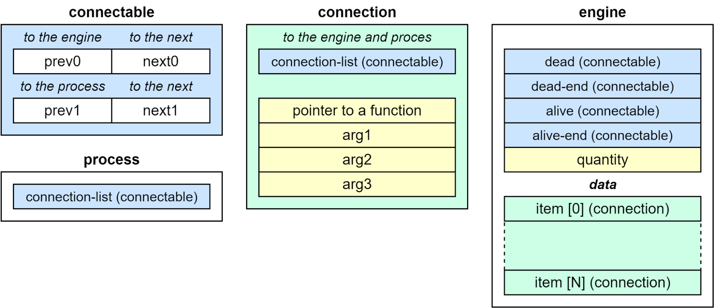
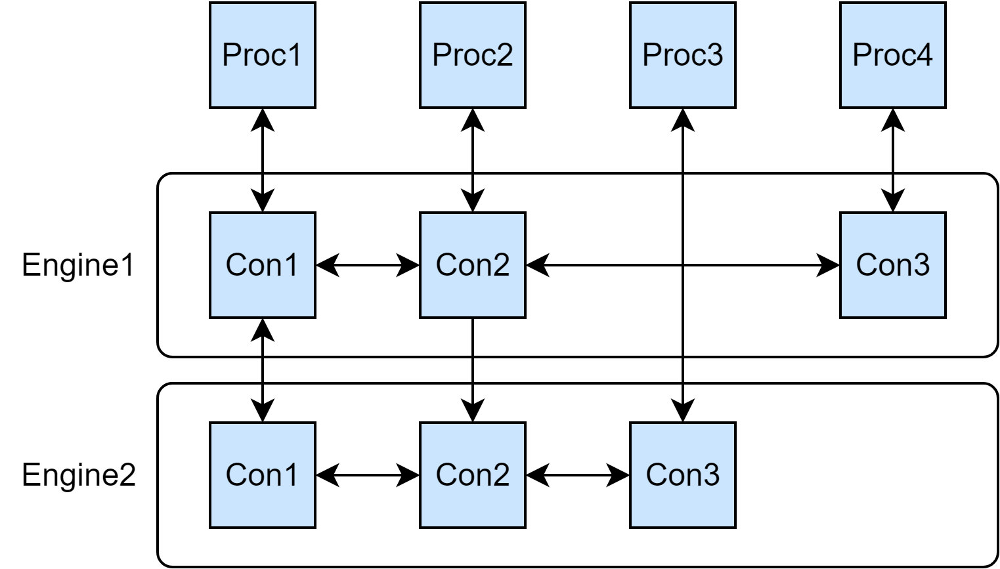

Отлично! Теперь у меня есть полная картина. Давайте я перепишу статью с учётом реального кода и вашего последнего комментария.

---

# Двухсвязные матрицы подсистем: Архитектура управления параметрами в OpenGOAL

*Как система ортогональных списков позволяет гибко управлять параметрами игры с автоматическим блендингом и минимальной связанностью компонентов*

**Аннотация.** В статье рассматривается архитектурный подход к организации игровых подсистем, реализованный в движке OpenGOAL. Система ортогональных двухсвязных списков позволяет множеству процессов одновременно управлять одними и теми же параметрами (громкость звука, яркость света, время суток) с автоматическим блендингом и без жесткой связанности компонентов. В отличие от ECS, эта система предназначена для логики верхнего уровня, а не для низкоуровневых вычислений. Материал будет полезен разработчикам игр, интересующимся гибкими архитектурами для управления состоянием игрового мира.

---

## 1. Проблема: управление параметрами в сложной игре

Представьте типичную игровую ситуацию:

- Игрок заходит в пещеру — громкость эхо должна плавно увеличиться.
- Одновременно солнце садится — яркость источников света должна измениться.
- Персонаж получает бафф на скорость — анимация должна ускориться.
- Звук шагов зависит от типа поверхности.

В классическом ООП-подходе управление параметрами выглядит как прямые вызовы:

```csharp
// Кто-то где-то пишет
AudioManager.Instance.SetVolume(0.8f);
LightManager.Instance.SetBrightness(0.5f);
```

Проблемы начинаются, когда параметров много, а контролировать их хотят десятки разных систем одновременно. Например:

- **Система окружения** говорит: "Громкость должна быть 0.8, потому что мы в пещере".
- **Система здоровья** говорит: "Громкость должна быть 0.3, потому что персонаж ранен".
- **Система диалогов** говорит: "Громкость должна быть 0.5, потому что идет важный разговор".

Как объединить эти запросы? Применить минимальное значение? Максимальное? Среднее? А может быть, плавно переходить между ними?

Именно для решения этой задачи в OpenGOAL была разработана система **ортогональных двухсвязных матриц**.

---

## 2. Архитектура: основные понятия

Система строится на трёх базовых классах, каждый из которых выполняет строго определенную роль:


*Рис. 1 — Ортогональная система связей*

### 2.1. Connectable — узел связи

Базовый класс, который содержит два независимых двухсвязных списка:

```csharp
public class Connectable
{
    public object Owner;
    
    // Горизонтальный список (внутри Engine)
    public Connectable Next0;
    public Connectable Prev0;
    
    // Вертикальный список (между Engine для одного Process)
    public Connectable Next1;
    public Connectable Prev1;
}
```

Каждый `Connectable` может одновременно находиться в двух независимых списках:
- **Горизонтальный (0)**: связывает узлы внутри одного `Engine`
- **Вертикальный (1)**: связывает узлы, принадлежащие одному `Process`

### 2.2. Connection — узел с данными

Наследует `Connectable` и добавляет параметры:

```csharp
public class Connection : Connectable
{
    public object Arg0;  // Функция-обработчик или ссылка на объект
    public int Arg1;     // Идентификатор параметра (ESetting)
    public int Arg2;     // Метод применения (EMethod)
    public int Arg3;     // Значение параметра
}
```

### 2.3. Engine — подсистема управления

Управляет списком `Connection` и выполняет их обновление:

```csharp
public class Engine
{
    public string Name;
    public int Length;  // Количество активных соединений
    
    // Сентинелы для списков
    public Connectable AliveList;
    public Connectable AliveListEnd;
    public Connectable DeadList;
    public Connectable DeadListEnd;
    
    // Пул предварительно выделенных соединений
    public Connection[] Data;
}
```

### 2.4. Process — сущность игрового мира

Любая сущность, которая может управлять параметрами (персонаж, источник света, триггер зоны):

```csharp
public class Process
{
    public string name;
    public Connectable ConnectionList;  // Голова вертикального списка
}
```

---

## 3. Двухсвязные списки: как это работает


*Рис. 1 — Ортогональная система связей*

### Горизонтальный вектор (next0 / prev0)

Связывает все `Connection` внутри одного `Engine`. Каждый `Engine` имеет два списка:
- **AliveList** — активные соединения, которые должны быть обработаны
- **DeadList** — пул неактивных соединений для переиспользования

При создании нового `Engine` все соединения предварительно выделяются в пуле:

```csharp
public Engine(string name, int size)
{
    Data = new Connection[size];
    for (int i = 0; i < size; i++)
        Data[i] = new Connection();
    
    // Все соединения находятся в DeadList
    DeadList.Next0 = Data[0];
    DeadListEnd.Prev0 = Data[Data.Length - 1];
    
    // Связываем все элементы в цепочку
    for (int i = 0; i < Data.Length - 1; i++)
    {
        Data[i].Next0 = Data[i + 1];
        Data[i + 1].Prev0 = Data[i];
    }
}
```

### Вертикальный вектор (next1 / prev1)

Связывает все `Connection`, принадлежащие одному `Process`. Это позволяет быстро найти все подсистемы, в которых зарегистрирован процесс.

---

## 4. Регистрация и выполнение

### Добавление соединения

Когда процесс хочет начать управлять параметром, он создаёт соединение:

```csharp
// В SettingsControl
public void AddSetting(Process process, int setting, EMethod method, int arg)
{
    engine.AddConnection(process, null, setting, (int)method, arg);
}

// В Engine
public void AddConnection(Process process, object arg0, int arg1, int arg2, int arg3)
{
    // Берём соединение из DeadList
    Connectable connectable = DeadList.Next0;
    Connection connection = connectable as Connection;
    
    // Настраиваем параметры
    connection.Arg0 = arg0;
    connection.Arg1 = arg1;  // ESetting
    connection.Arg2 = arg2;  // EMethod
    connection.Arg3 = arg3;  // Значение
    
    // Перемещаем в AliveList
    DeadList.Next0 = connectable.Next0;
    connectable.Next0.Prev0 = DeadList;
    
    connectable.Next0 = AliveList.Next0;
    connectable.Next0.Prev0 = connectable;
    connectable.Prev0 = AliveList;
    AliveList.Next0 = connectable;
    
    // Добавляем в вертикальный список процесса
    connectable.Next1 = process.ConnectionList.Next1;
    if (connectable.Next1 != null)
        connectable.Next1.Prev1 = connectable;
    connectable.Prev1 = process.ConnectionList;
    process.ConnectionList.Next1 = connectable;
    
    Length++;
}
```

### Вычисление итогового значения

Каждый кадр `SettingsControl` обновляет параметры:

```csharp
public void Update()
{
    // Начинаем с дефолтных значений
    target.CopyFrom(defaults);
    
    // Применяем все запросы из Engine
    target.UpdateFromEngine(engine);
    
    // Вычисляем итоговые значения
    ApplySettings();
    InterpolateSettings();
}
```

`SettingsData.UpdateFromEngine` обходит все активные соединения и применяет их:

```csharp
public void UpdateFromEngine(Engine engine)
{
    var item = engine.AliveListEnd.Prev0;
    
    while (item != engine.AliveList)
    {
        var prev = item.Prev0;
        UpdateConnection(engine, item as Connection);
        item = prev;
    }
}
```

Методы обновления для разных типов значений:

```csharp
protected float UpdateFloat(float current, EMethod method, float value)
{
    switch (method)
    {
        case EMethod.Set:    return value;                // Абсолютное значение
        case EMethod.Rel:    return current * value * 0.01f; // Проценты
        case EMethod.Scale:  return current * value;       // Масштабирование
        default: return current;
    }
}

protected bool UpdateBool(bool current, EMethod method, bool value)
{
    switch (method)
    {
        case EMethod.Set:    return value;    // Установить
        case EMethod.Or:     return current | value;  // Логическое ИЛИ
        case EMethod.And:    return current & value;  // Логическое И
        default: return current;
    }
}
```

### Методы применения

| Метод | Назначение | Пример |
|-------|------------|--------|
| **Set** | Установить абсолютное значение | `Громкость = 0.8` |
| **Rel** | Проценты от текущего значения (0..100) | `Громкость *= 50%` |
| **Scale** | Масштабирование (0..1) | `Громкость *= 0.5` |
| **Or** | Логическое ИЛИ (для флагов) | `Флаги |= 0x01` |
| **And** | Логическое И (для флагов) | `Флаги &= 0xFE` |

---

## 5. Пример: управление громкостью звука

Рассмотрим реальный сценарий с тремя процессами, управляющими громкостью:

```csharp
// 1. Процесс "Пещера" — абсолютное значение
public class CaveProcess : Process
{
    void OnEnter()
    {
        settings.AddSetting(
            this,
            (int)ESetting.Volume,
            EMethod.Set,
            0.8f  // Громкость 80%
        );
    }
    
    void OnExit()
    {
        settings.RemoveSetting(this, (int)ESetting.Volume);
    }
}

// 2. Процесс "Ранение" — масштабирование
public class DamageProcess : Process
{
    void OnTakeDamage()
    {
        settings.AddSetting(
            this,
            (int)ESetting.Volume,
            EMethod.Scale,
            0.5f  // Уменьшить громкость вдвое
        );
    }
}

// 3. Процесс "Диалог" — абсолютное значение
public class DialogProcess : Process
{
    void OnDialogStart()
    {
        settings.AddSetting(
            this,
            (int)ESetting.Volume,
            EMethod.Set,
            0.6f  // Громкость 60% во время диалога
        );
    }
}
```

### Как это работает в рантайме:

```
Начальное состояние (default): Volume = 1.0

1. Игрок входит в пещеру:
   - CaveProcess: Set(0.8) → Volume = 0.8

2. Игрок получает ранение:
   - CaveProcess: Set(0.8)
   - DamageProcess: Scale(0.5) → Volume = 0.8 * 0.5 = 0.4

3. Начинается диалог:
   - CaveProcess: Set(0.8)
   - DamageProcess: Scale(0.5)
   - DialogProcess: Set(0.6) → Volume = 0.6 (переопределяет)

4. Диалог заканчивается (удаляется соединение):
   - CaveProcess: Set(0.8)
   - DamageProcess: Scale(0.5) → Volume = 0.8 * 0.5 = 0.4
```

Итоговая громкость зависит от того, какие процессы активны и в каком порядке они применяются.

---

## 6. Удаление соединений (O(1))

Когда процесс уничтожается, он должен освободить все свои соединения. Благодаря вертикальному списку, это делается мгновенно:

```csharp
public Connection MoveToDead()
{
    Engine engine = GetEngine();
    
    // Удаляем из горизонтального списка Engine (O(1))
    Prev0.Next0 = Next0;
    Next0.Prev0 = Prev0;
    
    // Удаляем из вертикального списка Process (O(1))
    Prev1.Next1 = Next1;
    if (Next1 != null)
        Next1.Prev1 = Prev1;
    
    // Перемещаем в DeadList
    Next0 = engine.DeadList.Next0;
    Next0.Prev0 = this;
    Prev0 = engine.DeadList;
    engine.DeadList.Next0 = this;
    
    engine.Length--;
    
    return this;
}
```

Процесс может удалить все свои соединения одним вызовом:

```csharp
public void RemoveSetting(Process process, int setting)
{
    var item = process.ConnectionList.Next1;
    while (item != null) 
    {
        var next = item.Next1;
        var conn = item as Connection;
        
        if (conn.BelongsToEngine(engine) && 
            (setting == (int)ESetting.All || conn.Arg1 == setting))
        {
            conn.MoveToDead();  // O(1) для каждого соединения
        }
        item = next;
    }
}
```

---

## 7. Важное уточнение: это не ECS

Систему OpenGOAL часто путают с ECS (Entity-Component-System), но это принципиально разные подходы с разными целями:

| Характеристика | OpenGOAL | ECS (Unity DOTS) |
|----------------|----------|------------------|
| **Основная цель** | Гибкое управление параметрами с блендингом | Максимальная производительность массовых вычислений |
| **Кэш-дружественность** | Не является приоритетом. Объекты разбросаны по памяти | Все компоненты одного типа лежат в непрерывных массивах |
| **Итерация** | По связным спискам (некэш-френдли) | По линейным массивам (кэш-френдли) |
| **Применение** | Логика верхнего уровня, управление состоянием | Низкоуровневые вычисления (физика, рендеринг) |
| **Гибкость** | Высокая — динамическое изменение архетипа объекта | Низкая — архетип фиксирован |
| **Блендинг** | Встроен на уровне архитектуры | Требуется ручная реализация |
| **Реальное использование** | Управление параметрами в Jak and Daxter | Физика, рендеринг в современных играх |

В OpenGOAL `Connection` — это не просто данные, это **активный участник системы**, который содержит логику применения (`EMethod`). А сами объекты (`Process`) могут быть разбросаны по памяти — система не требует от них кэш-дружественности.

**Ключевое отличие от ECS:** в OpenGOAL важна гибкость и возможность динамически менять набор параметров, которыми управляет объект, а не скорость прохода по массиву.

---

## 8. Универсальность паттерна

Хотя в оригинальной реализации OpenGOAL система ортогональных матриц использовалась исключительно для управления параметрами (громкость, яркость, скорость времени), архитектурный паттерн сам по себе универсален.

> **Важное уточнение:** В Jak and Daxter система **не** использовалась для физики, рендеринга или массовых вычислений. Её реальное применение — управление параметрами с блендингом. Однако структура данных может быть переиспользована для других задач.

### Потенциальные сценарии (гипотетические)

1. **Система баффов и дебаффов**
   - Процесс-игрок: "Скорость = 5"
   - Бафф: "Умножь скорость на 1.5"
   - Дебафф: "Умножь скорость на 0.5"
   - Результат: 5 × 1.5 × 0.5 = 3.75

2. **Система квестов**
   - Процесс-квест: "NPC активен"
   - Процесс-время суток: "NPC активен только ночью"
   - Процесс-прогресс: "NPC активен только после квеста X"

3. **Система модификаторов оружия**
   - Оружие: "Урон = 10"
   - Модификатор "Огненный": "Умножь урон на 1.2"
   - Модификатор "Тяжелый": "Умножь урон на 1.5"
   - Результат: 10 × 1.2 × 1.5 = 18

### Почему этот паттерн не стал ECS

Важно понимать, почему эта система не превратилась в ECS:

| Аспект | OpenGOAL (оригинал) | Почему не ECS |
|--------|---------------------|---------------|
| **Цель** | Гибкость управления параметрами | Для ECS нужна другая структура памяти |
| **Итерация** | По связным спискам | Некэш-дружественно для массовых вычислений |
| **Данные** | Разбросаны по куче | Для ECS нужны непрерывные массивы |
| **Сценарий** | Логика верхнего уровня | ECS — для низкоуровневых вычислений |

---

## 9. Код из реального проекта

Ниже представлен фрагмент реального кода, демонстрирующий использование системы для управления настройками в игре. Полный код включает:

- `Connectable.cs` — базовый узел с двумя двухсвязными списками.
- `Connection.cs` — узел с параметрами и методами управления.
- `Engine.cs` — подсистема с пулом соединений.
- `Settings.cs` — надстройка для управления настройками с тремя копиями (default, target, current).

```csharp
/// <summary>
/// Три копии настроек:
/// - default — базовые значения (если никто не управляет параметром)
/// - target — дефолтные значения + изменения от всех процессов
/// - current — фактические значения (применяются каждый кадр)
/// </summary>
public class SettingControl<T> where T : SettingsData, new()
{
    public T current;
    public T target;
    public T defaults;
    public Engine engine;
    
    public void Update()
    {
        // Начинаем с дефолтов
        target.CopyFrom(defaults);
        // Применяем все запросы из Engine
        target.UpdateFromEngine(engine);
        // Вычисляем итоговые значения
        ApplySettings();
        InterpolateSettings();
    }
}
```

---

## 10. Выводы

Двухсвязные ортогональные матрицы OpenGOAL — это инструмент для управления сложностью и гибкостью в игровых проектах. В отличие от ECS, эта система предназначена для:

- Управления параметрами (громкость, яркость, скорость времени)
- Состояния мира (время суток, погода, региональные эффекты)
- Блендинга анимаций (плавные переходы между состояниями)
- Логики верхнего уровня, где требуется динамическое изменение поведения объекта

Система даёт разработчикам возможность:

1. **Динамически менять архетип объекта** — добавлять и удалять способности, эффекты, модификаторы.
2. **Разрешать конфликты запросов** без написания сложного кода приоритетов.
3. **Получать плавные переходы** автоматически (блендинг встроен в архитектуру).
4. **Быстро удалять объекты** (O(1) за счёт вертикальных списков).

Это архитектура, рожденная для гибкости и выразительности, а не для рекордов производительности. И в этом её главная ценность.

---

## Дополнительные материалы

1. **Исходный код системы** — прилагается в файлах: `Connectable.cs`, `Connection.cs`, `Engine.cs`, `Settings.cs`.
2. **OpenGOAL GitHub** — открытая реализация движка: [github.com/open-goal](https://github.com/open-goal)
3. **GDC 2004 — Jak and Daxter** — доклад о технических решениях Naughty Dog.

---

*Автор: Валерия Пудова (hww)*  
*Исходный материал: RA Game Developing Notes (2023)*  
*Дата публикации: 17 августа 2026*