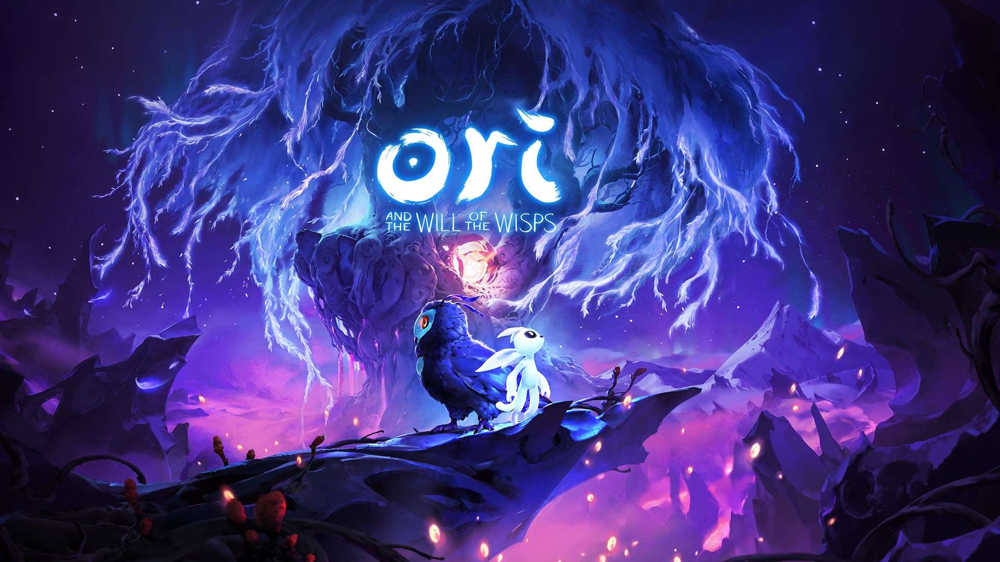

# Архитектура анимационных процессов и Tooling
> **Пояснения для технической и креативной команд**  
> *Материал из R&D-архива проекта hww.*  
> *Дата написания: 16.08.2022.*

## Дисклеймер (Disclaimer)

> ⚠️ В технической части исследования **«Программирование игрового процесса — На примере игры The Last of Us»** рассматривались сугубо низкоуровневые особенности виртуальной машины и рантайма, без углубления в логику взаимодействия с креативным департаментом. 
> 
> Ниже представлен анализ того, как архитектурные решения ядра и инструментарий (**Tooling**) напрямую определяют эффективность производства контента и культуру разработки в высокотехнологичных проектах.

---

### 🔗 Связанные материалы

Данный документ является архитектурно-художественным дополнением к основному техническому исследованию. Если вас интересует низкоуровневый разбор, спецификация байт-кода, устройство кастомной виртуальной машины и реверс-инжиниринг рантайма, обратитесь к первой (технической) части:
👉 **[Читать первую часть: Программирование игрового процесса На примере игры The Last of Us](https://hww.github.io/articles/2022/nd_gfs/index)**

---

## Введение и визуальная выразительность

Несмотря на то, что декорации и окружение имеют важное значение, основу интерактивного взаимодействия составляют **персонажи**: их физика, перемещение и адаптивное поведение в игровых ситуациях. По этой причине анимация, её пластика, точность и естественность — это фундаментальный технический и художественный вопрос для студий уровня *Naughty Dog*.

Анимация способна транслировать внутреннее состояние персонажа через движение, формируя основу визуальной выразительности и зрелищности. При этом воспроизведение движений необязательно должно точно копировать реальность. Напротив, в рантайме часто требуется усугублять характерные черты для повышения читаемости геймплея. **Поиск баланса между реализмом и выразительностью** — ключевая задача на стыке технологий и арта.

Чем выше плотность интерактивной анимации, тем более живым воспринимается игровой мир, при этом избыточная детализация фона может отступать на второй план:
* **Пример:** Проекты студии *Playdead*, где при минималистичном окружении за счет огромного количества уникальных контекстных анимаций достигается высокая материальность и достоверность мира. 

В таком контексте наличие опытных технических художников (Technical Artists) и аниматоров становится первоочередным фактором успеха.

---

## Управление конкурентными процессами в рантайме

Современный пайплайн включает множество типов анимационных систем: от классического **Keyframe-скриптования** и данных **Motion Capture (mocap)** до **Tween-интерпретаторов**, процедурной генерации геометрии, систем частиц и динамической симуляции физических тел (**Ragdoll**). Задача инженера — спроектировать фреймворк, позволяющий гибко комбинировать, смешивать по слоям, синхронизировать или воспроизводить эти процессы независимо на основе игровых событий.

Критически важно, чтобы результирующее поведение сохраняло детерминизм и естественность при одновременной работе разных подсистем. 
* **Пример:** Анимация перемещения ног должна быть жестко синхронизирована с линейной скоростью физического тела в пространстве для исключения эффекта «скольжения».

В процессе полировки разработчикам приходится многократно изменять параметры и воспроизводить результат. Игру в целом можно условно воспринимать как сверхсложную систему конкурентных интерактивных процессов, состоящую из тысяч треков, клипов и логических правил их выполнения. Финальная имплементация такого комплекса требует написания сотен тысяч строк кода, большая часть которого уникальна для конкретных игровых ситуаций.

Именно поэтому первоочередная задача программистов ядра движка — создать масштабируемый **Task Manager / Process Engine**, позволяющий легко оперировать тысячами параллельных потоков логики. Данные процессы должны быть:
1. Максимально «дешевыми» и энергоэффективными для целевого процессора (например, **Cell в PS3**).
2. Поддерживать механизм **Hot Reload** на уровне инструментария (мгновенное внесение изменений в код и ассеты без необходимости перекомпиляции и перезапуска игрового клиента).

> 💡 Техническая реализация подобных решений на примере виртуальной машины *Naughty Dog* подробно описана в первой части данного исследования.

## Проблема «перевернутой пирамиды» в производстве

В большинстве стандартных команд разработки наблюдается системный архитектурный сбой — так называемая **перевернутая пирамида ресурсов**. Типичная структура студии из 50 человек часто выглядит так: около 10 программистов, пишущих логику игры вручную кодом, огромный штат художников, создающих статичный контент (текстуры, модели), и всего 1–3 аниматора на весь проект. 

Это фундаментальная ошибка позиционирования продукта:
* **Как видит игрок:** Пользователь оценивает живость и достоверность мира не по статичным задникам, а по **динамике интерактивного взаимодействия** — по пластике движений персонажа, его физическому отклику на окружение и выразительности анимаций. Анимация — это «основа» геймдизайна, а не декоративный элемент.
* **В чем системный тупик:** Пытаясь компенсировать нехватку анимационных инструментов силами программистов (заставляя их хардкодить механики в коде движка), студии кратно усложняют кодовую базу, увеличивают количество багов и получают на выходе статичную, «деревянную» игру.

Задача этой статьи — перевернуть пирамиду обратно. Первоочередная обязанность программиста ядра — не писать геймплей руками, а **создать отказоустойчивые Data-Driven инструменты**. Инженерия должна дать креативному департаменту возможность генерировать тысячи контекстных анимаций без единой строчки кода. Только так достигается визуальный уровень AAA-проектов.

---

## Влияние Tooling на экономику разработки

При техническом аудите игровых проектов в первую очередь оценивается разнообразие и адаптивность анимационных решений:
* Как меняется поведение персонажа при перемещении по уступу скалы?
* Каковы алгоритмы поведения в режиме ожидания (**Idle**)?
* Как анимация интегрирована в драматургию и боевую систему?

Эти нюансы являются прямыми индикаторами качества архитектуры ядра движка.

Если проект не насыщен динамическими анимациями, он неизбежно выглядит статичным. Часто причиной становится избыточный упор на чисто программную реализацию логики поведения там, где задача должна решаться специализированными инструментами контента. Это усложняет кодовую базу и приводит к неоптимальным результатам.

> 🛠 **Рекомендуемый подход для R&D-команд:** 
> Имплементировать программным кодом исключительно системный базис, отдавая управление визуальной логикой в гибкие **Data-Driven инструменты** для дизайнеров (такие как скриптовые файлы схем DC). 

Это не только кратно повышает привлекательность и отзывчивость продукта (как в примере *Ori and the Blind Forest*), но и существенно экономит чистое время и ресурсы разработки.

---

## Выводы и анализ ресурсов

В завершение анализа стоит привести весомые статистические данные. Производство такого масштабного проекта, как **The Last of Us** для платформы *PlayStation 3*, потребовало распределения ресурсов в следующих пропорциях:

| Категория ресурса | Количество | Специфика / Примечание |
| :--- | :--- | :--- |
| **Программисты** | 16 человек | Из них 2 — сугубо *Tools Programmers*, сфокусированные на инструментарии |
| **Дизайнеры** | 20 человек | Проектирование логики и игровых ситуаций |
| **Художники-аниматоры** | 120 человек | Производство и полировка контента |
| **Исходные файлы схем данных** | ~6000 файлов | **DC-файлы**, управляющие рантаймом |

### Главный инженерный вывод:

Такое соотношение (где количество аниматоров почти **в 8 раз** превышает штат программистов) наглядно доказывает: **ключевая задача системного инженера в геймдеве** — не писать геймплей вручную, а спроектировать высокопроизводительный рантайм и отказоустойчивый инструментарий (**Tooling**), способный эффективно переваривать огромные массивы данных креативной команды.

---

> 💼 **Бизнес-контакты и сотрудничество**
> 
> Материал подготовлен в рамках независимого системного R&D. По вопросам контрактной разработки, проектирования ПАК (программно-аппаратных комплексов) и архитектурного сотрудничества можно писать напрямую в Telegram: **[@valery_h2w](https://t.me)**.
> 
> *Комментарии к публикации не отслеживаются. Для связи и обсуждения технических вопросов используйте указанный выше контакт.*

---
