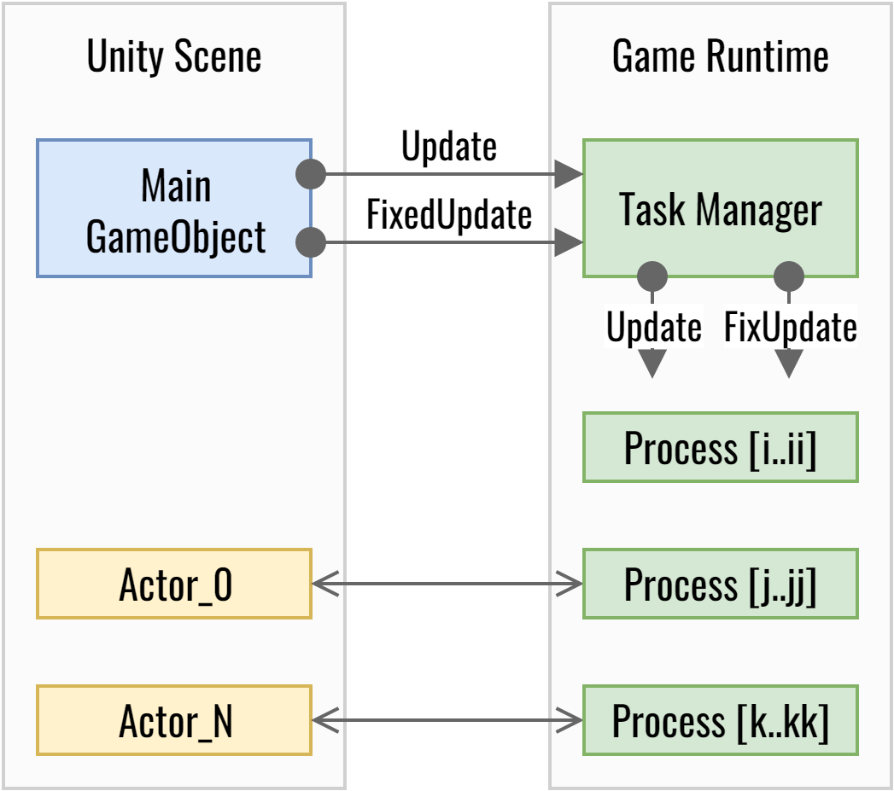
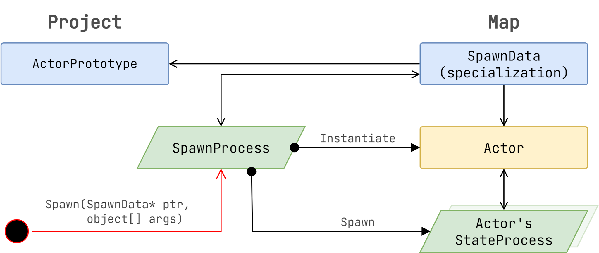
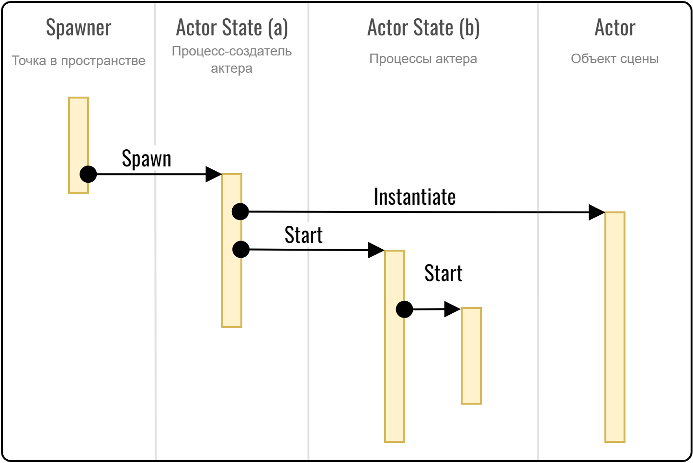

# Unity Spawning Methods

## Методы инстанцирования актёров сцены в Unity

**Валерия Пудова**  
2008

---

## Содержание

- Введение
- Описание подхода
- Инстанцирование актёров
- Структуры объектов сцены и данных кода
- Пример API
- Выводы

---

## Введение

Существует множество способов инстанцирования объектов сцены в Unity и запуска процессов, связанных с этими актёрами. Перечислим их:

1. **Использование Unity Runtime System**  
   а. Префаб, размещённый в сцене в режиме редактора с последующим запуском игры.  
   б. Префаб, установленный в сцене в рантайме (Drag&Drop), или использование метода `GameObject.Instantiate`.

2. **Собственный рантайм игры**, в котором специальный спаун-процесс инстанцирует префаб методом `GameObject.Instantiate`, запускает необходимые процессы и обновляет состояния объектов. При этом сам префаб не запускает никаких процессов (см. диаграмму 1).

У каждого из перечисленных способов есть свои достоинства и недостатки.  
Например, метод (1а) позволяет точно видеть положение, ориентацию и размер персонажа в его окружении прямо в редакторе.  
Метод (1б) привычен и работает с купленными ассетами, однако он неэффективен с точки зрения производительности — «проснувшийся» актёр или множество актёров могут создать высокую вычислительную нагрузку.

В этом документе я сосредоточусь на методе (2), который был успешно применён в нескольких проектах.

---

## Описание подхода

На диаграмме (1) упрощённо изображена структура метода (2). В сцене расположен единственный объект (`Main GameObject`), который вызывает методы в `TaskManager`.


**Диаграмма 1.** Собственный рантайм игры.

`TaskManager` запускает процессы, которые могут создавать и обновлять актёров. Процессы бывают двух видов:

- Самостоятельные процессы без актёров (процессы i…ii на диаграмме)
- Процессы актёров (процессы j…jj и k…kk на диаграмме)

---

## Инстанцирование актёров

Для начала определим составные части актёра сцены. На диаграмме (2) показаны основные компоненты, необходимые для инстанцирования.


**Диаграмма 2.** Основные элементы актёра сцены.

- **Actor** — анимированный персонаж игры, управляемый процессами.
- **ActorPrototype** — объект с параметрами, созданный в редакторе Unity. Это может быть один или несколько префабов и ассетов.
- **SpawnData** — объект сцены в редакторе, содержащий информацию о том, какой `SpawnProcess` использовать, а также когда, где и какой прототип инстанцировать, и какие параметры ему установить после инстанцирования (специализация актёра, подобие инъекции).
- **SpawnProcess** — программа, выполняющая все операции для инстанцирования актёра. При запуске процесс получает в качестве аргумента `SpawnData` и, возможно, дополнительные аргументы.
- **StateProcess** — набор процессов, управляющих персонажем в определённый момент времени (определённое состояние).

Несмотря на то, что множество разных архетипов могут использовать одну и ту же реализацию `SpawnProcess`, сам `SpawnProcess` можно считать начальным состоянием актёра.

---

## Структуры данных модели мира

Структуры объектов сцены не должны повторять структуры данных модели мира. Иерархия сцены или префаба создаётся художниками исходя из интуитивного понимания сущности, а также по техническим причинам — скелет и меш должны иметь определённую иерархию.

Поскольку структура данных, используемая кодом, не обязана совпадать со структурой объекта сцены, на `ActorPrototype` лучше смотреть как на комбинацию из двух контейнеров:

- **Type** или **Archetype** — кодовая модель прототипа.
- **Prefab** — визуальная модель прототипа.

Это позволяет использовать разные архетипы на одном и том же префабе (например, `Cyborg` и `Cyborg_Ragdoll`).

В предлагаемом решении именно процессы порождают актёров со своими процессами. В обычном подходе Unity процессы создаются компонентами актёров.

---

## Пример API

Ниже приведён небольшой фрагмент API. Он состоит, в основном, из двух групп методов:

- **Spawning** — запуск самостоятельных процессов или процессов актёра сцены.
- **Instantiating** — инстанцирование актёра и запуск его процессов.

Для начала определим следующие типы данных:

- `IProcess` — интерфейс или базовый класс процесса. Процессы организованы в дерево, и у каждого есть обработчик событий.
- `State` — именованное состояние процесса (точнее, множество процессов). В состоянии заданы код инициализации и выхода, а также обработчик событий.
- `ProcessBucket` — список гомогенных структур (процессов), обрабатываемых за один проход. В игре может быть несколько таких списков.
- `SpawnData` — параметры инстанцирования, например, параметры специальной точки сцены, называемой `Spawner`.
- `Archetype` — архетип актёра — совокупность всех данных, необходимых для его конструирования. Обычно в качестве архетипа используется `SerializedObject`.
- `Actor` — объект сцены, созданный на основе архетипа. Как правило, `Actor` — это компонент Unity.

Ещё один важный тип — `ResultCode`, который сообщает об ошибках внутри методов. Это не только отладочный инструмент: в зависимости от ошибки процессы могут менять своё поведение.

```csharp
public enum ResultCode
{
    Invalid,             // < не инициализирован (значение по умолчанию)
    Null,                // < равен null (пустой результат)
    Success,             // < успешная операция
    Allocated,           // < объект был выделен
    NotAllocated,        // < в пуле нет свободных объектов
    InvalidState,        // < переход в неверное неопределённое состояние
    InvalidStateReturn,  // < доставка сообщения в FSM не удалась
    InvalidReturn        // < невозможно вернуть корректное значение
}
```

Для работы с пулом существует метод поиска свободного процесса или освобождения занятого:

```csharp
// Найти свободный процесс или высвободить процесс с низким приоритетом
public IProcess FindFreeOrReusable(ProcessBucket headObject, bool forced);
```

Следующий набор методов предназначен для управления процессами без актёров:

```csharp
// Создать процесс, дочерний к имеющемуся
SpawnResult SpawnProcess(IProcess parent,
                         Archetype type,
                         State state,
                         params object[] args);

// Создать процесс на основе спаунера — точки в пространстве сцены.
// Этот процесс может создать одного или множество актёров
SpawnResult SpawnProcess(SpawnData data,
                         IProcess parent = null);

// Создать процесс для существующего актёра сцены
SpawnResult SpawnProcess(Actor entity,
                         Archetype type,
                         State state,
                         IProcess parent = null,
                         params object[] args);

// Инициализировать процесс параметрами архетипа и состояния.
// Метод вызывается после получения процесса из пула
SpawnResult InitProcess(IProcess process,
                        Archetype type,
                        State state,
                        params object[] args);

// Остановить процесс и высвободить его в пул
SpawnResult TerminateProcess(IProcess process,
                             bool terminateEvent = true);
```

Далее идут методы для работы с актёрами. Эти методы являются заменой `GameObject.Instantiate`:

```csharp
T Instantiate<T>(IProcess process,
                 GameObject prefab,
                 Archetype type) where T : Actor;

// Инстанцировать актёра для имеющегося процесса в точке
T Instantiate<T>(IProcess process,
                 GameObject prefab,
                 Archetype type,
                 Vector3 position,
                 Quaternion rotation) where T : Actor;

// Инстанцировать дочернего актёра для процесса в точке и с поворотом
T Instantiate<T>(IProcess process,
                 GameObject prefab,
                 Archetype type,
                 Vector3 position,
                 Quaternion rotation,
                 Transform parent) where T : Actor;

// Удалить процесс вместе с его актёром или актёрами
void DestroyActor(IProcess process);
```

Для остановки процессов состояния существует метод `Go`:

```csharp
// Остановить текущие процессы и создать новые
process.Go(IProcess parent, State state, params object[] args);
```

Однако на практике использовался другой способ перехода в новое состояние. Поскольку у каждого состояния был код `OnEnter`, вызов этого метода автоматически осуществлял переход:

```csharp
// Остановить текущие процессы и создать новые
ResultCode Goto_WalkingState(params object[] args)
{
    // Код инициализации состояния и запуска необходимых процессов
}

// Пример передачи параметров состоянию
Goto_WalkingState(/* указать цель пути, если есть */ currentZoneExitPoint);
```

Порядок инстанцирования не начинается с `GameObject.Instantiate`. Этот метод выполняется внутри процесса и не всегда обязателен. Иными словами, программист создаёт контейнеры данных и алгоритмы их модификации. Алгоритм изменяет состояние мира, а также инстанцирует и обновляет объекты сцены (см. диаграмму 3).


**Диаграмма 3.** Инстанцирование актёра сцены.

Процесс инстанцирования актёров должен распределять нагрузку между кадрами. Некоторые объекты должны создаваться быстро — без задержек. Для таких процессов стоит ограничить время инстанцирования двумя кадрами: `Instantiate → Spawn`. Другие объекты (например, фоновые актёры) могут создаваться с большей задержкой.

---

## Выводы

Предложенная терминология и API могут быть усовершенствованы, но сам подход с использованием собственного рантайма игры оказался очень эффективным. Ниже перечислены достоинства метода:

- Производительность инстанцирования актёров не вызывает заметных задержек (spikes).
- Производительность обновления структур данных значительно выше, чем у рантайм-системы Unity.
- Отсутствуют проблемы «одного кадра» — ситуации, когда один объект неожиданно обновляется раньше или позже другого, что приводит к ошибкам.
- Упрощение пайплайна за счёт того, что код в гораздо большей степени отделён от данных, в отличие от компонентной системы Unity.

Начиная новый проект в Unity, обязательно подумайте о том, как организовать рантайм-систему, чтобы минимизировать риски.
