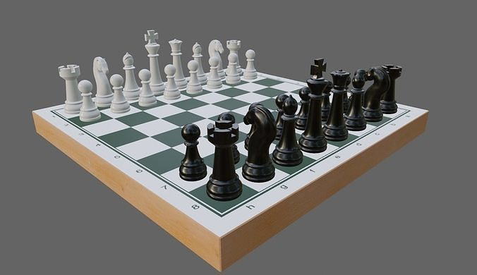
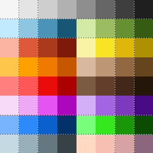
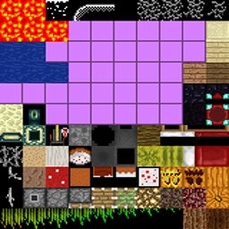
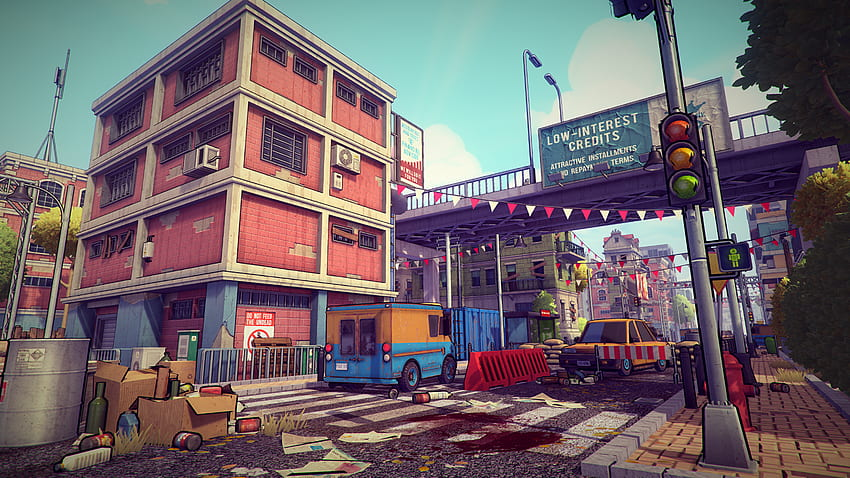
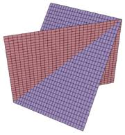
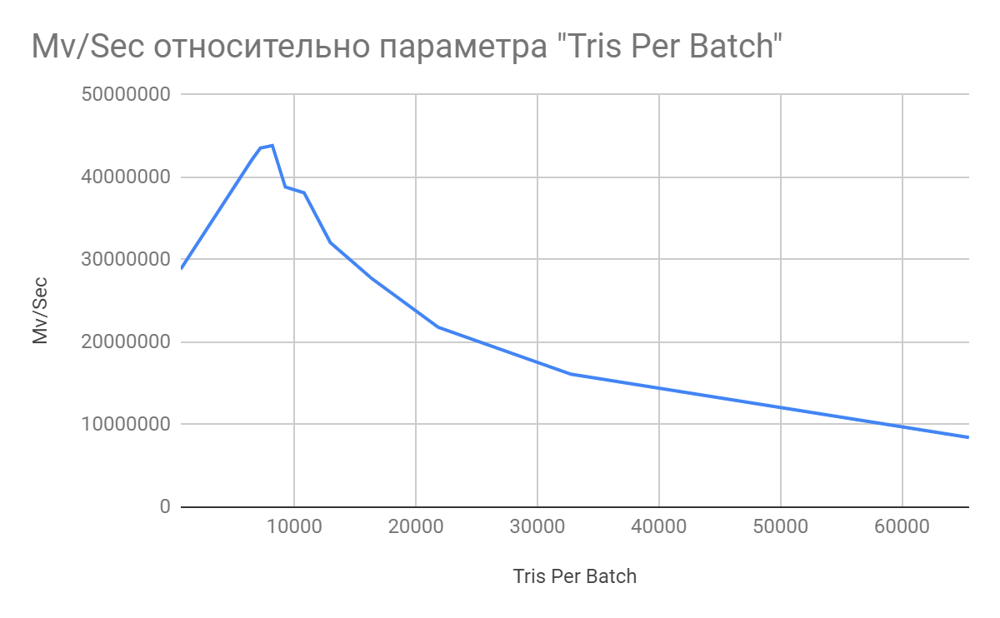
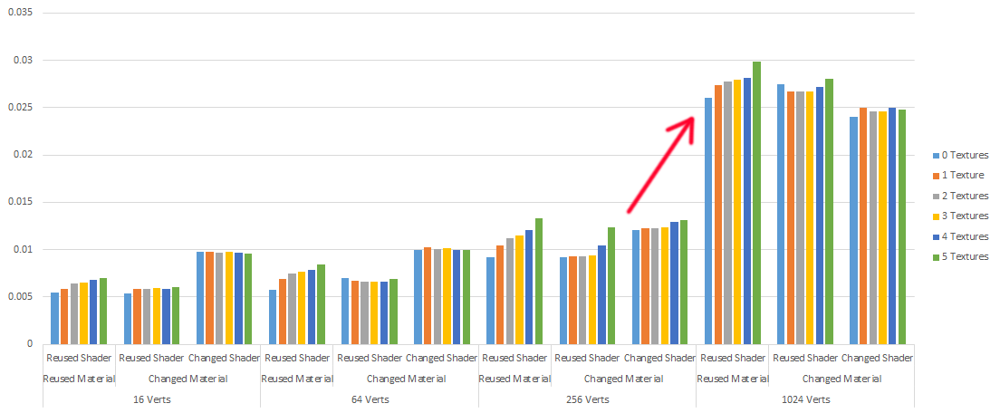
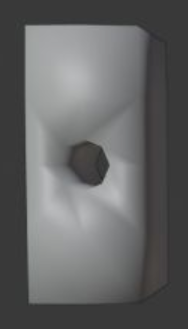
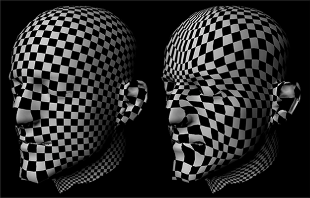

# Sweet Spot для GPU: правила оптимизации графики под мобильные платформы

**Большинство 3D-художников уверены: оптимизация модели — это исключительно борьба за низкий полигонаж. Это опасное заблуждение.** Современные мобильные чипы легко переваривают миллионы треугольников, но моментально «вешают» игру из-за невидимых для глаза ловушек в структуре мешей и материалов.

Ниже — инженерный чеклист для трехмерщика, который хочет, чтобы его модели работали на реальном железе, а не только красиво смотрелись в портфолио.

---

## Оглавление

1. Ловушка полигонажа: скрытая стоимость материалов
2. Закон Атласа: логика общих материалов против текстур
3. Анатомия мобильного рендера: почему большие объекты — это зло
4. Размер текстур
5. Культура прозрачности и батчинга
6. Культура производства: нормали, UV и именование

---

## 1. Ловушка полигонажа: скрытая стоимость материалов

Художник может потратить два дня, ужимая сетку модели с 5000 до 3000 полигонов, думая, что спасает проект. Но если при этом на объекте висит **три материала вместо одного**, производительность игры станет **хуже**.

Упрощенная формула стоимости рендеринга кадра:

$$Resources = RP + (SM + SMesh + SMesh + Pix) + Shad + RCnt$$

Для 3D-моделлера критически важна группа в скобках: **(SM + SMesh + SMesh)**.

- **RP** — стоимость проходов рендера (зависит от постобработки и количества источников света с тенями).
- **SM** (Setting Material) — затраты на переключение состояния материала.
- **SMesh** (Setting Mesh) — подготовка нового меша к отрисовке.
- **SMesh** (второй раз) — затраты на переключение между сабмешами внутри одного объекта.
- **RMesh** (Render Mesh) — непосредственно отрисовка треугольников.
- **Pix** — стоимость чтения, смешивания и записи пикселей (зависит от метода блендинга).
- **Shad** — сложность шейдерных вычислений.
- **RCnt** — количество видимых объектов на экране.

**В чем физика процесса:**  
Самый дорогой ресурс на мобильных платформах — это **количество Draw Calls** (команд отрисовки). Каждый новый материал → новый Draw Call. CPU отправляет эти команды, и именно он становится узким горлышком. Видеокарта же (GPU) считает треугольники с огромной скоростью.

**Правило:**  
Если объект содержит **менее 500 треугольников**, его оптимизация по сетке **не дает прироста FPS**. Единственное, что реально влияет — **минимизация количества уникальных материалов**.

||
|--|
|*Figure 1 - Влияние вызовов отрисовки (draw calls) на стоимость рендеринга. Элементы (SM + SMesh + SMesh) — главный приоритет для 3D-моделлера.*|

---

## 2. Закон Атласа: логика общих материалов против текстур

Чтобы сократить количество Draw Call'ов, есть три основных подхода:

### А) Shared Materials (общие материалы без текстур)

Использование нескольких чистых цветов-материалов на всю сцену.  
**Пример:** шахматы — 32 фигуры и доска рендерятся всего через два материала (черный и белый).  
✅ Видеокарте не нужно загружать текстуры — это **самый дешевый рендеринг**.  
⚠️ Работает только при малом количестве цветов (до 10–20).

||
|--|
|*Figure 2 - Шахматные фигуры требуют всего двух материалов — черного и белого.*|

### Б) Texture Atlas (текстурный атлас)

Объединение сотен мелких текстур в одно большое полотно.  
**Пример:** целый город или лес упаковываются в 2 текстуры (одна для непрозрачных объектов, вторая — для полупрозрачных).  
✅ Позволяет использовать один материал для тысяч разных объектов → один Draw Call.  
⚠️ Требует аккуратной UV-развертки, чтобы избежать кровотечения пикселей (mipmap bleeding). Загрузка текселей из атласа стоит GPU-ресурсов.

**Вывод:**  
Если нужно 10–20 цветов — выбирайте Shared Materials.  
Если нужно визуальное разнообразие и сотни объектов — используйте атлас, но с осторожностью.

|||
|--|--|
|*Figure 3 - Текстурный атлас с чистыми цветами.*|*Figure 4 - Текстурный атлас с субтекстурами (изображениями).*|

### В) Весь мир состоит из одного или двух материалов

Если невозможно использовать подходы 1 и 2, то в большинстве случаев действует правило:

- Используйте **один сабмеш, один материал и одну текстуру** для объекта, который полностью непрозрачен **или** полностью полупрозрачен.
- Используйте **два сабмеша, два материала и две текстуры** для объекта, у которого есть как непрозрачные, так и полупрозрачные части.

**Исключение:**  
Сложный персонаж может потребовать большего количества текстур для **упрощения производственного процесса**. Это осознанный компромисс между производительностью и удобством работы художников. Например, могут быть раздельные слои для:

- Тела
- Одежды
- Аксессуаров и оружия

Хороший пример разделения по слоям описан в статье [Texturing Game Characters in Substance Painter](https://learn.unity.com/project/texturing-game-characters-in-substance-painter).

||
|--|
|*Figure 5 - Такая сцена может быть отрисована небольшим количеством текстур и материалов.*|

---

> **Главный закон оптимизации материалов**
> В любом из этих трёх случаев количество материалов должно быть равно количеству сабмешей.

---

## 3. Анатомия мобильного рендера: почему большие объекты — это зло

Моделлеры любят собирать крупные объекты (длинные заборы, ангары, монолитные участки земли) единым мешем. Для мобильных платформ и VR-шлемов (Oculus Quest, Pico) **это технический приговор**.

**В чем физика процесса:**  
Мобильные GPU используют **Tile-Based Rendering** — разбивают экран на маленькие квадраты (плитки) и просчитывают их изолированно.  
Огромный монолитный объект всегда находится в поле зрения хотя бы частично. Движок не может его отсечь (culling) и вынужден прокручивать геометрию гиганта через кэш памяти для каждой плитки. Результат — перегрев чипа и падение FPS.

||
|--|
|*Figure 6 - Крупные пересекающиеся объекты не дружественны для рендеринга на TBR-платформах.*|

**Правило:**  
У мобильных платформ есть жесткая зона максимальной эффективности — **Sweet Spot**.  
Например, для Oculus Quest это **5–7 тысяч треугольников на один батч**.  
Любой крупный объект обязан собираться из **небольших модулей**, размер которых укладывается в ограничения платформы.

||
|--|
|*Figure 7 - У каждой платформы есть своя оптимальная зона производительности (sweet spot) для отрисовки множества объектов с различным размером мешей. Например, для Oculus Quest наилучшая производительность достигается при использовании объектов в диапазоне 5–7 тысяч треугольников на один батч.*|

---

## 4. Размер текстуры: Ловушка пропускной способности

Большинство 3D-художников уверены: если текстура высокого разрешения физически «влезает» в объем видеопамяти шлема или смартфона, то её можно использовать. Это опасное архитектурное заблуждение. Сама по себе память может быть полупустой, но игра начнет нещадно тормозить.

| |
|---|
| Figure 8 - У платформы возникают проблемы, когда размер текстуры превышает определённый порог. |

В чем физика процесса:
На мобильных платформах и автономных VR-шлемах (Oculus Quest) оперативная (RAM) и видеопамять (VRAM) — это один физический чип. Они делят между собой общую шину данных, которая имеет очень узкое «горлышко» — пропускную способность (Memory Bandwidth).
Когда GPU пытается одновременно отрисовать на экране десятки объектов с текстурами 4K, происходит следующее:

- Забивание шины данных: Текстура 4K содержит в 4 раза больше пикселей (текселей), чем текстура 2K. Чтобы просто передать эти массивы данных из RAM в графический чип, общая шина забивается «до отказа». Процессор (CPU) и видеокарта (GPU) начинают простаивать, банально ожидая, пока пиксели доедут по шине.
- Катастрофа текстурного кэша: Внутри GPU есть крошечная, но сверхбыстрая память — текстурный кэш. Когда видеокарта красит пиксель, она забирает кусочек текстуры в этот кэш. Если текстура маленькая (например, 512x512), её фрагменты идеально ложатся в кэш, и GPU работает на максимальной скорости. Огромная текстура в кэш не помещается. Видеокарта постоянно сталкивается с промахами кэша (Cache Misses), вынужденно обращаясь назад к медленной общей памяти.

Правило: Размер текстуры должен определяться не «красотой вблизи», а её физическим разрешением на экране игрока. Если объект занимает на экране область 200x200 пикселей, натягивать на него текстуру 2048x2048 — это техническое преступление, которое сожрет драгоценный Bandwidth всей системы.

Всегда используйте Mipmap-уровни (LOD-текстуры), чтобы движок автоматически подменял разрешение текстуры на меньшее по мере удаления объекта от камеры.

---

## 5. Культура прозрачности и батчинга

Рендеринг полупрозрачных материалов — одна из самых тяжелых операций для графического чипа. В отличие от непрозрачной геометрии, которую видеокарта рисует «в лоб», прозрачность заставляет железо работать в режиме постоянного стресса.
В чем физика процесса:
Когда объект имеет полупрозрачные области (Alpha Blending), GPU не может просто записать цвет пикселя в буфер экрана. Он вынужден выполнять тяжелую операцию Read-Modify-Write: считать цвет того, что уже нарисовано сзади, смешать его с цветом прозрачного объекта и записать результат обратно.
Если на экране друг на друга накладываются несколько слоев прозрачности (например, пышная крона дерева из прозрачных плашек или эффекты дыма), возникает катастрофический эффект Overdraw (Перерисовка). Один и тот же пиксель экрана пересчитывается по 5–10 за кадр. Мобильная видеокарта моментально захлебывается, шина памяти перегружается, а FPS падает в разы.
Чтобы удержать симуляцию в рабочих рамках, трехмерщик обязан соблюдать три жестких правила:

## 1. Alpha Test против Alpha Blend: Анатомия компромисса

- Alpha Blend (Мягкое затухание): На мобильных устройствах и VR-шлемах это строжайшее табу. Оно порождает бесконечный Overdraw и заставляет движок тратить ресурсы CPU на постоянную, попиксельную сортировку объектов по глубине (чтобы понять, какой прозрачный объект находится ближе к камере, а какой дальше).
- Alpha Test (Жесткое вырезание по маске): Пиксель либо на 100% виден, либо полностью прозрачен. Края получаются ступенчатыми и грубыми («ugly»), но такой метод не требует сортировки слоев. Однако у него есть скрытая ловушка: Alpha Test ломает технологию Early-Z. Современные GPU умеют отбрасывать скрытые за стенами пиксели еще до запуска тяжелых шейдеров. Но при Alpha Test чип не знает, отбросить пиксель или нет, пока не выполнит шейдер и не проверит маску прозрачности.
- Инженерное решение: Используйте Alpha Test как компромисс только для удаленных объектов (деревья издалека). Вблизи часто выгоднее нарезать меш дополнительными полигонами по контуру листа или детали, сделав честную непрозрачную геометрию, чем использовать квадратный полигон с прозрачной маской. На платформах с включенным сглаживанием MSAA используйте современную альтернативу — Alpha to Coverage, которая дает мягкие края без потери производительности.

## 2. Иллюзия LOD (Level of Detail)

Системы автоматического переключения уровней детализации (LOD) — прекрасный инструмент, но художники часто пихают его повсюду.

- Правило: Расчет LOD имеет смысл только для динамических объектов или при быстро движущейся камере. Если в вашей сцене камера статична (или движется по жестко ограниченному рельсу), постоянный математический расчет того, на каком расстоянии находится объект и какой LOD ему включить, тратит ресурсы центрального процессора (CPU) абсолютно впустую. При статичной камере LOD’ы должны быть отключены, а геометрия сцены — изначально зафиксирована в оптимальном качестве.

## 3. Скрытая цена батчинга (Batching)

Когда программисты говорят: «Не переживай за Draw Call'ы, мы включим батчинг и движок сам все склеит», они умалчивают о побочных эффектах.

- Ловушка Static Batching (Статический батчинг): Этот инструмент действительно объединяет статичные объекты с общим материалом в один вызов отрисовки. Но физически он создает в оперативной памяти один гигантский монолитный меш. В итоге мы возвращаемся к проблеме «Больших объектов» (Раздел 3): огромный забор или кусок города будет целиком мертвым грузом висеть в памяти шлема, даже если игрок уперся носом в один-единственный столб.
- Границы Dynamic Batching (Динамический батчинг): Работает «на лету» только для мелких, движущихся объектов (снаряды, монетки, частицы) и жестко ограничен лимитом в ~300 треугольников. Если моделлер превысит этот лимит хотя бы на один полигон, объект вылетит из батчинга и создаст лишний Draw Call.

---

## 6. Культура производства: Скрытая математика геометрии

Большинство художников оценивают тяжесть модели по счетчику полигонов в Blender, Maya или 3ds Max. Однако игровой движок видит геометрию иначе. Из-за скрытых ловушек на этапе создания UV и нормалей модель из 1000 полигонов при импорте в движок может внезапно превратиться в 2000 или 3000 вершин, перегружая шейдерные процессоры.

## Нормали и жесткие ребра (Hard Edges)

Некорректные нормали не просто создают некрасивые заломы и артефакты на свету, вынуждая программистов тратить время на исправление чужих ошибок. Они напрямую влияют на производительность.

| |
|---|
| Figure 9 - Дефекты, вызванные некорректными нормалями. |

В чем физика процесса:
Игровой движок считает нагрузку не по треугольникам, а по количеству вершин (Vertex Count). Когда вы назначаете ребру статус Hard Edge (острое ребро / разделение групп сглаживания), движок физически не может сгладить нормаль в этой точке. Ему приходится разрывать и дублировать вершины вдоль всего этого ребра. Каждая грань получает свою копию вершины со своим направлением нормали.

Правило: Чем больше на модели неоправданных Hard Edge’ей, тем выше её реальный вес в движке. Стремитесь переносить жесткие ребра на текстуру (через карту нормалей), оставляя саму сетку максимально сглаженной (Smooth Edges).

## UV-развертка и ловушка швов (UV Seams)

Проверка развертки шахматной текстурой (checkerboard) — это не просто эстетическое требование для борьбы с растяжениями пикселей. Это техническая необходимость.

| |
|---|
| Figure 10 - Слева — хорошая развертка, справа — плохая (растянутые UV). |

В чем физика процесса:
Точно так же, как и в случае с Hard Edges, игровой движок дублирует вершины на каждом текстурном шве (UV Seam). Вершина геометрии может быть одна, но если она принадлежит двум разным островкам развертки, она имеет разные UV-координаты. Движок вынужден скопировать её в памяти.
Если моделлер бездумно порезал меш на сотни мелких UV-островков, реальный Vertex Count модели на мобильном GPU вырастет в 2–3 раза. Видеокарта будет тратить лишние такты на обработку одних и тех же точек.

## Именование как элемент архитектуры

Требование давать объектам понятные имена вместо стандартных Mesh_01, Box_offset_2 или Material_red — это не прихоть лид-артиста, а защита от человеческого фактора.
Когда проект собирается под мобильные платформы, программисты настраивают автоматические скрипты оптимизации пайплайна (Asset Postprocessors). Например, скрипт может автоматически объединять в батчи все объекты, содержащие в имени Static_Prop_, или применять особые сжатые текстурные форматы к объектам с тегом *UI*. Если меши названы хаотично, автоматизация ломается, и команде приходится вручную перебирать тысячи ассетов в поисках причин падения производительности.

Правило: Имя ассета должно быть строго структурированным и самодокументируемым (например, Character_Body_01). Это единственный способ держать проект под контролем, когда количество объектов на сцене переваливает за тысячи.

## Дополнительные рекомендации для production-культуры

- Двухсторонняя геометрия (Double-sided): Избегайте включения галочки "Two Sided" в настройках материала. Она полностью отключает важнейшую аппаратную оптимизацию видеокарты — Backface Culling (отсечение задних граней). GPU начинает тратить ресурсы на обработку внутренних полигонов, которые игрок физически никогда не увидит. Если нужна толщина (например, у ткани или листа) — честно смоделируйте её геометрией.
- Злоупотребление полигонами «на всякий случай»: Всегда удаляйте невидимые полигоны — те, что прижаты к стенам, находятся внутри других объектов или скрыты под землей. Они не только занимают место в памяти, но и участвуют в расчетах видимости, тратя ресурсы CPU.

## Дополнительные рекомендации (для production-культуры)

- **Двухсторонняя геометрия:** избегайте — она удваивает нагрузку на растеризатор.
- **Окклюзия:** эффективна только при движущейся камере. При статичной камере расчет окклюзии тратит CPU впустую.
- **Alpha Test:** помните, что он дает ступенчатые края, но может быть оправдан для крупных удаленных объектов.

---

## Итоговый чек-лист оптимизации (Шкала критичности от 1 до 10)

Чем выше балл, тем сильнее эта ошибка бьет по производительности мобильной платформы. Проверяйте модель строго сверху вниз.

| Действие при проверке ассета | Влияние на FPS (0–10) | Физический смысл / Почему это критично |
| --- | --- | --- |
| 1. Сократить количество материалов до минимума | 10 / 10 | Каждый материал генерирует новый Draw Call, перегружая процессор (CPU). |
| 2. Использовать атлас или общие цвета вместо кучи текстур | 10 / 10 | Защищает шину памяти (Bandwidth) от забивания тяжелыми текстурными данными. |
| 3. Проверить нормали (артефакты) и UV (шахматкой) | 9 / 10 | Хаотичные швы развертки и Hard Edge'и физически удваиваютVertex Count модели в движке. |
| 4. Избегать Alpha Blend (строгое табу), использовать Alpha Test | 8 / 10 | Спасает мобильный чип от эффекта Overdraw (многократной перерисовки пикселей). |
| 5. Разбивать крупные объекты на модули по 5–7k треугольников | 7 / 10 | Позволяет плиточному рендеру (TBR) эффективно отсекать невидимую геометрию. |
| 6. Избегать двусторонней геометрии (Double-sided) | 6 / 10 | Сохраняет аппаратную оптимизацию Backface Culling (отсечение задних граней). |
| 7. Применять статический батчинг только после профилирования | 4 / 10 | Защищает оперативную память от раздувания монолитными невидимыми мешами. |
| 8. Включать LOD только для движущихся объектов/камеры | 3 / 10 | Избавляет CPU от холостых расчетов расстояний при статичном кадре. |
| 9. Оптимизировать полигонаж, только если в сетке > 500 трисов | 2 / 10 | Экономит время художника. Мелкую сетку оптимизировать по полигонам бесполезно. |

---

**Автор:** Валерия Пудова (hww)  
**Год:** 2022  
**Контакты:** Telegram [@valery_h2w](https://t.me)  
