# Производительность Oculus Quest 

## Аннотация

В статье описаны приёмы оптимизации для Oculus Quest с акцентом на практическую реализацию. Материал сочетает официальные рекомендации Meta, инженерный опыт и взгляд художника. В отличие от оригинала, здесь восстановлены все ключевые смыслы, включая разделы о Tile-Based Rendering, Early-Z, управлении порядком рендеринга и практические чек-листы. **Все иллюстрации сохранены.**

**Keywords:** Oculus Quest, Performance, Optimization, CPU, GPU, FPS, TBR, Early-Z

---

## Введение

Очевидно, что требуется ограничение количества draw calls. Но это число не универсально: 10 или 200 — зависит от сцены. То же самое касается количества треугольников. Однако производительность определяется не только этими цифрами. Ниже мы разберём процессы и опции, которые наиболее критичны для мобильной архитектуры.

- **Tile-Based Rendering (TBR)** — ключевая особенность архитектуры мобильных GPU.
- **Оценка затрат CPU** — что реально дорого для процессора.
- **Оценка затрат GPU** — что нагружает графику.
- **Взгляд для художника** — упрощённый, но практичный подход.
- **Инженерный чек-лист** — правила кодинга под Quest.

---

## 1. Баланс CPU & GPU

Качественная оптимизация — это поиск равновесия между загрузкой центрального процессора и графического ускорителя. Если одно устройство простаивает в ожидании другого — это потеря производительности.

Есть два основных узких места:

| Тип | Описание |
|-----|----------|
| **CPU Bound** | Процессор не успевает отправлять задания GPU. Причин много: слишком много draw calls, тяжёлые скрипты, физика, сборщик мусора, частые переключения шейдеров и материалов. |
| **GPU Bound** | Графический процессор перегружен. Даже если draw calls мало, сложные шейдеры, большие меши, тяжёлые текстуры и низкая пропускная способность памяти создают. |

|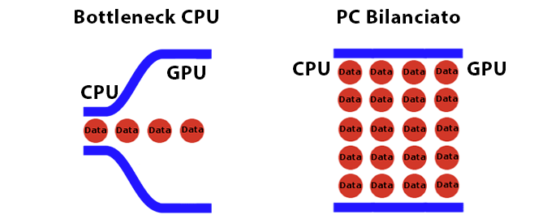|
| :---: |
| *Figure 1 — Распределение нагрузки и эффект бутылочного горлышка (Bottleneck) между CPU и GPU.* |

---

## 2. Tile-Based Rendering (TBR) — архитектурная основа

Oculus Quest использует TBR-архитектуру. Экран разбивается на небольшие тайлы (плитки). Рендеринг происходит в два этапа:

1. **Vertex-проход** — все вершины обрабатываются, и для каждого примитива определяется, в какой тайл он попадает.
2. **Фрагментный проход** — для каждого тайла выполняются фрагментные шейдеры.

**Ключевая оптимизация TBR — Early-Z.** Если объекты рендерятся **от ближних к дальним**, GPU может отбросить пиксели, скрытые за непрозрачными объектами, **до** выполнения фрагментного шейдера.

|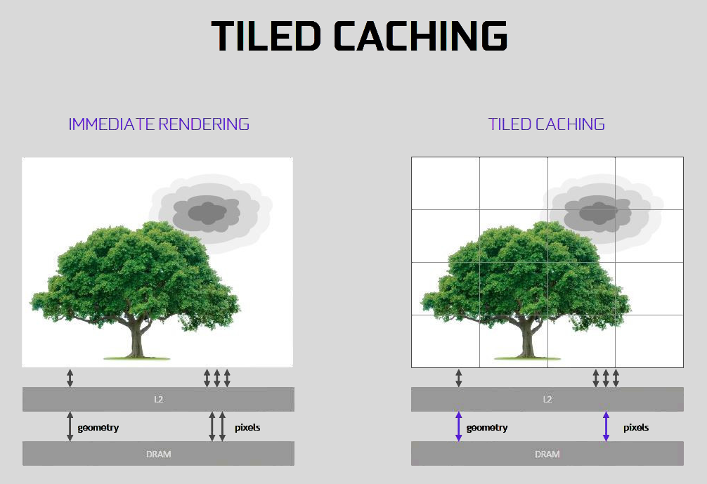|
| :---: |
| *Figure 2 — Принцип работы Tile-Based Rendering: разбивка экрана на тайлы и двухпроходный рендеринг.* |

> ⚠️ **Важно:** Как только в тайл попадает **любой полупрозрачный** объект (даже alphatest), оптимизация Early-Z **полностью отключается для всего тайла**. Все пиксели в этом тайле будут вычислены полностью, даже если они скрыты.

---

## 3. Ловушка Early-Z и порядок рендеринга

Все знают: непрозрачные объекты должны рендериться от ближних к дальним. Но в Unity есть скрытые ловушки.

### Ловушка 1: Alpha Test убивает Early-Z

Если поверх непрозрачной стены рендерится куст с альфа-тестом (листва, решётка), то в этой зоне Early-Z отключается. GPU не знает, прозрачен пиксель или нет, пока не выполнит фрагментный шейдер. Это означает, что ресурсы тратятся на пиксели, которые игрок даже не увидит.

> **Решение:** Измените порядок рендеринга. Непрозрачный объект должен рендериться **первым** — тогда он запишется в Z-буфер. Полупрозрачный полигон выполнит обновление только реально видимых пикселей.

### Ловушка 2: UI рендерится поверх всей сцены

По умолчанию UI в Unity рендерится **после** всей сцены. Если у игрока перед глазами большое меню, оно перерисовывает пиксели уже готового трёхмерного мира. Это чистый overdraw.

> **Решение:** Установите `Custom Render Queue` для UI на `Geometry-1` или `Geometry+1`. Если интерфейс обновит Z-буфер **до** отрисовки сцены, GPU аппаратно отбросит всю геометрию, скрытую за интерфейсом.

---

## 4. Оценка затрат CPU

### Дороже сменить шейдер, чем материал

Это золотое правило: переключение шейдера — одна из самых дорогих операций. Идеальный минимум: один шейдер для непрозрачных объектов, один для прозрачных, один для unlit. Всё остальное — роскошь.

### Дороже сменить материал, чем геометрию

Дешевле иметь 2 меша с 1 материалом, чем 1 меш с 2 материалами. Практический вывод: объединяйте рядом стоящие непрозрачные объекты в один меш, а текстуры — в один атлас.

### Что почти бесплатно для CPU:

- Замена текстуры материала (при том же шейдере)
- Замена цвета материала
- Размер текстуры (от 32×32 до 4096×4096)
- Текстурный фильтр
- Способ компрессии

> Но всё это может быть дорого для GPU — см. ниже.

|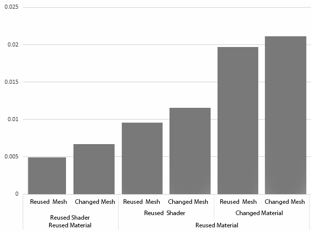|
| :---: |
| *Figure 3 — Сравнение относительных затрат CPU на переключение шейдера, материала и меша.* |

### Итог по CPU (приоритеты):

1. **Минимизировать смену шейдера** — самое дорогое.
2. **Минимизировать смену материала** — тоже дорого, но меньше.
3. **В меньшей степени — смену меша** и большое число текстур.

---

## 5. Оценка затрат GPU

### Сложный меш — нелинейная проблема

Размер меша влияет на производительность нелинейно. Падение производительности особенно заметно при переходе от 256 вершин к 1024. Скорее всего, это связано с кэш-промахами GPU.

||
| :---: |
| *Figure 4 — Нелинейное падение производительности при росте размера меша.* |

> **Вывод:** Иногда дешевле отрендерить множество маленьких одинаковых объектов, чем один большой. Особенно если объекты помещаются в кэш GPU.

### Sweet Spot для Oculus Quest

Оптимальный размер геометрии на один батч — **6–8 тысяч треугольников**. Это та зона, где производительность максимальна.

||
| :---: |
| *Figure 5 — Производительность (Mv/Sec) в зависимости от размера геометрии в одном вызове (Tris Per Batch). Отчётливо видно плато в диапазоне 6–8K.* |

### Multitexture — не так страшно

Хотя официальное руководство советует избегать множества текстур, графики показывают, что это не слишком дорого. Однако может давать нестабильный результат из-за кэш-промахов.

> Но multitexture-материал **выгоднее**, чем дополнительный шейдер или материал (т.е. дополнительный draw call).

### Что почти бесплатно для GPU:

- Размер текстуры (от 32×32 до 4096×4096) — **не влияет** на производительность
- Текстурный фильтр
- Способ компрессии

|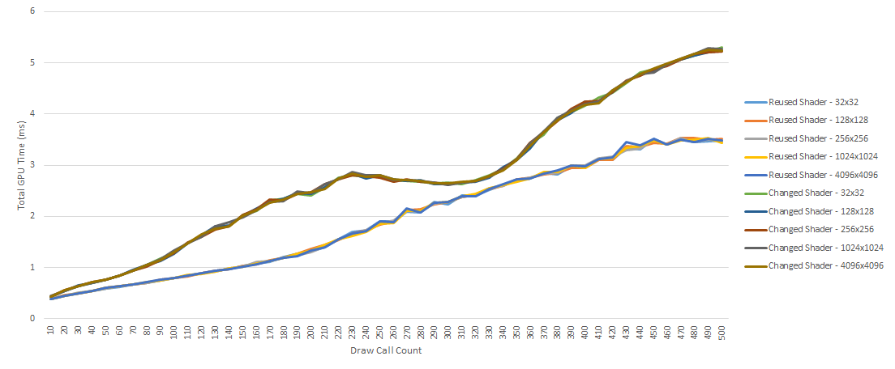|
| :---: |
| *Figure 6 — Зависимость времени кадра (Total GPU Time) от количества вызовов отрисовки (Draw Call Count). Верхний кластер линий наглядно показывает сокрушительную цену смены шейдера (Changed Shader) по сравнению с переиспользованием старого (Reused Shader). При этом графики для текстур от 32×32 до 4096×4096 слились в монолитные линии, доказывая, что сам по себе размер текстур для GPU на этой платформе бесплатен.* |

> ⚠️ **Исключение:** Cubemap **дороже** 2D-текстуры. Используйте их минимально.

### Итог по GPU (приоритеты):

1. **Минимизировать смену шейдера**.
2. **Минимизировать смену материала**.
3. **Не использовать объекты с большим числом треугольников** (держитесь в Sweet Spot).
4. Обратить внимание на **непропорциональное падение производительности** при увеличении примитивов.

---

## 6. Взгляд для художника

Здесь — восстановленный и расширенный раздел для тех, кто не хочет лезть в дебри кода.

### Основные технологии оптимизации на Oculus Quest:

| Технология | Как помогает |
|------------|--------------|
| **Occlusion Culling** | Игнорирование не только объектов вне кадра, но и тех, что скрыты другими. |
| **Primitive Culling & Clipping** | Отбрасывание или обрезка примитивов, не попадающих во фрустум. |
| **Sorted Rendering + TBR** | Рендеринг от ближних к дальним. Отключение шейдера фрагмента для скрытых пикселей. Частично уменьшает overdraw. |
| **GPU Cache** | Быстрый рендеринг объектов, размер которых помещается в кэш. |
| **Shader Instancing** | Подходит для множества мелких динамических объектов: пули, декор, частицы, листва. |

### Complex Mesh vs Large Game Object — важное различие

|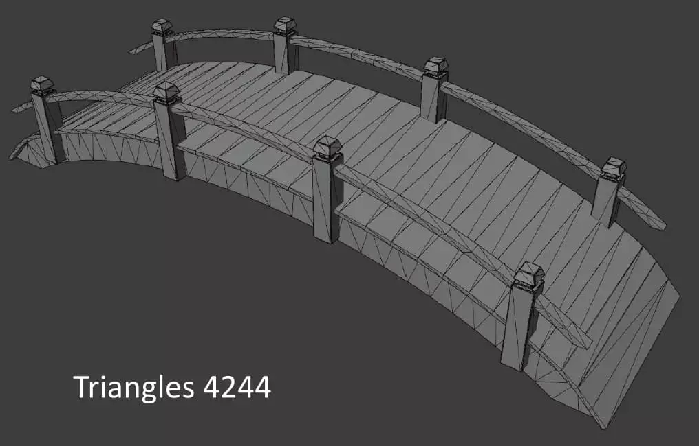|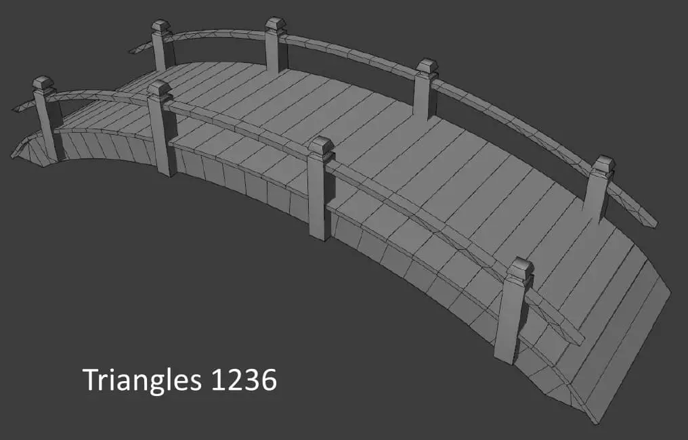|
| :---: | :---: |
| *Figure 7 — Complex Mesh: 4244 треугольника, много деталей.* | *Figure 8 — Simple Mesh: 1236 треугольников, деталей меньше.* |

**Complex Mesh** — это когда много треугольников. Деталей много, но цена — производительность.

**Large Game Object** — это когда объект **занимает большой объём пространства** (здание, гора). Проблема в том, что такой объект сложно спрятать за другими, он всегда рендерится целиком, даже если игрок находится внутри.

|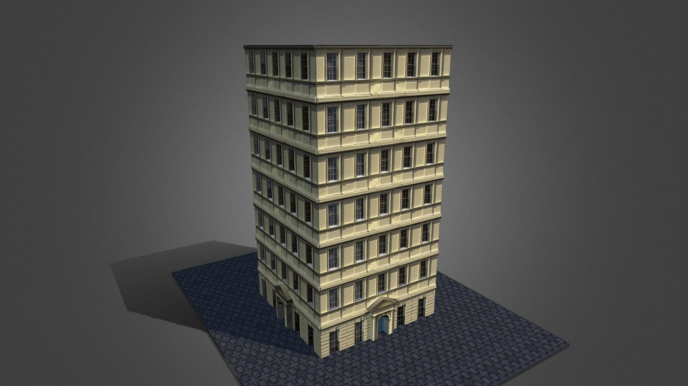|
| :---: |
| *Figure 9 — Large Game Object это геометрически большой объект* |

> **Решение:** Разбивайте Large Game Objects на модули. Например, здание — на этажи, блоки с оконными проёмами или отдельные секции.

### Когда Occlusion Culling работает:

✅ Есть небольшие чётко выраженные пространства (комнаты, коридоры, дворы).  
✅ Есть продуманное ограничение видимости (извилистый каньон, смена indoor/outdoor).  
✅ Камера движется.

### Когда Occlusion Culling бесполезна:

❌ Все объекты видны всегда.  
❌ Объекты огромные (Large Game Object).  
❌ Мало памяти.  
❌ Сцена генерируется в рантайме.  
❌ Игра с фиксированной камерой.

### GPU Cache — практические советы

- Объекты должны помещаться в кэш.
- Избегайте слишком маленьких объектов — цена переключения меша выше, чем рендеринг нескольких полигонов.
- Ограничивайте размер геометрии в полигонах.
- Используйте LOD.
- Используйте lightmap низкого разрешения.

### Overdraw и Sorted Rendering

Unity рендерит объекты от ближних к дальним, что уменьшает overdraw. Но некоторые большие объекты (skydome, гора, большое здание) могут создавать проблемы.

|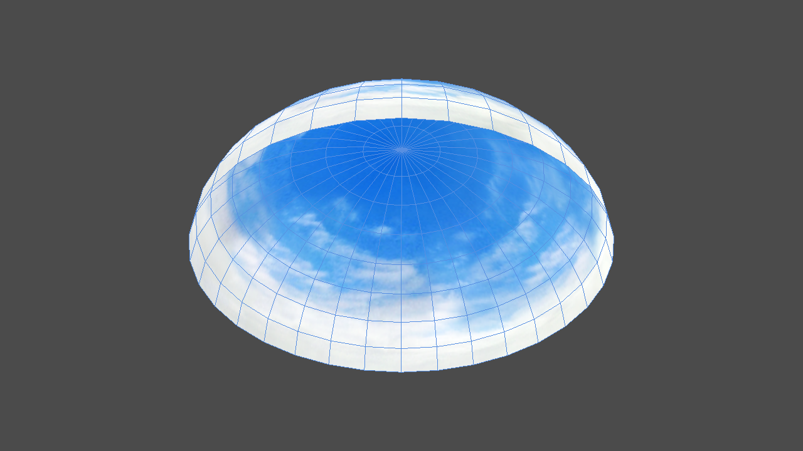|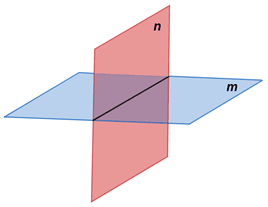|
| :---: | :---: |
| *Figure 9 — Skydome. Объект находится близко к центру, но должен рендериться последним.* | *Figure 10 — Самопересекающаяся геометрия. Такие объекты стоит разбивать на две непересекающиеся части.* |

**Решение:** разбивайте большие объекты на несколько, чтобы Unity использовал более точный origin для сортировки.

### Полупрозрачные объекты

Желательно минимизировать alphablend и alphatest, так как они вызывают падение производительности в TBR.

**Правила для художников:**

- Ограничивай количество слоёв прозрачных объектов.
- Ограничивай их размер по отношению к экрану.
- Полностью выключай объекты со 100% прозрачностью.
- Используй Tight Mesh Sprite (без пустых больших бордюров).
- Для UI предпочитай SpriteRenderer вместо UI Image.
- Уменьшай время жизни частиц.

|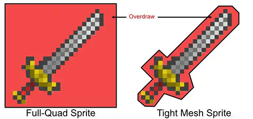|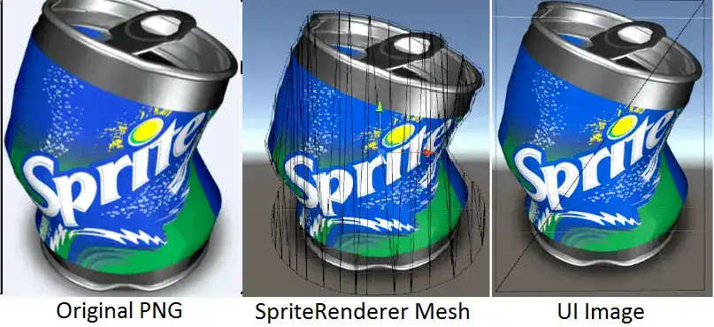|
| :---: | :---: |
| *Figure 11 — Tight Mesh Sprite* | *Figure 12 — Самопересекающаяся геометрия. Такие объекты стоит разбивать на две непересекающиеся части.* |


---

## 7. Инженерный чек-лист (для программистов)

Этот список собран из практического опыта R&D.

### Системные и рендер-настройки

- Используйте **URP** и **Forward Rendering**.
- Включите **Instanced Stereo / Multi-View**.
- Установите рекомендованный уровень **MSAA = 4x**.
- Не используйте **Render Scale > 1.2**.
- Предпочитайте **2D Textures** вместо Cubemap (Cubemap значительно дороже).

### Отключаемые эффекты (экономия GPU)

- Категорически избегайте: **SSAO, motion blur, global fog, parallax mapping**.
- Не используйте **realtime global illumination**.
- Выключайте тени, когда достигнут GPU-лимит.

### Лимиты на ресурсы

- Избегайте текстур высокого разрешения **(больше 2K × 2K)**.
- Не используйте **больше 1 источника света** на пиксель.
- Не используйте **multipass шейдеры** (например, legacy specular).
- Не злоупотребляйте проходами шейдера **(не больше 2 shader passes)**.

### Настройки физики

- Не ставьте `Sleep Threshold` меньше **0.005**.
- Не ставьте `Default Contact Offset` меньше **0.01**.
- Не ставьте `Solver Iteration Count` больше **6**.

### Работа с памятью и загрузкой

- Не держите большие текстуры или множество префабов в стартовой сцене — сжимайте их и грузите асинхронно.
- Используйте **Addressables** для выгрузки ресурсов по мере прохождения уровня.

### Hard-coded solutions (директивное управление)

Когда автоматика не справляется, переходите на ручное управление:

```csharp
void OnPlayerEnterHeavyZone() {
    ParticleSystem.timeMax = 0.5f;
    ShadowQuality.disableDistance = 10f;
    RenderScale.value = 1.0f;
    DeactivateHiddenObjects();
}
```

---

## Инженерный чек-лист оптимизации VR-кода (Шкала критичности от 1 до 10)

| Инженерное действие при оптимизации | Влияние на FPS (0–10) | Физический смысл / Почему это критично |
|---|---|---|
| 1. Определить Bottleneck через профилировщик | 10 / 10 | Без этого оптимизация превращается в слепой хаос и трату времени не на те подсистемы. |
| 2. Использовать Job System + Burst Compiler | 10 / 10 | Разгружает перегретый главный поток (CPU), распределяя математику по всем ядрам ARM. |
| 3. Минимизировать количество уникальных материалов | 10 / 10 | Напрямую сокращает количество Draw Call'ов — главного убийцы производительности CPU. |
| 4. Минимизировать количество шейдеров (opaque/alpha/unlit) | 9 / 10 | Смена шейдера — самая дорогая операция смены состояния (Render State) для видеокарты. |
| 5. Изменить порядок рендеринга UI (Geometry-1) | 9 / 10 | Заставляет Z-буфер аппаратно отсекать геометрию мира, скрытую за панелями интерфейса. |
| 6. Использовать Sweet Spot (6–8K трисов на батч) | 8 / 10 | Идеальный баланс, защищающий от оверхеда на CPU и кэш-промахов на мобильном GPU. |
| 7. Избегать Alpha Test/Blend на больших объектах | 8 / 10 | Предотвращает катастрофический Overdraw и уход плиточного рендера (TBR) в бесконечный цикл. |
| 8. Разбивать Large Game Objects на модули | 7 / 10 | Позволяет движку корректно определять видимость объектов и отсекать то, что за спиной. |
| 9. Использовать Tight Mesh для спрайтов вместо Full-Quad | 7 / 10 | Физически срезает пустые невидимые пиксели, разгружая шину памяти от лишнего Overdraw. |
| 10. Деактивировать объекты со 100% прозрачностью | 6 / 10 | Полностью исключает невидимые объекты из расчетов Read-Modify-Write графического чипа. |
| 11. Использовать Hard-coded управление для тяжелых зон | 5 / 10 | Дает жесткие, 100% рантим-гарантии детерминизма там, где автоматика не справляется. |
| 12. Настроить проект на уровне URP (MSAA, лимиты) | 4 / 10 | Базовая глобальная конфигурация конвейера под физические ограничения платформы Oculus. |
| 13. Использовать Addressables для управления памятью | 4 / 10 | Предотвращает раздувание RAM и пиковые фризы от Garbage Collector в рантайме. |
| 14. Оптимизировать сетку, только если в ней > 500 трисов | 2 / 10 | Экономия времени. Мелкие меши оптимизировать по полигонам бессмысленно — CPU сожрет больше. |

---

## Выводы

В статье были рассмотрены наиболее дорогие процедуры рендеринга для Oculus Quest. Для оптимизации производительности соблюдайте следующие правила (в порядке приоритетов):

1. Ограничивайте видимость разумным планированием сцены.
2. Избегайте смены шейдера.
3. Избегайте мешей с большим числом примитивов (держитесь Sweet Spot).
4. Избегайте смены материала.
5. Избегайте alphablend и alphatest. При необходимости делайте такие объекты небольшими относительно экрана.
6. Используйте только оптимизированные под платформу шейдеры.
7. Избегайте большого числа текстур и минимизируйте нагрузку на GPU (lightmap, environment maps и т.д.).
8. Моделируйте объекты так, чтобы они могли сортироваться по расстоянию от камеры (разбивайте большие объекты на несколько меньших). Избегайте самопересечений.
9. В меньшей степени, но избегайте смены меша — используйте повторяющиеся объекты.

---

**Автор:** Валерия Пудова  
**Год:** 2021–2026 (обновлённая версия)  
**Контакты:** Telegram @valery_h2w