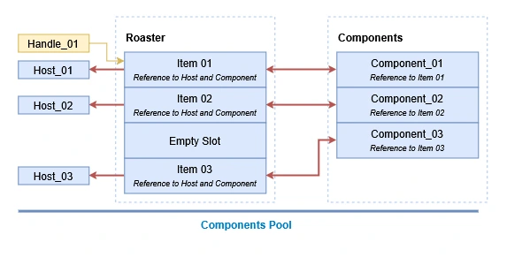
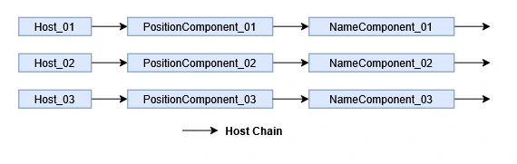
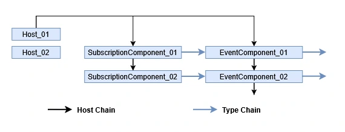
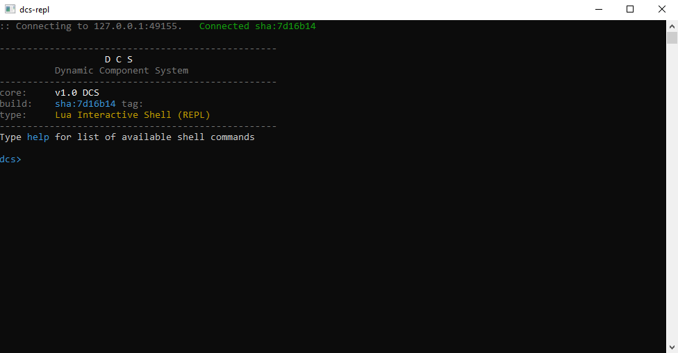
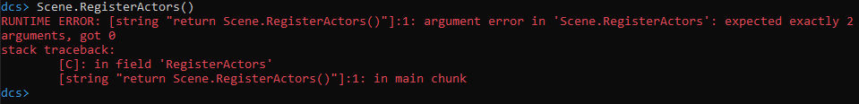

# Опыт построения data-oriented системы в Unity: где теория ломается о реальность

> Честный отчёт об эксперименте: динамическая компонентная система, Lua-интеграция и пространственные данные в Unity.

**Валерия Пудова (hww), 2026**

---

## Оглавление

1. [Введение](#1-введение-что-и-зачем)
2. [ECS: идея vs реальность](#2-ecs-идея-vs-реальность)
3. [Архитектура компонентной системы](#3-архитектура-компонентной-системы)
4. [Пространственные данные](#4-пространственные-данные)
5. [Authoring: сцена как метаданные](#5-authoring-сцена-как-метаданные)
6. [Lua: дирижёр, а не музыкант](#6-lua-дирижёр-а-не-музыкант)
7. [Data-oriented: когда нужна, когда вредна](#7-data-oriented-когда-нужна-когда-вредна)
8. [Про DCS и Lua](#8-про-dcs-и-lua)
9. [Заключение](#9-заключение)
10. [Дополнения](#10-дополнения)

---

### Раздел 1. Введение

Эта статья — не манифест и не учебник. Это отчёт об эксперименте.

Некоторое время назад мне стало интересно проверить одну идею: можно ли в Unity, на C#, построить динамическую компонентную систему — такую, какую использовала Insomniac в своих движках. Ту самую, где у одного объекта не один-два компонента, а много, где компоненты — это не только данные (позиция, скорость), но и сообщения между объектами. Ту, где всё — данные, и всё живёт в плоских массивах.

Зачем? Не ради производительности. Не потому, что «так модно». А потому, что это интересно — как идея. Хотелось понять: где теория сходится с реальностью, а где — ломается. Что даёт эта система на практике, а что отнимает.

Плюс к этому — второй эксперимент: Lua. Хотелось избавиться от цикла «правка → компиляция → рестарт» и получить интерактивное программирование прямо внутри запущенной игры.

Плюс третий — пространственные данные. Это часть, которая адаптирует Unity-сцену к data-oriented подходу: мёртвый мир из authoring-объектов компилируется в runtime-данные, а потом оживляется процессами.

Эти три вещи в статье идут вместе, потому что разделить их невозможно. Компонентная система требует Lua для параметров. Lua требует пространственных данных для ИИ. Пространственные данные требуют компонентной системы для runtime. Это один эксперимент, разложенный на три.

Цель статьи — честно рассказать, что получилось, что не получилось, и почему. Без «ECS — это будущее» и без «ECS — это тупик». Потому что ответ двоякий: для одних задач система необходима, для других — вредна. Где именно — об этом и поговорим.

---

### Раздел 2. ECS: идея vs реальность

Идея, которую хотелось проверить, была простой: у объекта нет фиксированного набора полей. У него есть набор компонентов, и этот набор можно менять на ходу. Один компонент — позиция. Другой — имя. Третий — событие «нанесён урон». Четвёртый — состояние ИИ. Пятый — ещё одно событие. Шестой — ещё. Компонентов может быть много, и они могут быть любые.

Каждый компонент — это struct. Не класс, не MonoBehaviour. Простая структура данных, лежащая в плоском массиве — пуле. Доступ к компоненту — через Handle: 16 бит на индекс в пуле, 16 бит на generation (защита от «висячих» ссылок). Системы обходят пулы линейно, читают компоненты, пишут компоненты. Никаких `GetComponent<T>`, никаких MonoBehaviour, никаких деревьев объектов.

Это сильно отличается от того, как Unity устроена из коробки. И это работает.

Что получилось хорошо.

Обход линейный. Компоненты лежат подряд в памяти. Когда система обрабатывает всех врагов с компонентом `HealthComponent`, она не ищет их по сцене — она идёт по массиву. Cache-friendly. Memory-efficient. Никаких аллокаций на каждый кадр.

Компоненты можно накидывать. Это, пожалуй, самое интересное. У объекта может быть несколько компонентов одного типа — например, три события «нанесён урон» за кадр. Или два `DamageSourceComponent` — от разных источников. В OOP-модели такое делают через списки внутри одного MonoBehaviour, что сложно и уродливо. Здесь — естественно.

И, наконец, та же система унифицированно доставляет сообщения. Событие — это такой же компонент, просто с флагом. Подписчик — тоже компонент. Доставка идёт по тем же пулам, тем же Handle. Нет отдельной системы событий — события часть компонентной модели.

Что не получилось хорошо.

Первая проблема — два способа доступа. В системе живут два типа Handle.

*Host Handle* — ссылка на объект. Это как «идентификатор игрового объекта». Через него можно спросить: «какие компоненты у этого объекта?» — и получить цепочку компонентов.

*Component Handle* — ссылка на конкретный компонент в конкретном пуле. Через него можно напрямую прочитать или записать данные.

Первое — для поиска. Второе — для работы. И то, и другое нужно. И это разрастается. Где-то система хочет «все объекты с компонентом X» — она идёт по пулу X, берёт каждый компонент, читает Host из Roster. Где-то система хочет «у этого объекта компонент X» — она идёт через HostChain, ищет по типу, получает Component Handle. Где-то оба способа нужны в одном месте, и код становится нетривиальным.

Ниже — иллюстрация. Это реальный код из системы, читающий input для движения:

```csharp
for (int i = 0; i < animPool.Partition; i++)
{
    ref var anim = ref animPool.Components[i];
    if (anim.PositionHandle.IsNull) continue;

    ref var pos = ref posPool.ResolveHandle(anim.PositionHandle);

    if (!anim.KeyboardInputHandle.IsNull)
    {
        ref var kb = ref kbPool.ResolveHandle(anim.KeyboardInputHandle);
        forward = kb.Forward;
        fire = kb.Fire;
    }
    // ...
}
```

Здесь три пула в одной функции: `AnimationStateComponent`, `PositionComponent`, `KeyboardInputComponent`. Между ними — Handle. Логика размазана по трём массивам. Работает быстро, но читается тяжело.

Вторая проблема — зависимости ломают cache-friendly.

Если компонент A зависит от компонента B, то A хранит Handle на B. Тогда система обходит пул A линейно, но при обработке каждого элемента прыгает в пул B — по Handle. Это не линейный обход. Cache теряется. Мы выиграли на одной оси (linear iteration) и проиграли на другой (random access к зависимостям).

Это не проблема конкретно этой системы. Это общая проблема data-oriented дизайна. Решается либо тем, что зависимость кладётся рядом с данными (тогда это уже не два компонента, а один), либо тем, что зависимости выносятся во внешние системы, которые обходят оба пула одновременно. Но красивого решения нет.

Третья проблема — C# не приспособлен для низкоуровневого программирования.

В C++ всё это выглядело бы естественно. Шаблоны, `std::variant`, отсутствие боксинга, `constexpr`, `entt`, `flecs`. В C# — приходится идти на компромиссы.

Главный компромисс — боксификация. В C# структура, приведённая к интерфейсу, упаковывается в heap-объект. Если у вас есть `struct AnimationStateComponent : IInitializable`, и вы пишете `if (comp is IInitializable init) init.Init(prius)` — компилятор создаёт копию в куче, вызывает `Init` на копии, и выбрасывает её. Изменения не сохраняются.

Это неочевидно. Это раздражает. Это заставляет искать обходные пути — generic constraints, `ref`-делегаты, `InitCallback` в пуле. Каждый обход — работает, но усложняет код.

Низкоуровневое программирование в C# — это испытание. Это не «просто C++ с другим синтаксисом». Это другой язык, другая модель памяти, другие правила. И когда ты пытаешься выйти за пределы, для которых C# проектировался, каждый шаг — борьба.

Что это значит.

Сама идея — правильная. Компоненты, пулы, Handle, линейный обход — работает. Memory-efficient, быстро, интересно. Но реализация в C# — со скрипом. Не потому, что C# плохой, а потому, что он не для этого. Он для другого — для удобства, для безопасности, для быстрой разработки. А низкоуровневая работа — не его сильная сторона.

Это не приговор. Это честное наблюдение. Если бы тот же эксперимент проводился на C++ — грабли были бы другими. Возможно, меньше. Возможно, больше. Но это — то, что получилось в Unity, на C#. Со своими компромиссами.

---

### Раздел 3. Архитектура компонентной системы

Прежде чем говорить о граблях и компромиссах, стоит объяснить, как эта система устроена внутри. Иначе разговор о «двух Handle», «цепочках» и «генерациях» останется словами без смысла. Этот раздел — про механику. Я постараюсь разложить её по атомам, чтобы читатель, никогда не видевший ECS, понял, что здесь происходит и почему это устроено именно так, а не иначе.

#### Пул компонентов

Начнём с основы. Компонент — это структура данных. Не класс, не MonoBehaviour. Простой `struct` с полями. У него есть только одно обязательное поле — `RosterIndex`, целое число. Всё остальное — то, что нужно конкретному компоненту. У `PositionComponent` — это `Vector3 Position` и `Quaternion Rotation`. У `NameComponent` — это `Name`. У `DamageEventComponent` — это `float Amount` и `Host Source`. Каждый компонент сам определяет свои поля.

```csharp
public struct PositionComponent : IComponent
{
    public int RosterIndex { get; set; }
    public Vector3 Position;
    public Quaternion Rotation;
}
```

Компоненты не живут сами по себе. Они лежат в пулах. Пул — это контейнер для компонентов одного типа. `PositionComponent` — один пул. `NameComponent` — другой. `DamageEventComponent` — третий. Пул владеет всеми экземплярами своего типа и управляет их жизненным циклом.

Пул устроен не так, как обычный массив. Если бы это был просто массив, то при удалении компонента из середины пришлось бы сдвигать все последующие — это дорого и плодит дырки. Вместо этого пул использует двухмассивную схему, которую часто называют sparse set.

Первый массив — плотный (dense). Это `Components[]`. В нём компоненты лежат подряд, без дырок. Если в пуле сто компонентов, они занимают индексы `0..99`. Никаких пропусков. Это критично для производительности: системы обходят этот массив линейно, и процессор предсказывает следующее обращение.

Второй массив — разреженный (sparse). Это `Roster[]`. В нём индексы фиксированы. Каждому компоненту при создании выдаётся постоянный номер в Roster — и этот номер не меняется никогда, пока компонент жив. Даже если компонент переместился в плотном массиве, его номер в Roster остался тем же.



Зачем это нужно? Затем, что ссылка на компонент должна быть стабильной. Если бы мы ссылались напрямую на индекс в плотном массиве, то при любом удалении другого компонента индекс мог бы сместиться — и все ссылки сломались бы. А через Roster — нет. Roster хранит текущее положение компонента в dense-массиве, и это положение обновляется, когда компонент перемещается.

Как происходит удаление? Очень просто. Если из dense-массива ста элементов нужно удалить, скажем, пятый, то мы берём последний (сотый), кладём его на место пятого, и уменьшаем размер массива на один. Компонент, который был последним, переехал на место удалённого. В Roster обновляется его `Index` — теперь он указывает на новое место. Всё. Никаких сдвигов. Одно перемещение. Практически бесплатно.

Roster, кроме индекса, хранит ещё две вещи. Первая — generation. Это число, которое увеличивается каждый раз, когда слот в Roster переиспользуется под новый компонент. Смысл — защита от висячих ссылок. Если у вас есть Handle на компонент, который уже удалён, generation в Handle не совпадёт с generation в Roster — и система поймёт, что ссылка устарела. Никаких «use after free», никаких обращений к освобождённой памяти.

Вторая — Host. Это ссылка на игровой объект, которому принадлежит компонент. Host — это тоже просто пара чисел (id + generation). Через Host можно спросить: «а какие ещё компоненты есть у этого объекта?» Об этом — чуть ниже.

#### Handle

Handle — это ссылка на компонент. Он выглядит просто: два 16-битных числа, упакованных в одно 32-битное. Первое — индекс в Roster. Второе — generation. Если generation не совпадает с тем, что сейчас в Roster, значит, ссылка устарела, и компонент больше не существует.

```csharp
public struct Handle
{
    public ushort Id;          // индекс в Roster
    public ushort Generation;  // защита от висячих ссылок
}
```

Handle** — это не указатель. Это номер. Если два Handle имеют одинаковые Id и Generation, они указывают на один и тот же компонент. Если Generation разный — на разные (или один из них устарел). Это делает Handle сериализуемым, копируемым, передаваемым по сети — и безопасным. Нельзя «случайно» обратиться к удалённому компоненту: система проверит generation и откажет.

Почему Handle указывает именно на Roster, а не на dense-массив? Потому что dense-массив перемещается. Компонент, который был на позиции 99, после удаления пятого переехал на позицию 4. Если бы Handle указывал напрямую на 99, он бы сломался. А через Roster — нет: Roster хранит текущее положение, и оно обновляется при каждом перемещении.

Это правильная архитектура. И она работает в любой ECS, не только в нашей.

#### Host

**Host** — это игровой объект. Точнее, это ссылка на игровой объект. Тоже пара чисел (id + generation), как и Handle. Но если Handle указывает на компонент, то Host указывает на объект, у которого компонентов может быть много.

Зачем Host нужен, если есть Handle? Потому что не всегда мы знаем, какой компонент нам нужен. Иногда нужно спросить: «а есть ли у этого объекта компонент X?» Или: «дай мне все компоненты этого объекта». Handle на компонент тут не поможет — он уже указывает на конкретный. Нужна другая ссылка, которая указывает на объект как на целое.

Host, как и Handle, защищён generation. Если Host «устарел» (объект был удалён, а id переиспользован), generation не совпадёт с тем, что в `HostManager`, и система поймёт, что ссылка невалидна.

`HostManager` — это центральный менеджер, который выдаёт Host'ы, хранит их generation, и связывает Host с MonoBehaviour (Actor). Actor — это сцена, Unity-объект. Host — это логика, ECS-объект. Связь — через weak GCHandle. Это позволяет системе, знающей Host, быстро достать реальный Unity-объект: `HostManager.GetActor(host)` вернёт либо Actor, либо null. Без поиска по сцене.

#### Две цепочки

Теперь — самое интересное. Есть два способа связать данные: по объекту и по типу.

**HostChain** — цепочка, связывающая Host со всеми его компонентами. У каждого Host есть голова — индекс первого `ChainNode` в общей цепочке. `ChainNode` хранит Handle на компонент и тип компонента. Узлы связаны через `Next`. Так один Host может иметь много компонентов, и все они найдены за линейный проход.

```csharp
public struct ChainNode
{
    public Handle Component;
    public int TypeId;
    public int Next;
}
```



**TypeChain** — цепочка другого рода. Она связывает тип сообщения со всеми подписками на этот тип. Когда система отправляет событие, она не ищет подписчиков по всей сцене. Она берёт голову цепочки для этого типа события — и проходит по ней. Все подписчики уже там.

Это унифицирует доставку сообщений. События — такие же компоненты, просто с флагом `IEvent`. Подписки — такие же компоненты, просто с полем `TargetEventTypeId`. Доставка — через ту же систему пулов и Handle. Никакой отдельной событийной машины. Всё внутри одной модели.

Две цепочки независимы. HostChain отвечает на вопрос: «какие компоненты у этого объекта?» TypeChain отвечает на вопрос: «кто подписан на этот тип события?» Одна про объект, другая про тип. Вместе они покрывают оба способа доступа к данным.



#### Домены

Всё это — пулы, цепочки, HostManager — объединено в один контейнер. Он называется Domain.

**Domain** — это пространство исполнения. У него свои пулы. Свои цепочки.  Свои компоненты, но общий HostManager. Домены не пересекаются. Компонент из одного домена не виден в другом. Handle из одного домена не валиден в другом.

Зачем несколько доменов? Затем, что разные части игры не должны мешать друг другу. Например, GUI — один домен. Сцена — другой. Сетевой слой — третий. У каждого своя логика, свои компоненты, свои события. Если смешать их в одном домене, любой баг в GUI сломает сцену. А разделив — мы изолируем проблемы.

В типичной игре доменов один-два. В больших — больше. Разделение — по смыслу, не по «модно». Если у вас одна сцена и одна логика — один домен. Если сцена, GUI и сеть независимы — три домена.


#### Два дополнительных реестра

Всё это — пулы, цепочки, домены — работает. Но есть две вещи, которые не были названы, а они важны для внешнего мира — в первую очередь для Lua.

Первая — DomainRegistry. Это реестр всех доменов в системе. У каждого домена есть имя и индекс. Домен с именем `"scene"` и домен с именем `"gui"` — это разные домены, у них разные индексы, разные данные. `DomainRegistry` позволяет найти домен по имени или по индексу. Зачем? Затем, что из Lua приходят вызовы с именем домена — «работай с доменом `scene`». Lua не знает внутренних индексов. Он знает имена. `DomainRegistry` превращает имя в ссылку на домен. Один lookup. Одна операция. Без поиска по всем доменам.

Вторая — ComponentRegistry. Это реестр всех типов компонентов. У каждого типа есть имя и уникальный идентификатор, который выдаётся один раз — при инициализации системы. `PositionComponent` — это тип с одним id. `NameComponent` — с другим. `DamageEventComponent` — с третьим. `ComponentRegistry` позволяет превратить имя типа в его id или в его пул. Или наоборот — id в имя (для отладки и Lua). Зачем? Затем, что системам нужно знать, с каким пулом работать. Хранить все пулы в одном месте, где каждый тип знает свой id. Когда Lua просит «создай компонент типа `DamageEvent`» — `ComponentRegistry` находит id и направляет вызов в правильный пул. Одна операция. Без рефлексии, без поиска по типу в рантайме.

Эти два реестра — мосты между именами и данными. Внутри системы имена не нужны — там числа. Но снаружи — в Lua, в редакторе, в логах — имена удобны. Реестры позволяют пользоваться именами, не платя за них внутри hot-path. `ComponentType<T>.Id` — это статическое поле, которое вычисляется один раз при запуске. Дальше — константа. Никаких поисков. Никакой рефлексии. Только число.

#### Как это всё вместе

Полная картина такая. Есть компоненты — структуры данных. Они лежат в пулах. Каждый компонент принадлежит какому-то Host. Связь Host ↔ компоненты — через HostChain. Компоненты особого вида (события) доставляются через TypeChain — это связь тип события ↔ подписки. Всё это вместе — внутри Domain. Domain — это контейнер, в котором живёт игра.

Когда система обрабатывает что-то, она не ищет объекты по сцене. Она обходит пул линейно. Для каждого компонента она знает Handle. Handle ведёт к данным. Данные — рядом, в плоском массиве. Процессор доволен.

Когда система отправляет событие, она не ищет подписчиков. Она берёт голову TypeChain для этого типа. Проходит по ней. Подписчики — там. Никаких поисков. Никаких аллокаций. Никаких `GetComponent`.

Когда система хочет достать Unity-объект по Host, она зовёт `HostManager.GetActor(host)`. Это одна операция. Weak ссылка. Быстро.

Это и есть та самая «data-oriented» модель, о которой столько говорят. Только без маркетинга. Конкретно: пулы, Handle, цепочки, домены. Понятно и работает.

---

### Раздел 4. Пространственные данные

Компонентная система — это основа. Но сама по себе она не отвечает на вопрос: как найти объект в мире? Как понять, что вот этот солдат — это конкретный солдат, а не другой? Как понять, что он типа «пехотинец», а не «танк»? Как понять, где он находится? На эти вопросы отвечает пространственный слой — следующий уровень над компонентами.

#### Три аспекта объекта

Для того чтобы работать с объектами эффективно, мы разделили их идентификацию на три независимых аспекта. Каждый аспект отвечает на один вопрос.

Имя отвечает на вопрос: *«кто ты конкретно?»*. Это уникальный идентификатор объекта. Он позволяет найти объект по имени, отличить его от других, сослаться на него в скрипте или в коде. «Jack» — это имя. «NorthGates» — тоже имя. Оно одно на объект, оно не меняется в течение жизни объекта, и через него можно всегда найти этот объект.

Архетип отвечает на вопрос: *«какого ты типа?»*. Это не уникальный идентификатор, а категория. Архетип говорит: «этот объект — пехотинец». Или «танк». Или «ворота». Или «камера». Через архетип можно найти все объекты этого типа. Можно назначить им общий код. Можно обрабатывать их одинаково. Архетип — это не про что объект, а про как с ним работать. И, что важно, архетип не обязан быть уникальным. Много солдат — один архетип.

Флаги отвечают на вопрос: *«как тебя исполнять?»*. Это не про объект. Это про систему, которая обрабатывает объект. Флаги принадлежат системам, а не объектам. Например, система физики имеет флаг «работать с коллайдерами». Система рендера имеет флаг «рисовать непрозрачное». Система ИИ имеет флаг «думать каждый кадр». Объект не имеет флагов — но система, обрабатывая объект, смотрит на его архетип и решает, касается ли её этот объект.

Это тонкое место, и оно принципиальное. В OOP-модели флаги были бы на объекте — например, `bool isVisible` или `bool isStatic`. В data-oriented модели флаги у системы — потому что решение о том, что делать с объектом, принимает система, а не объект. Объект не знает, что его рисуют или не рисуют. Это знает система рендера. И это правильно с точки зрения DOD: логика — у систем, данные — у объектов.

#### Как хранить имена и архетипы

Строки в рантайме — это дорого. Каждая строка — отдельная аллокация в heap. Сравнение строк — посимвольное. Копирование строк — медленное. И всё это — давление на сборщик мусора.

Поэтому строки в этой системе не хранятся как строки. Они свёртываются в 32-битное число через CRC32. Каждой строке соответствует ровно одно число. Сравнение строк становится сравнением чисел — одна операция. Хранение — четыре байта вместо нескольких десятков. Копирование — один `mov`.

Оригинальная строка не теряется. Она хранится в одном буфере — таблице интернирования — и в любой момент может быть восстановлена по числу. Это позволяет использовать число для внутренней логики, а строку — только для отладки и для Lua, где строки привычны.

Класс, который всё это делает, называется `Name`. Это обёртка над 32-битным числом. Не string. Не указатель. Число.

```csharp
public struct Name
{
    public uint Id;
    // ...
}
```

#### Идентификационные компоненты

На основе вышеизложенного — у нас имеется три основных компонента. 

**NameComponent** хранит имя объекта. Один объект — одно имя. Через этот компонент можно найти объект по имени. Или получить имя объекта для вывода, для сохранения, для Lua.

**ArchetypeComponent** хранит архетип объекта. Один объект — один архетип. Через этот компонент можно собрать все объекты одного типа. Или проверить, подходит ли объект под фильтр системы.

**PositionComponent** хранит положение объекта в мире. Позицию и поворот. Через этот компонент можно понять, где объект, и куда он смотрит.

```csharp
public struct NameComponent : IComponent
{
    public int RosterIndex { get; set; }
    public Name Name;
}

public struct ArchetypeComponent : IComponent
{
    public int RosterIndex { get; set; }
    public Name Archetype;
}

public struct PositionComponent : IComponent
{
    public int RosterIndex { get; set; }
    public Vector3 Position;
    public Quaternion Rotation;
}
```

Эти три компонента — основа пространственных данных. Из них состоит идентичность объекта: имя говорит *кто*, архетип говорит *что*, позиция говорит *где*. Всё остальное — надстройка.

#### Индексы

Три компонента есть — но как по ним искать? Если у нас десять тысяч объектов, и мы хотим найти всех солдат — мы не можем обойти все десять тысяч и проверить каждого. Это слишком медленно.

Для этого строятся индексы. Индекс — это структура, которая заранее группирует объекты по общему признаку. Не проверяет — а уже знает. Потому что объекты в него были добавлены один раз, при создании.

Мы строим три индекса.

**NameIndex** — от имени к объекту. Если нужно найти «Солдат Иван» — индекс сразу говорит, какой это Host. Никаких обходов. Один lookup.

**ArchetypeIndex** — от архетипа к списку объектов. Если нужно найти всех солдат — индекс сразу даёт список. Потом можно обойти только их — а не все десять тысяч.

**FlagsIndex** — опциональный контейнер поиска от флага к списку объектов. Если нужно найти все объекты с флагом «статический» — индекс даёт список. Тот же принцип.

Индекс — это не магия. Это всего лишь структура, которая содержит уже сгруппированные данные. Она дороже по памяти — нужно хранить списки. Но она дешевле по CPU — поиск занимает константное время, а не линейное. Trade-off, как всегда.

#### SpatialDomain

Все три индекса — плюс три пула — живут вместе, в отдельном домене. Он называется SpatialDomain.

**SpatialDomain** — это надстройка над компонентной системой. Он не заменяет её. Он использует её. Имя, архетип и позиция — такие же компоненты, как и любые другие. Они лежат в таких же пулах. Но доступ к ним оптимизирован через индексы, которые сразу знают, кто где.

Зачем отдельный домен, а не просто ещё пулы в общем? Затем, что пространственные данные не нужны всем системам. GUI не нуждается в поиске объектов по имени. Сеть не нуждается в архетипах. Пространство нужно тем, кто работает с миром — AI, физика, триггеры, спавнеры. Разделив пространство от остального, мы изолируем его ответственность.

#### DynamicSpatial

Отдельно внутри SpatialDomain живёт DynamicSpatial.

Он отвечает только за динамические объекты — те, которые двигаются. Те, чья позиция меняется каждый кадр. Солдат, машина, пуля, снаряд. Их не так много — десятки, сотни. Но их положение постоянно меняется — и искать их через статичный индекс неудобно.

DynamicSpatial устроен по-другому. Это пространственный map — сетка, разбитая на ячейки. Каждый объект лежит в той ячейке, где сейчас находится. Когда он двигается — он переезжает из ячейки в ячейку. Поиск «все объекты рядом с точкой X» становится поиском по нескольким ячейкам, а не по всему миру.

Это не замена индексам. Это дополнение. Статические объекты — через индексы. Динамические — через DynamicSpatial. Каждый — там, где удобнее.

#### Как всё вместе

Полная картина такая. Есть компоненты. Есть три специальных компонента — Name, Archetype, Position — которые описывают объект в мире. Есть индексы, которые знают, где кто находится. Есть SpatialDomain, который содержит всё это. И есть DynamicSpatial — внутри — для тех, кто двигается.

Когда системе нужно найти объект по имени — она зовёт NameIndex. По архетипу — ArchetypeIndex. По флагу — FlagsIndex. Когда нужно все объекты рядом — DynamicSpatial. Никаких `GameObject.Find`. Никаких обходов всей сцены. Никаких поисков по иерархии. Только прямой доступ к уже известным данным.

Это и есть пространственные данные. Простые в основе, сложные в деталях. Работают быстро, стоят памяти. И освобождают программиста от рутины поиска.

---

### Раздел 5. Authoring: сцена как метаданные

До этого мы говорили о том, как система устроена. Теперь — о том, откуда она берёт данные.

#### Мёртвый мир

Ключевая идея в том, что мир изначально мёртв. Мы не создаём его в рантайме. Мы загружаем его уже готовым — как данные. В этом мёртвом мире живут акторы, но они не работают. Это заготовки, описания, метаданные. Они ждут, когда их оживят.

Актор — это не любой объект сцены. Это особый объект, унаследованный от специального класса `BaseActor`. Все остальные объекты сцены — декорации, их никто не видит. Система работает только с акторами. Всё остальное — игнорируется на уровне данных. Это сильно упрощает жизнь: не нужно разбираться с тем, что не является частью игровой логики.

#### Что есть у актора

У любого актора есть положение в мире — позиция, поворот, масштаб. Это минимум.

Дальше — в зависимости от конкретного актора — он может иметь свои поля. Пространственная форма: `ShapeBox`, `ShapeSphere`, `ShapeCylinder`, `ShapeBorder` — если актор описывает какую-то область в мире. Спаунер — если актор создаёт других. `Encounter` — если актор объединяет в себе целую боевую сцену, участок мира, зону с логикой.

И есть самый простой актор — `Locator`. У него только имя и положение. Ничего больше. Он не описывает форму. Не создаёт объектов. Не управляет зоной. Просто точка с именем. Иногда это всё, что нужно — поставить метку в мире, к которой привяжется потом логика из Lua.

#### Общий язык для сложных акторов

Все сложные акторы имеют обобщённый способ читать и писать свои поля. Это важно. Неважно, спаунер это или энкаунтер, регион или шейп — любой из них умеет принимать запрос «прочитай поле X» и отвечать. И умеет принимать запрос «запиши в поле X значение Y». Это унифицирует работу с ними из скриптов. Lua не должен знать, что у спаунера есть свои поля, а у энкаунтера — свои. Он говорит «прочитай поле `prefabPath`» — и получает ответ. Спаунер знает, как ответить. Энкаунтер знает, как ответить. Это полиморфизм, но без наследования классов — через общий интерфейс.

Многие из этих акторов могут ссылаться на код в Lua. Это ещё один слой гибкости: автор сцены может написать в инспекторе «при активации этого объекта вызвать модуль `encounters.village` и функцию `on_activate`» — и система вызовет. Без компиляции C#, без пересборки проекта. Только текст в инспекторе.

#### Факты

Наконец, у акторов есть динамическая таблица аргументов. Она называется Facts. Это свободная структура «ключ — значение», где значения — простые типы: числа, строки, векторы, цвета. Facts не имеют фиксированной схемы. Каждый автор может завести свои ключи, свои значения. Никто не проверяет, что `health` — это `int`, а не `string`. Это ответственность автора.

Зачем это нужно? Затем, что гейм-дизайнер не программист. Он не хочет писать C#-класс для каждого объекта в сцене. Он хочет сказать: «у этого бочонка `health = 50`, `explodes = true`, `loot = \"coins\"`». Без компиляции, без пересборки, без ожидания программиста. Facts — это инструмент для гейм-дизайнеров. Он отвязывает их от программистов. Каждый работает в своей зоне: программист — на уровне систем, гейм-дизайнер — на уровне данных сцены.

#### Компиляция в ассеты

Все эти данные — акторы, поля, факты — сохраняются в специальные ассеты. Через отдельные инструменты редактора. Ассет — это не сцена. Это набор запечённых данных: список акторов, их поля, их факты, их пространственные формы. Всё, что нужно для загрузки мира в рантайме.

Ассеты можно загружать несколько одновременно. Это позволяет работать с несколькими сценами сразу. Например, основная сцена и отдельная сцена для интерьера. Или сцена и отдельная сцена для сетевой игры. Каждая — свой ассет. Загружаются вместе, работают независимо.

Наконец, есть визуализатор этих запечённых данных. Он показывает, что внутри ассета — какие акторы, где, с какими полями, с какими фактами. Это инструмент отладки: загрузил ассет, посмотрел, что реально внутри, убедился, что всё правильно запечено.

#### Факты и пространственные данные — где копировать

Здесь есть нерешённый вопрос, о котором честно стоит сказать.

Когда ассет загружается в рантайме, его факты нужно где-то хранить. Два варианта. Первый — копировать факты в пространственные данные. Второй — не копировать, а смотреть их через объект сцены, когда нужно.

Оба варианта имеют плюсы и минусы. Если копировать — пространственные данные отвязываются от реального мира. `GameObject.Find` не нужен. Никаких ссылок на Unity-объекты. Всё внутри данных. Если не копировать — экономим память, но каждый доступ к факту требует идти в объект сцены, а это дороже и сложнее.

В нашем проекте факты копируются. Это не значит, что это единственно правильный выбор. Просто так было сделано. И в целом — копирование ничего плохого не имеет. Зато отвязка от Unity-объектов даёт гибкость: пространственные данные знают всё, что им нужно, сами. Не зависят от сцены. И если понадобится сохранить состояние мира — сохранят без проблем.

С другой стороны, можно посмотреть и иначе. Факты — это инструмент гейм-дизайнера. У него всегда есть способ преобразовать хост в объект сцены. А из объекта — достать факты. Тогда хранить их в пространственных данных не обязательно. Достаточно хранить только то, что нужно для ориентации в мире — имя, архетип, позицию, форму. А факты — смотреть через объект, когда понадобится.

Мы выбрали копирование. Но это не окончательный ответ. Это открытый вопрос, который стоит ещё проверить на практике.

---

### Раздел 6. Lua: дирижёр, а не музыкант

Когда мы говорим о Lua в этом проекте, важно понимать одну вещь: Lua здесь — не язык программирования. Lua здесь — язык описания. Дирижёр, а не музыкант. Он не играет партии сам. Он указывает, кто и когда играет. Он занимается логикой верхнего уровня — сценарием игры. Он не создаёт объекты, не выделяет память, не связывает компоненты. Он говорит: «в этой точке появись солдат, у него будет такое-то имя, он пойдёт туда». Всё остальное — делает C#.

Это принципиальное решение. Оно идёт вразрез с тем, как Lua обычно используют в игровой индустрии. В большинстве проектов Lua — мощный язык, на котором пишут половину игры. У нас — не так. У нас Lua — тонкая прослойка. Сознательно тонкая.

#### Почему тонкая

Причина простая. Lua — это инструмент гейм-дизайнера, а не программиста. Гейм-дизайнер хочет сказать: «здесь будет деревня, в ней живут крестьяне, они работают днём и спят ночью». Он не хочет создавать `prefab`, инстанцировать его, выделять Host, добавлять компоненты, связывать их с Unity-объектом, инициализировать системы. Всё это — программистская работа. Она должна быть в C#. И она есть в C# — в фабриках и системах.

Lua лишь вызывает эти фабрики. Один вызов: `Soldier.Spawn(prefabPath, name, x, y, z)`. Всё. Внутри — C# делает всё, что нужно. Lua не знает, что там внутри. Ему не нужно знать. Это не его ответственность.

Тонкий интерфейс — это не компромисс. Это осознанный дизайн. Если бы Lua знал про компоненты, про Handle, про `Animator`, — API между Lua и C# разросся бы до сотен функций. Каждый компонент — новая функция. Каждое поле — новая функция. Маршалинг — каждый тип. Это то, что мы наблюдали в процессе разработки. И это то, от чего мы сознательно ушли.

#### Удалённая консоль

Второй аспект, который занял много времени, — это удалённая консоль. Идея была такая: пока игра работает — хочется общаться с ней напрямую. Писать код, проверять его в моменте, менять поведение без перезапуска. Это то, что называется REPL — read-eval-print loop.

Проблема в том, что Unity не даёт такой возможности из коробки. Нет встроенного REPL. Нет способа писать C# и сразу видеть результат. Можно пересобирать проект каждый раз — но это долго и неудобно. Особенно когда игра уже запущена.

Мы сделали свою консоль. Она подключается к игре по HTTP. Снаружи. Отдельная программа. Отдельный процесс. Игра слушает порт. Консоль отправляет команды. Игра выполняет их в Lua-состоянии. Ответ возвращается обратно. Всё это работает, пока игра запущена. Никаких перезапусков. Никаких пересборок.



Это одна из немногих вещей, которые оправдывают наличие Lua в проекте. C# не даёт такого из коробки. Lua даёт — потому что его состояние можно менять на ходу. Но это — не про скорость и не про выразительность. Это про интерактивность. Про ощущение живого диалога с игрой.

#### Ошибки, которые говорят

Третий аспект — ошибки. Когда что-то идёт не так в Lua — ошибка должна быть полезной. Не «nil value», а «поле `position` не найдено у объекта `Soldier_131077_1`, потому что он не был заспавнен». Не «stack overflow», а «вызов `Vector3.New` из `soldier.lua:47` привёл к переполнению стека в `Vector3.__add`».

Мы сделали специальную систему ошибок. Она перехватывает ошибки в Lua на границе с C#, обогащает их контекстом — стек, имена, значения — и отправляет их и в Unity-лог, и в удалённую консоль. Если вы работаете через консоль — вы видите ошибку сразу. Если нет — она в Unity-логе, как обычно.



Это не rocket science. Это мелочи, которые делают работу приятной. Без них — Lua превращается в чёрный ящик, в котором ничего не понятно.

#### Валидатор аргументов

Четвёртый аспект — валидация аргументов. Когда Lua вызывает C#-функцию, все аргументы приходят как `object`. Тип не проверяется автоматически. `float` может оказаться `string`. `Host` может оказаться `nil`. И функция упадёт где-то в середине, не понимая, что именно пошло не так.

Мы сделали специальную прослойку — `ArgReader`. Она позволяет функции сказать системе: «мне нужны ровно три аргумента, первый — integer, второй — string, третий — Vector3». И система проверяет. Если не соответствует — сразу ошибка с понятным сообщением. Обязательные и необязательные аргументы. Значения по умолчанию. Диапазоны. Всё, что нужно, чтобы функции не падали случайно.

Это стандартная практика в любой интеграции скриптов в C#. Без неё — отладка превращается в ад. С ней — ошибки находятся сразу и понятно.

### Векторы и кватернионы

Отдельная история — векторы. И кватернионы. В C# Vector3 — это простая структура из трёх чисел. В Lua — не структура. У Lua нет структур. Только таблицы, числа, строки, функции, userdata. И всё.

Можно было сделать Vector3 таблицей с полями x, y, z. Можно было сделать функцией с метатаблицей. Можно было передавать три числа отдельно. Можно было хранить вектор в пуле и передавать только индекс.

Мы попробовали несколько вариантов. Остановились на userdata. Vector3 и Quaternion — это userdata с прямыми полями внутри. Двенадцать байт для вектора, шестнадцать для кватерниона. Никаких дополнительных аллокаций. Никаких ссылок на пул. Никаких трёх чисел подряд.

Это не самый эффективный способ. Это не самый красивый способ. Это не самый гибкий способ. Но — самый простой. И самый агностический. Userdata работает всегда, везде, одинаково. Он не требует специальной поддержки на стороне C#. Он не требует специальной логики на стороне Lua. Он просто есть. Как число. Как строка. Как таблица.

Мы сравнили с другими вариантами. Каждый из них имел свои плюсы и свои минусы. И каждый из них требовал компромисса. Userdata тоже требует компромисса — но меньшего, чем остальные. И это решило дело.

Vector3 в Lua выглядит так же, как в C#. У него есть поля x, y, z. С ним можно складывать через +. Вычитать через -. Умножать на число. Он работает естественно. Как будто он родной для Lua. А внутри — userdata. Двенадцать байт. Просто. Понятно. Без сюрпризов.

#### Конечные автоматы

И пятый аспект, самый, пожалуй, интересный. Мы сделали компактную библиотеку конечных автоматов для Lua. Идея простая: есть объект в игре, у него есть состояние — «стоит», «бежит», «стреляет». Каждое состояние — своя логика. Свои делегаты: что делать при обновлении, что делать при получении сообщения, что делать при проверке наличия сообщения.

Эта библиотека позволяет описать все состояния на Lua одним файлом. Не раздувая C#. Не плодя классы. Компактно, читаемо, гибко. Гейм-дизайнер сам пишет: «в состоянии `guard` солдат поворачивается на 90 градусов, если слышит выстрел». Программист не участвует. Только Lua. Только данные.

И это, пожалуй, всё, что стоит сказать про Lua. Он работает, он полезен, но он не универсален. Он не язык программирования в нашем проекте. Он язык описания. Дирижёр. И это — не компромисс. Это осознанный выбор.

---

### Раздел 7. Data-oriented: когда нужна, когда вредна

Есть одна мысль, которую я хочу донести чётко. Data-oriented программирование — не универсальная истина. Это инструмент. И как любой инструмент — он нужен тогда, когда действительно нужен. И вреден, когда не нужен.

Что значит «действительно нужен»? Это значит: у вас тысячи объектов на экране одновременно, и логика этих объектов простая и однородная. Пять тысяч юнитов в RTS. Десять тысяч пуль в shooter'е. Сто тысяч частиц в симуляции. Вот здесь DOD выигрывает. Потому что может обрабатывать их линейно, плотно, параллельно, без потерь на абстракции.

А что значит «не нужен»? Это значит: у вас сто объектов на экране или меньше. Это значит: у каждого объекта — своя сложная логика, свои переходы состояний, свои взаимодействия с другими. Вот здесь DOD проигрывает. Потому что усложняет программирование, требует дисциплины, заставляет думать о данных, а не о логике.

И это не теоретический вывод. Это вывод из практики. Я построила эту систему. Я провела её через десять итераций. И я вижу, где она работает хорошо, а где — плохо. Она не плохая. Она просто не для всех задач.

#### Про PS5 и PC

Отдельно стоит сказать про платформы. На PlayStation 5 и подобных консолях есть особенность: сопроцессоры работают в небольшом объёме памяти. Это значит, что данные должны быть компактными, плотными, без мусора. DOD — идеально подходит для этого. Он не создаёт мусор. Он не тратит память на абстракции. Он работает с тем, что есть.

На PC — картина другая. Архитектура гораздо более производительная. Кеши большие. Памяти много. Мусор — не такая проблема. И здесь DOD теряет своё преимущество. Его сложность остаётся, а выигрыш — нет.

#### Ratchet & Clank как «обманка»

Есть один пример, который стоит разобрать. Ratchet & Clank. Игра выглядит так, будто там много всего происходит. Много врагов, много эффектов, много движущихся объектов. Кажется, что без DOD не обойтись.

Но это не так. Если посмотреть внимательно — на экране не так много объектов. Десятки, не сотни. Сотни, не тысячи. Логика у каждого — своя, сложная, уникальная. И здесь DOD не даёт ничего. Классический OOP подходит лучше. И игра сделана на OOP. Несмотря на то, что выглядит масштабно.

Это важный урок. Визуальное впечатление обманчиво. Игра выглядит сложной, но с точки зрения процессора — она простая. И это значит, что DOD здесь не нужен. И это не плохо. Это правильно.
Совет

Если вы делаете игру на PC, и у вас не тысячи объектов на экране — DOD не нужен. Он усложнит разработку. Он заставит думать о данных, а не о логике. И выигрыша вы не увидите. Задумайтесь лучше о том, как уменьшить количество объектов на экране. Иногда это возможно. Иногда — нет. И если нет — DOTS. Если да — OOP.

### Раздел 8. Про DCS и Lua

Два эксперимента закончились. Пора подвести итоги.

#### DCS: динамическая компонентная система

Компонентная система в том виде, в котором мы её сделали, — работает. Она решает свои задачи. Она memory-efficient. Она cache-friendly. Она унифицирует не только компоненты, но и доставку сообщений. Она дружелюбна к параллельным потокам и к Burst-компилятору.

Но — она не так эффективна, как Leo ECS или DOTS. Потому что C# — не C++. Потому что отсутствие наследования структур, managed-ссылки — всё это мешает. Мы шли на компромиссы на каждом шагу. И это оставило след на производительности и на сложности кода.

Это не значит, что идея плохая. Идея — хорошая. Реализация — на столько, на сколько позволяет C#. Если бы мы делали на C++ — было бы лучше. Но мы делали на C#. И получили то, что получили.

Главное преимущество нашей системы — унификация. Не только компоненты, но и сообщения. Не только данные, но и доставка. Всё в одной модели. И это — уникально. Это то, что я хотела получить. И это работает.

#### Lua: положительный, но с оговоркой

Опыт с Lua — положительный. Скажу честно. Мы сделали REPL, валидацию аргументов, систему ошибок, конечные автоматы, userdata-векторы. Всё это работает. И работает хорошо.

Но — есть оговорка. И эта оговорка — важная.

Lua имеет смысл только для команд больше пяти человек. Когда у вас несколько гейм-дизайнеров и несколько программистов. Когда у вас разделение труда. Когда гейм-дизайнер хочет писать логику без компиляции. Когда программист хочет не отвлекаться на постоянные правки.

Для маленькой команды — пять человек или меньше — Lua начинает играть негативную роль. Разделение кода на два домена — C# и Lua — создаёт дополнительную нагрузку. Каждое изменение нужно согласовывать. Каждая функция нужна в двух местах. API разрастается. Появляется слой, который никто не хотел. И это — проблема.

#### Что важно отметить

Опыт показал одну вещь, которая важна для всех. Концепцию можно развивать и использовать внутри любой парадигмы. OOP не отменяет data-oriented мышления. DOD не отменяет OOP. Lua не отменяет C#. Они могут сосуществовать. И это — не компромисс. Это правильный дизайн.

Если вы делаете игру и думаете: «может быть, мне нужна компонентная система?» — сначала спросите себя: сколько у меня объектов на экране? Какая у них логика? Есть ли смысл усложнять ради производительности, которую я не увижу?

Если вы думаете: «может быть, мне нужен Lua?» — сначала спросите себя: сколько человек в команде? Есть ли разделение на программистов и гейм-дизайнеров? Готовы ли вы нести дополнительную сложность?

Честные ответы на эти вопросы — важнее, чем мода, чем «так делают все», чем «это будущее».

### Раздел 9. Заключение

#### Что осталось непонятным?

Многое. Authoring-система не протестирована. Пространственные данные не прогнаны на больших сценах. DCS не сравнена напрямую с DOTS или Leo ECS на одних и тех же задачах. Lua не проверена на командах разного размера. Это — честно. Я не утверждаю, что знаю истину. Я делюсь тем, что видела.

#### Что стоит попробовать?

Первое — вытащить пространственные данные и запустить новый проект на их базе. Это правильный путь. Здесь нет разочарований. Архитектура хорошая, работает, её можно развивать.

Второе — не повторять ошибок с Lua на маленьких командах. Если команда до пяти человек — не нужен Lua. C# справится. Hot-reload можно получить и без Lua — через Assembly Reload, через правильные практики. REPL — можно сделать на Roslyn, если очень хочется.

Третье — не бояться смешивать парадигмы. DOD в OOP — это нормально. Компоненты в MonoBehaviour — это нормально. Lua в C# — если оправдано. Никакой парадигмы не существует в чистом виде. Всё — смесь. И это — не компромисс. Это реальность.

#### О чем была эта статья

Я потратила достаточно много ресурса на эту систему. На проработку, на обдумывание, на принятие решений, на переделывание, на тестирование. Это было интересно. И это было долго.

Я решила поделиться этим опытом для того, чтобы, если у вас есть свои идеи, вам не пришлось проходить тот же путь. Не пришлось тратить время на те же грабли. Чтобы вы могли подчеркнуть этот опыт уже готовым — сделать собственные выводы, поставить собственные эксперименты, получить ещё более впечатляющий результат.

> Спасибо всем, кто участвовал в обсуждении и помогал с кодом. Без вас этот эксперимент не состоялся бы.

---

## Дополнения

Дополнительный материал после публикации статьи.

---

### A. Ревизия пула компонентов

Интерфейс `IComponent` сохранён как пустой маркер для отсечения в маршалинге. `RosterItem` уменьшен с 16 до 8 байт: убрано поле `Host` (хранится в самом компоненте), поля приведены к `ushort` (`Index`, `Generation`, `Next`, `Prev`). Порядок плотного массива теперь поддерживается интрузивным двусвязным `used-list` поверх `RosterItem` (`Head`/`Tail` в `RosterLink`), что позволяет `Swap-Back` определять последний слот через `_usedList.Tail` **без чтения `RosterIndex` из компонента** — именно это делает `IComponent` необязательным. `Free-list` остался односвязным через `Next`. `DeliverDirect` переведён на статический делегат-мост `IMessageReceiver` (без боксинга и `is`-проверки в `hot-path`). Публичный API пула сохранён; чтения `Roster[..].Host` заменены на доступ к `Host` в компоненте или через `TryGetHost`.

**В результате:**

- сократился объём памяти под `Roster` и компоненты;
- приведение `Component → Host` заметно ускорилось.

---