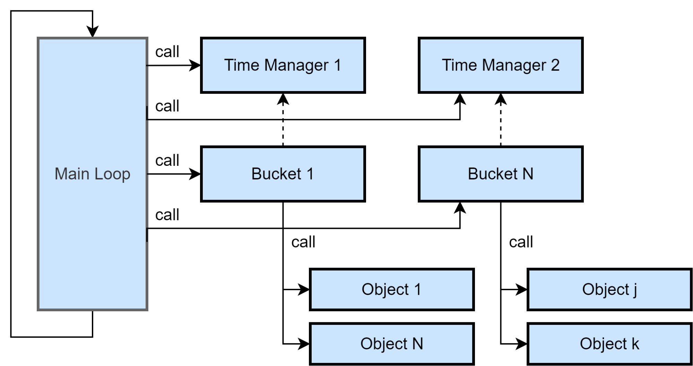
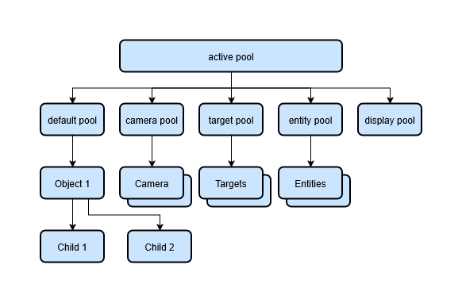
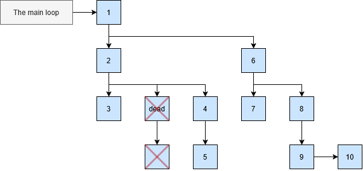
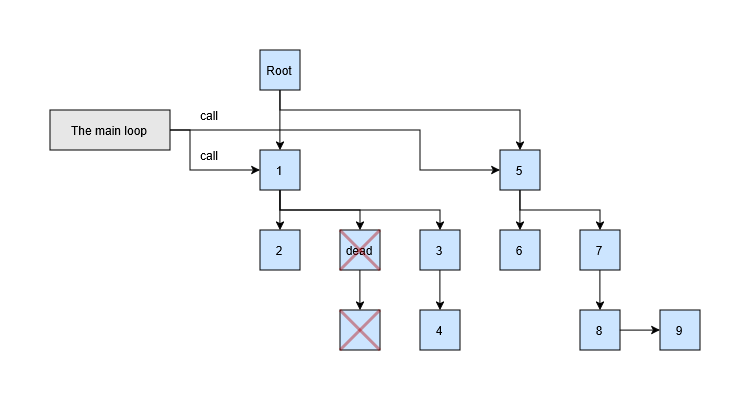
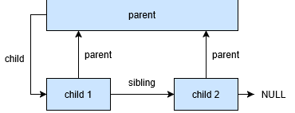
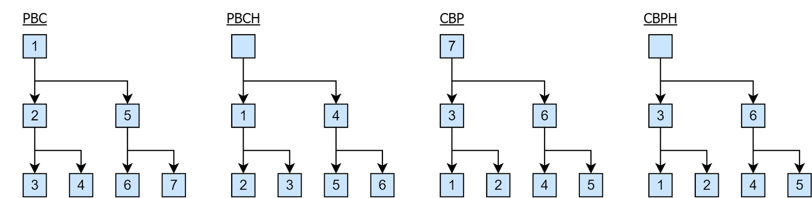
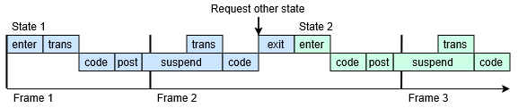

# Архитектура детерминированного игрового рантайма: Иерархия процессов, Бакализация и Жизненный цикл состояний в стиле OpenGOAL

## Введение: Иллюзия контроля в современных движках

Большинство современных игровых движков, включая Unity, предлагают компонентно-ориентированный подход, где визуальное представление объекта жестко связано с его логикой. Однако за удобство редактора приходится платить тремя фундаментальными проблемами:

   1. Недетерминизм вызовов: Порядок выполнения стандартных обновлений (Update) между сотнями объектов не гарантирован, что делает рантайм непредсказуемым.
   2. Размытый жизненный цикл: Родные менеджеры потоков и корутин работают как «черный ящик». Вы не можете развернуть время вспять, заморозить изолированную группу задач или предсказать точный кадр переключения логики.
   3. Связанность с визуальной сценой: Иерархия объектов в коде вынуждена повторять физическую структуру сцены.

Главный тезис этой архитектуры: Дерево логических процессов не обязано и не должно совпадать с деревом визуальной сцены.

Для достижения 100% детерминизма исполнения, lock-step синхронизации или реализации честной системы реплеев логический рантайм должен быть полностью изолирован. Мы изолируем его в виде кастомного диспетчера процессов, вдохновленного идеями движков серий Crash Bandicoot и Jak and Daxter (компиляторная среда GOAL/OpenGOAL), где каждый игровой элемент — это предсказуемый микропроцесс со строго контролируемым жизненным циклом

------------------------------

## Глава 1. Макроархитектура: Плоские бакеты против Иерархических деревьев

При проектировании изолированного рантайма разработчик сталкивается с выбором структуры хранения активных задач: плоские бакеты (группы) или иерархическое дерево.
На первый взгляд это противоположные подходы, но в реальности иерархическая система процессов является генерализацией (супермножеством) плоской бакетной системы. Иерархическая система позволяет создавать объекты иерархии, которые объединяют в себе то, что внутри является бакетом.


*Вариант А: Плоская бакетная система (Flat Buckets)*


*Вариант Б: Иерархическая система процессов (генерализованные бакеты)*

### 1.1 Сравнительный анализ подходов через призму детерминизма

| Критерий | Плоские бакеты (Flat Buckets) | Иерархическое дерево процессов (ProcessTree) |
| --- | --- | --- |
| Суть структуры | Массив или плоский список объектов, разбитый по фазам (AI, Physics, UI). | Граф (дерево), где узел хранит ссылки на parent, child и brother. |
| Контроль порядка | Идеальный детерминизм внутри одного бакета (строго по индексу массива). | Детерминизм определяется строгим алгоритмом обхода дерева (например, DFS — Parents Before Children). |
| Связи объектов | Объекты изолированы. Логические связи (кто чей спутник/оружие) приходится хранить в виде внешних ID. | Логические связи заложены в саму структуру рантайма. Оружие — это дочерний процесс персонажа. |
| Дистрибуция событий | Каждому объекту сообщение шлется напрямую или через глобальный бродкаст. | Направленная дистрибуция. Сообщение спускается по ветке иерархии процессов. |
| Управление ресурсами | При удалении родителя нужно вручную итерировать и зачищать списки зависимых объектов в бакетах. | Каскадное отсечение. Если родитель переходит в статус dead, вся его дочерняя ветка мгновенно исключается из рантайма. |

Иерархическая система позволяет использовать корневые или промежуточные узлы дерева в качестве изолированных бакетов (например, выделить ветки default pool, camera pool, target pool, entity pool, display pool).


*Вариант A: Исполнение корневого процесса*


*Вариант B: Прямое исполнение дочерних эдементов*

При этом каждый бакет (или поддерево) получает возможность работать изолированно. Дерево процессов может доставлять сообщения по иерархии, искать объекты по иерархии, но это будет именно управляемая иерархия процессов, а не иерархия визуальных схем сцены

### 1.2 Реализация компактного дерева: Структура из трех указателей

Классическое представление иерархии через списки дочерних элементов (например, List<Process> children) не подходит для детерминированного Zero GC рантайма. Динамические списки неизбежно порождают скрытые аллокации памяти в куче при изменении структуры дерева, а также размывают кэш процессора, распределяя узлы по разным адресам.
Элегантным низкоуровневым решением этой проблемы является организация структуры дерева процессов всего на трех фиксированных указателях (ссылках) внутри каждого объекта ProcessTree:

* parent — прямая ссылка на родительский узел верхнего уровня.
* child — ссылка на первого (старшего) ребенка в локальной группе.
* sibling (или brother) — ссылка на следующий соседний узел (брата) того же уровня.



### 1.3 Технические преимущества подхода

   1. Фиксированный размер памяти: Каждый узел весит строго одинаково. Структура дерева полностью статична с точки зрения выделения памяти, что исключает фрагментацию кучи при добавлении или удалении сотен объектов в кадре.
   2. Эффективность обхода: Алгоритмы детерминированной итерации (такие как DFS — обход в глубину) реализуются в виде простых циклов while, которые последовательно переходят по ссылкам child и sibling. Это работает на максимальной скорости CPU без создания промежуточных итераторов и накладных расходов.

------------------------------

## Глава 2. Анатомия детерминированного обхода: Правила итерации

Чтобы обход дерева процессов был строго детерминированным и не порождал сайд-эффектов (когда объект, обновленный раньше, меняет состояние объекта, обновляемого позже, непредсказуемым образом), рантайм использует фиксированные типы обхода на базе функций высшего порядка.

### 2.1 Основные паттерны обхода

* PBC (Parents Before Children): Сначала выполняется функция для процесса, а затем для всех его детей. Выполнение терминируется, если процесс возвращает ошибку ErrorCode.InvalidReturn. Если родитель в текущем кадре переходит в статус dead, рантайм мгновенно прекращает спуск по его ветке, гарантируя, что «осиротевшие» объекты не выполнят логику в полуразрушенном состоянии.
* PBCH (Parents Before Children Ignore Top): Пропускает топовый процесс дерева, выполняя обход PBC для всех дочерних поддеревьев.
* CBP (Children Before Parents): Сначала функция выполняется для всех детей, и только затем для самого родительского процесса.
* CBPH (Children Before Parents Ignore Top): Обход CBP с игнорированием корневого узла.

Процесс выполнения дерева может идти строго последовательно от родительских узлов к дочерним группами (букетами).



При необходимости главный цикл может эксклюзивно выполнять определенные изолированные узлы, чтобы более точно контролировать порядок вызовов на макроуровне.
[Вставить Рисунок: figure13_updating_the_process_tree]

### 2.2. Битовые маски процессов: Многократный обход и контекстная фильтрация

Дерево процессов в рамках одного кадра может обходиться рантаймом не один, а несколько раз — в зависимости от текущей системной задачи или фазы игрового цикла. Каждая итерация запускается под конкретное глобальное событие:

* Основное обновление логики (Update-loop).
* Физический шаг дискретизации времени (FixedUpdate-loop).
* Позднее обновление анимаций и камер (PostUpdate-loop).
* Системные сквозные операции (например, каскадный сбор данных для создания детерминированного с Snapshot'а сохранения игры).

При многократном обходе рантайм обязан мгновенно отсекать узлы, которые не должны реагировать на текущее событие. Для этого у каждого процесса Process есть маска процесса (Process Mask) — 32- или 64-битное поле, где каждый бит кодирует определенные свойства, назначение или тайм-домен объекта.

С технической точки зрения планировщик при вызове очередного цикла обновления получает текущую системную маску (например, маску блокировки). Для каждого узла дерева процессов итератор производит побитовую операцию AND (логическое И) между системной маской и маской самого процесса. Если результат не равен нулю ((process.Mask & currentMask) != 0), это означает пересечение блокирующих флагов, и планировщик полностью игнорирует данный процесс и всю его ветку, мгновенно переходя к следующему узлу.

### 2.3 Исторический контекст: Низкоуровневые маски в OpenGOAL

В оригинальной архитектуре движков серий Crash Bandicoot и Jak and Daxter от Naughty Dog эта система оперировала низкоуровневыми состояниями памяти и специфическими геймплейными сущностями PlayStation 2. Вот как выглядело это битовое поле в исходном коде компилятора GOAL:

```
(defenum process-mask
    :bitfield #t :type uint32
    (execute         0) ;; Если установлен, полностью запрещает выполнение процесса в любых условиях.
    (draw            1) ;; Не используется (зарезервировано под отрисовку).
    (pause           2) ;; Если установлен, процесс не выполняется, когда игра на паузе.
    (menu            3) ;; Процесс замораживается, если открыто отладочное (debug) меню.
    (progress        4) ;; Процесс не выполняется, если открыто меню паузы/статистики (progress menu).
    (actor-pause     5) ;; Если установлен, система автоматически усыпляет объект при удалении от игрока.
    (sleep           6) ;; Запрещает выполнение, но процесс может быть разбужен сменой состояний.
    (sleep-code      7) ;; Запрещает выполнение только основного потока (Code), остальные методы работают.
    (process-tree    8) ;; Объект является не живым процессом, а техническим узлом дерева для организации структуры.
    (heap-shrunk     9) ;; Компактор кучи (actor heap compactor) уже сжал память, выделенную под данный процесс.
    (going          10) ;; Установлено следующее состояние (next state), ожидающее входа на следующем шаге.
    (movie          11) ;; Если установлен, процесс замораживается во время проигрывания кат-сцен.
    (movie-subject  12) ;; Устанавливается для объектов фазы silostep, иначе не используется.
    (target         13) ;; Устанавливается на главного героя (Target / Jak).
    (sidekick       14) ;; Устанавливается на компаньона (Sidekick / Daxter).
    (crate          15) ;; Применяется ко всем ящикам в игре.
    (collectable    16) ;; Применяется ко всем собираемым предметам.
    (enemy          17) ;; Применяется ко всем противникам.
    (camera         18) ;; Применяется ко всем игровым и скриптовым камерам.
    (platform       19) ;; Устанавливается на все движущиеся платформы.
    (ambient        20) ;; Применяется к объектам окружения и фонового эмбиента.
    (entity         21) ;; Устанавливается на все процессы, порожденные из статических сущностей карты.
    (projectile     22) ;; Применяется ко всем летящим снарядам.
    (attackable     23) ;; Устанавливается для объектов, которые могут быть атакованы.
    (death          24) ;; Устанавливается на misty-conveyor, в остальных местах не используется.
    )
```

### 2.4 Современная реализация на C#

В современной практике проектирования изолированных рантаймов на C# эта концепция сохраняет свою математическую скорость, но эволюционирует в гораздо более читаемую, структурированную и расширяемую систему категорий:

```cs
using System;
/// <summary>/// Маски для категоризации процессов и управления поведением./// Используются для фильтрации, запросов и контроля поведения./// </summary>
[Flags]public enum ProcessMask
{
    /// <summary>Нет флагов - состояние по умолчанию</summary>
    None = 0,

    // =======================================================================
    // CORE BEHAVIOR FLAGS (базовое поведение)
    // =======================================================================

    /// <summary>Процесс отключен и не выполняет логику</summary>
    Disabled = 1 << 0,

    /// <summary>Процесс спит - пропускает обновление, но остается в памяти</summary>
    Sleeping = 1 << 1,

    /// <summary>Процесс в переходном состоянии между состояниями</summary>
    Transitioning = 1 << 2,

    // =======================================================================
    // ENTITY CATEGORIES (категории сущностей)
    // =======================================================================

    /// <summary>Процесс представляет игрока</summary>
    Player = 1 << 4,

    /// <summary>Процесс представляет врага</summary>
    Enemy = 1 << 5,

    /// <summary>Процесс представляет NPC</summary>
    NPC = 1 << 6,

    /// <summary>Процесс представляет интерактивный объект</summary>
    Interactive = 1 << 7,

    /// <summary>Процесс представляет коллекционный предмет</summary>
    Collectible = 1 << 8,

    /// <summary>Процесс представляет элемент окружения</summary>
    Environmental = 1 << 9,

    // =======================================================================
    // SYSTEM CATEGORIES (системные категории)
    // =======================================================================

    /// <summary>Процесс управляет камерой</summary>
    Camera = 1 << 10,

    /// <summary>Процесс управляет UI элементами</summary>
    UI = 1 << 11,

    /// <summary>Процесс управляет аудио</summary>
    Audio = 1 << 12,

    /// <summary>Процесс управляет визуальными эффектами</summary>
    VisualEffects = 1 << 13,

    /// <summary>Процесс управляет игровой логикой</summary>
    GameLogic = 1 << 14,

    /// <summary>Процесс представляет игровое меню</summary>
    GameMenu = 1 << 15,

    // =======================================================================
    // BEHAVIOR MODIFIERS (модификаторы поведения)
    // =======================================================================

    /// <summary>Процесс должен приостанавливаться при паузе игры</summary>
    Pausable = 1 << 16,

    /// <summary>Процесс сохраняется между сценами</summary>
    Persistent = 1 << 17,

    /// <summary>Процесс временный и может быть очищен</summary>
    Temporary = 1 << 18,

    /// <summary>Процесс критический и не должен прерываться</summary>
    Critical = 1 << 19,

    /// <summary>Сообщение о логическом завершении задачи этого состояния</summary>
    StateTaskCompleteFlag = 1 << 20,

    /// <summary>Процесс в режиме отладки</summary>
    Debugging = 1 << 21,

    // =======================================================================
    // LEGACY COMPATIBILITY (для обратной совместимости)
    // =======================================================================

    /// <summary>Узел дерева процессов без функциональности (легаси)</summary>
    ProcessTree = 1 << 30
}
```

С такой структурой вызов отсечения в планировщике превращается в быструю низкоуровневую проверку на C#:

```cs
// Если процесс содержит биты, подпадающие под текущую маску блокировки/игнорирования
if ((currentExecutionMask & process.Mask) != ProcessMask.None)
{
    // Мгновенный детерминированный пропуск вызова логики на уровне итератора кадра
    return; 
}
```

------------------------------

## Глава 3. Микроуровень: Жизненный цикл и микро-нюансы смены состояний

Перейдем к детальному разбору механики смены состояний (Transition Lifecycle). В недетерминированных средах вызов смены стейта часто приводит к багам «кадра-призрака» или к утечкам ресурсов. В предложенной архитектуре процесс представляет собой «корутину на стероидах».
Архитектура строится на базе классов ProcessTree (хранящих ссылки на parent, child, brother) и Process (процесс со стейтом и статусом).

[Вставить Рисунок: figure10_finite_state_machine_classes]
Каждое состояние внутри процесса содержит строго определенный набор методов (делегатов):

* Enter — вызывается при входе в состояние.
* Code — корутина состояния, выступающая «главным потоком» процесса.
* Exit — вызывается после выхода из состояния.
* Post — вызывается каждый кадр после выполнения основного кода.
* OnEvent — вызывается при доставке сообщения в это состояние.

Рассмотрим микро-нюансы работы функции перехода go(NewState):


### 3.1 Микро-нюансы и правила рантайма

* Место вызова go() решает всё:
* Вызов go() из основного потока Code: Переход происходит немедленно внутри текущего кадра. Код ниже инструкции go() в этой же функции прерывается. Рантайм останавливает текущую корутину, мгновенно вызывает метод Exit() старого состояния, переключает контекст на новое состояние, выполняет метод Enter() нового состояния и запускает его корутину Code до первого прерывания (suspend).
  * Вызов go() из побочных методов (Init, Trans, Post, Exit, OnEvent): Поскольку эти методы вызываются диспетчером рантайма снаружи, мгновенный сброс контекста невозможен. Метод go() просто сохраняет целевое состояние в переменную nextState и возвращает контроль текущему процессу. Процесс завершает выполнение текущего метода до конца его блока, и рантайм производит физическую смену состояния на следующей итерации.
* Микро-нюансы вызова Exit:
* Метод Exit() вызывается всегда, когда процесс штатно покидает состояние, гарантируя зачистку локальных ресурсов (отписка от событий, выключение локальной дебаг-отрисовки).
  * Исключение: Если процесс уничтожается принудительно (переводится в статус dead из-за смерти родительского узла), выполнение ветки обрывается жестко. Очистка при смерти процесса ложится на системные методы самого объекта (OnDisable), а не на логический Exit стейта, так как стейт в этот момент уже невалиден.
* Защита от бесконечной рекурсии (State Loop):
* Если внутри метода Enter() нового состояния программист случайно снова вызывает go(), это может вызвать переполнение стека. Рантайм перехватывает этот переход, переводя статус процесса в специальный режим initialize-go. Это позволяет корректно закрыть стейт до запуска Code и предотвратить падение потока.

Внутренне состояние процессо сохрнаняется в переменной status и участвует в процессе принятия решений планировщиа и методов управления процессом.

```cs
   /// <summary>
   /// Represents the internal execution status of a process
   /// Used exclusively by the runtime system for execution management
   /// </summary>
   public enum ProcessStatus
   {
       /// <summary>
       /// Process is newly constructed or has been deactivated and returned to pool
       /// - Process exists in pool and can be reused
       /// - Activate() has not been called or Deactivate() has completed
       /// - No resources allocated, no execution context
       /// </summary>
       Dead = 0,

       /// <summary>
       /// Process has been activated but not yet initialized or started
       /// - Activate() has been called with valid parent and name
       /// - Process has PID, parent reference, and proper mask flags
       /// - Entity reference may be set if inherited from parent
       /// - No state machine initialized, no coroutine running
       /// - Process is idle and awaiting initialization or direct state transition
       /// </summary>
       Ready,

       /// <summary>
       /// The initial state of a Process upon creation, before its first frame of execution.
       /// </summary>
       /// <remarks>
       /// This state is set automatically by the Kernel when a process is launched via <see cref="Runner.Run"/> or <see cref="Runner.RunFromPool"/>.
       /// <para>
       /// The Process remains in this state until its assigned initializer function is executed.
       /// The initializer is responsible for setting up the Process and must call <see cref="GoHook"/> to transition
       /// to the first operational state (typically "Enter"). This is the only valid way to leave the <see cref="Init"/> state.
       /// </para>
       /// <para>
       /// A Process in the Init state has not yet entered the main logic flow and is considered to be initializing.
       /// </para>
       /// </remarks>
       Init, 

       /// <summary>
       /// Process has a scheduled deferred operation pending execution
       /// - GoHook was called from external context or during initialization
       /// - runAtNextFrame lambda is set to perform state transition
       /// - Kernel will execute the deferred operation next frame
       /// - Typically transitions to Suspended after state transition
       /// </summary>
       Pending,

       /// <summary>
       /// Imediately after anter new state, will be replaced to suspended as
       /// soon as it possible.
       /// </summary>
       Transition,
       /// <summary>
       /// Process coroutine has yielded and awaits next execution cycle
       /// - State coroutine has executed yield return statement
       /// - Process preserves execution context and stack frame
       /// - Most common state during normal process lifetime
       /// - Will be resumed by kernel in next appropriate update cycle
       /// </summary>
       Suspended
   }
   ```
------------------------------

## Глава 4 Анатомия контейнера данных: Полиморфизм, Типизация и Object Pooling

Само сообщение по своей сути является легковесным транспортным контейнером данных, который переносит контекст события от источника к адресату. При реализации этой системы на C# использование оператора new для создания сообщений внутри игрового цикла категорически запрещено, так как перманентная аллокация в куче (heap) мгновенно приведет к микро-фризам рантайма из-за сборщика мусора (Garbage Collector).
Чтобы совместить гибкость объектно-ориентированного программирования с требованием Zero GC, архитектура опирается на абстрактный базовый класс сообщений с обязательной поддержкой переиспользования памяти через пулы объектов (Object Pooling).

### 4.1 Базовый контракт сообщения

Каждое сообщение в системе наследуется от единого корня, который хранит метаданные, необходимые для отладки, маршрутизации и утилизации:

```cs
using UnityEngine;
public abstract class Message
{
    /// <summary>Процесс-отправитель сообщения (опционально)</summary>
    public Process Sender;

    /// <summary>Время создания сообщения для отладки и профилирования (Time.time)</summary>
    public readonly float CreateTime = Time.time;

    /// <summary>
    /// Сброс состояния объекта для безопасного возврата в пул (Object Pooling).
    /// Все наследники обязаны переопределять этот метод для зачистки своих тяжелых полей.
    /// </summary>
    public virtual void Reset() => Sender = null;

    public override string ToString() => $"{GetType().Name}";
}
```

### 4.2 Реализация конкретного сообщения: Контекст управления камерой

На практике сообщения разделяются по доменам логики. Ниже приведен пример реализации высокоуровневого сообщения CameraSwitchMessage, управляющего поведением и режимами следования игровой камеры.
Обратите внимание на использование статических фабричных методов (инкапсулирующих сборку объекта) и жесткую валидацию через Debug.Assert, что критически важно для поддержания стабильности детерминированного рантайма:

```cs
using UnityEngine;
/// <summary>/// Сообщение для переключения режимов и управления поведением камеры.
/// </summary>
public class CameraSwitchMessage : CameraMessage // Наследуется от Message через промежуточный доменный класс
{
    public enum SwitchType
    {
        Idle,
        FreeCamera,
        OrbitCamera,
    }

    public SwitchType Switch;
    public Entity Entity;
    public Transform Transform;
    public Vector3 Position;

    // Константы для быстрого доступа из внешних контекстов без раздувания синтаксиса
    public const SwitchType Idle = SwitchType.Idle;
    public const SwitchType FreeCamera = SwitchType.FreeCamera;
    public const SwitchType OrbitCamera = SwitchType.OrbitCamera;

    // =======================================================================
    // ФАБРИЧНЫЕ МЕТОДЫ (Вызываются при извлечении объекта из пула)
    // =======================================================================

    public static CameraSwitchMessage WithSwitch(SwitchType switchType)
    {
        // В реальном рантайме здесь будет вызов: var msg = MessagePool<CameraSwitchMessage>.Spawn();
        return new CameraSwitchMessage()
        {
            Switch = switchType,
            Entity = null,
            Transform = null,
            Position = Vector3.zero
        };
    }

    public static CameraSwitchMessage WithPosition(SwitchType switchType, Vector3 position)
    {
        return new CameraSwitchMessage()
        {
            Switch = switchType,
            Entity = null,
            Transform = null,
            Position = position
        };
    }

    public static CameraSwitchMessage WithTransform(SwitchType switchType, Transform transform)
    {
        // Жесткая проверка входных данных на этапе сборки — залог детерминизма
        Debug.Assert(transform != null);

        return new CameraSwitchMessage()
        {
            Switch = switchType,
            Entity = null,
            Transform = transform,
            Position = transform.position
        };
    }

    public static CameraSwitchMessage WithEntity(SwitchType switchType, Entity entity)
    {
        Debug.Assert(entity != null);

        return new CameraSwitchMessage()
        {
            Switch = switchType,
            Entity = entity,
            Transform = entity.transform,
            Position = entity.transform.position
        };
    }

    // =======================================================================
    // ЖИЗНЕННЫЙ ЦИКЛ ПАМЯТИ
    // =======================================================================

    public override void Reset()
    {
        base.Reset(); // Сбрасываем поле Sender в базовом классе Message
        Switch = default;
        Transform = null;
        Entity = null;
        // Поле Position затирается фабриками при следующем Spawn, 
        // но обнуление ссылочных типов (Transform, Entity) критически важно для предотвращения утечек памяти!
    }

    public override string ToString()
    {
        var entityInfo = Entity != null ? Entity.name : "null";
        var targetInfo = Transform != null ? Transform.name : "null";
        return $"{GetType().Name}(Switch: {Switch}, Target: {targetInfo}, Entity: {entityInfo})";
    }
}
```

Благодаря такой структуре, когда диспетчер в конце кадра завершает трансляцию CameraSwitchMessage по дереву процессов, он вызывает метод Reset() и возвращает экземпляр сообщения в пул класса. Ссылки на Unity-компоненты (Transform, Entity) мгновенно зануляются, что полностью страхует рантайм от утечек памяти и "зомби-объектов", которые могли бы удерживаться в памяти уничтоженными сценами.

Этот фрагмент кода идеален. Он раскрывает саму суть того, как математически строго обеспечивается детерминизм на стыке дерева процессов и системы сообщений. В отличие от предыдущего примера, этот код показывает низкоуровневый механизм доставки на уровне базового класса Process.
Здесь наглядно зафиксированы фундаментальные правила рантайма:

   1. Атомарность переходов: Состояния-призраки исключаются проверкой IsWaitingToRun (статус WaitingToRun блокирует сообщения, защищая OnExit/OnEnter).
   2. Топологическое вещание: Методы BroadcastMessage и BroadcastMessageToChildren показывают, как сообщения каскадно «стекают» по дереву процессов сверху вниз через ссылки firstChild и nextSibling.

Мы полностью заменяем подраздел 4.2 этим кодом и вашими комментариями, сохранив их как есть в оригинале.

### 4.3. Механика диспетчеризации: Атомарность переходов и Топологическое вещание

Когда сообщение извлекается из очереди и передается целевому объекту, управление переходит к базовым методам доставки класса Process. В детерминированном рантайме этот этап является критическим шлюзом. Процесс имеет право реагировать на внешние раздражители только тогда, когда он находится в стабильном состоянии, а его контекст исполнения на 100% предсказуем.
Ниже приведен эталонный системный код из ядра рантайма, реализующий доставку и каскадное вещание сообщений по дереву процессов:

```cs
#region Message System
/// <summary>
/// Отправляет сообщение в обработчик событий текущего состояния процесса.
/// Гарантирует детерминированное выполнение, блокируя обработку сообщений во время критических переходов.
/// </summary>
/// <param name="message">Сообщение для обработки</param>
/// <returns>
/// true - сообщение было принято и обработано обработчиком состояния,
/// false - сообщение было отклонено (процесс не готов к обработке или нет обработчика)
/// </returns>
/// <remarks>
/// <para>
/// Механизм обработки сообщений построен на принципе детерминизма — процесс реагирует на события
/// только в стабильных состояниях, когда его контекст исполнения предсказуем.
/// </para>
/// <para>
/// Критической фазой является переход между состояниями (статус WaitingToRun). В этот момент:
/// - Выполняется OnExit() для предыдущего состояния
/// - Меняется текущее состояние
/// - Выполняется OnEnter() для нового состояния
/// Обработка сообщений во время этой операции может привести к неопределенному поведению,
/// гонкам состояний и трудноотлаживаемым ошибкам.
/// </para>
/// </remarks>
public override bool SendMessage(Message message)
{
    // Процесс не имеет активного состояния (не инициализирован, завершен или состояние не имеет обработчика)
    if (state == null)
    {
        // Логируем только если уровень логирования позволяет видеть транзитивные состояния
        if (LogLevel > LogLevel.Trans)
            Debug.Log($"[Process] Ignoring event {message} - no event handler");

        // Сообщение не может быть обработано из-за отсутствия контекста
        return false;
    }

    // Детальное логирование для отладки потока сообщений
    if (LogLevel > LogLevel.Status)
        Debug.Log($"[Process] Send event {message}");

    // КРИТИЧЕСКИ ВАЖНАЯ ПРОВЕРКА:
    // Если процесс находится в состоянии перехода (WaitingToRun), все входящие сообщения игнорируются.
    // Это обеспечивает атомарность переходов и предотвращает:
    // - Попытки обработки сообщений неактуальным состоянием
    // - Вмешательство в работу OnExit()/OnEnter()
    // - Наложение асинхронных операций во время смены контекста
    if (IsWaitingToRun)
    {
        // На этом уровне логирования видно игнорирование сообщений (важно для отладки deadlocks)
        if (LogLevel > LogLevel.Trans)
            Debug.Log($"[Process] Ignoring event {message} - process is transitioning states");

        return false;
    }

    // Процесс в стабильном состоянии (Suspended) - сообщение передается в обработчик текущего состояния
    // Возвращаемый результат указывает, было ли сообщение обработано обработчиком состояния
    if (state.Event != null)
        return state.Event.Invoke(this, message);
    return false;
}
/// <summary>
/// Broadcast message to process and optionally children
/// </summary>
public override bool BroadcastMessage(Message message, bool includeChildren = true)
{
    var result = SendMessage(message);

    if (includeChildren)
        result |= BroadcastMessageToChildren(message);

    return result;
}
/// <summary>
/// Broadcast message to process and optionally children
/// </summary>
public override bool BroadcastMessageToChildren(Message message)
{
    bool result = false;
    var child = firstChild;
    while (child != null)
    {
        if (child is Process childProcess)
        {
            result |= childProcess.BroadcastMessage(message, true);
        }
        child = child.nextSibling;
    }

    return result;
}
/// <summary>
/// Broadcast message to direct children only (not recursive)
/// </summary>
public override bool BroadcastMessageToDirectChildren(Message message)
{
    bool result = false;
    var child = firstChild;
    while (child != null)
    {
        if (child is Process childProcess)
        {
            // Отправляем только прямым детям, без рекурсии
            result |= childProcess.SendMessage(message);
        }
        child = child.nextSibling;
    }
    return result;
}
#endregion
```

### 4.4 Глубокий разбор системной логики

1. Защита транзитивной фазы (IsWaitingToRun):
   Самая частая причина багов в кастомных стейт-машинах игровых движков — это попытка объекта среагировать на событие в тот момент, когда он выполняет логику Exit или Enter. Например, в момент взрыва босс переходит в состояние смерти, и в эту же наносекунду ему прилетает сообщение о дополнительном уроне от периодического эффекта (DoT). Без проверки IsWaitingToRun объект попытался бы повторно обработать урон в контексте старого стейта, порождая каскадный сбой. Игнорирование сообщений в фазе WaitingToRun гарантирует атомарность смены стейтов.
2. Маршрутизация по топологии дерева:
   Методы BroadcastMessageToChildren и BroadcastMessageToDirectChildren наглядно иллюстрируют, как дерево процессов заменяет собой глобальные шины данных. Мы можем точечно отправить сообщение родительскому процессу (например, SquadProcess — процесс отряда), и оно детерминировано, предсказуемо и без лишних аллокаций спустится по ссылкам firstChild -> nextSibling строго до нужных дочерних юнитов.
   3. Поглощение и булев результат:
   Обратите внимание на побитовое сложение результатов (result |= ...). Система точно знает, затухло ли сообщение в пустоте или хотя бы один узел в иерархии процессов успешно перехватил и обработал событие (state.Event.Invoke).

------------------------------

## Глава 5. Топология очередей: Три стратегии доставки сообщений

В предложенном рантайме не существует «единственно верного» способа передачи событий. В зависимости от архитектурной задачи, требований к производительности и сложности логики конкретного модуля, система гибко сочетает три различных метода дистрибуции сообщений. Все они абсолютно допустимы, если применяются к месту.

```txt
                  ┌─────────────────────────────────────────┐
                  │   СТРАТЕГИИ ДОСТАВКИ СООБЩЕНИЙ В КАДРЕ  │
                  └────────────────────┬────────────────────┘
                                       │
         ┌─────────────────────────────┼─────────────────────────────┐
         ▼                             ▼                             ▼
  1. МГНОВЕННЫЙ ВЫЗОВ         2. ГЛОБАЛЬНАЯ ОЧЕРЕДЬ          3. ЛОКАЛЬНАЯ ОЧЕРЕДЬ
  (Direct Method Call)          (Global Message Bus)        (Per-Process Message Queue)
  • Самый быстрый               • Буферизация кадра          • Сортировка/Приоритеты
  • Для простых связей          • Требует хендлы (Handles)   • Идеально для GUI/ИИ
```

### 5.1. Стратегия 1: Мгновенная доставка (Прямой вызов метода)

В самом простом случае доставка сообщения идет немедленно, работая как обычный вызов метода через process.SendMessage(message).

* Когда применять: Для жестко связанных геймплейных пар, где реакция должна быть сиюминутной и не порождает циклических зависимостей. Например, физический триггер подножки мгновенно отправляет сообщение Hit персонажу, который наступил на него.
* Ограничение: Вызывающий процесс должен быть уверен, что объект-цель находится в стабильном состоянии и готов принять удар (что как раз гарантируется системными проверками IsWaitingToRun внутри SendMessage).

### 5.2. Стратегия 2: Глобальная очередь сообщений (Global Message Bus)

Все процессы пишут события в единый плоский системный буфер, из которого диспетчер последовательно раздает их адресатам в фиксированной фазе кадра (например, в конце кадра).

* Когда применять: Для сквозных системных событий или lock-step синхронизации, где критически важно собрать все интенты мира за кадр, перемешать их для QA-тестов на недетерминизм или передать по сети.
* Проблема безопасности и Хендлы: В момент, когда в конце кадра очередь доходит до конкретного сообщения, его получатель уже может быть уничтожен каскадным удалением родительской ветки. Поэтому в глобальной очереди прямые ссылки на память процессов запрещены. Адресация идет через легковесные хендлы (Handle — уникальный ID процесса + счетчик генерации). Диспетчер перед вызовом проверяет хендл по системной таблице, и если процесс мертв, сообщение безопасно утилизируется, предотвращая NullReferenceException.

### 5.3. Стратегия 3: Локальная очередь сообщений внутри объекта (Per-Process Queue)

Каждый процесс (или специализированный менеджер) несет в себе собственную изолированную микро-очередь, куда другие системы могут складывать сообщения. Объект сам решает, в какой конкретно момент своего логического шага вычитать и обработать скопившийся буфер.

### 5.4. GUI-контроллер как эталон применения локальной очереди

Классическим примером, где локальная очередь жизненно необходима, является GUI-контроллер (интерфейсная система игры). В течение одного кадра от геймплейных систем, сетевых пакетов и действий игрока в интерфейс могут лавинообразно прилетать десятки сообщений: ОбновитьЗдоровье, ПоказатьИконкуУрона, ОткрытьОкноНаград, ЗапуститьАнимациюКнопки.
Если бы GUI-контроллер обрабатывал их мгновенно по мере поступления, рантайм столкнулся бы со следующими проблемами:

   1. Баг избыточного обновления: Интерфейс перерисовывал бы текстовые поля и перезапускал тяжелые UI-лейауты по 5-10 раз за один кадр, съедая драгоценный процессорный шаг.
   2. Конфликты отображения: Сообщение об открытии окна наград и сообщение о закрытии меню, придя в один кадр от разных систем, могли бы затереть контекст друг друга, оставив UI в сломанном («зависшем») состоянии.

Локальная очередь позволяет GUI-контроллеру собрать все входящие сообщения за кадр, а затем за один проход выполнить их интеллектуальный анализ:

* Приоритетизация: Отсортировать события по важности (например, системное сообщение КритическаяОшибкаСети должно быть обработано и выведено на экран раньше, чем анимация получения монетки).
* Аннулирование и Схлопывание (Eviction/Collapsing): Если в очередь пришло пять последовательных сообщений ИзменитьОпыт с разными значениями, контроллер аннулирует первые четыре как неактуальные, берет только последнее, актуальное для конца кадра значение, и обновляет шкалу интерфейса ровно один раз.

Для простых геймплейных объектов эта локальная очередь может быть оптимизирована до «очереди размером в один элемент» (Single-Element Eviction Queue), где новое сообщение с более высоким приоритетом просто вытесняет старое из фиксированного слота процесса, гарантируя Zero GC и отсутствие динамических аллокаций.

------------------------------

## Глава 6. API жизненного цикла процесса и каскадное управление

Жизненный цикл процесса в детерминированном рантайме строго регламентирован и изолирован от недетерминированной среды игрового движка. В отличие от классического компонентного подхода (например, MonoBehaviour в Unity), где объекты создаются, подписываются на события и уничтожаются хаотично в произвольные моменты времени, здесь каждый процесс проходит через строгую и предсказуемую последовательность статусов: Inactive → Ready → Running → Suspended → Dead.
Управление рантаймом на уровне кода инкапсулировано в три базовых метода ядра: Activate(), Deactivate() и Disconnect().

------------------------------

### 6.1. Активация процесса (Activate)

Метод отвечает за рождение процесса, его контролируемое внедрение в топологию иерархии и первичную подготовку к исполнению планировщиком.

```cs
/// <summary>
/// Активирует процесс в дереве с указанием родителя и опциональной маски.
/// </summary>
public override void Activate(ProcessTree parent, string name, ProcessMask setMask = ProcessMask.None)
{
    // Шаг 1: Базовая вставка узла в иерархию (установка parent, child, sibling)
    base.Activate(parent, name, setMask);

    // Шаг 2: Выделение уникального ID ядра
    pid = Kernel.GetNextPid();
    
    // Шаг 3: Маркировка для диспетчера
    status = ProcessStatus.Ready;

    // Шаг 4: Наследование логической сущности от родительского контейнера
    if (CheckMask(ProcessMask.ProcessTree) && parent is Process parentProcess)
    {
        entity = parentProcess.entity;
    }

    // Шаг 5: Инициализация сетевых/событийных соединений
    ConnectionList = new Connectable(this);
}
```

### 6.2 Архитектурные нюансы фазы активации

   1. Отложенный старт (ProcessStatus.Ready): Процесс никогда не начинает выполнять свою стейт-машину мгновенно в момент вызова Activate(). Он лишь регистрируется в системе в статусе готовности. Планировщик подхватит его и запустит первый метод Enter() текущего состояния строго на следующем кадре. Это гарантирует, что все объекты в рамках одной итерации кадра видят мир в абсолютно консистентном, неразрывном состоянии.
   2. Наследование сущности (entity): Если узел дерева является чисто техническим контейнером (ProcessMask.ProcessTree), он не дублирует данные, а автоматически наследует ссылку на игровую сущность (entity) своего родителя. Это позволяет группировать логику (например, процесс ИИ оружия и процесс анимации рук) под единым логическим началом.
   3. PID как фундамент хендлов: Уникальный числовой pid, выдаваемый ядром, является основой детерминированной адресации сообщений. Вместо сырых указателей на память, которые могут стать «висячими» при удалении объекта, система сообщений использует хендлы вида (PID + Generation Counter).

## 6.3. Деактивация процесса (Deactivate)

Метод Deactivate() реализует один из фундаментальных принципов нашей макроархитектуры — Каскадное отсечение (Cascading Deactivation).

```cs
/// <summary>
/// Каскадно деактивирует процесс и все его дочерние поддеревья.
/// </summary>
public override void Deactivate()
{
    // Защита от повторного удаления и зацикливания
    if (status == ProcessStatus.Dead) return;

    // Полное обнуление контекста кастомных корутин
    coroutineStack.Clear();

    // Рекурсивный обход и уничтожение всей дочерней ветки
    var child = firstChild;
    while (child != null)
    {
        var next = child.nextSibling;
        if (child is Process childProcess)
        {
            childProcess.Deactivate();
        }
        child = next;
    }

    // Принудительный разрыв логических связей и отписка от событий
    Disconnect();

    // Безопасный возврат объекта в пул ядра (Zero GC)
    pool?.ReturnBase(this);

    // Полная зачистка системных полей во избежание "призрачных" ссылок
    status = ProcessStatus.Dead;
    entity = null;
    pid = 0;
    _progress = null;
}
```

### 6.4. Архитектурные нюансы фазы деактивации

   1. Безопасность иерархии: Благодаря рекурсивному циклу по firstChild и nextSibling, перевод родительского процесса в статус Dead мгновенно и лавинообразно закрывает всю его дочернюю инфраструктуру. Ситуация, при которой, например, персонаж умер, а его логический процесс меча остался висеть в памяти кадра и выполнять Update, физически исключена архитектурой рантайма.
   2. Очистка стека корутин (coroutineStack.Clear()): Это критически важный шаг для детерминизма. Поскольку мы используем пул объектов для достижения Zero GC, не до конца выполненная или зависшая корутина обязана быть стерта. В противном случае следующий логический процесс, доставший этот объект из пула, «проснется» с чужими остатками данных и сломает рантайм.
   3. Обнуление системных ссылок: Принудительное выставление в null полей entity и _progress гарантирует, что утилизированный объект в пуле не будет удерживать ссылки на старые геймплейные данные, предотвращая скрытые утечки памяти.

### 6.5. Разрыв логических связей (Disconnect)

В детерминированной системе мертвый объект не должен оказывать никакого влияния на живой мир, даже если к нему еще летят отложенные сообщения.

```cs
/// <summary>
/// Разрывает все активные логические соединения процесса.
/// </summary>
public void Disconnect()
{
    var item = ConnectionList.Next1;
    while (item != null)
    {
        if (item is Connection connection)
        {
            // Переводим соединение в невалидный статус
            connection.MoveToDead();
        }
        item = item.Next1;
    }
}
```

### 6.6. Архитектурные нюансы фазы разрыва связей

Метод Disconnect() изолирует процесс от событийной сетки. Проходя по списку ConnectionList, ядро переводит все связанные узлы в статус Dead.

Это напрямую связано с работой локальных очередей сообщений: если в конце кадра глобальный диспетчер или локальный буфер попытаются доставить сообщение по хендлу этого процесса, внутренняя проверка Handle-системы мгновенно вернет Invalid, и сообщение будет безопасно уничтожено без вызова обработчиков OnEvent.

------------------------------

### 6.7. Сводная матрица состояний жизненного цикла

Чтобы окончательно синхронизировать макро-интерфейсы ядра с микро-уровнем стейт-машины, жизненный цикл процесса можно представить в виде следующей сквозной цепочки рантайма:

| Стадия процесса | Вызываемый API-метод | Текущий статус процесса | Поведение в кадре |
| --- | --- | --- | --- |
| Создание | Activate() | ProcessStatus.Ready | Регистрируется в дереве, ожидает начала следующего кадра. |
| Вход в состояние | Делегат Enter | ProcessStatus.Running | Выполняется первичная инициализация логики стейта. |
| Основной поток кадра | Делегат Code (Корутина) | ProcessStatus.Running | Выполняется главный геймплейный алгоритм процесса. |
| Пост-обработка | Делегат Post | ProcessStatus.Running | Отрабатывает каждый кадр строго после завершения основного Code. |
| Приостановка | Инструкция suspend (yield) | ProcessStatus.Suspended | Логика замораживается, управление возвращается планировщику кадра. |
| Смена стейта | Вызов go(NewState) | ProcessStatus.Running | Мгновенно выполняются делегаты Exit(Old) → Enter(New). |
| Уничтожение | Deactivate() | ProcessStatus.Dead | Каскадно зачищается, отписывается и возвращается в пул объектов. |

## Глава 7: API перехода в другое состояние

### 7.1. `GoHook`

```cs
/// <summary>
/// Request transition to new state with optional parameters
/// </summary>
/// <param name="nextState">Target state to transition to</param>
/// <param name="transitionParams">Transition parameters message</param>
/// <param name="transitionPriority">Transition can be done immediately or later</param>
public void GoHook(State nextState, in Message transitionParams = default, 
                   TransitionPriority transitionPriority = TransitionPriority.Delayed)
{
    // Implementation
}
```

### 7.2. Параметры перехода

| Параметр | Тип | Назначение |
| ---------- | ----- | ------------ |
| `nextState` | `State` | Целевое состояние, в которое переходит процесс |
| `transitionParams` | `in Message` | Параметры перехода (передаются в `Enter()` нового состояния) |
| `transitionPriority` | `TransitionPriority` | Определяет, когда произойдёт переход: **немедленно** или **отложенно** |


### 7.3. Режимы приоритета перехода

```cs
public enum TransitionPriority
{
    /// <summary>
    /// Transition occurs immediately within the current execution context.
    /// Works only when called from the main Code coroutine.
    /// </summary>
    Immediate,

    /// <summary>
    /// Transition is queued and executed at the next safe point
    /// (after current method completes, or at the start of next frame).
    /// Used when called from Post, Trans, Exit, Enter, or OnEvent.
    /// </summary>
    Delayed
}
```

### 7.4. Микро-нюансы перехода (связь с разделами 3 и 4)**

#### 7.4.A. Вызов из `Code` (основной корутины)

```cs
// Внутри метода Code() состояния
GoHook(nextState, transitionParams, TransitionPriority.Immediate);
```

**Поведение:**

* Переход происходит **немедленно** внутри текущего кадра
* Вызывается `Exit()` текущего состояния
* Вызывается `Enter()` нового состояния
* Запускается `Code()` нового состояния до первого `suspend`

**Соответствие диаграмме:**

```
Frame 2:
3. code          ← GoHook() вызывается здесь
4. exit          ← немедленный выход из State 1
5. enter         ← немедленный вход в State 2
6. code          ← выполнение Code нового состояния
7. suspend
```

---

#### 7.4.B. Вызов из побочных методов (`Post`, `Trans`, `Exit`, `Enter`, `OnEvent`)

```cs
// Внутри метода Post()
GoHook(nextState, transitionParams, TransitionPriority.Delayed);
```

**Поведение:**

* Переход **не происходит** мгновенно
* Целевое состояние сохраняется в переменную `_pendingState`
* Текущий метод завершается до конца
* Физический переход происходит **на следующей итерации диспетчера** (следующий кадр или после `suspend`)

**Соответствие коду `kernel-dispatcher`:**

```lisp
;; Временный поток для trans-hook/post-hook
(let ((trans (new 'process 'cpu-thread ...)))
  (reset-and-call trans (-> this trans-hook))
  (delete trans))
```

Поскольку `trans-hook` и `post-hook` выполняются во **временных потоках**, мгновенная смена состояния невозможна — переход откладывается.

---

### 7.5. Защита от рекурсии (State Loop Guard)

При вызове `GoHook()` с приоритетом `Immediate` из метода `Enter()` нового состояния может возникнуть **бесконечная рекурсия**:

```
Enter(State1) → GoHook(State2, Immediate) → Enter(State2) → GoHook(State1, Immediate) → ...
```

**Решение:** Рантайм перехватывает такой переход и переводит процесс в специальный статус:

```cs
private void PerformImmediateTransition(State nextState, in Message transitionParams)
{
    if (_isTransitioning)
    {
        // Guard: переход уже выполняется
        _status = ProcessStatus.InitializeGo; // Специальный статус-предохранитель
        return;
    }
    
    _isTransitioning = true;
    try
    {
        Exit();
        Enter(nextState, transitionParams);
        Code(); // до первого suspend
    }
    finally
    {
        _isTransitioning = false;
    }
}
```

**Статус `InitializeGo`** позволяет корректно завершить текущий стейт **до** запуска нового `Code`, предотвращая падение потока.

---

### 7.6. Передача параметров перехода (`transitionParams`)

Параметры передаются в метод `Enter()` нового состояния через структуру `Message`:

```cs
public void Enter(State state, in Message transitionParams)
{
    switch (transitionParams.Type)
    {
        case MessageType.MsgVec3:
            var position = transitionParams.vec3;
            // Инициализация позиции
            break;
        case MessageType.MsgIVec3:
            var target = transitionParams.ivec3;
            // Установка целевой точки
            break;
        // ...
    }
}
```

**Преимущество:** Использование `in Message` и `StructLayout(LayoutKind.Explicit)` обеспечивает **Zero GC** — параметры передаются по ссылке без создания объектов в куче.

### 7.7. Связь с Handle-системой и Message Queue

При вызове `GoHook()` с параметрами:

1. Если переход **отложенный** (`Delayed`), параметры копируются в `Message Queue` процесса
2. Handle получателя валидируется перед доставкой
3. Если процесс умер до момента перехода, сообщение безопасно утилизируется

### 7.8. Полный пример использования

```cs
public class EnemyProcess : Process
{
    private State _idleState;
    private State _chaseState;
    private State _attackState;

    public void GoToChase(Vector3 targetPosition)
    {
        var paramsMsg = new Message
        {
            Type = MessageType.MsgVec3,
            vec3 = new MsgVec3 { x = targetPosition.x, y = targetPosition.y, z = targetPosition.z }
        };
        
        // Из Code → немедленный переход
        GoHook(_chaseState, paramsMsg, TransitionPriority.Immediate);
    }

    public void GoToIdle()
    {
        // Из Post → отложенный переход
        GoHook(_idleState, default, TransitionPriority.Delayed);
    }
}
```

### 7.9. Таблица: Где какой приоритет использовать

| Место вызова | Рекомендуемый приоритет | Причина |
| -------------- | ------------------------- | --------- |
| `Code` (корутина) | `Immediate` | Можно безопасно переключить контекст |
| `Post` | `Delayed` | Выполняется во временном потоке |
| `Trans` | `Delayed` | Выполняется во временном потоке |
| `Enter` | `Delayed` (с защитой) | Риск рекурсии |
| `Exit` | `Delayed` | Нельзя переключать состояние во время выхода |
| `OnEvent` | `Delayed` | Обработка события не должна прерываться |

---

### 7.10. Связь с кодом `kernel-dispatcher`

В OpenGOAL аналог `GoHook()` — это вызов `go(NewState)` внутри `resume-hook`:

```lisp
;; Внутри resume-hook (Code)
(go 'chase-state)   ;; Immediate переход
```

Для отложенного перехода используется установка `next-state`:

```lisp
;; Внутри trans-hook или post-hook
(set! (-> this next-state) 'chase-state)   ;; Delayed переход
```

Диспетчер проверяет `next-state` на следующей итерации:

```lisp
(when (-> this next-state)
  (let ((old-state (-> this current-state)))
    (exit old-state)
    (enter (-> this next-state))
    (set! (-> this current-state) (-> this next-state))
    (set! (-> this next-state) #f)))
```

## 7.11. Двухфазная инициализация и механизмы отложенного планирования

Выделение памяти под процесс (Object Pooling) и его логическое наполнение геймплейными данными в детерминированном рантайме разнесены во времени. Процесс извлекается из пула в «сыром» виде, после чего проходит процедуру конфигурации.
Архитектура поддерживает два паттерна инициализации (декларативный и императивный), а также встроенные механизмы отложенного выполнения логики на следующем шаге диспетчера.

```txt
                   ┌───────────────────────────────┐
                   │    СПОСОБЫ ИНИЦИАЛИЗАЦИИ      │
                   └───────────────┬───────────────┘
                                   │
         ┌─────────────────────────┴─────────────────────────┐
         ▼                                                   ▼

  1. ДЕКЛАРАТИВНЫЙ (InitFromEntity)                 2. ИМПЕРАТИВНЫЙ (InitByOther)
  • Статические данные уровня                      • Динамический спавн из кода
  • Чтение параметров из Entity                    • Ленивая загрузка (Lazy Loading)
```

## 7.12. Дуализм инициализации: InitFromEntity против InitByOther

Чаще всего процессы порождают другие процессы, но в некоторых случаях процесс порождается объектом сцены Entity. Поэтому API процесса имеет два метода инициализации.

* InitFromEntity (Декларативный путь): Напрямую наследует подход Naughty Dog к стримингу игровых миров. Сектор карты содержит бинарные данные — списки Entity (координаты спавна, радиусы патрулирования, уникальные ID). Ядро связывает «пустой» процесс из пула со статическими данными уровня. Логика полностью изолирована от ассетов сцены: если рантайм работает в режиме выделенного сервера (headless), процесс врага обсчитывает навигацию по Entity-данным, вообще не создавая визуальные компоненты движка.
* InitByOther (Императивный путь / Lazy Loading): Используется для объектов, порождаемых динамически прямо во время игры (выстрел снаряда, выброс предмета из инвентаря). Вызывающий код запрашивает спавн, упаковывает аргументы в Zero-GC структуру Message и передает её в метод. Это позволяет реализовать отложенную (ленивую) инициализацию: процесс резервируется ядром, но тяжелое наполнение данными происходит только в момент, когда диспетчер кадра дойдет до выполнения этой ветки дерева, минимизируя пиковые нагрузки на CPU (Spikes).

```cs
/// <summary>
/// Инициализация процесса на основе статических данных сущности (Entity) карты.
/// </summary>
public override void InitFromEntity(Entity entity, Message message = null)
{
    this.entity = entity;
    // Базовая реализация — производные классы переопределяют для вычитывания параметров
}
/// <summary>
/// Динамическая инициализация процесса из кода через сообщение (Ленивая инициализация).
/// </summary>
public override void InitByOther(Message initMessage = null)
{
    // Базовая реализация — производные классы переопределяют для динамического спавна
}
```

## 7.13. Отложенный запуск действий через статусы планировщика

Для гибкого управления моментом старта логики внутри детерминированного цикла рантайм предоставляет специализированный API отложенного планирования (Scheduling API). Он позволяет привязать к процессу анонимный делегат (Action<Process>), выполнение которого строго регламентировано статусной моделью ядра.

```cs
/// <summary>
/// Планирует выполнение действия для процесса на следующий кадр.
/// </summary>
public void RunAtNextFrame(Action<Process> action)
{
    Debug.Assert(runAtNextFrame == null, "Допускается только одно отложенное действие runAtNextFrame");
    runAtNextFrame = action;
    status = ProcessStatus.Pending;
}
/// <summary>
/// Планирует выполнение действия инициализации процесса на следующий кадр.
/// </summary>
public void RunInitAtNextFrame(Action<Process> action)
{
    Debug.Assert(runAtNextFrame == null, "Допускается только одно отложенное действие runAtNextFrame");
    runAtNextFrame = action;
    status = ProcessStatus.Init;
}
/// <summary>
/// Принудительно выполняет запланированное отложенное действие (используется только в тестах).
/// </summary>
public void ExecuteScheduledAction()
{
    runAtNextFrame?.Invoke(this);
    runAtNextFrame = null;
}
```

##  7.14. Техническая суть и статусная модель отложенного запуска

1. Защита атомарности (Ассерт runAtNextFrame == null): На системном уровне к процессу в рамках одного кадра может быть привязано ровно одно отложенное действие. Попытка перезаписать делегат до его выполнения сигнализирует об архитектурной ошибке в логике состояний и жестко пресекается ядром, исключая появление неявных багов гонки условий.
2. Разделение фаз через ProcessStatus:

* ProcessStatus.Pending: Указывает планировщику, что процесс уже полностью инициализирован, но его основной цикл Code и корутины должны «подождать» один кадр. Отложенный делегат выполнится на старте следующего цикла обновлений, подготавливая контекст.
* ProcessStatus.Init: Сигнализирует о том, что процесс находится в промежуточной фазе конфигурации. Планировщик понимает: данный узел дерева еще не является полноценным участником игрового мира. Его отложенный Action — это тяжелая процедура сборки (например, линковка зависимостей или ленивая подгрузка ресурсов), которую нужно выполнить строго до того, как процесс получит статус Ready и начнет обрабатывать входящие сообщения.

3. Тестовая изоляция (ExecuteScheduledAction): Наличие метода принудительного вызова позволяет полностью изолировать логику отложенных действий в юнит-тестах. Тестировщик может симулировать наступление следующего кадра в изоляции, не прокручивая глобальный цикл диспетчера задач.

Привет! Ты совершенно права, эта деталь окончательно расставляет всё на свои места. Это не просто классический паттерн «Прокси» из учебников по ООП — это инженерный мост между детерминированным рантаймом (чистым кодом процессов) и визуальными данными сцены движка.
Ты очень точно сформулировала разделение обязанностей, и я полностью уловил суть:

   1. Визуальные данные — в редакторе: Цвета, материалы, кривые анимаций, префабы и связи между компонентами настраиваются там, где это делать удобнее всего — в визуальном инспекторе. Они выступают как декларативные контейнеры данных.
   2. Прокси как унифицированный интерфейс: Неважно, насколько сложная и запутанная структура данных внутри конкретного префаба (у одного персонажа кость называется Hand_R, у другого — mixamorig:RightHand). Прокси-объект предоставляет процессам фиксированные имена полей (например, RightHandBone), инкапсулируя внутри себя эту разницу.
   3. Минимум кода: Прокси-объекты — тонкие и «глупые». В них нет игровой логики. Они содержат только данные, ссылки на элементы сцены и простейшие методы доступа (интерфейс к ним).

## Глава 8. Концепция прокси-компонентов: Интеграция процессов с визуальными данными сцены

При проектировании изолированного рантайма разработчик неизбежно сталкивается с дилеммой: игровая логика должна быть на 100% детерминированной, текстовой и легковесной, но сама игра — это визуальная среда. Цвета, материалы, анимационные кривые, связи между компонентами и префабами гораздо быстрее, нагляднее и эффективнее настраивать вручную в визуальном редакторе движка (например, Unity Inspector).
Паттерн прокси-компонентов (Proxy Components) выступает связующим мостом: он обеспечивает бесшовную интеграцию логических процессов (чистого C#-кода) с объектами данных визуальной сцены, не нарушая при этом изоляцию и детерминизм ядра.

```cs
┌────────────────────────────────────────────────────────┐
│                      В РЕДАКТОРЕ                       │
│  [Визуальный Префаб] ──► Сложная структура компонентов │
│                           (Кривые, цвета, материалы)   │
└───────────────────────────┬────────────────────────────┘
                            ▼
┌────────────────────────────────────────────────────────┐
│                   ПРОКСИ-КОМПОНЕНТ                     │
│  • Содержит только данные и интерфейс к ним            │
│  • Минимум кода (Тонкая обертка)                       │
│  • Фиксированные имена (Пример: RightHandBone)         │
└───────────────────────────┬────────────────────────────┘
                            ▼
┌────────────────────────────────────────────────────────┐
│                       В ЯДРЕ                           │
│  [Чистый Процесс C#] ──► Обращается к прокси по имени  │
└────────────────────────────────────────────────────────┘
```

### 6.1. Архитектурная суть прокси-объектов

Главная задача прокси-компонента — предоставить процессам унифицированный интерфейс к визуальному объекту, независимо от того, какая структура данных и какая иерархия компонентов заложены внутри конкретного префаба.
Прокси-объекты проектируются по принципу максимальной легковесности:

* В идеале они содержат минимум кода.
* Они не принимают решений и не ведут глобальный стейт.
* Их единственное назначение — хранить данные, ссылки на визуальные элементы сцены и предоставлять чистый интерфейс доступа для логических процессов.


### 6.2. Варианты реализации: Поля данных и Интерфейсные методы

В зависимости от задачи прокси-объект может быть реализован в двух формах:

### 6.2 Вариант А: Прокси как плоский контейнер фиксированных ссылок (Данные)

Прокси-объект может вообще не содержать методов, а представлять собой структуру с фиксированными, понятными для рантайма именами полей.
Пример со скелетом персонажа:
В проекте есть два префаба: Monster и Human. У монстра кость правой руки в иерархии префаба называется Bone_R_02, а у человека — char_interior/arms/Hand_Right. Логическому процессу атаки (чистому коду C#) противопоказано знать об этих различиях.
На префаб вешается тонкий прокси-компонент, ссылки в котором художник или дизайнер настраивает в редакторе один раз:

```cs
public class CharacterSkeletonProxy : MonoBehaviour
{
    // Фиксированные имена полей для рантайма. 
    // В инспекторе сюда перетаскиваются совершенно разные кости для разных моделей.
    public Transform RightHandBone;
    public Transform LeftHandBone;
    public Transform HeadBone;
    public Transform WeaponAttachPoint;
}
```

Теперь геймплейный процесс оружия просто берет ссылку proxy.WeaponAttachPoint, сохраняя абсолютную независимость от того, как устроен конкретный визуальный префаб.

### 6.2 Вариант Б: Прокси как унифицированный интерфейс доступа (Код)

Если структура данных внутри префаба может динамически меняться или коренным образом отличаться у разных типов объектов, прокси предлагает процессам единый контракт в виде интерфейсных методов.

Пример с интерфейсом параметров:

```cs
public interface IRendererProxy
{
    void SetTeamColor(Color color);
    void SetDissolveValue(float t);
}
// Реализация для простого объекта (один MeshRenderer)
public class SimpleSpriteProxy : MonoBehaviour, IRendererProxy
{
    public MeshRenderer TargetRenderer;
    public void SetTeamColor(Color color) => TargetRenderer.sharedMaterial.color = color;
    public void SetDissolveValue(float t) => TargetRenderer.sharedMaterial.SetFloat("_Dissolve", t);
}
// Реализация для сложного составного объекта (десятки вложенных SkinnedMeshRenderer)
public class ComplexCharacterVisualProxy : MonoBehaviour, IRendererProxy
{
    public SkinnedMeshRenderer[] AllRenderers;
    
    public void SetTeamColor(Color color)
    {
        foreach (var r in AllRenderers) r.sharedMaterial.color = color;
    }
    
    public void SetDissolveValue(float t)
    {
        foreach (var r in AllRenderers) r.sharedMaterial.SetFloat("_Dissolve", t);
    }
}
```

## 6.3. Ключевые преимущества для детерминированного рантайма

   1. Разделение труда (Программист vs Художник): Технический дизайнер или художник по персонажам может полностью пересобрать структуру префаба, заменить шейдеры, переименовать узлы или изменить структуру компонентов в Unity. До тех пор, пока он переназначает ссылки в поля прокси-компонента, чистый код процессов не сломается и даже «не заметит» изменений.
   2. Изоляция логики от визуального движка: Геймплейные процессы оперируют чистыми абстракциями. Это исключает появление багов, когда логика игры начинает зависеть от случайного порядка выполнения обновлений (Update) визуальных компонентов самого движка.
   3. Поддержка Headless-режима: На выделенном сервере, где визуальная сцена отсутствует, прокси-объекты либо не инициализируются, либо подменяются легковесными структурами данных, позволяя логическим процессам беспрепятственно выполнять математические расчеты кадра.

Предоставленный код класса Entity идеально дополняет и завершает разговор об интеграции чистого рантайма с визуальной сценой. Он наглядно показывает, что Entity — это не пассивная структура, а активная точка сборки геймплейных данных и логических вычислений кадра.
Давайте оформим это как Раздел 7 нашей статьи, сделав акцент именно на процессах рождения, смерти и детерминированной маршрутизации событий через фазы жизни Entity.

## Глава 7. Концепция Entity: Активные прокси и детерминированное «воскрешение» объектов сцены

Если обычный прокси-компонент является «глупым» и просто предоставляет фиксированные имена для связи с элементами префаба, то Entity (Сущность) — это активный прокси-объект на стероидах. Это минимальная, но живая реализация любого объекта на сцене, которая служит монолитным фундаментом для интеграции процессов ядра с игровым миром.
Главная особенность Entity заключается в его автономии. Он не просто пассивно лежит в памяти, а обладает собственным базовым жизненным циклом и способен «воскресать» (реинкарнировать) при загрузке сцены или инстанцировании префаба, связывая визуальное представление с логическим процессом.

### 7.1. Процессы рождения и смерти: Birth() и Kill()

Жизненный цикл Entity жестко привязан к событиям активации игрового движка (OnEnable / OnDisable), но сразу же переводит их в плоскость предсказуемых системных статусов.

```txt
[ Событие Движка: OnEnable() ] ────────► 1. Birth()
                                              ├──► Генерация уникального EntityID
                                              └──► Установка флага EEntityStatus.IsAlive
                                              
[ Событие Движка: OnDisable() ] ───────► 2. Kill()
                                              ├──► Проверка связи: MainProcess.IsActive?
                                              ├──► Вызов каскада: MainProcess.Deactivate()
                                              └──► Полный сброс статусов (Zero GC / Ссылки в null)
```

### 7.1. Фаза 1: Рождение (Birth)

При активации объекта на сцене движок автоматически вызывает OnEnable(), который делегирует управление системному методу Birth():

```cs
public virtual void Birth()
{
    EntityID = GenerateID();
    SetStatus(EEntityStatus.IsAlive, true);
    Debug.Log($"[Entity] Birth: {this}");
}
```

В этот момент объект официально регистрируется в игровом мире, получает свой сквозной уникальный EntityID и переходит в статус IsAlive. Он готов к тому, чтобы либо самостоятельно запросить создание управляющего процесса из пула, либо быть подхваченным внешней системой инициализации уровня.

### 7.1. Фаза 2: Смерть (Kill)

Когда объект выключается (скриптом, при переходе на другой уровень или при уничтожении префаба), срабатывает OnDisable(), вызывающий метод Kill():

```cs
public virtual void Kill()
{
    // Деактивируем связанный логический процесс
    if (MainProcess != null && MainProcess.IsActive)
    {
        MainProcess.Deactivate();
        MainProcess = null;
    }
    SetStatus(EEntityStatus.IsAlive, false);
    SetStatus(EEntityStatus.IsInitialized, false);
    Debug.Log($"[Entity] Kill: {this}");
}
```

Архитектурный нюанс смерти: Entity выступает гарантом чистоты памяти рантайма. Если визуальный объект деактивируется, он обязан мгновенно оборвать свою логическую жизнь. Метод Kill() проверяет наличие привязанного процесса MainProcess и, если тот активен, принудительно вызывает Deactivate(), каскадно зачищая стек корутин и возвращая процесс обратно в пул. Ссылки обнуляются, полностью исключая появление утечек памяти или «висячих» логических апдейтов мертвых объектов.

### 7.2. Связывание с процессом: InitByProcess

Для того чтобы Entity ожил и начал выполнять геймплейный код, логический процесс ядра должен заявить свои права на владение этой сущностью. Это происходит через метод сопряжения:

```cs
public virtual void InitByProcess(Process process)
{
    if (MainProcess != null && MainProcess.IsActive)
    {
        Debug.LogWarning($"{name} already has active process", this);
        return;
    }
    MainProcess = process;
    SetStatus(EEntityStatus.IsInitialized, true);
    Debug.Log($"[Entity] InitByProcess: {this} by {process}");
}
```

Ядро защищает объект от ситуации «двух хозяев»: если у Entity уже есть активный исполняемый процесс, повторная инициализация заблокируется. Если проверка пройдена, сущность получает ссылку на процесс, выставляет статус IsInitialized = true и становится полноценным, предсказуемым актором игрового мира.

### 7.3. Детерминированная маршрутизация и бродкаст сообщений

Одно из главных преимуществ Entity как активного прокси — инкапсуляция детерминированной отправки сообщений, которая защищает логику во время нестабильных фаз смены стейтов.
Процесс обработки сообщений жестко подчинен правилу: объект реагирует на внешние раздражители только тогда, когда его логический контекст предсказуем. Критической зоной является статус WaitingToRun (фаза перехода между состояниями, когда выполняются методы Exit() старого и Enter() нового стейта). Любое сообщение, доставленное в этот момент, может вызвать гонку состояний.
Поэтому Entity безопасно делегирует отправку внутренним проверкам процесса:

```cs
public virtual bool SendMessage(Message message)
{
    if (MainProcess != null) {
        if (MainProcess.SendMessage(message))
            return true;
    }
    return false;
}
```

Более того, топология Entity на сцене (иерархия GameObject в редакторе) может использоваться для направленной дистрибуции событий (Broadcast), позволяя каскадно передавать сообщения дочерним узлам (например, сообщение Взрыв, пришедшее в корневой Entity танка, автоматически бродкастится на дочерние Entity башни и гусениц):

```cs
public virtual bool BroadcastMessage(Message message, bool includeChildren = true)
{
    var result = SendMessage(message);
    if (includeChildren)
    {
        for (var i = 0; i < transform.childCount; i++)
        {
            var child = transform.GetChild(i).GetComponent<Entity>();
            if (child != null)
                result |= child.SendMessage(message);
        }
    }
    return result;
}
```

Использование связки Entity + Process позволяет коду оставаться на 100% модульным. Мы можем в любой момент подменить управляющий процесс внутри Entity (например, переключить управление персонажем с PlayerControlProcess на AIControlProcess), при этом физический объект на сцене, его ID, его маски и связи с другими объектами останутся абсолютно нетронутыми.

### 7.4. Готовность к перекомпиляции «на лету» (Hot Reload)

Архитектура распределенного рантайма должна проектироваться с прицелом на максимальную скорость итерации во время разработки. Одним из самых жестких стресс-тестов для детерминированных систем является перекомпиляция кода «на лету» (Hot Reload) в редакторе Unity, когда программист вносит изменения в скрипты C# прямо во время работы игрового режима.
Приложение необходимо изначально проектировать таким образом, чтобы мгновенная перезагрузка ассембли не приводила к исключительным ситуациям, крашам или зависаниям рантайма.
Для этого на уровне Entity и связанных процессов учитываются критические особенности Hot Reload:

   1. Обнуление несериализуемых полей: В момент перекомпиляции Unity полностью уничтожает контекст выполнения. Все поля классов, которые не помечены атрибутом [SerializeField] (включая ссылки на интерфейсы, кастомные структуры очередей сообщений и указатели на логические процессы MainProcess), принудительно сбрасываются в null.
   2. Игнорирование Awake и Start: При «горячей» перезагрузке движок не вызывает методы Awake() или Start() для уже существующих на сцене объектов. Если инициализация несериализуемых полей (например, повторное связывание Entity со своим процессом или восстановление хендлов) была завязана на эти методы, объект проснется «сломанным».
   3. Спасительный дуализм OnEnable / OnDisable: Единственные методы жизненного цикла, которые Unity гарантированно вызывает до и после процедуры Hot Reload — это OnDisable() (перед компиляцией) и OnEnable() (сразу после её завершения).

```txt
     [ Изменение кода программистом ]
                   │
                   ▼
┌────────────────────────────────────────┐
│     ФАЗА ВЫКЛЮЧЕНИЯ (Pre-Rebuild)      │
│     • Автоматический вызов OnDisable() │ ──► Вызов Kill() и деактивация процесса
└──────────────────┬─────────────────────┘
                   │ (Сброс несериализуемых полей в null)
                   ▼
┌────────────────────────────────────────┐
│      ФАЗА ВКЛЮЧЕНИЯ (Post-Rebuild)     │
│     • Автоматический вызов OnEnable()  │ ──► Вызов Birth() и пересборка связей
└────────────────────────────────────────┘
       (Awake и Start НЕ вызываются!)
```

Именно поэтому в базовой реализации Entity процессы рождения и смерти детерминированно завязаны на эти фазы:

protected virtual void OnEnable() => Birth(); // Воскрешение и пересборка несериализуемых полейprotected virtual void OnDisable() => Kill(); // Безопасное освобождение ресурсов

* Освобождение ресурсов: В методе Kill() (вызываемом через OnDisable) происходит корректный разрыв связей. Если этого не сделать, старые «призрачные» указатели на процессы останутся в памяти, нарушая чистоту Zero-GC пулов после компиляции.
* Реинкарнация и ленивое восстановление: В методе Birth() (вызываемом через OnEnable) объект заново генерирует детерминированный рабочий контекст и сигнализирует ядру о готовности к повторному сопряжению с процессами, делая Hot Reload абсолютно незаметным и безопасным для игрового потока.

