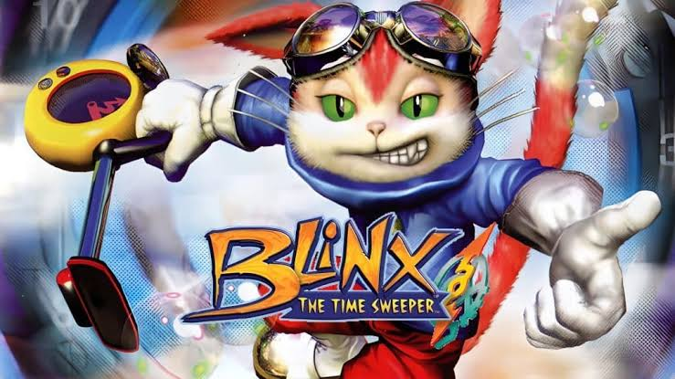

## Вектор Времени: Как спроектировать нелинейный таймлайн в Unity и не сойти с ума

<div style="text-align: center; max-width: 650px; margin: 20px auto; padding: 20px; border: 1px solid #e1e4e8; border-radius: 8px; background-color: #fafbfc;">
  <div style="font-size: 1.2em; font-weight: bold; margin-bottom: 5px; color: #24292e;">Valeriya Pudova</div>
  <p style="margin: 0 0 15px 0; color: #586069; font-size: 0.95em;">
  💬 Telegram: <a href="https://t.me" style="text-decoration: none; color: #0366d6; font-weight: 600;">@valery_h2w</a> 
  &nbsp;|&nbsp; 
  ✉️ Business: <a href="mailto:valery.hww@gmail.com" style="text-decoration: none; color: #0366d6;">valery.hww@gmail.com</a> 
  </p>
  <div style="margin: 15px 0; overflow: hidden; border-radius: 6px; box-shadow: 0 2px 8px rgba(0,0,0,0.08);">
    
  </div>
</div>


Когда мы начинаем делать игру, где время — это не просто монотонно тикающий счетчик, а игровой элемент (в духе Blinx, Braid или Superhot), стандартный инструментарий Unity быстро выставляет нам жесткие рамки. Статический класс Time [Time](https://docs.unity3d.com/ru/530/ScriptReference/Time.html) хорош для линейного геймплея, но в сложных механиках манипуляции временем он беспомощен.

Эта статья — хроника архитектурного поиска. Мы разберем популярные подходы контроля времени, наступим на скрытые мины, отсечем нерабочие варианты и соберем изящное, масштабируемое решение, готовое к высоким нагрузкам

------------------------------

## Важный дисклеймер: Границы применимости

Перед началом проектирования сразу обозначим жесткую границу. Описываемая ниже система применима исключительно для:

   1. Полностью кастомной / кинематической физики. Движение персонажей, врагов и снарядов должно просчитываться вручную кодом (через Transform или Rigidbody.MovePosition).
   2. Декоративной физики. Партиклы, осколки стен и щепки могут использовать стандартный Rigidbody, если их заморозка не влияет на геймплей.

Попытка подружить индивидуальный реверс времени со встроенным динамическим фреймворком PhysX / Chaos в Unity — это архитектурное самоубийство, так как физический движок намертво привязан к глобальному времени кадра [Time-fixedDeltaTime]

------------------------------

## Этап 1: Тупик глобального состояния и параллельных вселенных

Первая идея, которая приходит в голову — создать несколько изолированных «источников правды». Например, разделить мир на статические классы или глобальные синглтоны: PlayerTime, EnemyTime, AnomalyTime.
Представим классическую задачу: «Временная граната». В месте взрыва образуется сфера. Все враги, попавшие внутрь, замедляются на 90%.
Если мы используем параллельные источники времени, то при входе врага в триггер гранаты нам придется переключать его с EnemyTime на AnomalyTime. В этот момент происходит катастрофа. Предположим, на часах «Быстрого времени» мира натикало 100 условных минут, а на часах «Замедленного времени» аномалии — только 50. В момент смены источника локальное время врага резко прыгает назад на 50 минут. Внутреннее состояние объекта мгновенно разрушается: кулдауны способностей откатываются, анимации сходят с ума, а физические интерполяции улетают в бесконечность.

Вывод первого этапа: Иметь несколько независимых абсолютных источников времени нельзя. Время внутри каждого объекта обязано идти непрерывно и монотонно возрастать. Переключение внешних источников ломает логику. Объект должен сам управлять своим внутренним временем.

------------------------------

## Этап 2: Парадигма доставки (Как накормить Load Balancer)

Раз время должно быть индивидуальным, объекту для обновления нужна дельта времени (deltaTime). Но как доставить эту дельту?
В масштабной игре с тысячами объектов нам жизненно необходим Планировщик (Load Balancer). Дальние объекты нет смысла обновлять каждый кадр — их можно распределить по корзинам (бакетам) и вызывать, например, раз в 3–5 кадров для оптимизации.

## Вариант А: Передача дельта-времени (Относительное время)

Мы вызываем обновление объекта и передаем ему скалярное значение: UpdateObject(float deltaTime).

* Где мина: Если планировщик вызывает дальний объект раз в 5 кадров, он должен знать, что этому объекту нужно передать другую, накопленную дельту. Планировщик превращается в громоздкую бухгалтерскую машину. Ему приходится вручную суммировать и хранить микро-дельты прошедших кадров для каждой отдельной группы объектов, а при переходе объекта из редкого бакета в частый — судорожно пересчитывать эти хвосты. Это работает, но это неизящно, хрупко и порождает скрытые баги.

## Вариант Б: Передача абсолютного времени (Точка правды)

Мы передаем объекту единую точку на шкале глобального времени: UpdateObject(double absoluteTime). При этом способ передачи не так важен: это может быть чистая скалярная величина в аргументе метода, указатель на контекст или ref-структура (как рекомендуют технические публикации [Insomniac Games: Core](https://insomniacgames.github.io/)). Для простоты понимания в примерах ниже мы будем использовать скалярный float.
При таком подходе объект сам вычисляет дельту. Он хранит метку времени своего предыдущего обновления и находит разницу с текущим.

* Почему это триумф для планировщика: Планировщику абсолютно плевать, как часто он вызывает объект. Он может вызвать его три кадра подряд, а потом забыть на 10 кадров. В момент вызова объект просто посмотрит на «точку правды», вычтет старую точку и получит математически точную, честную дельту за весь пропущенный период. Планировщик полностью разгружен.

## Этап 3: Истинное изящество. Разделение Симуляции и Визуализации

Мы пришли к оптимальной формуле: Планировщик (Load Balancer) поставляет объекту глобальную точку времени, а объект сам считает дельту и накладывает свои локальные модификаторы. Но если мы попытаемся в одном и том же методе рассчитать новые координаты объекта и сразу же сдвинуть его 3D-модель на экране, мы неизбежно столкнемся со скрытой ловушкой интерполяции.
Поскольку балансировщик ради оптимизации вызывает логику объектов неравномерно (ближних — каждый кадр, дальних — раз в несколько кадров), вычисленное дельта-время будет постоянно прыгать. Стандартное сглаживание движения на рваном deltaTime начнет неестественно дергаться, а объекты в бакетах редкого обновления будут перемещаться по экрану телепортами.
Чтобы победить эту проблему, мы применим архитектурный паттерн, на котором строятся ААА-движки и сетевые шутеры: жесткое разделение объекта на Логическое состояние (State) и Визуальное представление (View).

```txt
 [Планировщик]  ──> Логический Тик (Рваный FPS)    ──> Вычисление State A и State B
                                                           │
                                                           ▼
 [Экран игрока] ──> Визуальный Кадр (Максимум FPS) ──> Интерполяция View (Плавный ход)
```

## 1. Логический слой (Кастомный FixedUpdate)

Этот слой считает только сухие данные: где объект находится на самом деле в пространстве нашего таймлайна. Его дергает планировщик с переменной частотой. Чтобы визуал мог плавно отрисовать движение между редкими логическими шагами, объект обязан хранить два последних рассчитанных состояния (снапшота) — текущее и предыдущее.

```cs
public struct ObjectState
{
    public Vector3 position;
    public Quaternion rotation;
}

public class TimeDrivenLogic : MonoBehaviour
{
    [SerializeField] private float myTimeScale = 1.0f;
    private float _lastMasterTime;

    // Два источника правды для визуального слоя
    public ObjectState PreviousState { get; private set; }
    public ObjectState CurrentState { get; private set; }

    public void Initialize(float currentMasterTime)
    {
        _lastMasterTime = currentMasterTime;
        var initial = new ObjectState { position = transform.position, rotation = transform.rotation };
        PreviousState = initial;
        CurrentState = initial;
    }

    // Вызывается планировщиком (частота может быть рваной)
    public void ManagedUpdate(float currentMasterTime)
    {
        float masterDeltaTime = currentMasterTime - _lastMasterTime;
        _lastMasterTime = currentMasterTime;

        float localDeltaTime = masterDeltaTime * myTimeScale;

        // Сдвигаем историю состояний назад
        PreviousState = CurrentState;

        // Рассчитываем новое «честное» состояние
        CurrentState = CalculateNewState(CurrentState, localDeltaTime);
    }

    private ObjectState CalculateNewState(ObjectState current, float dt)
    {
        // Только сухая математика без прямого изменения Transform графики!
        ObjectState next;
        next.position = current.position + (Vector3.forward * 5f * dt);
        next.rotation = current.rotation;
        return next;
    }
}
```

## 2. Визуальный слой (Экранный Update)

Этот слой работает на максимальной частоте монитора игрока в стандартном Update(). Он вообще не знает про существование планировщика или аномалий времени. Его задача — плавно двигать картинку, используя стабильный Time.deltaTime [Time-deltaTime] текущего кадра.
В зависимости от динамики игры визуал может использовать два подхода:

* Интерполяция (Движение в прошлом): Графика плавно скользит от PreviousState к CurrentState. Визуал всегда отстает от логики ровно на один шаг планировщика, но движение гарантированно будет гладким, даже если планировщик сильно задерживает кадры.
* Экстраполяция (Предсказание будущего): Визуал берет вектор скорости между двумя состояниями и продолжает двигать модельку дальше в этом направлении, предугадывая положение. Как только планировщик присылает реальный CurrentState, визуал плавно корректирует картинку под истинные координаты.

Пример реализации визуального сглаживания через интерполяцию:

```cs
public class TimeDrivenView : MonoBehaviour
{
    [SerializeField] private TimeDrivenLogic logic;
    private float _interpolationProgress;

    void Update()
    {
        // Вычисляем, насколько визуал успел продвинуться между логическими тиками.
        // Используем стандартный, стабильный deltaTime экрана.
        _interpolationProgress += Time.deltaTime * 10f; // 10f - скорость подстройки графики
        _interpolationProgress = Mathf.Clamp01(_interpolationProgress);

        // Идеально плавно рендерим объект на экране
        transform.position = Vector3.Lerp(logic.PreviousState.position, logic.CurrentState.position, _interpolationProgress);
        transform.rotation = Quaternion.Slerp(logic.PreviousState.rotation, logic.CurrentState.rotation, _interpolationProgress);
    }

    // Вызывается внешним триггером каждый раз, когда логика завершила свой ManagedUpdate
    public void ResetInterpolation()
    {
        _interpolationProgress = 0f;
    }
}
```

## Почему это идеальное решение для нашей архитектуры?

   1. Полная победа над лагами планировщика: Экранный Update всегда имеет стабильный шаг. Ему безразлично, что логика пули или врага просчиталась всего 15 раз за секунду вместо 144 — на экране объект продолжит двигаться как шелк.
   2. Идеальная готовность к реверсу времени: Если мы меняем знак времени и локальная дельта становится отрицательной, логический слой просто начинает генерировать CurrentState и PreviousState в обратном порядке (или доставать их из буфера истории). Визуальный скрипт этого даже не заметит: для него это точно такие же две точки в пространстве, между которыми нужно нарисовать плавный переход.

## Ложка дегтя: Главное ограничение визуального сглаживания

Для абсолютной честности необходимо зафиксировать фундаментальный компромисс этой системы: в каждый конкретный миг времени объект на экране находится не там, где он существует в логике игры.

Пока наш кастомный физический коллайдер или логический триггер уже находится в точке CurrentState (например, совершил прыжок вперед), визуальный интерполятор всё еще плавно тащит графическую 3D-модель из точки PreviousState. Картинка на экране игрока всегда является «эхом прошлого», отстающим от логики на один шаг планировщика. В случае с экстраполяцией ситуация обратная — графика пытается «угадать» будущее и может на долю секунды промахнуться мимо реального положения коллайдера.
Это означает, что:

* Если игрок целится во врага, который обновляется балансировщиком очень редко, он может визуально стрелять точно в голову модели, но с точки зрения логики промахнуться, потому что истинный хитбокс улетел чуть вперед.
* Именно поэтому данный подход требует баланса: важные интерактивные объекты (близкие враги, летящие в игрока снаряды) планировщик обязан обновлять чаще, сводя визуальный рассинхрон к незаметному минимуму, в то время как на дальних объектах или декорациях экономия процессора будет колоссальной.

**Важная оговорка:** Описанная проблема рассинхрона существует только в моменты жесткой оптимизации (Load Balancing). Если частота обновления логического состояния объекта совпадает с частотой обновления его изображения на экране (планировщик дергает логику каждый кадр в честных 60/120/144 FPS), **данная проблема полностью исчезает**. В этом случае истинный хитбокс и визуальная модель движутся синхронно, а все архитектурные решения, описанные в статье, работают идеально и без каких-либо компромиссов.

## Этап 4: Прагматичный реверс и точка сингулярности

Когда мы меняем знак локального масштаба времени (myTimeScale = -1.0f), вычисленная объектом дельта становится отрицательной. В этот момент разработчики часто совершают ошибку, пытаясь построить «всеведущую машину времени»: они пытаются сохранять снапшоты здоровья, отменять дискретные события (например, засасывать вылетевшие частицы обратно в ствол) и оборачивать вспять логику ИИ. Попытка реализовать это в лоб приводит к титаническому труду, утечкам памяти и багам сопутствующих подсистем.
Настоящее практическое решение гораздо изящнее. Мы должны принять факт: честный реверс времени без огромных затрат памяти возможен только для процедурных вычислений и непрерывных математических функций.
Когда объект переходит в определенное состояние (например, прыжок в атаку), его код фиксирует две вещи: глобальное время старта этого состояния (T_start) и математическую функцию, зависящую от локального времени t (сколько секунд прошло со старта).

   1. Процедурная физика: Функция траектории (парабола полета) при отрицательном dt послушно вычисляется в обратном порядке. Враг летит назад по той же дуге.
   2. Процедурная анимация: Анимационный плеер (например, через ручное управление Animator.Play("Attack", 0, normalizedTime)) получает уменьшающийся нормализованный таймлайн и проигрывает движения задом наперед.

При этом сопутствующие подсистемы (системы частиц, искры, следы от пуль) мы просто игнорируем или уничтожаем — для хорошего геймплея этого более чем достаточно.

## Порог сингулярности

Мотая время вспять, локальный счетчик времени внутри текущего состояния объекта неизбежно дойдет до нуля (t = 0). Мы упираемся в точку сингулярности — момент, когда этого прыжка или этой анимации еще не существовало в природе.

Пытаться отмотать код еще дальше назад, чтобы «отменить» само решение ИИ атаковать — бессмысленно и архитектурно опасно. Вместо этого мы применяем правило ограничения: при достижении точки сингулярности локальный счетчик времени объекта фиксируется на нуле. Враг просто застывает в воздухе в своей стартовой позе атаки, а анимация замирает на первом кадре.
Для игрока это выглядит как безупречная, стильная работа временной аномалии, а для нашего движка — это триумф оптимизации, не потребовавший ни одного байта оперативной памяти под хранение истории кадров

------------------------------

## Заключение

Пройдя через всю паутину архитектурных вариантов, мы вывели оптимальный лейтмотив для создания нелинейного времени в Unity:

* Время доставляется планировщиком в виде абсолютной точки мастер-таймлайна, что разгружает систему оптимизации кадров (Load Balancing).
* Объект полностью автономен, он сам считает свою дельту и адаптирует её под свои нужды, исключая прыжки времени назад при смене зон.
* Симуляция отделена от визуализации, благодаря чему рваный шаг планировщика превращается в шелковое движение на экране через интерполяцию состояний.
* Реверс работает на уровне локальных математических функций и останавливается в точке сингулярности, сохраняя стабильность геймплейного кода.
