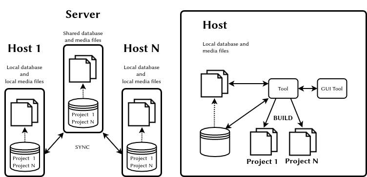
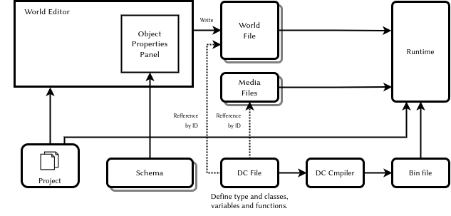
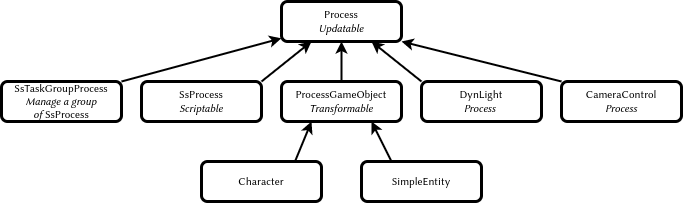
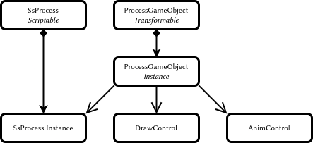
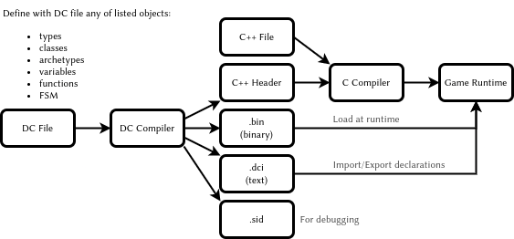
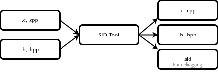
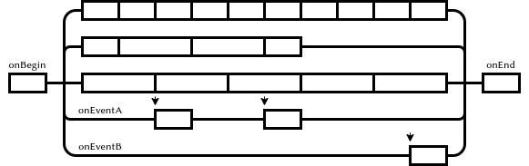
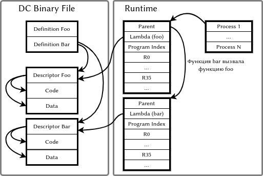

<div class="center" markdown="1">Valeriya Pudova</div>

<div class="center" markdown="1"><valery.hww@gmail.com></div>

<div class="center" markdown="1">18.05.2022</div>

<div class="center" markdown="1">

</div>


<details>
  <summary><b>Disclaimer</b></summary>
  <p>
I don’t work at *Naughty Dog*, nor do I have any secret knowledge of *The Last of Us*, except what I figured out myself from the disc. So a lot of this may well be wrong. Take it with a pinch of salt. Most of the code samples in this document are taken from the sources listed at the end of the document.
  </p>
</details>

# Introduction

The company *Naughty Dog* *(ND)* uses a set of developer tools consisting of many different utilities. Some of these utilities have their own *GUI*, while others remain as commands for the console `\citep{jgregory2014}`{=latex}. This approach has some advantages over integrated development environments (*IDE*) for 3D games such as Unity 3D.

- Less development overhead becasue *GUI* is not needed, so more resources can be spent on the game itself

- It is easier to organize the collaboration of the team as a whole

- The *GUI* tools individually require fewer resources. And so they are more convenient for a specific task: *World*,*FX*, *Shaders*, editors, etc.

- With this approach it is easier to organize production automation

- The tools do not work destructively: if the designer does not change anything, the project stays the same

The main feature of *ND* approach is based on the use of animations and dynamic updates of the runtime environment - no recompilation and restart of the project is required to see the result.

# Asset Management

The *asset management* system is designed to organize collaboration on a project, versioning source files[^1], eliminate conflicts, and also to generate the current state of all project media-resources and save the result in an optimal format for streaming-loading. This system is based on a distributed database, which is implemented using *DB* or *xml* files[^2]. The database contains information about all source files inputs and allows you to create a project’s asset folder and fill it with content. Each entry contains not only import parameters, but also additional information such as comments for the team. To resolve conflicts, a history of actions on each file is stored: renaming, moving, deleting, etc.

<figure id="fig:assets">

<figcaption><span id="fig:assets" label="fig:assets"></span>Asset Management</figcaption>
</figure>

Don’t neglect the asset management system: a lot depends on it, because making games is more about working with assets than programming.

# World Editor

The editor has nothing to do with the engine itself and this is a[^3]. It uses text configuration files *schema*. Each file contains parameter descriptions for one type of scene object. For each field could be declared: type, default value, minimum and maximum, and the list of options for the enumerated types. After putting an empty object on the scene, the designer chooses which scheme file this object uses. Then, the designer can fill the fields, as the list of fields is described in the schema file. The designer has the ability to add or remove fields to the *schema* file himself. Eventually, the world editor will write down the structure of the whole scene, e.g. as *xml* or another file format. The approach illustrated in figure <a href="#fig:nd_schema" data-reference-type="ref" data-reference="fig:nd_schema">2</a>

<figure id="fig:nd_schema">

<figcaption><span id="fig:nd_schema" label="fig:nd_schema"></span>World Editor and a <em>schema</em> file</figcaption>
</figure>

There are the following types `\citep{jgregory2017}`{=latex} of scene objects:

- *Spawner* - The point and process that instantiates the character

- {emph{Spline} - 3D curve

- *Region* - A world fragment

- {emph{Nav Mesh} - Navigation geometry (navigation grid)

- *Static Background Geometry* - Static background geometry

The object’s parameters list may include fields such as *archetype* and sometimes *parent-archetype*. These parameters define: which entity class will actually be used, which components it has and which fields has each component.

# Object System

The class hierarchy is not deeply nested and is built from a single ancestor class. In my opinion, the system could theoretically be implemented as a dynamic component system`\citep{tcohen2010}`{=latex} or another variant of *Data Oriented* programming.

An approximate class structure is shown in the diagram <a href="#fig:nd_classes" data-reference-type="ref" data-reference="fig:nd_classes">3</a>

<figure id="fig:nd_classes">

<figcaption><span id="fig:nd_classes" label="fig:nd_classes"></span>The game object classes<span class="citation" data-cites="jgregory2006"></span></figcaption>
</figure>

The base class of all characters *ProcessGameObject* and the classes inherited from it represent a host object whose functionality is extended with composition, see figure <a href="#fig:nd_components" data-reference-type="ref" data-reference="fig:nd_components">4</a>. In case of using *MVC* you can create two separate classes the *model* and *view*, each with its own set of state parameters and its own set of components.

<figure id="fig:nd_components">

<figcaption><span id="fig:nd_components" label="fig:nd_components"></span>Object composition<span class="citation" data-cites="jgregory2006"></span></figcaption>
</figure>

The object system of the game is based on a *LISP*-like language which describes structures, classes, class instances together with the data stored in them, as well as variables and functions in the *.dc* file. This file is compiled into files *.h*, *.bin* and *.dci*. In addition to all of the above, the *.dc* file contains the source code of the state machines for the game objects. This code is organized as a set of parallel processes working in a cooperative multitasking environment. The processes have a synchronization mechanism based on signals.

- *.h* - is intended to be built by the *C* compiler and provides a direct access to the dynamic data from the *C*

- *.bin* - contains only data structures and functions. Loaded by the game in the runtime

- *.dci* - text file with declaration of all files to *import* and all definitions for *export*.

Changing of the *dc* file requires recompilation of the project only if the structure has changed, i.e. *.h* file has been changed. The functioning of the system is shown in figure <a href="#fig:nd_world" data-reference-type="ref" data-reference="fig:nd_world">5</a>.

<figure id="fig:nd_world">

<figcaption><span id="fig:nd_world" label="fig:nd_world"></span>The world model editing<span class="citation" data-cites="jgregory2017"></span></figcaption>
</figure>

# Spawning

The basis of flexible creation *spawning* of new instances of game entities is the use of scripting processes. Such processes do all the necessary work to create objects, and then inject the necessary data. The *spawning* system uses an *object factory* which has a table of type names and archetypes and stores information about inheritance and class size. The system must also be able to move objects to use memory efficiently.

The system can request the maximum amount of memory needed to store the object and, after instantiation, release the unused memory fragment. After relocation, all objects in memory should be positioned in an optimized layout.

A more qualitative result can be given by the *Data Oriented* approach, which uses pools of homogeneous objects.

In general, *spawning*-system should solve the following problems:

- Keep the uniqueness of identifiers.

- Create all necessary hierarchy of objects for single prototype *prefab*.

- Configure all necessary dependencies.

- Efficient use of memory.

- Use processor resources carefully. For example, to create an object in a few steps: query, create, initialize, request the creation of children, etc.

- Be able to use the *priority queue* when creating objects

- Allow to create the objects with different ways and with injection paramteres:

  - *Spawner* - by the *spawner* object in the world

  - *C* - with *C* code

  - *Script* - with script code

  - *Cloning* - by copying of existing object

  - *Replication* - by network replication

# Message Sysyem

The one of main objectives for a programmer is to create code with a minimum of dependencies. Two interacting objects should not know too much about each other. Instead, using polymorphism, they should talk to each other in an abstract language – the language of signals and messages.

The message is a data container with records as *key* and *value* pairs. The value has a *variant* type.

Some time, instead of using pointer as value woulde be better to use names *StringId* or identifiers *Handler* as objects reference.

# States

The game objects are updated using the *batched* and *bucket* methods.

- *batched* - update all components of the same type *Data Oriented Programming*

- *bucket* - update objects by priorities, to eliminate the interdependency problem

Below is an example of *batched* and *backed* updates `\citep{jgregory2017}`{=latex}.

``` c
while (true)
{
    PollJoypad();
    float dt = GetFrameDeltaTime();
    // Backed update game objects
    for (each bucket)
    {
        for (each gameObject in bucket)
        {
            gameObject.Update(dt);
        }
    }
    // Batched update components
    g_animationEngine.Update(dt);
    g_physicsEngine.Simulate(dt);
    g_collisionEngine.Run(dt);
    g_audioEngine.Update(dt);
    g_renderingEngine.RenderFrame();
    g_videoDriver.FlipBuffers();
 }
```

The phase-by-phase update eliminates interdependency problems. The essence of the solution is to update objects with several passes, see the example below `\citep{jgregory2017}`{=latex}.

In my projects, I use this method of updating objects. In principle, the number of phases can be any, but in my practice only two were used.

``` c
while (true) // main game loop
{
    // ...
    for (each gameObject)
        gameObject.PreAnimUpdate(dt);

    g_animationEngine.CalculateIntermediatePoses(dt);

    for (each gameObject)
        gameObject.PostAnimUpdate(dt);

    g_ragdollSystem.ApplySkeletonsToRagDolls();
    g_physicsEngine.Simulate(dt);
    g_collisionEngine.DetectAndResolveCollisions(dt);
    g_ragdollSystem.ApplyRagDollsToSkeletons();
    g_animationEngine.FinalizePoseAndMatrixPalette();

    for (each gameObject)
        gameObject.FinalUpdate(dt);
    // ...
}
```

How objects need to be updated depends a lot on the game itself and the decision must be made on a case-by-case basis, for each specific.

# String ID

All object names are converted to integer values using the *CRC32* algorithm. The *C* source code uses the macro *SID(s)* which is converted to *SID(n, s)* before compilation. The identifiers of all lines are collected in a separate text *.sid* file for debugging. An example macro in the source *C* file is shown below.

``` c
#define SID(n,...) n
```

As a result the source lines are discarded during the compilation, but added to the *.sid* file. The generated *.cpp\|.h* files have a link to the original version of this file. An example of such a reference is shown below.

``` c
#line 1 "original_file.cpp"
```

In general, the process looks as shown in the diagram <a href="#fig:nd_sider" data-reference-type="ref" data-reference="fig:nd_sider">6</a>.

<figure id="fig:nd_sider">

<figcaption><span id="fig:nd_sider" label="fig:nd_sider"></span>ОProcessing <em>C</em> files before compilation</figcaption>
</figure>

A modern version of *C* allows to use *constexpr* for this purpose to generate *StringId*. An example of such a function is given below:

``` c
// Usage: find_character("player"_id)
constexpr StringId operator "" _id(const char* v, unsigned int c) {
    return crc32_helper(v, c, 0xFFFFFFFF);
}
```

An example of the *StringId* generator is shown below. This function works in the my custom *.bin* file disassembler for *The Last of Us* game.

``` python
# Python
def create_table(poly):
  init=0
  l=[0]*256
  for i in range(256):
    t=init^(i<<24)
    for j in range(8):
      mask=1<<31
      if(mask&t!=0):
          t=(t<<1)^poly
      else:
          t=(t<<1)
    l[i]=t&0xffffffff
  return l

crc32_table = create_table(0x04c11db7)

def crc32(s, init=0):
  crc = init
  if s:
    for c in s:
      crc = (crc32_table[ ((crc>>24) ^ ord(c)) & 0xff ] \
        ^ (crc << 8)) & 0xffffffff
  return crc
```

# DC Syntax

The DC language allows you to declare new types, below is an example of a four-component vector `\citep{dliebdold2008}`{=latex}.

``` lisp
(deftype vec4 (:align 16)
  ((x float)
   (y float)
   (z float)
   (w float :default 0)
   )
  )
```

You can use inheritance when declaring, example below `\citep{dliebdold2008}`{=latex}.

``` lisp
(deftype quaternion (:parent vec4)
  ())

(deftype point (:parent vec4)
  ((w float :default 1)
   ))
```

Another example, but now with composition of classes`\citep{dliebdold2008}`{=latex}.

``` lisp
(deftype locator ()
  ((trans point :inline #t)
   (rot quaternion :inline #t)
   )
)
```

As a result, the *DC* compiler converts the structure into the contents of the *.h* file `\citep{dliebdold2008}`{=latex}.

``` c
struct Locator
{
    Point m_trans;
    Quaternion m_rot;
};
```

There is a way to define a function. Below is an example of the function *axis-angle-\>quat* `\citep{dliebdold2008}`{=latex}.

``` lisp
(define (axis-angle->quat axis angle)
  (let ((sin-angle/2 (sin (* 0.5 angle))))
    (new quaternion
         :x (* (-> axis x) sin-angle/2)
         :y (* (-> axis y) sin-angle/2)
         :z (* (-> axis z) sin-angle/2)
         :w (cos (* 0.5 angle))
)))
```

One important feature of the *LISP*-like language is the ability to create domain-specific languages *DSL*. This allows you to write code and declare data more efficiently, without extra ceremony `\citep{dliebdold2008}`{=latex}.

``` lisp
(define *y-axis* (new vec4 :x 0 :y 1 :z 0))
(define *origin* (new point :x 0 :y 0 :z 0))
```

A data definition can use a function as the value. An example of definition for the player’s starting point is shown below. Here a function calculating *quaternion* from an *angle* and *rotation axis* and the result is used as the value of the rotation angle `\citep{dliebdold2008}`{=latex}.

``` lisp
(define-export *player-start*
  (new locator
       :trans *origin*
       :rot (axis-angle->quaternion *y-axis* 45)
       ))
```

Using definitions in the *DC* file from *C* source code shown in the example below `\citep{jgregory2014}`{=latex}.

``` c
#include "dc-types.h"

const Locator * pLoc = DcLookupSymbol("*player-start*");
Point pos = pLoc->m_trans;
```

# Animation States [sec:org3216cbf]

Animation states are implemented as data structures. A corresponding *C* code is required in order to interpret these states and to construct the necessary objects in the system memory. Below is a simple animation’s state*pirate-jump* `\citep{jgregory2017}`{=latex}.

``` lisp
(define-state simple
  :name     "pirate-jump"
  :clip     "pirate-jump"
  :flags    (anim-state-flag no-adjust-to-ground)
  )
```

An example of a complex animation state is given below `\citep{jgregory2017}`{=latex}. In this case a linear interpolation of two animations is performed: *pirate-jump* and *pirate-scare*.

``` lisp
(define-state complex
  :name   "pirate-jump"
  :tree
  (anim-node-lerp
   (anim-node-clip "pirate-jump")
   (anim-node-clip "pirate-scare")
   )
  )
```

Another example is given below, it has a tree of different nodes that perform animation mixing operations `\citep{jgregory2017}`{=latex}.

``` lisp
(define-state complex
  :name     "pirate-jump"
  :tree
  (anim-node-lerp
   (anim-node-additive
    (anim-node-additive
     (anim-node-clip "pirate-jump-f")
     (anim-node-clip "pirate-scare-f")
     )
    (anim-node-clip "pirate-felldown-f")
    )
   (anim-node-additive
    (anim-node-additive
     (anim-node-clip "pirate-jump-b")
     (anim-node-clip "pirate-scare-b")
     )
    (anim-node-clip "pirate-felldown-b")
    )
   )
  )
```

Yet another example is given below, it has a tree different nodes that perform animation mixing operations `\citep{jgregory2017}`{=latex}.

``` lisp
;; nb aim-tree is the macro definition
(define-state complex
  :name "s-turret-idle"
  :tree (aim-tree (anim-node-clip "turret-aim-all-base")
                  "turret-aim-all-left-right"
                  "turret-aim-all-left-updown")
  :transitions (
                (transition "reload" "s_turret-reload"
                            (range - -) :fade-time 0.2)

                (transition "step-left" "s_turret-step-left"
                            (range - -) :fade-time 0.2)

                (transition "step-right" "s_turret-ste-right"
                            (range - -) :fade-time 0.2)

                (transition "reload" "s_turret-fire"
                            (range - -) :fade-time 0.1)

                ;; invoke previously defined group of transitions
                ;; it is used when the same set of transitions needed
                ;; to be used in the other state
                (transition-group "combat-gunpout-idle-mode")

                ;; specifies a transition that is
                ;; taken upon reaching the end of the state's
                ;; local time line if no other transition
                ;; has been taken before then
                (transition-end "s-turret-idle")
                )
  )
```

Similar methods can be used to encode other game systems: *AI*, *Melee* `\citep{minglun2021}`{=latex}, etc.

# States

In the *DC* language, a state refers to a particular set of processes that run for a particular host object or as independent processes in memory. An example of finite state machine with a single state of an animated scene is shown below`\citep{jgregory2006}`{=latex}.

``` lisp
;; Сцена с аварией автобуса
(define-state-script ("wz-bus-crash")
  ;; состояние spawn солдат
  (state ("spawn-soldiers")
         (on (begin)
             ;; отключить управление игроком, но кроме правой кнопки
             [player-disable-controls
             (controls all-but-right-stick)]
             ;; создать солдат
             [spawn-npc-in-combat "npc-wz-52"]
             [spawn-npc-in-combat "npc-wz-53"]
             ...
             ;; перейти в состояние crash
             [go "crash"]
             )
         )
...
```

# Declaration of state variables [sec:org92c5bc2]

A state can have its own variables for storing different values or exchanging data.

``` lisp
;; Сцена с аварией автобуса
(define-state-script ("kickable-gate")
:initial-state "closed"
:declarations (decl-list
  (var "num-attempts" :type int32)
  (var "is-locked" ::default #t)))
  ....
  )
```

# Multitasking

Each state of an object can be represented as a set of parallel process (tracks). Some of them are executed from beginning to end in each rendering frame, while others are paused and continue execution in the next frame or on response to a certain event. There are also separate tracks that are triggered by an event. Initialization code is executed at the beginning of state, and finalization code is executed at the end. The diagram <a href="#fig:nd_tracks" data-reference-type="ref" data-reference="fig:nd_tracks">7</a> illustrates one state.

<figure id="fig:nd_tracks">

<figcaption><span id="fig:nd_tracks" label="fig:nd_tracks"></span>The tracks of state</figcaption>
</figure>

The next state `\citep{jgregory2006}`{=latex} starts four tracks – four parallel processes. Each process runs a different script and sends a message in the final state. Each process can pause while waiting for another process or while waiting for a particular event.

``` lisp
(state ("crash")
       (on (begin)
           ;; процесс анимации автобуса
           (track ("bus")
                  [wait-animate "bus-1" "bus-crash"
                  [get-locator "ref-bus-crash-1"]]
                  [signal "bus-done"]
                  )
           ;; процесс анимации игрока
           (track ("player")
                  [animate "player" "player-watch-crash"
                  [get-locator "ref-bus-crash-1"]]
                  [wait-until-frame 250]
                  [say "player" "vox-wz-drk-01-what-the"]
                  [signal "drake-done"]
                  )
           ;; процесс анимации того, кого собъет автобус
           (track ("guy-hit-by-bus")
                  [wait-animate "npc-wz-52" "npc-hit-by-bus"
                  [get-locator "ref-bus-crash-1"]]
                  [npc-die "npc-wz-52"]
                  [signal "npc-dead"]
                  )
           ;; процесс ожидания всех остальных процессов
           (track ("wait-for-all-done")
                  [wait-for-signal "bus-done"]
                  [wait-for-signal "drake-done"]
                  [wait-for-signal "npc-dead"]
                  [go "done"]
                  )
...
```

Ultimately, the track system is layered, with the upper levels controlling the lower levels. Examples of such layers from the top to the bottom are given below:

- The top-level processes of the game, as well as global processes such as chaining a time of day or weather
- Current scene processes
- Current zone processes
- Battle-zone processes
- Group AI processes
- Character processes
- Processes of child objects

Using a scripting is very efficient way with some drawbacks, such as:

- Designers must be able to program in scripting language

- The execution of code in tracks is not time-dependent, i.e., it cannot be executed in reverse order or make jumps in time.

The latter, however, is possible in pure *Data-Driven* system.

# Reflection

The *DC* source code compiled into bytecode[^4]. Any way to integrate a dynamic language into the system requires a mechanism for this integration: *Reflection*, *FFI*, etc.

*ND* has a very simple but very effective way to integrate the virtual machine and the engine itself. To do this, they use a hash table with a function name as key *ssid* and a function pointer as value. This function with variable number of arguments, which have *variant* type.

An example of such a function is given below `\citep{jgregory2006}`{=latex}. Object names in the form *StringId* are used to access scene objects, with the reserved name *self* addressing the process host object.

``` c
Variant ScriptWaitAnimate(int argc, Variant* argv)
{
    StringId objName = SC_ARG(0,StringId, NULL);
    StringId animName = SC_ARG(1,StringId, NULL);

    if(!objName)
        // The ScriptError is a function return Variant(false)
        // And print the error message
        return ScriptError(
            "wait-animate: expected object name (arg1)\n");
    if(!animName)
        return ScriptError(
            "wait-animate: expect animation name (arg2)\n");

    // find the object
    ProcessGameObject* pObj = g_processMgr.Lookup(objName);

    if(!pObj)
        return ScriptError("wait-animate: could not found %s\n",
                            StringIdToString(onjName));

    // insruct object to play animation, and wakeup
    // this script when done
    pObj->WaitAnimate(animName, g_scriptContext);
    g_scriptContext.Suspend(); // go to sleep until animation complete
    return Variant(true);
}
```

The *C* function *ScriptWaitAnimate* can now be declared in a dynamic programming environment, see example below `\citep{jgregory2006}`{=latex}. The declaration is only needed to exposing the method’s signature, that is, to check types.

``` lisp
(define-c-function wait-animate
  (object-name string)
  (anim-name string)
  )
```

# DC Compiler

Implemented in *Racket*, although it could have been implemented in *C*, *Go* or any other language. The use of *Racket* may be explained by the following reasons:

- It is an environment specifically aimed at developing *DSL*

- The Racket compiler supports a large number of languages already implemented for the platform, such as

- It’s a mature product, well proven in academic environments

- *Racket* has its own *IDE*, *DrRacket*. It is easy to install and use. The tools it provides are very clear and informative.

- Advanced programmers can use another editor, e.g. *EMACS*

# SID-file

The presence of such a file is my assumption. The file has a text format and is designed to store the text forms of each *StringId*. It can be useful when debugging programs. Below is an example of a fragment of this file.

``` text
dbd3d0d8 is-test-task?
2a990f91 is-demo-part-2?
bff578ab is-t2?
dcf596c6 get-difficulty
a86d881d get-dda
```

# DCI-file

This file is intended for linking modules. There are the next definitions in each file:

- All imported files

- All exported definitions

Theoretically, in debug mode, all text forms can be placed in the file and another data.

``` lisp
;; script-user-funcs.dci
(script-user-funcs (69857) ;
  ;; Import files
  (import script-funcs vox-defines
          vox-remap-defines fact-defines
          vox-action-defines)
  ;; Export symbols
  (export disable-relocation add-int32 subtract-int32 string)
)
```

# The binary DC-file

The binary file is undocumented and has not yet been fully investigated, but some conclusions can already be drawn. The file format is very simple and friendly for a runtime system. Each file starts with a 32 byte header.

``` c
struct DcHeader {
  char magic[4] = "DC00"; // Магическая сигнатура
  u32 unknown1;
  u32 relocation1;
  u32 unknown2;
  u32 unknown3;
  u32 definitions_count;  // Количество дефиниций в файле
  u32 definitions_offset; // Начало данных с дефинициями
  u32 unknown4;           // PS4 version only
}
```

Each definition has a name, type and offset from the beginning of the file. Remarkably, the object type is written in text form, converted to *StringId*.

``` c
class DcDefinition {
  u32 nameId;   // SID aka StringId("player")
  u32 typeId;   // SID aka StringId("lambda")
  u32 offset;   // Start of the descriptor
  u32 unknown1; // PS4 version only
}
```

The following are supposedly the main types of definitions. But the game has thousands of them.

``` c
vector        = 0x012f77fe
string        = 0x0b3952e7
float         = 0x0f182ec3
angle         = 0x13812cd6
state         = 0x2e6743e3
direction     = 0x7194cbe7
color         = 0x71e73c6c
boolean       = 0x8b4e76ff
vec4          = 0x93bd2e95
script-lambda = 0x9ed499e1
function      = 0xab3eb31f
int32         = 0xc7cb2752
```

The source code is translated into the type *script-lambda* or *function*. The definition in the file points to the lambda descriptor. The descriptor has a pointer to the *lambda* function code and a pointer to the constants block located immediately after code.

``` c
struct DcDescriptor {
  u32 code;       // Смещение начала кода
  u32 unknown1;
  u32 data;       // Смещение начала данных
  u32 unknown2;
}
```

# VM

The virtual machine has a list of process, which contains pointers to a memory block storing the proces’s *environment*. The environment contains:

- A pointer to the *lambda* function being executed.

- Index of the current instruction (PC)

- A pointer to the parent environment, if the environments are not organized as a stack

- A block of registers, each of them is the *variant* type

The structure of the *VM* environment is shown in figure <a href="#fig:vm_runtime" data-reference-type="ref" data-reference="fig:vm_runtime">8</a>

<figure id="fig:vm_runtime">

<figcaption><span id="fig:vm_runtime" label="fig:vm_runtime"></span>The VM Runtime <span class="citation" data-cites="jgregory2006"></span></figcaption>
</figure>

# Instruction Set

The instruction’s sequence consists of homogeneous instructions as an array of 32-bit values. Besides the operation code there are three operands *a*,*b*,*c*. For some instructions the *c* operand is used as a direct value *k*, for others the *b* and *c* operands are combined into a 16-bit value *kk*.

``` c
struct DcInstruction {
  u8 opcode;  // Opcode
  u8 a;       // Register number
  u8 b;       // Register number
  u8 c;       // Register number
}
```

The constants are accessed by the data address from the descriptor. The register value multiplied by N[^5] is used as the offset of the data area where they are stored records of types:

- *I8,U8,I16,U16,I32,U32,I64,U64* numbers. However, in the game I investigated, only *I32* and *U32* are used

- 32-bit floating point numbers

- C-strings

The table below shows the instruction set of the virtual machine. The *Q-ty* column gives the approximate number of the command uses in the game.

<div id="tab:codes1" markdown="1">

| Opcode | Name              | Q-ty | Comment                                |
|-------:|:------------------|-----:|:---------------------------------------|
|   0x00 | return            | 1412 | return aRes, b (allways equal a)       |
|   0x01 | intAdd            |  130 | a = b + c                              |
|   0x02 | intSub            |   19 | a = b - c                              |
|   0x03 | intMul            |    1 | a = b * c                              |
|   0x04 | intDiv            |    0 | a = b / c                              |
|   0x05 | floatAdd          |   32 | a = b + c                              |
|   0x06 | floatSub          |   44 | a = b - c                              |
|   0x07 | floatMul          |   68 | a = b * c                              |
|   0x08 | floatDiv          |   30 | a = b / c                              |
|   0x09 | loadStaticInt     |    0 | a = (int)data[kk*N]                    |
|   0x0A | loadStaticFloat   |    0 | a = (float)data[kk*N]                  |
|   0x0B | loadStaticPointer |    0 | a = (char*)data[kk*N]                  |
|   0x0C | loadImm           | 3577 | a = BC                                 |
|   0x0D | loadInt           |   78 | a = (int)*b                            |
|   0x0E | loadFloat         |  129 | a = (float)*b                          |
|   0x0F | loadPointer       |    2 | a = (pointer)*b                        |
|   0x10 | storeInt          |    0 | (int*)a = b                            |
|   0x11 | storeFloat        |    0 | (float*)a = b                          |
|   0x12 | storePointer      |    0 | (char**)a = b                          |
|   0x13 | lookupInt         |    0 | a = (int)lookup((sid)data[kk*N])       |
|   0x14 | lookupFloat       |    0 | a = (float)lookuo((sid)data[kk*N])     |
|   0x15 | lookupPointer     | 8313 | a = (char\*)lookup((sid)data[kk*N])    |
|   0x16 | moveInt           |    0 | a = b                                  |
|   0x17 | moveFloat         |    0 | a = b                                  |
|   0x18 | movePointer       |    0 | a = b                                  |
|   0x19 | castInteger       |   23 | a = (int)b                             |
|   0x1A | castFloat         |   86 | a = (float)b                           |
|   0x1B | call              | 1429 | Call script function(aArg, bRes, argc) |
|   0x1C | callFf            | 6866 | Call native function(aArg, bRes, argc) |
|   0x1D | cmpEqual          |  721 | a = b == c                             |
|   0x1E | cmpGt             |   49 | a = b > c                              |
|   0x1F | cmpGtEqual        |   20 | a = b >= c)                            |

Opcodes 0x00-0x1F

</div>

<div id="tab:codes2" markdown="1">

| Opcode | Name             | Q-ty | Comment                 |
|-------:|:-----------------|-----:|:------------------------|
|   0x20 | cmpLt            |  141 | a = b \< c              |
|   0x21 | cmpLtEqual       |   16 | a = b \<= c             |
|   0x22 | cmpFloatEqual    |   19 | a = b == c              |
|   0x23 | cmpFloatGt       |  108 | a = b > c               |
|   0x24 | cmpFloatGtEqual  |   31 | a = b >= c              |
|   0x25 | cmpFloatLt       |  153 | a = b \< c              |
|   0x26 | cmpFloatLtEqual  |   44 | a = b \<= c             |
|   0x27 | intMod           |    2 | a = mod(b)              |
|   0x28 | floatMod         |    0 | a = fmod(b)             |
|   0x29 | intAbs           |    0 | a = abs(b)              |
|   0x2A | floatAbs         |   18 | a = fabs(b)             |
|   0x2B | (not available)  |    0 |                         |
|   0x2C | (not available)  |    0 |                         |
|   0x2D | branch           |  844 | rjump kk                |
|   0x2E | branchIf         |  348 | if (a) rjmp kk          |
|   0x2F | branchIfNot      | 2063 | if (not a) rjmp kk      |
|   0x30 | opLogNot         |  417 | a = not b               |
|   0x31 | opBitAnd         |    1 | a = b band c            |
|   0x32 | opBitNot         |    0 | a = bnot(b)             |
|   0x33 | opBitOr          |    0 | a = b bor c             |
|   0x34 | opBitXor         |    0 | a = b bxor c            |
|   0x35 | opBitNor         |    0 | a = bont (b bor c)      |
|   0x36 | opLogAnd         |    0 | a = b and c             |
|   0x37 | opLogOr          |    0 | a = a or c              |
|   0x38 | intNeg           |    0 | a = -b                  |
|   0x39 | floatNeg         |    0 | a = -b                  |
|   0x3A | loadParmCnt      |    1 | a = argc                |
|   0x3B | intAddImm        |  158 | a = b + k               |
|   0x3C | intSubImm        |    0 | a = b - k               |
|   0x3D | intMulImm        |    0 | a = b * k               |
|   0x3E | intDivImm        |    0 | a = b / k               |
|   0x3F | loadStaticI32Imm | 7128 | a = (i32)data[kk*N])    |

Opcodes 0x20-0x3F

</div>

<div id="tab:codes3" markdown="1">

| Opcode | Name              |  Q-ty | Comment                            |
|-------:|:------------------|------:|:-----------------------------------|
|   0x40 | loadStaticFloat   |  1699 | a = (float)data[kk*N])             |
|   0x41 | loadStaticPointer |   558 | a = (char*)&data[data[kk*N]]       |
|   0x42 | intAsh            |     0 | a shift b bits left/right          |
|   0x43 | move              | 27681 | a = b                              |
|   0x44 | loadStaticU32     |     0 | a = (u32)data[kk*N])               |
|   0x45 | loadStaticI8      |     0 | a = (i8)data[kk*N])                |
|   0x46 | loadStaticU8      |     0 | a = (u8)data[kk*N])                |
|   0x47 | loadStaticI16     |     0 | a = (i16)data[kk*N])               |
|   0x48 | loadStaticU16     |     0 | a = (u16)data[kk*N])               |
|   0x49 | loadStaticI64     |     0 | a = (i64)data[kk*N])               |
|   0x4A | loadStaticU64     |     0 | a = (u64)data[kk*N])               |
|        |                   |       |                                    |

Opcodes 0x40-0x4A

</div>

## VM Registers and Constants

Here are a few examples. In the game *The Last of Us* there were no accesses to a register larger than *R34*. Perhaps therefore registers *R24* and higher were usually used to pass arguments.

The code of the *npc-smart-move-to* function looks like this:

``` asm
npc-smart-move-to:
    ; Get 4 arguments
    move    r0, r24             ; r0 = r24
    move    r1, r25             ; r1 = r25
    move    r2, r26             ; r2 = r26
    move    r3, r27             ; r3 = r27
    ; Find object reference
    lockupPointer r4, data[0]   ; r4 = StringId(0xa93d2926)
    move    r5, r1              ; r5 = r1
    ; Set arguments
    move    r24, r5             ; r24 = r5
    ; Call function
    callFf  r4,r4,1
    ; Use the result of functo
    branchIfNot r4, 0x00001770  ; ix00001770
```

Below is the source code of the *vector-scale* function. You may notice that the compiler has no means for quality optimization. But this is not a problem, because the game has a good architecture and a clear separation between high-intensity processes and game logic runs on *VM*.

``` asm
vector-scale(scalar, vector*)
    move            r0, r24     ; r0 = r24 = scalar value
    move            r1, r25     ; r1 = r25 = vector pointer
    ; Get native function pointer
    lookupPointer   r2, data[0] ; r2 = StringId(0xcd4b9c1b)
    ; Scale X
    move            r3, r0      ; r3 = r0
    move            r4, r1      ; r4 = r1 = &vector.x
    loadFloat       r4, (r4)    ; r4 = *r4 = vector.x
    floatMul        r3, r3, r4  ; r3 = r3 * r4 = x * scale
    ; Scale Y
    move            r4, r0      ; r4 = r0 = scalar
    move            r5, r1      ; r5 = r1 = &vector
    intAddImm       r5, r5, 0x04; r5 = r5 + 4 = &vector.y
    loadFloat       r5, (r5)    ; r5 = *r5 = vector.y
    floatMul        r4, r4, r5  ; r4 = r4 * r5 = y * scale
    ; Scale Z
    move            r5, r0      ; r5 = r0 = scalar
    move            r6, r1      ; r6 = r1 = &vector
    intAddImm       r6, r6, 0x08; r6 = r6 + 8 = &vector.z
    loadFloat       r6, (r6)    ; r6 = *r6 = vector.z
    floatMul        r5, r5, r6  ; r5 = r5 * r6 = vector.z * scale
    loadStaticFloat r6, data[1] ; r6 = 1
    ; Call function with 4 values
    move            r24, r3     ; r24 = r3 = x
    move            r25, r4     ; r25 = r4 = y
    move            r26, r5     ; r26 = r5 = z
    move            r27, r6     ; r27 = r6 = w = 1
    callFf          r2, r2, 4   ; function(x,y,z,w)
    return          r2, r2
```

Sending a message to an object is in the code below.

``` asm
kill-rigid-body(x,y)
    move            r0, r24     ; r0 = r24
    move            r1, r25     ; r1 = r25
    lookup          r2, data[0] ; r2 = StringId(NATIVE:send-event)
    loadStaticI32Imm r3, data[1]; r3 = 274190794 (0x1057d1ca)
    move            r4, r0      ; r4 = r0
    loadImm         r5, 0x0004  ; r5 = 4
    move            r6, r1      ; r6 = r1
    move            r24, r3     ; r24 = r3
    move            r25, r4     ; r25 = r4
    move            r26, r5     ; r26 = r5
    move            r27, r6     ; r27 = r6
    callFf          r2, r2, 4   ; send-event(264190794,x,4,y)
    return          r2,r2
```

The *variant* container can’t store a *StringId* value, instead *integer* value is used. This can be seen in the example below.

``` asm
    cloth-remove-external-collider(arg)
    move            r0, r24         ; r0 = r24
    lookupPointer   r1, data[0]     ; r1 = StringId(send-event)
    ; Load string id 'cloth-remove-external-collider'
    ; as integer 32 bits constant 1119424146
    loadStaticI32Imm r2, data[1]    ; r2 = 1119424146
    move            r3, r0          ; r3 = r0
    move            r24, r2         ; r24 = r2
    move            r25, r3         ; r25 = r3
    ; callFf(sid(cloth-remove-external-collider), arg)
    callFf          r1, r1, 2
    return          r1, r1
```

Data types whose size exceeds *variant* container are passed as a pointer to an object or as a handrer.

# Result

Of course, this introduction is very simplified, it describing only the base of the game system and the pipeline as a whole. However, from this description you can get an idea of the most important points:

- Avoid designing tools with an overloaded GUI; it’s better to use the effort on the game itself

- The distributed asset management system should be collaborative and should support multiple projects and their variants

- The game kernel should be productive and the designer’s tools should be flexible

- The use of *LISP*-like languages allows data and code to be conveniently described in a single file

The entire game process consists of thousands of parallel processes, each one similar to a movie script. I have observed that there are functions in the source code whose takes up several pages.

In general, most of the approaches mentioned are applicable to other game development environments such as *Unity 3D* and *Unreal Engine*. I have completed commercial projects in *Unity 3D* using the principles outlined in this document. I estimate this result as successful.

# Conclusion

As a conclusion, it is worth saying that the *{*The Last of Us on the Playstation 3} project required the following resources:

- 16 programmers.

  - two of them– *tool* programmers.

- 20 designers

- 120 animators

- 6000 DC files

  - 120 Mb total volume of DC-source files

  - 45 Mb total size of DC-binary files

  - Dynamically loaded in 5 Mb of heap

There is something to think about.

[^1]: such as .psd, .tga, .mb, .fbx, etc

[^2]: Or a combination of both approaches

[^3]: advantage of this approach in the introduction

[^4]: This aspect will be discussed in more detail below

[^5]: 8 for *The Last of Us PS4* and 4 for *The Last of Us PS3*
