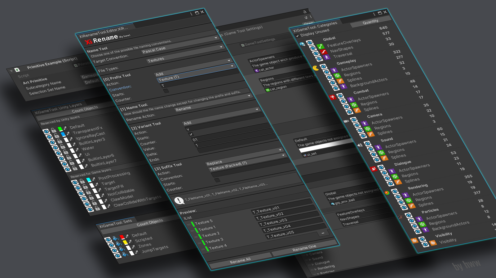

## Sample Code

|     | Link                                                                               |
|-----|:-----------------------------------------------------------------------------------|
| C#  | [XiRename The renaming tool for Unity 3D](https://github.com/hww/XiRename) |
| C#  | [XiGameTool - Unity 3D Art Game Data Manager](https://github.com/hww/XiGameTool) | 
| C#  | [XiKeyboard - Emacs style menu for Unity 3D](https://github.com/hww/XiKeyboard) | 
| C#  | [XiDebugDraw - Debugging drawing tool for Unity 3D](https://github.com/hww/XiDebugDraw) |
| C#  | [XiDebugMenu - In Game Text Only Debug Menu for Unity](https://github.com/hww/XiDebugMenu) | 
| C#  | [XiSound - A tiny sound system for Unity 3D](https://github.com/hww/XiSound) |
| C#  | [VARP Oscilloscope - Unity Asset](https://hww.github.io/projects/varp_oscilloscope/) |
| C#  | [Using Model-View-Controller pattern with Unity 3D](https://github.com/hww/unity_mvc) |
| C#  | [A Unity 3D Demo _Noise Flowfield_](https://github.com/hww/noise_flow_field) |
| C#  | [A Unity 3D Demo _Koch Fractals_](https://github.com/hww/koch_fractals) |
| C#  | [A Unity 3D Demo _The text effect for Unity 3D_](https://github.com/hww/XiPixelTextEffect) |
| CL  | [The open GOAL type system for Common LISP](https://github.com/hww/open-goal-type-system-cl) |
| C++ | [Ray Tracer](https://github.com/hww/RayTracer) |
| C   | [Synthesizer sampler & MIDI Player](https://github.com/hww/SndSynt/) |
