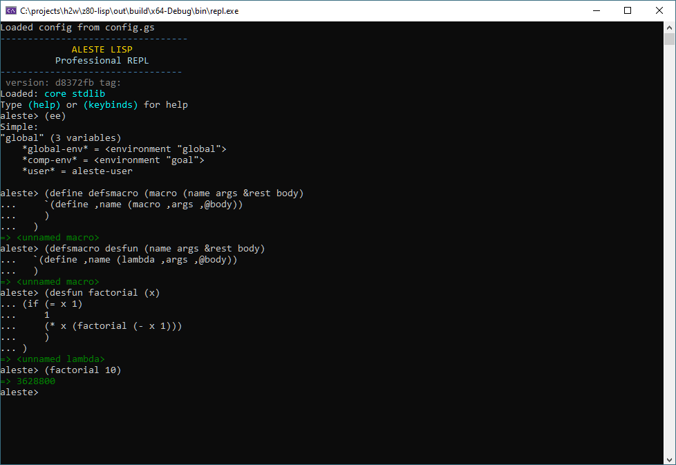
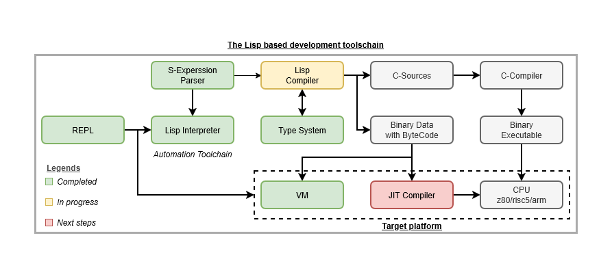

# Lisp-Based Development Ecosystem for Resource-Constrained Platforms

A comprehensive development ecosystem has been successfully created for my project, addressing the challenge of building software for resource-constrained target platforms. Since development directly on target devices is not feasible (such as on gaming consoles that lack development tools), the following architecture has been implemented:

## Implemented System Components

**Lisp Interpreter** - The core of the system, providing Lisp code execution with enhanced S-expression parsing capabilities. The interpreter is optimized for resource-constrained environments similar to gaming consoles.

**REPL Interactive Environment** - A full-featured environment for interactive development, debugging, and code testing. The REPL is integrated with the type system and virtual machine, providing immediate feedback that is particularly valuable for reverse engineering.

**Type System** - An advanced type system providing static type checking and runtime safety. The type system is closely integrated with the compiler and virtual machine, using approaches similar to OpenGoal.

**Virtual Machine and Bytecode Format** - A high-performance virtual machine executing specially designed bytecode. The bytecode format is optimized for fast loading and execution on resource-constrained platforms, inspired by solutions discovered during Uncharted analysis.

## Development Methodology

The development is based on OpenGoal principles - an open approach to reverse engineering game systems, focusing on:

- Analysis of existing binary files and data formats
- Recreating development toolchains used by original creators
- Building compatible runtime environments

Reverse engineering techniques similar to those used in studying engines like Uncharted are applied, including:

- Analysis of executable files and libraries
- Investigation of data formats and resources
- Reconstruction of memory systems and resource management

## Current Development Status

All core system components have been completed and tested:

- Lisp interpreter with full S-expression support
- REPL interactive environment with debugging capabilities
- Type system with static type checking
- Virtual machine with optimized bytecode format

Active development is currently underway on the compiler and integrated debug environment. The compiler transforms Lisp code into bytecode for the virtual machine and also generates C source files for compilation to native code on the target platform.

## Architectural Advantages

This ecosystem provides:

- Controlled multitasking and secure execution environment
- Crash protection - errors generate clear messages pointing to the problem source
- Cross-platform compatibility (supports RISC-V, ARM, microcontrollers)
- Efficient use of limited resources
- Compatibility with existing game assets and data formats

The project demonstrates the practical applicability of Lisp approaches in embedded systems and gaming platforms, continuing active development to meet the requirements of target projects in the spirit of OpenGoal.
